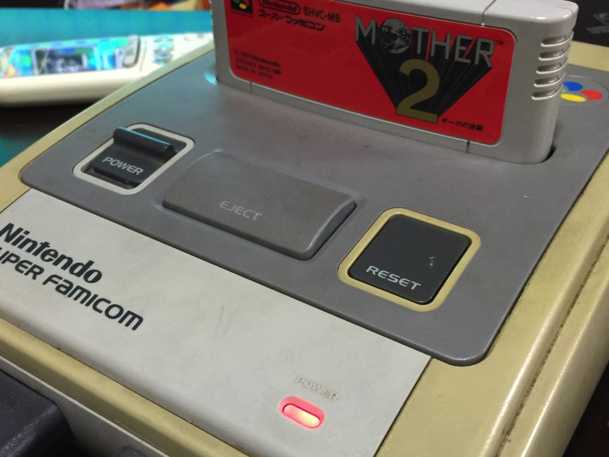
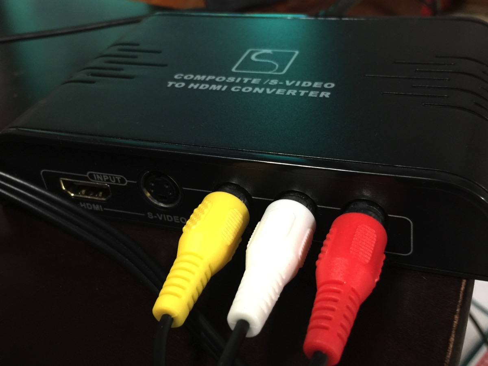
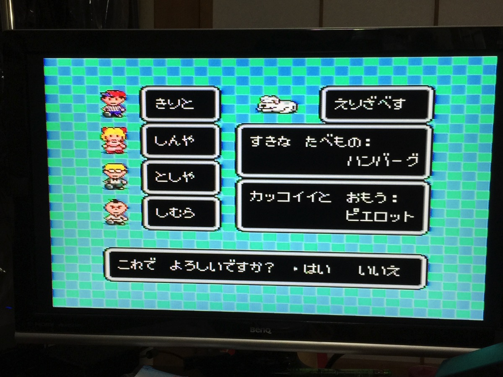
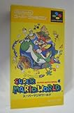
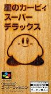
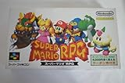
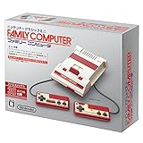

---
categories:
- ゲーム
date: Sun, 13 Sep 2015 14:00:00 +0000
slug: post-8393
tags:
- ゲーム
title: スーファミをHDMIでテレビ接続してプレイする方法
---

PS4でメタルギアの最新作にして最終作が出たそうですね。Youtubeのゲーム実況者はこぞってプレイしているみたいです。ただし、ぼくは全く興味がわきません。メタルギアソリッドをやったことがあるだけ。あれをステルスゲームと呼ぶのにいささかの疑問を持っています。そんな、最新ゲームを横目で見ながら任天堂が誇る傑作RPG「MOTHER2」がやりたくてやりたくて、とうとうやるぜ！というお話です。<!--more--><h2>MOTHER2とは</h2>

若い人は知ってるかな〜知らないだろうな〜

スーパーファミコンソフトとして1994年に発売したロールプレイングゲームです。

<a class="embedly-card" data-card-image="0" href="https://ja.wikipedia.org/wiki/MOTHER2_%E3%82%AE%E3%83%BC%E3%82%B0%E3%81%AE%E9%80%86%E8%A5%B2">MOTHER2 ギーグの逆襲 - Wikipedia</a>

<strong>SMAPの木村拓哉</strong>が、ひたすら「まーざつーまーざつー」と繰り返すめちゃくちゃシュールなCMを鮮明に覚えています。

あらすじとしては、どこにでもいる普通の少年が普通に生活していると、ある時町に隕石が落ちてきます。でも、じつはそれは10年後の未来からタイムスリップしてきた人が乗っていた乗り物でした。未来人は、世界が悪の手に落ち大変な状況にあることを少年に伝えます。そして、未来を救うことができるのは少年とこれから出会う3人の仲間の力が必要であると伝えて生き絶えます。

ここら辺までは、普通のゲームっぽいでしょう？

でも、こ<strong>のゲームの特徴はあくまで少年の日常の延長として冒険が描かれている点です。</strong>

武器も最初はボロい野球バット、回復アイテムはクッキーやハンバーガー。敵は町の不良や野良犬。そして極め付けは、お金の獲得方法。
普通のRPGはモンスターを倒すとなぜかお金が手に入ります。しかし、<strong>このゲームはなんとお父さんから仕送りされます。</strong>さらにそのお金も自動でお財布に入るわけではありません。<strong>コンビニのATMに行って下さねばなりません。</strong>セーブポイントなんかもありません。お父さんに電話して記録をつけてもらってください。その電話を掛けるときもちゃんとお金がかかります。

当時としては、こんなゲームほとんどありませんでした。

ファイナルファンタジーやらドラクエやらといったRPGがある中で、ある意味こんなにリアルなゲームはありませんでした。

そしてぼくは、そのゲームを懐かしんで、今どうしてもやりたくなったのです！！！！

正直、iOSアプリとして発売してくれれば5000円でも買いましたよ！？

Wii Uとかでダウンロードとかできるらいいけど・・・ニンテンドーDSかなんかでできるらしいんだけど・・・ゲームボーイアドバンスで2,3のパックででてたのどっかにあったけど・・・

ここはあえて、スーパーファミコンでやったるで！！

<h2>スーパーファミコンをHDMI端子のテレビに出力する方法</h2>

しかし、問題があります。

スーパーファミコンはアナログ出力なのです。わかりますか？3色の端子。

でも、今のテレビは大抵HDMI端子です。

アナログ出力されたものをHDMIに変換する装置が必要になります。
で、わたし探しました。で、良さげなのが見つかりましたよ〜

それがこちら!!!

<table  border="0" cellpadding="5" style="border:none"><tr><td valign="top" style="border:none"></td><td valign="top" style="border:none;text-align:left">
<a href="http://www.amazon.co.jp/exec/obidos/ASIN/B00B7ZXYIC/warawareotoko-22/ref=nosim/" target="_blank" >アナログ to HDMI コンバーター S端子 、 コンポジット +HDMI 出力をHDMI 出力へ変換 コンバータ フルHD1080P対応 (Simble 相性保証付き)</a>

 Simble 

売り上げランキング : 6409
<table style="border:none;margin-top:10px"><tr><td style="border:none;text-align:left;">
<a href="http://www.amazon.co.jp/gp/search?keywords=%83A%83i%83%8D%83O%20to%20HDMI%20%83R%83%93%83o%81%5B%83%5E%81%5B%20S%92%5B%8Eq%20%81A%20%83R%83%93%83%7C%83W%83b%83g%20%20HDMI%20%8Fo%97%CD%82%F0HDMI%20%8Fo%97%CD%82%D6%95%CF%8A%B7%20%83R%83%93%83o%81%5B%83%5E%20%83t%83%8BHD1080P%91%CE%89%9E%20&__mk_ja_JP=%83J%83%5E%83J%83i&tag=warawareotoko-22" target="_blank" >Amazon</a>

<a href="http://hb.afl.rakuten.co.jp/hgc/0f6e221b.2eb9748a.0f6e221c.35cc1e84/?pc=http%3A%2F%2Fsearch.rakuten.co.jp%2Fsearch%2Fmall%2F%25E3%2582%25A2%25E3%2583%258A%25E3%2583%25AD%25E3%2582%25B0%2520to%2520HDMI%2520%25E3%2582%25B3%25E3%2583%25B3%25E3%2583%2590%25E3%2583%25BC%25E3%2582%25BF%25E3%2583%25BC%2520S%25E7%25AB%25AF%25E5%25AD%2590%2520%25E3%2580%2581%2520%25E3%2582%25B3%25E3%2583%25B3%25E3%2583%259D%25E3%2582%25B8%25E3%2583%2583%25E3%2583%2588%2520%2520HDMI%2520%25E5%2587%25BA%25E5%258A%259B%25E3%2582%2592HDMI%2520%25E5%2587%25BA%25E5%258A%259B%25E3%2581%25B8%25E5%25A4%2589%25E6%258F%259B%2520%25E3%2582%25B3%25E3%2583%25B3%25E3%2583%2590%25E3%2583%25BC%25E3%2582%25BF%2520%25E3%2583%2595%25E3%2583%25ABHD1080P%25E5%25AF%25BE%25E5%25BF%259C%2520%2F-%2Ff.1-p.1-s.1-sf.0-st.A-v.2%3Fx%3D0%26scid%3Daf_ich_link_urltxt%26m%3Dhttp%3A%2F%2Fm.rakuten.co.jp%2F" target="_blank" >楽天市場</a>

<a href="http://ck.jp.ap.valuecommerce.com/servlet/referral?sid=3041033&pid=882528283&vc_url=http%3A%2F%2Fsearch.shopping.yahoo.co.jp%2Fsearch%3Fp%3D%25E3%2582%25A2%25E3%2583%258A%25E3%2583%25AD%25E3%2582%25B0%2520to%2520HDMI%2520%25E3%2582%25B3%25E3%2583%25B3%25E3%2583%2590%25E3%2583%25BC%25E3%2582%25BF%25E3%2583%25BC%2520S%25E7%25AB%25AF%25E5%25AD%2590%2520%25E3%2580%2581%2520%25E3%2582%25B3%25E3%2583%25B3%25E3%2583%259D%25E3%2582%25B8%25E3%2583%2583%25E3%2583%2588%2520%2520HDMI%2520%25E5%2587%25BA%25E5%258A%259B%25E3%2582%2592HDMI%2520%25E5%2587%25BA%25E5%258A%259B%25E3%2581%25B8%25E5%25A4%2589%25E6%258F%259B%2520%25E3%2582%25B3%25E3%2583%25B3%25E3%2583%2590%25E3%2583%25BC%25E3%2582%25BF%2520%25E3%2583%2595%25E3%2583%25ABHD1080P%25E5%25AF%25BE%25E5%25BF%259C%2520" target="_blank" >Yahooショッピング</a>

<a href="http://ck.jp.ap.valuecommerce.com/servlet/referral?sid=3041033&pid=882660047&vc_url=http%3A%2F%2Fauctions.search.yahoo.co.jp%2Fsearch%3Fvo%3D%26ve%3D%26auccat%3D0%26aucminprice%3D%26aucmaxprice%3D%26aucmin_bidorbuy_price%3D%26aucmax_bidorbuy_price%3D%26loc_cd%3D0%26abatch%3D0%26istatus%3D0%26filtered%3D1%26ei%3DUTF-8%26tab_ex%3Dcommerce%26va%3D%25E3%2582%25A2%25E3%2583%258A%25E3%2583%25AD%25E3%2582%25B0%2520to%2520HDMI%2520%25E3%2582%25B3%25E3%2583%25B3%25E3%2583%2590%25E3%2583%25BC%25E3%2582%25BF%25E3%2583%25BC%2520S%25E7%25AB%25AF%25E5%25AD%2590%2520%25E3%2580%2581%2520%25E3%2582%25B3%25E3%2583%25B3%25E3%2583%259D%25E3%2582%25B8%25E3%2583%2583%25E3%2583%2588%2520%2520HDMI%2520%25E5%2587%25BA%25E5%258A%259B%25E3%2582%2592HDMI%2520%25E5%2587%25BA%25E5%258A%259B%25E3%2581%25B8%25E5%25A4%2589%25E6%258F%259B%2520%25E3%2582%25B3%25E3%2583%25B3%25E3%2583%2590%25E3%2583%25BC%25E3%2582%25BF%2520%25E3%2583%2595%25E3%2583%25ABHD1080P%25E5%25AF%25BE%25E5%25BF%259C%2520" target="_blank" >ヤフオク!</a>
</td><td style="vertical-align:bottom;padding-left:10px;font-size:x-small;border:none">by <a href="http://kaereba.com" rel="nofollow" target="_blank">カエレバ</a></td></tr></table></td></tr></table>

こいつを接続すれば！！！！

なんとこのように！！！

どうだーー！！！ぼくの環境では、画面が切れてたり気になるような不具合は今のところでていません！！

<h2>まとめ</h2>

PS4のリッチなゲームに疲れたなら、今こそ原点回帰はいかがですかい？スーファミを二束三文で売り飛ばすくらいなら、今一度生き返らせましょう！！！

ソフトならAmazonやヤフオクを探せばいくらでもある！！

<table  border="0" cellpadding="5" style="border:none"><tr><td valign="top" style="border:none"></td><td valign="top" style="border:none;text-align:left">
<a href="http://www.amazon.co.jp/exec/obidos/ASIN/B000068GUZ/warawareotoko-22/ref=nosim/" target="_blank" >スーパーマリオワールド</a>

 任天堂 1990-11-21

売り上げランキング : 877
<table style="border:none;margin-top:10px"><tr><td style="border:none;text-align:left;">
<a href="http://www.amazon.co.jp/gp/search?keywords=%83X%81%5B%83p%81%5B%83%7D%83%8A%83I%83%8F%81%5B%83%8B%83h&__mk_ja_JP=%83J%83%5E%83J%83i&tag=warawareotoko-22" target="_blank" >Amazon</a>

<a href="http://hb.afl.rakuten.co.jp/hgc/0f6e221b.2eb9748a.0f6e221c.35cc1e84/?pc=http%3A%2F%2Fsearch.rakuten.co.jp%2Fsearch%2Fmall%2F%25E3%2582%25B9%25E3%2583%25BC%25E3%2583%2591%25E3%2583%25BC%25E3%2583%259E%25E3%2583%25AA%25E3%2582%25AA%25E3%2583%25AF%25E3%2583%25BC%25E3%2583%25AB%25E3%2583%2589%2F-%2Ff.1-p.1-s.1-sf.0-st.A-v.2%3Fx%3D0%26scid%3Daf_ich_link_urltxt%26m%3Dhttp%3A%2F%2Fm.rakuten.co.jp%2F" target="_blank" >楽天市場</a>

<a href="http://ck.jp.ap.valuecommerce.com/servlet/referral?sid=3041033&pid=882528283&vc_url=http%3A%2F%2Fsearch.shopping.yahoo.co.jp%2Fsearch%3Fp%3D%25E3%2582%25B9%25E3%2583%25BC%25E3%2583%2591%25E3%2583%25BC%25E3%2583%259E%25E3%2583%25AA%25E3%2582%25AA%25E3%2583%25AF%25E3%2583%25BC%25E3%2583%25AB%25E3%2583%2589" target="_blank" >Yahooショッピング</a>

<a href="http://ck.jp.ap.valuecommerce.com/servlet/referral?sid=3041033&pid=882660047&vc_url=http%3A%2F%2Fauctions.search.yahoo.co.jp%2Fsearch%3Fvo%3D%26ve%3D%26auccat%3D0%26aucminprice%3D%26aucmaxprice%3D%26aucmin_bidorbuy_price%3D%26aucmax_bidorbuy_price%3D%26loc_cd%3D0%26abatch%3D0%26istatus%3D0%26filtered%3D1%26ei%3DUTF-8%26tab_ex%3Dcommerce%26va%3D%25E3%2582%25B9%25E3%2583%25BC%25E3%2583%2591%25E3%2583%25BC%25E3%2583%259E%25E3%2583%25AA%25E3%2582%25AA%25E3%2583%25AF%25E3%2583%25BC%25E3%2583%25AB%25E3%2583%2589" target="_blank" >ヤフオク!</a>
</td><td style="vertical-align:bottom;padding-left:10px;font-size:x-small;border:none">by <a href="http://kaereba.com" rel="nofollow" target="_blank">カエレバ</a></td></tr></table></td></tr></table>

<table  border="0" cellpadding="5" style="border:none"><tr><td valign="top" style="border:none"></td><td valign="top" style="border:none;text-align:left">
<a href="http://www.amazon.co.jp/exec/obidos/ASIN/B000068GVN/warawareotoko-22/ref=nosim/" target="_blank" >星のカービィ スーパーデラックス</a>

 任天堂 1996-03-21

売り上げランキング : 1319
<table style="border:none;margin-top:10px"><tr><td style="border:none;text-align:left;">
<a href="http://www.amazon.co.jp/gp/search?keywords=%90%AF%82%CC%83J%81%5B%83r%83B%20%83X%81%5B%83p%81%5B%83f%83%89%83b%83N%83X&__mk_ja_JP=%83J%83%5E%83J%83i&tag=warawareotoko-22" target="_blank" >Amazon</a>

<a href="http://hb.afl.rakuten.co.jp/hgc/0f6e221b.2eb9748a.0f6e221c.35cc1e84/?pc=http%3A%2F%2Fsearch.rakuten.co.jp%2Fsearch%2Fmall%2F%25E6%2598%259F%25E3%2581%25AE%25E3%2582%25AB%25E3%2583%25BC%25E3%2583%2593%25E3%2582%25A3%2520%25E3%2582%25B9%25E3%2583%25BC%25E3%2583%2591%25E3%2583%25BC%25E3%2583%2587%25E3%2583%25A9%25E3%2583%2583%25E3%2582%25AF%25E3%2582%25B9%2F-%2Ff.1-p.1-s.1-sf.0-st.A-v.2%3Fx%3D0%26scid%3Daf_ich_link_urltxt%26m%3Dhttp%3A%2F%2Fm.rakuten.co.jp%2F" target="_blank" >楽天市場</a>

<a href="http://ck.jp.ap.valuecommerce.com/servlet/referral?sid=3041033&pid=882528283&vc_url=http%3A%2F%2Fsearch.shopping.yahoo.co.jp%2Fsearch%3Fp%3D%25E6%2598%259F%25E3%2581%25AE%25E3%2582%25AB%25E3%2583%25BC%25E3%2583%2593%25E3%2582%25A3%2520%25E3%2582%25B9%25E3%2583%25BC%25E3%2583%2591%25E3%2583%25BC%25E3%2583%2587%25E3%2583%25A9%25E3%2583%2583%25E3%2582%25AF%25E3%2582%25B9" target="_blank" >Yahooショッピング</a>

<a href="http://ck.jp.ap.valuecommerce.com/servlet/referral?sid=3041033&pid=882660047&vc_url=http%3A%2F%2Fauctions.search.yahoo.co.jp%2Fsearch%3Fvo%3D%26ve%3D%26auccat%3D0%26aucminprice%3D%26aucmaxprice%3D%26aucmin_bidorbuy_price%3D%26aucmax_bidorbuy_price%3D%26loc_cd%3D0%26abatch%3D0%26istatus%3D0%26filtered%3D1%26ei%3DUTF-8%26tab_ex%3Dcommerce%26va%3D%25E6%2598%259F%25E3%2581%25AE%25E3%2582%25AB%25E3%2583%25BC%25E3%2583%2593%25E3%2582%25A3%2520%25E3%2582%25B9%25E3%2583%25BC%25E3%2583%2591%25E3%2583%25BC%25E3%2583%2587%25E3%2583%25A9%25E3%2583%2583%25E3%2582%25AF%25E3%2582%25B9" target="_blank" >ヤフオク!</a>
</td><td style="vertical-align:bottom;padding-left:10px;font-size:x-small;border:none">by <a href="http://kaereba.com" rel="nofollow" target="_blank">カエレバ</a></td></tr></table></td></tr></table>

<table  border="0" cellpadding="5" style="border:none"><tr><td valign="top" style="border:none"></td><td valign="top" style="border:none;text-align:left">
<a href="http://www.amazon.co.jp/exec/obidos/ASIN/B000068GVO/warawareotoko-22/ref=nosim/" target="_blank" >スーパーマリオRPG</a>

 任天堂 1996-03-09

売り上げランキング : 1244
<table style="border:none;margin-top:10px"><tr><td style="border:none;text-align:left;">
<a href="http://www.amazon.co.jp/gp/search?keywords=%83X%81%5B%83p%81%5B%83%7D%83%8A%83IRPG&__mk_ja_JP=%83J%83%5E%83J%83i&tag=warawareotoko-22" target="_blank" >Amazon</a>

<a href="http://hb.afl.rakuten.co.jp/hgc/0f6e221b.2eb9748a.0f6e221c.35cc1e84/?pc=http%3A%2F%2Fsearch.rakuten.co.jp%2Fsearch%2Fmall%2F%25E3%2582%25B9%25E3%2583%25BC%25E3%2583%2591%25E3%2583%25BC%25E3%2583%259E%25E3%2583%25AA%25E3%2582%25AARPG%2F-%2Ff.1-p.1-s.1-sf.0-st.A-v.2%3Fx%3D0%26scid%3Daf_ich_link_urltxt%26m%3Dhttp%3A%2F%2Fm.rakuten.co.jp%2F" target="_blank" >楽天市場</a>

<a href="http://ck.jp.ap.valuecommerce.com/servlet/referral?sid=3041033&pid=882528283&vc_url=http%3A%2F%2Fsearch.shopping.yahoo.co.jp%2Fsearch%3Fp%3D%25E3%2582%25B9%25E3%2583%25BC%25E3%2583%2591%25E3%2583%25BC%25E3%2583%259E%25E3%2583%25AA%25E3%2582%25AARPG" target="_blank" >Yahooショッピング</a>

<a href="http://ck.jp.ap.valuecommerce.com/servlet/referral?sid=3041033&pid=882660047&vc_url=http%3A%2F%2Fauctions.search.yahoo.co.jp%2Fsearch%3Fvo%3D%26ve%3D%26auccat%3D0%26aucminprice%3D%26aucmaxprice%3D%26aucmin_bidorbuy_price%3D%26aucmax_bidorbuy_price%3D%26loc_cd%3D0%26abatch%3D0%26istatus%3D0%26filtered%3D1%26ei%3DUTF-8%26tab_ex%3Dcommerce%26va%3D%25E3%2582%25B9%25E3%2583%25BC%25E3%2583%2591%25E3%2583%25BC%25E3%2583%259E%25E3%2583%25AA%25E3%2582%25AARPG" target="_blank" >ヤフオク!</a>
</td><td style="vertical-align:bottom;padding-left:10px;font-size:x-small;border:none">by <a href="http://kaereba.com" rel="nofollow" target="_blank">カエレバ</a></td></tr></table></td></tr></table>

<table  border="0" cellpadding="5" style="border:none"><tr><td valign="top" style="border:none"></td><td valign="top" style="border:none;text-align:left">
<a href="http://www.amazon.co.jp/exec/obidos/ASIN/B000065V6V/warawareotoko-22/ref=nosim/" target="_blank" >バハムート ラグーン</a>

 スクウェア 1996-02-09

売り上げランキング : 4058
<table style="border:none;margin-top:10px"><tr><td style="border:none;text-align:left;">
<a href="http://www.amazon.co.jp/gp/search?keywords=%83o%83n%83%80%81%5B%83g%83%89%83O%81%5B%83%93&__mk_ja_JP=%83J%83%5E%83J%83i&tag=warawareotoko-22" target="_blank" >Amazon</a>

<a href="http://hb.afl.rakuten.co.jp/hgc/0f6e221b.2eb9748a.0f6e221c.35cc1e84/?pc=http%3A%2F%2Fsearch.rakuten.co.jp%2Fsearch%2Fmall%2F%25E3%2583%2590%25E3%2583%258F%25E3%2583%25A0%25E3%2583%25BC%25E3%2583%2588%25E3%2583%25A9%25E3%2582%25B0%25E3%2583%25BC%25E3%2583%25B3%2F-%2Ff.1-p.1-s.1-sf.0-st.A-v.2%3Fx%3D0%26scid%3Daf_ich_link_urltxt%26m%3Dhttp%3A%2F%2Fm.rakuten.co.jp%2F" target="_blank" >楽天市場</a>

<a href="http://ck.jp.ap.valuecommerce.com/servlet/referral?sid=3041033&pid=882528283&vc_url=http%3A%2F%2Fsearch.shopping.yahoo.co.jp%2Fsearch%3Fp%3D%25E3%2583%2590%25E3%2583%258F%25E3%2583%25A0%25E3%2583%25BC%25E3%2583%2588%25E3%2583%25A9%25E3%2582%25B0%25E3%2583%25BC%25E3%2583%25B3" target="_blank" >Yahooショッピング</a>

<a href="http://ck.jp.ap.valuecommerce.com/servlet/referral?sid=3041033&pid=882660047&vc_url=http%3A%2F%2Fauctions.search.yahoo.co.jp%2Fsearch%3Fvo%3D%26ve%3D%26auccat%3D0%26aucminprice%3D%26aucmaxprice%3D%26aucmin_bidorbuy_price%3D%26aucmax_bidorbuy_price%3D%26loc_cd%3D0%26abatch%3D0%26istatus%3D0%26filtered%3D1%26ei%3DUTF-8%26tab_ex%3Dcommerce%26va%3D%25E3%2583%2590%25E3%2583%258F%25E3%2583%25A0%25E3%2583%25BC%25E3%2583%2588%25E3%2583%25A9%25E3%2582%25B0%25E3%2583%25BC%25E3%2583%25B3" target="_blank" >ヤフオク!</a>
</td><td style="vertical-align:bottom;padding-left:10px;font-size:x-small;border:none">by <a href="http://kaereba.com" rel="nofollow" target="_blank">カエレバ</a></td></tr></table></td></tr></table>

と言ったところで本日は以上になります。  おやすみなさい。

<a href="http://www.amazon.co.jp/exec/obidos/ASIN/B01M1VMFUA/warawareotoko-22/ref=nosim/" target="_blank" >ニンテンドークラシックミニ ファミリーコンピュータ</a>
posted with <a href="http://kaereba.com" rel="nofollow" target="_blank">カエレバ</a>

 任天堂 2016-11-10    

<a href="http://www.amazon.co.jp/gp/search?keywords=%83j%83%93%83e%83%93%83h%81%5B%83N%83%89%83V%83b%83N&__mk_ja_JP=%83J%83%5E%83J%83i&tag=warawareotoko-22" target="_blank" >Amazon</a>

<a href="http://hb.afl.rakuten.co.jp/hgc/0f6e221b.2eb9748a.0f6e221c.35cc1e84/?pc=http%3A%2F%2Fsearch.rakuten.co.jp%2Fsearch%2Fmall%2F%25E3%2583%258B%25E3%2583%25B3%25E3%2583%2586%25E3%2583%25B3%25E3%2583%2589%25E3%2583%25BC%25E3%2582%25AF%25E3%2583%25A9%25E3%2582%25B7%25E3%2583%2583%25E3%2582%25AF%2F-%2Ff.1-p.1-s.1-sf.0-st.A-v.2%3Fx%3D0%26scid%3Daf_ich_link_urltxt%26m%3Dhttp%3A%2F%2Fm.rakuten.co.jp%2F" target="_blank" >楽天市場</a>

<a href="http://ck.jp.ap.valuecommerce.com/servlet/referral?sid=3041033&pid=882528283&vc_url=http%3A%2F%2Fsearch.shopping.yahoo.co.jp%2Fsearch%3Fp%3D%25E3%2583%258B%25E3%2583%25B3%25E3%2583%2586%25E3%2583%25B3%25E3%2583%2589%25E3%2583%25BC%25E3%2582%25AF%25E3%2583%25A9%25E3%2582%25B7%25E3%2583%2583%25E3%2582%25AF&vcptn=kaereba" target="_blank" >Yahooショッピング</a>

