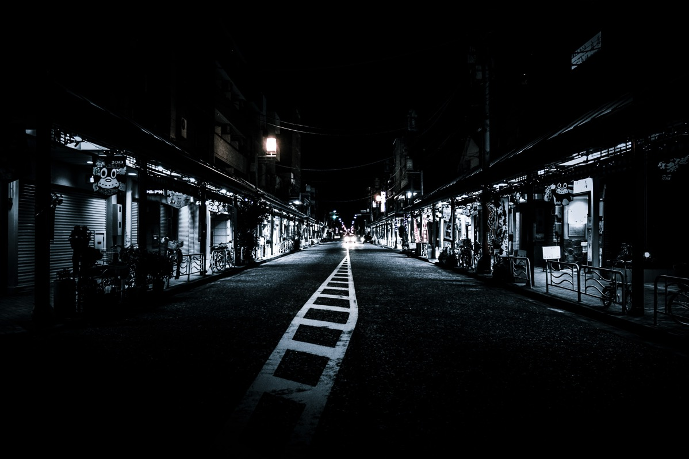
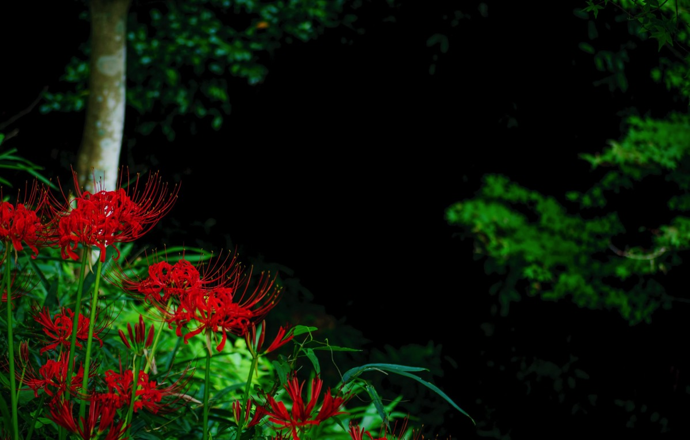
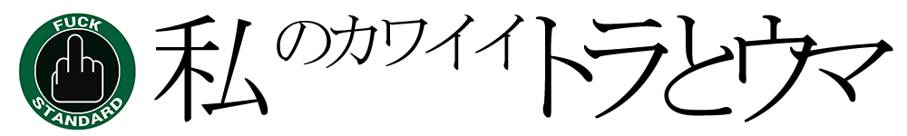

---
categories:
- ブログ
date: Wed, 16 Sep 2015 14:00:07 +0000
slug: post-8399
tags:
- ブログ
title: より内面を写すためにブログタイトルを「私のカワイイトラとウマ」に変更しました。
---

ブログ名変えました。

<!--more-->

前のタイトル「ガジェットゾンビィパラサイト」は、

ガジェット関連、とくにiPhoneとか

ゾンビはDIR EN GREY関連

そういった内容にしたかったのでこの二つの単語を組み合わせました。

じゃあパラサイトはなんなの？というと、単語三つ並べてDIR EN GREYっぽくしたかったので、単純になんかそれっぽいのをつけました。あと、おそらく地球上にこの並びでこの単語たちを重ねた人間いないだろうなとも思い、考えた結果でした。

で、今回なぜ変えたかというと、自分のブログってなんかつまんないなと思ってて色々工夫したりして、ちょっとマシになったりしてきたかなーと思ってたんですが、それでもブロガーぽい型にハマってたなと・・・

そんな感じで自己を省みて、やっぱ本当につまらないなと思ったからです。

で、面白いかどうかはわかりませんが、
もっとぼくの根源的なことに基づくものを書いていきたいと思いました。

だから、タイトルにトラウマという言葉を使いました。

そういえば、書いていて思い出しましたが最初このブログを始めた時は、「入社して6年で7回部署異動した笑われ男の日記」とかそんなタイトルでした確か・・・

そこから、もっと自分の好きなことをフォーカスして書こうと思い、さらにsukekiyo関連の情報まとめとかをしたりして「Gadget Zombie Parasite(ガジェットゾンビィパラサイト)」に改名したんでした。。。

そう思うと最初から、ぼくの中身から出るものとか好きなものを中心に書きたいという思いはありました。ただ、割と切り取って載っける感が強いかなと思います。なので、今後は「なんぜこうなったのか」「なんで好きになったのか」「なんで好きなままでいるのか」っていう文脈だったり流れを重視したいなと思います。

いわゆるコンテキストってやつです。

とはいえ、おそらくですけど内容もテーマも変わらないと思います。

もっと多くの方に恒常的に読んでいただけるように精進いたします。

今後とも「私のカワイイトラとウマ」を宜しくお願いいたします。

しんぺー