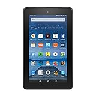

---
categories:
- レビュー
date: Sat, 19 Sep 2015 14:00:00 +0000
slug: post-8403
tags:
- amazon
title: Amazonからとにかく安い最強のタブレットが出るらしい「Fire」
---

Amazonから安いタブレットが出るらしいです。これは即買いしたいくらいめちゃくちゃいいガジェットだと思いますので、ご紹介<!--more-->ぼくは、電子書籍を読む時は、KindleかiPhone6 PlusのKindleアプリを使っています。以前はiPad miniを使っていましたがiPhone6 Plusが出たことをきっかけにiPad miniとそんなに大きさからないのではと思い、乗り換えました。そのため電子書籍用にiPhone6 Plusにしたと言っても過言ではありません。

じゃあ、なんで<strong>Kindleも使ってるのかというとその理由は3つあります。</strong>

<h2>Kindleを使うメリット</h2>

どくが使っているKindleは最下位モデルのノーマルKindleです。

バックライトなし、スワイプ感度悪し、大昔のゲームボーイのようなモノクロ

でも、これがいいんです。

<h3>いいところその１</h3>

余計な機能がないから<strong>読書に集中できる</strong>

iPadみたいに高性能だと、すぎにTwitterみたりfacebookみたり、マインクラフト始めちゃったりしちゃうんですけど、Kindle本しか読めないから読書しかしません。

一つのことしかできない。だから一つのことしかしない。

道具としての心理を追求している感じだします。

<h3>いいところその2</h3>

<strong>めちゃくちゃ軽い</strong>

バックライトもカラーの液晶もない。おまけにシングルタスク。

だから余計な機構はありません。だからめちゃくちゃ軽いのです。

体感では普通の文庫本や漫画の単行本より軽い気すらします。

だからこそ読書しやすいのです。

<h3>いいところその３</h3>

<h3>バッテリーのもちが神がかってる。</h3>

3週間くらい放置してて、久しぶりにみたらなんと全然電源入りました。バッテリーのもちが過ごすぎる。。。

普通に毎日使っても、充電入らないくらい。

iPhoneを１日２回充電する身としては、これは驚愕です。

<h3>不満は２つ</h3>

不満は2つ。

ひとつはAmazonプライム会員は月に1冊ほど無料対象書籍をダウンロードすることができます。

しかし、それは<strong>Kindleからしかできないのです！！！</strong>

iPhoneからはできない！！

もうひとつは、Kindleに最適化されていない本が読みずらいという点。文庫本などは読みやすいのですが、技術書とか図解が多様されているようなものは読みづらいです。そういった本はiPadで読むほうがスムーズです。

<h2>Fireに期待すること</h2>

<table  border="0" cellpadding="5" style="border:none"><tr><td valign="top" style="border:none"></td><td valign="top" style="border:none;text-align:left">
<a href="http://www.amazon.co.jp/exec/obidos/ASIN/B00Y3TMKKM/warawareotoko-22/ref=nosim/" target="_blank" >Fire タブレット 8GB、ブラック</a>

 Amazon 2015-09-30

売り上げランキング : 1
<table style="border:none;margin-top:10px"><tr><td style="border:none;text-align:left;">
<a href="http://www.amazon.co.jp/gp/search?keywords=Fire%20%83%5E%83u%83%8C%83b%83g%208GB%81A%83u%83%89%83b%83N&__mk_ja_JP=%83J%83%5E%83J%83i&tag=warawareotoko-22" target="_blank" >Amazon</a>
</td><td style="vertical-align:bottom;padding-left:10px;font-size:x-small;border:none">by <a href="http://kaereba.com" rel="nofollow" target="_blank">カエレバ</a></td></tr></table></td></tr></table>

不満のひとつを解決してくれそうな期待

カラーでバックライトがあるので、<strong>技術書や雑誌といった大判の書籍が読みやすくなるだろう！！</strong>

さらに、Amazonプライムビデオの視聴が楽しめるという点。テレビにつなげればテレビに映してみることもできるでしょう。

そして、なんと言っても安すぎる！！！！！

だってプライム会員なら5000円以下で買えます。

このスペックで5000円なら絶対に買いです。AmazonのFireシリーズを購入するのは初めてなので、どんなアプリがあって、どういう使い心地なのかがきになるところですが、とりあえず手元に届くのを待ちたいと思います！！

今なら予約受け付け中です。これを気にプライム会員になって4000円OFFで購入すれば実質会費が無料くらいになるので、おすすめです。

<h2>まとめ</h2>

<strong>・Amazonプライム会員なる→Fireを予約する。このコンボがおすすめです。
</strong>

<strong>・Fireは安すぎるのでやっぱりおすすめです。</strong>

<strong>・わたくし買います！！</strong>

と言ったところで本日は以上になります。  おやすみなさい。

<table  border="0" cellpadding="5" style="border:none"><tr><td valign="top" style="border:none"></td><td valign="top" style="border:none;text-align:left">
<a href="http://www.amazon.co.jp/exec/obidos/ASIN/B00Y3TMKKM/warawareotoko-22/ref=nosim/" target="_blank" >Fire タブレット 8GB、ブラック</a>

 Amazon 2015-09-30

売り上げランキング : 1
<table style="border:none;margin-top:10px"><tr><td style="border:none;text-align:left;">
<a href="http://www.amazon.co.jp/gp/search?keywords=Fire%20%83%5E%83u%83%8C%83b%83g%208GB%81A%83u%83%89%83b%83N&__mk_ja_JP=%83J%83%5E%83J%83i&tag=warawareotoko-22" target="_blank" >Amazon</a>
</td><td style="vertical-align:bottom;padding-left:10px;font-size:x-small;border:none">by <a href="http://kaereba.com" rel="nofollow" target="_blank">カエレバ</a></td></tr></table></td></tr></table>

<iframe src="http://rcm-fe.amazon-adsystem.com/e/cm?t=warawareotoko-22&o=9&p=12&l=ur1&category=prime&banner=1JDEH56FFMMBANKKEJR2&f=ifr" width="300" height="250" scrolling="no" border="0" marginwidth="0" style="border:none;" frameborder="0"></iframe>