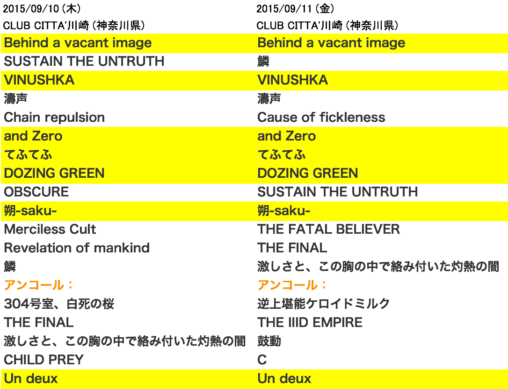
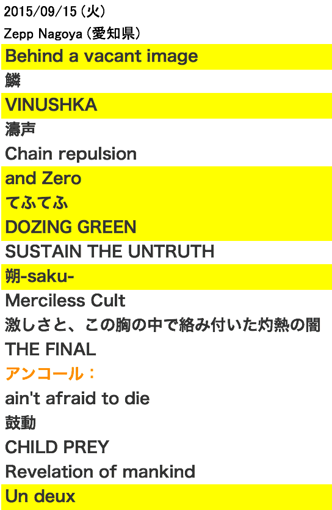
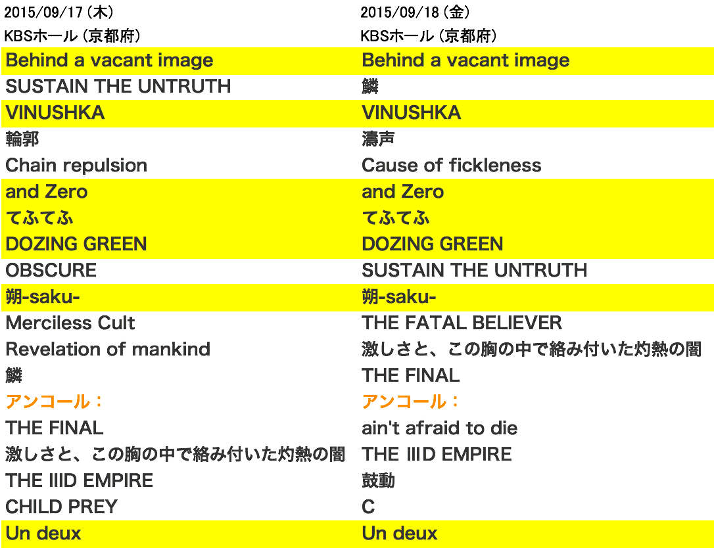
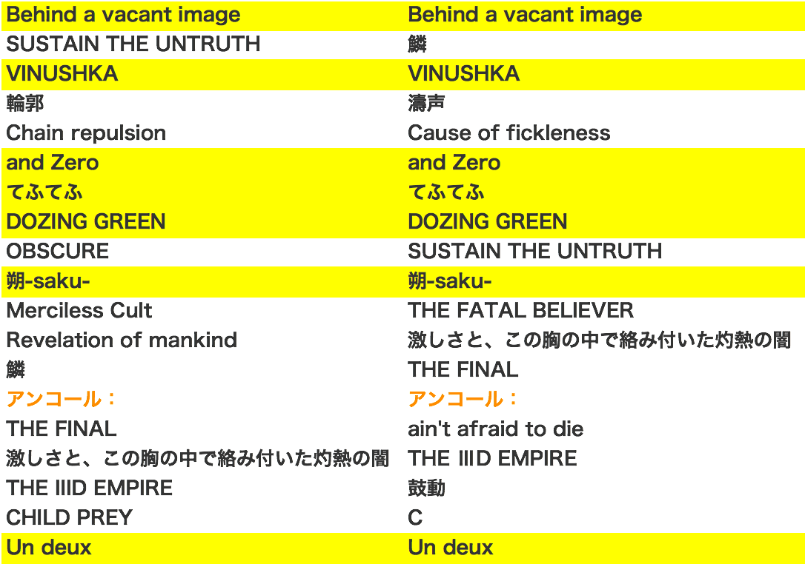

---
categories:
- DIR EN GREY
date: Sun, 20 Sep 2015 01:43:30 +0000
slug: post-8412
tags:
- DIR EN GREY
title: 【DIR EN GREY】今ツアーのセトリの傾向。2daysの後ろの日に鼓動やるっぽい
---

今回のツアー14日程のうち1/3ほどが終了しました。今回ぼくは1日しか参戦できない予定です。Twitterでレポートをみるたびにワクワクしております。そんな中現在までのセトリを見ると、今回のツアーの傾向が少しわかります。<!--more-->ハローしんぺー(<a href="https://twitter.com/s_s_p_y" target="_blank">@s_s_p_y</a> )です。
今日も「私のカワイイトラとウマ」にようこそ。

<h2>今回のツアーのセトリはこんな感じみたいです。</h2>

本編で必ず決まった位置で演奏するのが、
「Behind a vacant image」「VINUSHKA」「and Zero」「てふてふ」「DOZING GREEN」「朔-saku-」「Un deux」

あとは、前回のツアー同様「Chain repulsion」「Cause of fickleness」を交互に

そして、2daysの後ろの日程ではアンコールでかならず「鼓動」を演奏しています。

これは、、、、羨ましすぎる。。。

以下セトリ詳細

<h3>CLUB CITTA'</h3>

<h3>Zepp Nagoya</h3>

<h3>KBSホール</h3>

<h2>なんばHatchセトリ予想</h2>

おそらく京都セトリと同じ並びになるのではないでしょうか。
そして2日目の方で鼓動。。。

いやーーーー鼓動聞きたい！！！！

<h2><a href="https://twitter.com/s_s_p_y" target="_blank">しんぺー</a> はこう思った。</h2>

鼓動が聞きたいです！！！！

と言ったところで本日は以上になります。  おやすみなさい。