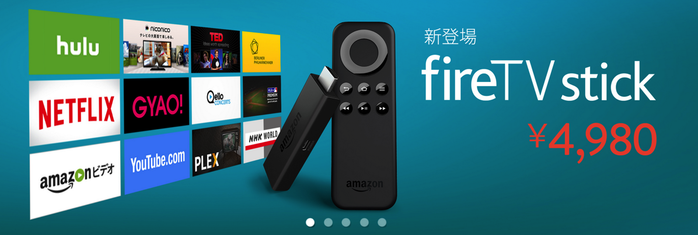
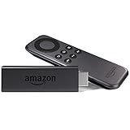

---
categories:
- レビュー
date: Sat, 26 Sep 2015 14:00:00 +0000
slug: post-8419
tags:
- Amazonプライムビデオ
title: Amazonプライムビデオのラインナップが全然大したことなくて拍子抜け
---

Amazonのプライム会員専用「プライムビデオ」がいよいよスタートしましたので、どんな感じか、huluやNetflixなどから乗り換えするべきかについて現時点の感想をご紹介<!--more--><h2>Amazonプライムビデオとは</h2>

<strong>Amazonのプライム会員専用で無料で動画が見放題のサービスです。</strong>

<h3>プライム会員とは</h3>

<iframe src="http://rcm-fe.amazon-adsystem.com/e/cm?t=warawareotoko-22&o=9&p=294&l=ur1&category=prime&banner=1P5H17MJB4YQ4W7GVCG2&f=ifr" width="320" height="100" scrolling="no" border="0" marginwidth="0" style="border:none;" frameborder="0"></iframe>

プライム会員は年会費3900円、実質<strong>月会費325円</strong>で利用できるサービスです。
この3900円を払えば、対象商品を早ければ当日に届けてくれます。（お急ぎ便無料）さらに、プライム会員限定の割引があったり、プライム会員限定のサービスがあったりします。

参考：<a href="https://www.amazon.co.jp/gp/prime/pipeline/landing?ie=UTF8&ref_=nav_prime_member_btn">プライム会員について（Amazon）</a>

Kindleをほぼ半額で買えたり、ゲームなんかも発売日の朝に注文しても家に帰る頃には届いていたりします。そしてKindle持っていれば、月に1冊対象ラインナップから無料で本をダウンロードもできます。

まあ、簡単にニュアンスだけ伝えると「Amazonファンクラブ」みたいな感じです。好きなアーティストのファンクラブに入っている人ならわかると思いますが、チケット先行販売とか限定グッズ販売とかそういった感じのメリットがあります。

<h3>プライムビデオのラインナップは？</h3>

さて、そんなAmazonプライムビデオですがラインナップは現時点では正直クソです。

huluやNetflixに契約していれば、乗り換えなんかしないほうがいいでしょう。

海外ドラマやテレビ番組、アニメ、どれをとってもhuluに負けています。オリジナルコンテンツもNetflixの足元にも及びません。

<strong>アニメもほとんどありません。</strong>

まどマギ、キルラキル、ノイタミナありません。

<h3>今後充実してくる兆し</h3>

ただし、今後順次ラインナップを拡充していくんだろうなという兆しがあります。

これはクロームキャストやApple TVなどと同じく、テレビに接続することであらゆるオンデマンドサービスに接続できるようになるというガジェットです。

<table  border="0" cellpadding="5" style="border:none"><tr><td valign="top" style="border:none"></td><td valign="top" style="border:none;text-align:left">
<a href="http://www.amazon.co.jp/exec/obidos/ASIN/B00ZVNYLS8/warawareotoko-22/ref=nosim/" target="_blank" >Fire TV Stick</a>

 Amazon 2015-10-28

売り上げランキング : 1
<table style="border:none;margin-top:10px"><tr><td style="border:none;text-align:left;">
<a href="http://www.amazon.co.jp/gp/search?keywords=Fire%20TV%20Stick&__mk_ja_JP=%83J%83%5E%83J%83i&tag=warawareotoko-22" target="_blank" >Amazon</a>
</td><td style="vertical-align:bottom;padding-left:10px;font-size:x-small;border:none">by <a href="http://kaereba.com" rel="nofollow" target="_blank">カエレバ</a></td></tr></table></td></tr></table>

これの発売が10月28日とのこと。オリジナルの商品まで出すくらいなので、これは１ヶ月かけてコンテンツを充実させていくという意気込みの現れとぼくはとらえました。そしてポチりました。

ただし、これはぼくがプライム会員で、なおかつ安く購入できるクーポンがあったから買ったまでです。現時点プライム会員ではない人がビデオ目当てで登録するのはおすすめしません。

コンテンツが増えてきてから、登録を検討するのがいいかと思います。

<h2>まとめ</h2>

ということでまとめです。

<strong>プライム会員に登録している人は、huluやNetflixの解約は待った方がいい</strong>

<strong>プライム会員に登録していない人は、10月末まで様子を見た方がいい</strong>

<iframe src="http://rcm-fe.amazon-adsystem.com/e/cm?t=warawareotoko-22&o=9&p=12&l=ur1&category=prime&banner=1JDEH56FFMMBANKKEJR2&f=ifr" width="300" height="250" scrolling="no" border="0" marginwidth="0" style="border:none;" frameborder="0"></iframe>

と言ったところで本日は以上になります。  おやすみなさい。