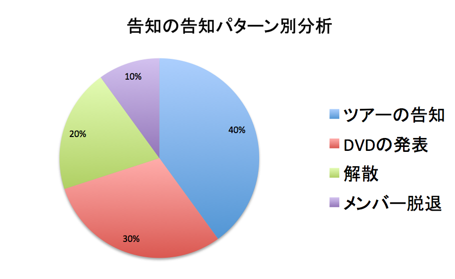

---
categories:
- music
date: Sat, 03 Oct 2015 14:00:00 +0000
slug: post-8440
title: ヴィジュアル系からの「大切なお知らせ」の告知＝告知の告知あるある
---

あるよねー○月○日○時にバンドより大切なお知らせがありますっていう告知の告知
なんだろう・・・まさか解散？とか誰か脱退？とか無駄にファンの不安を煽るやつ

あれ、アクセス集めるためなんだと思うけどやめたほうがいいよな<!--more--><h2>バンドからのお知らせ告知の告知パターン別分析</h2>

え、まさか等々ドラムのナントカくん脱退？？とかえ、メンバー結婚？だれ？とか解散なの？？

おバンギャ「ツアーの告知やろ。毎年冬は全国ツアーやで」（余裕ぶってる）

〜告知した告知時間〜

「ツアーやります！」

新規：「やったー」
自称オキニ：「いうたやろ。でもウレシイ。また○○くんにあえる！」
歴戦おばんぎゃ：（<font-color="red">何も言わずに高速バス、新幹線、ホテルの予約サイトを立ち上げ予約。交通手段のみをとりあえず押さえる場合もある。ホテルは最悪どうにかなるが交通手段は行楽シーズンと重なると取れない場合が多い。そして、それらの作業が終わったあと）「今からDVD見て気合いれます！」

みたいなこの一連の流れ。でもさ告知の告知って無駄にファン煽ってるとしか思えないんだよね！

ということで、告知の告知の中身がどんなもんか確率かってに考えてみた

<h3>ツアーの告知</h3>

これ一番多いと思う。今までにビジュアル系バンドからされた告知の告知の<strong>40%以上</strong>はこれなんじゃないかと思う。

ツアーの情報解禁と日程の告知ならまだいいよ。でも場合によっては、ツアーやります！とかだけの場合あるでしょ。

もっと早く仕事せんかい！と思うわwww

ツアーやりますって言われても有給とかホテル予約とか交通手段押さえたりしなきいけなんですバンギャは

だから、その煽る目的だけの告知やめてもらっていいですか？

ちゃんと全部決まってから告知しましょう。

「わーい！」「やったー！」「うれしい！」

でLIVEはいつですか？

みたいな

<h3>DVD発売のお知らせ</h3>

次に多いのがこれ。<strong>30%</strong>くらいはこれ。（知らないけど）作品の発表

このあたりはまだいい。作品の発表の場合は、たいてい大まかなスケジュールが決まってるから。

今冬発売とか、10月リリースとかってもう決まってるからね。スタジオ押さえたり、編集のための人間おさえたり、はたまたプレスする時間やらなんやらでいろんな人間が関わるからスケジュールも早く決まること多いだろうし。

<h3>メンバー脱退のお知らせ</h3>

逆にこれはほとんどない。10%以下。告知の告知でメンバーの脱退知らせるようなことはしないと思う。

脱退するパターンは、クビか自分からやめるかの2択しかない。

クビならクビでいきなり発表されることが多い。不仲、素行不良、失踪、戦力外通告、不祥事などでいきなり告知されるやつ

で、万が一あるとしたらメンバーが逮捕されたりして情報解禁時間がきまったりしてる場合とか、あとはのっぴきならない事情でメンバーが脱退してしまう場合など

どちらにしろ告知の告知でメンバー脱退はもっとも少ない事例と思われる。

<h3>解散</h3>

これね、意外とあるんじゃないかと思ってます。20%

不仲原因とかでいきなり解散しちゃうようなバンド（<font-color="#7b7b7b">PIERROTとか）だといきなり発表されると思うけど、もう輝けない系要因だったり円満解散や活動休止だと時間区切っての正式告知ってあると思うんですよねー

メンバー側もちゃんと告知したいって思いがあったりして

ということで告知の告知で解散発表は意外と<strong>ある</strong>んじゃないかと思います。こわいですねー

<h2>まとめ</h2>

ビジャル系告知の告知

40%以上　ツアーの告知

30%　　　DVDの発表

20%　　　解散

10%以下　メンバー脱退

どうでもいいけど、告知の時間告知するのは、本当にがっかりするから！！

ちなみにDIR EN GREYは告知の告知なんてしません。いきなりメールが送られてきます。これもこれで深夜に発狂するので心臓によくないですが。

と言ったところで本日は以上になります。  おやすみなさい。