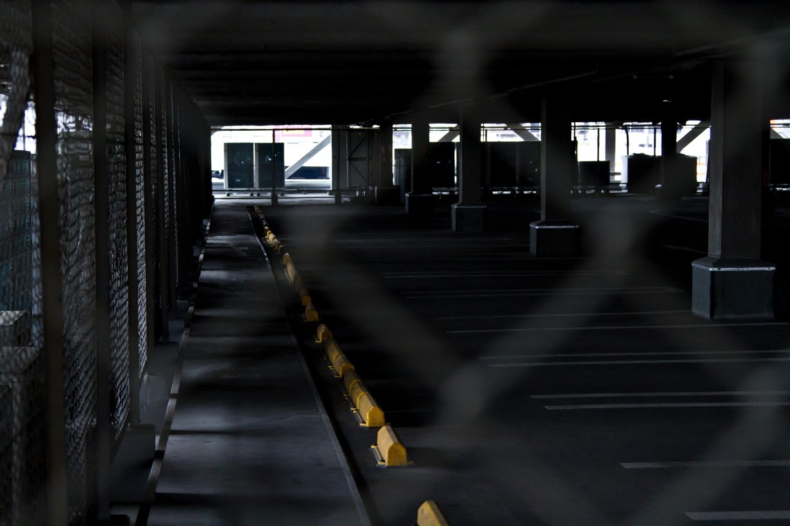
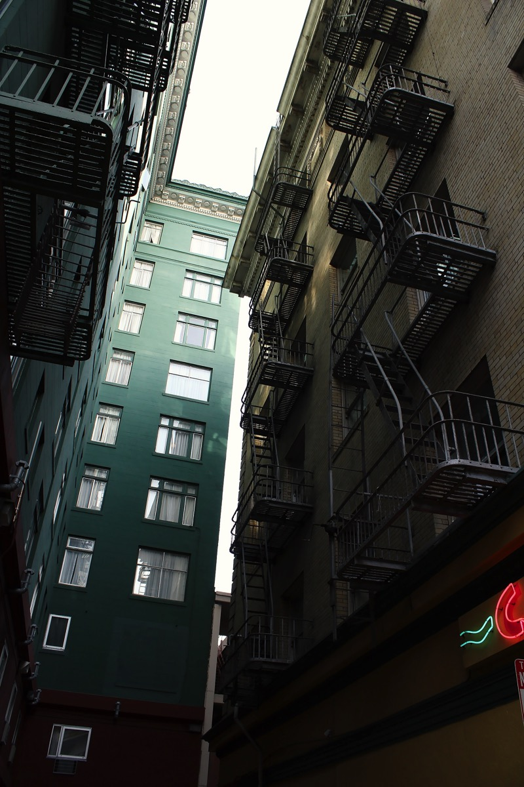

---
categories:
- トラウマ
date: Sun, 11 Oct 2015 14:00:00 +0000
slug: post-8466
tags:
- ブログ
title: 世界には一定数自分を嫌う人間がいるという事実が自分を救う
---

ぼくは昔から人に嫌われることが多かった。クセがある性格だからか、嫌う人間が一定数必ずいる。

同じような人が必ずいると思う。何もしていないのに、なぜか嫌われる。自分は何もしてないのに、自分だけが嫌われる。

嫌われるたびに、いつものことと自分に言い聞かせながらもそのコミュニティにいづらくなり、やがて嫌われないようにと当たり障りないコミュニケーションしかできなくなる。

<strong>だって、嫌われるの慣れても、嫌われるの嫌いだから</strong><!--more--><h2>嫌いってどういう感情か</h2>

そもそも、嫌うという状態はなんだろう？

好きの反対ではない。好きの反対は無関心なんてよく言いますが、だとすると嫌うとは好きとかとは全く別の感情になります。

嫌うとはすなわち攻撃的な感情です。

存在そのものを否定しているわけです。そしてその性質は2つに大別できると思います。

それは精神的な反応と生理的な反応です。

精神的な反応は、「〜〜〜だから嫌い」というロジックが成立します。例えば、あいつの考え方は俺とは違うから嫌いとか、あいつは〜〜をしたから嫌いとか、必ず理由があります。

一方生理的な反応は、理由がありません。理由なしに本能的に攻撃対象とされます。何をしても絶対に嫌われるので、ロジックも何もありません。

<h2>何もしなくても絶対に自分を嫌う人間の存在</h2>

バイトに入ったばかりんときにいわゆる先輩にとてつもなく嫌われたことがあります。

しかもバイト入りたてで1ヶ月くらいで嫌われました。<strong>何もしてないのに</strong>

当時のバイトは、某カフェチェーンで見てわかる通りリア充的な雰囲気です。
リア充なんて言葉は当時存在しませんでしたが、皆が皆したの名前やあだ名で呼び合ったりしちゃう職場でした。

いい人ばかり。もといいい人そうな人ばかり。

入ったばかりで親しく会話できる人も当然いませんので、コミュニケーションもそこそこ

にも関わらず、ぼくの存在が生理的に嫌いだったんでしょう。めちゃくちゃ嫌われました。

そいつの立場もあるからか、特に攻撃を受けたり嫌がらせを受けたわけではありませんが、態度からにじみ出る嫌悪のにおいは、ぼくの息を詰まらせました。

嫌で嫌で嫌でした。

だって何も悪いことしてないのに、なんで自分だけそんな嫌われなきゃいけないの？って

<strong>嫌われるの慣れてるけど嫌われるの嫌い</strong>

何もしなくても嫌う人間が存在することを人生で初めて気が付きました。それと同時に恐怖しました。

<h2>自分を嫌う人間もいるけど自分を好いてくれる人もいる</h2>

そうこうしているうちにバイトでどんどん孤立していきました。そいつは影響力があったので、中のいい人も多くぼくは肩身が狭かった。

でも、ぼくを好いてくれる人もいました。

リア充的な職場でしたが、同じくクセがあってイかれたw感じの人です。先輩とは今でも親友です。

そういう自分を助けてくれる人がいなかったら、自分は嫌でバイトを辞めていたでしょう。

ちなみにその後、ぼくを嫌ってるやつは学校の関係で、バイトを辞めることになりました。とても嬉しかったです。
それ以来、職場へもいきやすくなり色んなチャレンジをさせてもらって、とても楽しい時間を過ごせるようになりました。バイトがない時もバイト先に入り浸って、ぼくの重要な居場所になりました。

最近になって、Twitterで見かけたのですが

「この世の中にはあなたが何をしても絶対に好きになってくれる人が3割いる。それと同じく何をしても絶対に嫌う人が3割いる。残りの人はあなたの行動で好きにも嫌いにもなる。」

これが何をもってして証明されるのかはわかりませんが、でも本当にその通りだと思います。

何をしても嫌われる時は絶対に嫌われる。

でも、そっちに気をもんだりダメージを受けたりしてたら時間がもったいないと思います。だったら自分の支持者を募って、そっちに対しての人間関係を構築していった方がはるかに有用です。

<h2>詭弁</h2>

補足があるのでそれも書いておきます。

<strong>自分が好きな人間とばかりつきあってると将来こまる</strong>

こんなわけのわからないことをいう人がいます。

<strong>社会は自分のことを好きな人間ばかりじゃないんだから</strong>

こういうもっともらしい詭弁（きべん）を信じて、頑張っちゃうと職場で病みます。

これすごい矛盾してるのに気が付きませんか？

だって嫌う人間側は勝手に嫌ってるのに、なんでこっちが気を使わなければいけないの？自分の意思表明を勝手にしてるやつのために、こっちの心を消耗してどうするの？

もちろん仕事上で必要ならコミュニケーションはとりますし、連携が必要であればやりますが。

ただ、人間関係はいいことに越したことはありませんから、その人が何で嫌ってるかとか、改善の努力はある程度は行うべきです。

しかし、あーもうこいつ無理だわwってなったら必要以上に関わるのはやめましょう。時間の無駄です。

そいつはあなたのことを嫌う3割の人間なんです。

<h2>まとめ</h2>

・何もしなくても自分のことを嫌う人間は存在する

・自分を嫌いな人間と関わるのは時間の無駄なので、自分を好いてくれる人間とコミュニケーションしよう

・一定期間の関係改善努力は必要

全てぼくの経験上からの結論です。

なお、このバイト先というはの以前の記事であげた<a href="https://www.warawareotoko.com/2015/10/10/post-8450/">ぼくのコミュニケーション能力改善のために、働き出したところ</a>です。

はやくも弱点が露呈してたっぽいですw

でも、この時辞めなくてよかった。だから今のぼくがいます。

と言ったところで本日は以上になります。  おやすみなさい。