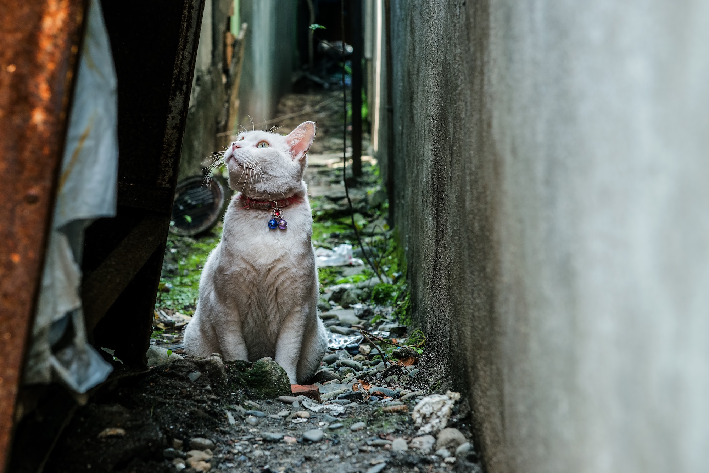
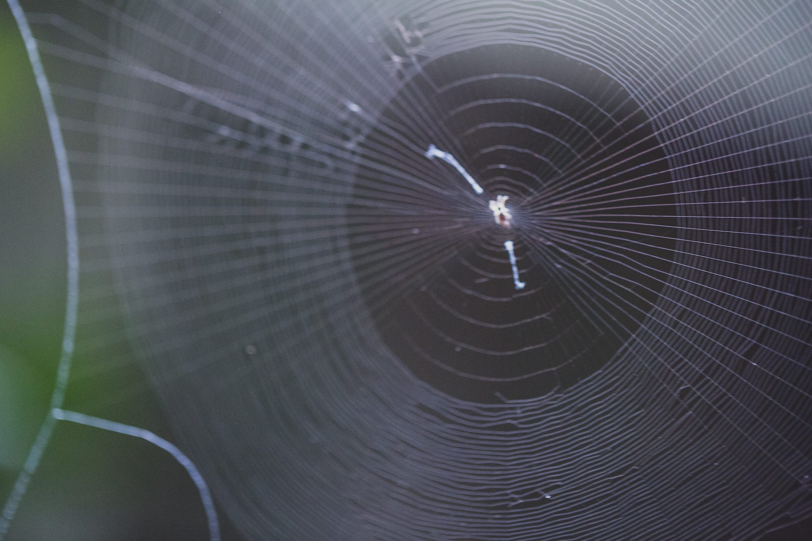

---
categories:
- トラウマ
date: Thu, 15 Oct 2015 00:22:00 +0000
slug: post-8469
title: 惨めさを払拭する方法。そんなモノはない。
---

いつも惨めな気分でした。他人と比べてできない自分を呪い。なんでこんなダメなんだろうと考えていました。とても嫌な気分。それを消し去りたいとずっと思っていました。今日はそれについて。

<!--more-->
<h2>スキル0で後輩が先輩でずっと惨めな思いをしてきた</h2>

入社以来たらい回し、異動のたびにスキル0の不思議のダンジョン状態

<strong>後輩が先輩で教わることはあるけど、教えることは社内ゴシップくらい</strong>

<strong>いつも惨めな思いをしてきました。</strong>

その惨めさを消すためには何をしたらいいのか。毎日惨めさを感じる人がどれくらいいるかわかりませんが、当時は毎日が苦痛でした。
<h2>惨めさの正体を見極める</h2>
では惨めさの原因て何だろうと考えると他人との比較により発生するのではないかと思います。

周囲と比べて、出来なかったり、持ってなかったりすることで<strong>自分を卑下する心情こそ、惨めさの正体なのではないかと思います。</strong>

そう考えると自分の気の持ちよう次第で惨めさを消すことができるのではないでしょうか。

その１つが<strong>「自分を許すこと」</strong>です。

プライドや焦りがあるから人と比べてしまうのです。そうじゃなくて、現在の自分をありのまま受け止め、ダメな自分を認め、冷静に足りない部分を見つめる。さらに足りない部分を獲得するために動く。

ムックの歌詞にもあります。
<blockquote>「今を受け入れろ、そこにとどまる価値なんてありゃしねえ」</blockquote>
弱さを受け入れて、強くなるための努力と勉強をすることでしか惨めさは消せないと思います。

そして、もう１つだけ方法がある。それは<strong>他の価値観を獲得して、惨めさを無視すること</strong>

会社や学校とは関係のないところで自分の価値を高め、自分には他に価値があってそっちで頑張ってるからココでクソでいいと思うこと。

ただ、中途半端なものだと惨めさに喰われるので誰にも負けないくらいのものを持たないとキツいかもしれない。
<h2>でも今も惨めさを感じてる</h2>

と散々書いてきましたが、結局は今現在ぼくは惨めさを払拭しきれていません。

自分より出来る奴なんていくらでもいるし、どうしても比べてしまいます。現状とのギャップを冷静に把握していても、比べてしまうものです。

ぼくの好きな海外ドラマ「Dr.HOUSE」の主人公のセリフにこんなのがあります。

「惨めさを無くすことなんかできない。ただ少なくすることはできる」

結局はコンプレックスを飼いならすしかないんだろうというのが今のぼくの結論です。
<h2>まとめ</h2>
惨めさを消すことなんてできない。だけど少なくすることはできる。

そのためには惨めさの正体を見極めて、努力すること。

もしくは、会社や学校以外で価値を見出して注力すること。