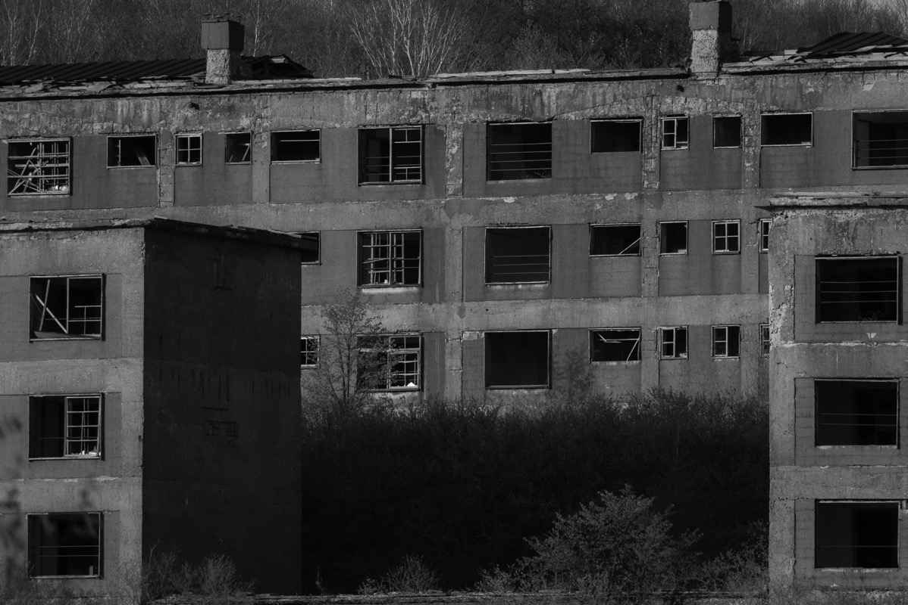
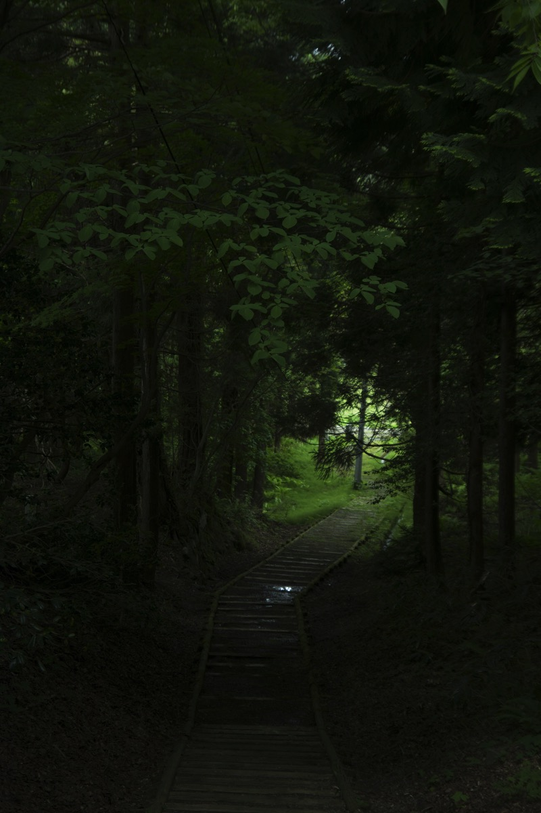

---
categories:
- トラウマ
date: Sat, 17 Oct 2015 16:07:30 +0000
slug: post-8479
tags:
- ブログ
title: 個性なんて鼻紙ほどの価値もないと呪った話
---

10代の時、他人と違う自分のことをひどく呪った時期がありました。

なぜ、クラスメイトが好きだというものに価値を見出せないのか

なぜ、クラスメイトが好むカルチャーを受け入れられないのか

なぜ、クラスメイトが賛同することに対して反対の意志しか湧かないのか

そんな自分を呪ったお話<!--more-->
<h2>人と違うものを求めた。生まれて初めてした自らの選択「PIERROT」</h2>

当時、ぼくはバキバキのピエラーでした。

ピエラーとは90年代後半から2000年代にかけて活躍したビジュアル系バンドのファンことです。世紀末にPIERROT（ピエロ）は、宗教的・政治的な体制批判的な楽曲や主張を発信し、LIVE演出も扇動的で宗教儀式や独裁的な政治パフォーマンスを再現することで逆説的に体制批判を行ったバンドでした。

これはぼくの解釈ですが、思春期真っ盛りのぼくはこの世界観と表現方法、楽曲のかっこよさに絡め取られ、<strong>人生で初めて与えられたもの以外で自分が好きだと言えるものに出会った</strong>のでした。

人が好かないものを、好きになったことは、ぼくだけの宝物を手にした感覚だったんでしょう。

しかし、時は世紀末。ビジュアル系ブームも風前の灯火

カラオケに行ってもメジャーなポップとして認識されるようになったGLAYやLUNA SEA、ラルクばかりが歌われ、PIERROTなんて知っている人は誰もいませんでした。

そして、やがては人と違うことを好むことは孤独になるんだということに気がつきます。
<h2>人と違うものを求めた結果、得たものは孤独と自己嫌悪</h2>

話が合わないクラスメイト、大勢の人と一緒にいることで感じる孤独。

ファンクラブの伝言ダイヤルに連絡先を入れたり、 ビジュアル系雑誌の白黒ページに掲載されてる友達募集の人に手紙を出したり、橋や原宿を徘徊したり、そんな感じで居場所を探していました。

やがて、孤独に耐え切れず自分を呪うようになりました。

恨んだのはあくまで自分自信。PIERROTを嫌いになったのかというと決してそんなことはなくて、もはや自分にはそれしかないんだという感覚で、さらに深く深く世界にはまっていきました。

今思えば、思春期真っ盛りかつ世紀末的な雰囲気にあって、PIERROTの厨二病的な歌詩は麻薬のような機能を果たしていたんだろうなと思います。

あの時に少しでも自分にバランス感覚があったら、こんな人生にはならなかっただろう。高校生活部活帰りに同級生とマック行って喋ったり、女の子と一緒に自転車押して帰ったり、休みの日にディズニーランドいったりとかしてたんだろうと思います。
<h2>滲みでるもの、それが個性</h2>

でも、今こうして冷静に過去を振り返ると決して全てがPIERROTを選んだせいではありません。

PIERROTを選択したバックグラウンドには、それを相応のものがありました。

自営業で親が働いるのでひたすら見させられた昔のウルトラマンに仮面ライダーにドラえもん

店が終われば帰って来た祖父と一緒に見た時代劇

休日も親は仕事だからゴジラにガメラ

そういった全てのことがぼくにPIERROTを選択させました。

だから、もうしょうがないんだなとそう気がついた時、なんだかあきらめがつきました。

それと同時に自分が求めた<strong>人と違うこと</strong>なんてものは、個性でもなんでもなかったんだなと感じました。

むしろ、人と違うものを選択させたバックグラウンドこそが個性

黙っていても滲みでる、それこそが個性なんだと思います。

そう結論付けてからは個性とか人と違うことがとか意識しなくなりました。

大人になった今でも、普通に初対面の人に「クセが強いですね〜」とか言われます。たぶん個性ってそういうもの
<h2>まとめ</h2>
個性とは、何を好きだとかどんなことをしてるとかじゃなくて、それをするに至ったバックグラウンドのこと

個性とは、自分から滲み出るもの