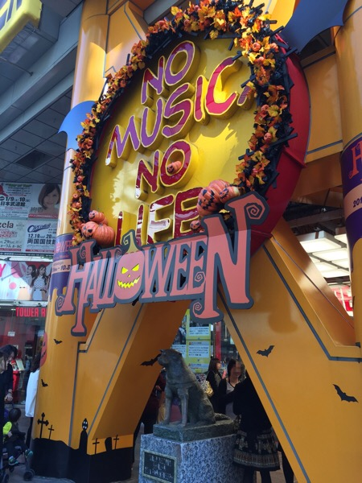
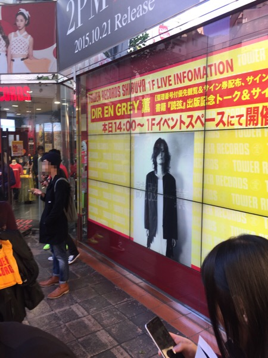
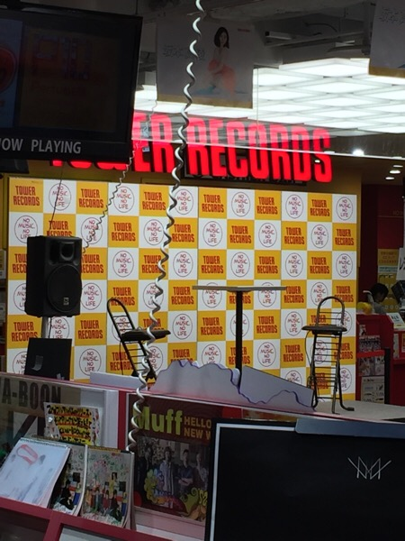
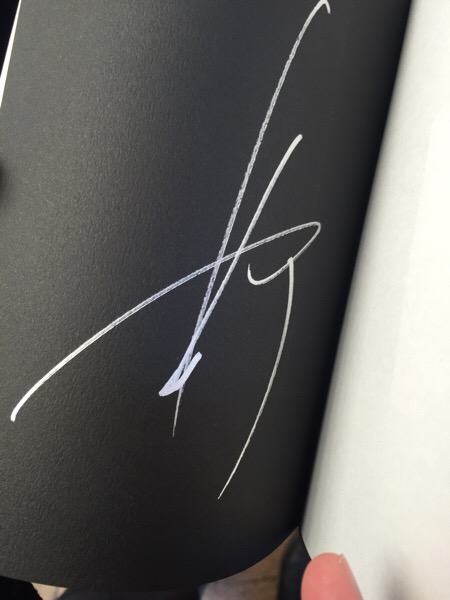

---
categories:
- 各メンバーの個人イベントレポなど
date: Sun, 25 Oct 2015 23:25:00 +0000
slug: post-8522
title: DIR EN GREY薫「読弦」発表トークイベント&サイン会レポ
---

DIR EN GREYのリーダー薫が、音楽と人にて毎月連載している「薫の読弦」
すでに連載から3年ほど経ちましたがこの度、単行本として発売されました。本日は、その発売を記念したトークイベントおよびサイン会のレポです。

https://twitter.com/tower_shibuya/status/658139005494542336
<h2>会場の様子</h2>
今回は渋谷のタワーレコードの一階でのイベントでした。

ステージには椅子が２つ机が１つ。SEは薫選曲と思しきハードなナンバーが流れていました。

<h2>トークイベント</h2>
まずは司会の方が現れ概要説明。するとおもむろに自己紹介

「音楽と人の樋口です」の声に会場からは「おー」の声。本人も恥ずかしがってました。

その後、呼び込まれて現れた薫に「かわいい」の黄色い悲鳴。そう言われて顔が真っ赤に。かわいい。

服装は上下全て真っ黒にいつものキャスケット
右手首には珠数の他に黒いチェーン状のブレスレット、小指に指輪
右腰にウォレットチェーン、黒ブーツ

トーク時間は30分。まずは1番の心配事である右手の状況についての話

樋口氏「大丈夫ですか？」

薫「いや、大丈夫じゃないですよ。でも、まぁしゃーないから。病院も何個か通って、トレーナーにもついてもらって、ちょっと時間かかるけど治していくので、<strong>大丈夫です。</strong>」

樋口氏「大丈夫とのことなので、このあとサインもしますので」

薫「さっき蚊に噛まれて腫れてるんですけど」

樋口氏「あとで観察してください」

その後は、執筆についての読弦の誕生の話や執筆について

読弦は樋口さんのオファーで、とりあえず半年やってみましょうと言うところから始まった。

最初の3ヶ月は書きだめしてあったからよかったけど、もうそれもできなくなってきた。樋口さん曰くしっかり〆切守ってくれるとのこと。

１つの原稿に1ヶ月くらいかかることも

読弦というタイトルは、薫が1番イマイチと思ったけど、いま思うとこれでよかった。他の候補を述べようとする樋口さんに薫が口止め

表紙の写真は薫が選出。薫の人となりがわかればということであの写真を選んだとのこと。2時間かけて撮影。アミタマリといつ方に撮影してもらったらしい。相性がいいのではと。

先着特典のしおりは、最初50種類くらい用意したかったけどダメでした

もうネタがなくなってきた。最近の話だとメンバーが出てきちゃうし、見せられない部分もあるから本当にネタがない

年始に薫単独イベントができればいいかなと！
<h2>サイン会</h2>
サインしてもらうページは表紙開いたところのみとのことで、迷ってたのでよかった。

本をスタッフの人が受け取って薫の前に固定してサインという流れ。なるべく薫に負担かけないようにということでしょうか

基本サインのみで会話できても一言二言のみ。少し長いと横に立ってる井上マネージャーがせきたてて剥がします。

ぼくは、何話そうかなぁと思ってましたが蚊に刺されたとのことなので

ぼく「蚊に刺されたら熱湯につけると治りますよ！」

薫「ほんまー！」

こんな、やりとりしました。

そしてこれがサイン

それと最後退場のとき「ありがとうございました。お騒がせしましたが頑張ってくんで。ありがとうございました。」と言って去っていきました。

https://twitter.com/tower_shibuya/status/658262960960212994
<h2>読弦について</h2>
読弦ですが•••もしまだ買ってなかったり、迷ってる方がいましたら絶対に買うことをお勧めします。

連載読んでたと思いますが、それ以外で追加された部分とインタビューは読むべきです。

最終章の「憧人」は、涙必至です。
<h2>まとめ</h2>
薫の指は気長に治療中

蚊に刺された

年明けにイベントやるかも

&nbsp;

&nbsp;

読弦の購入はこちらから
<a href="http://ck.jp.ap.valuecommerce.com/servlet/referral?sid=3041033&pid=883840419" target="_blank" rel="noopener noreferrer">TOWER RECORDS ONLINE</a>