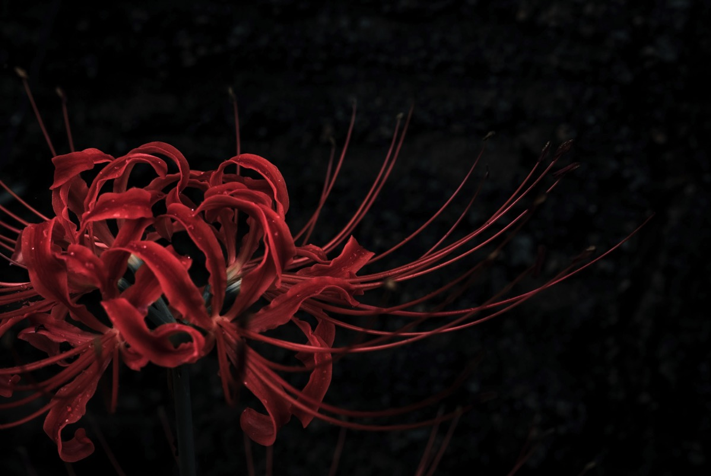
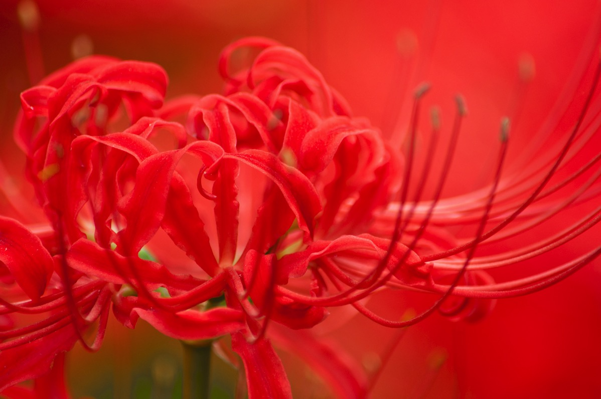

---
categories:
- トラウマ
date: Wed, 28 Oct 2015 16:42:47 +0000
slug: post-8526
tags:
- ブログ
title: 好きなものを好きで何がわるい
---

好きなものを好きで何がわるい。

これは、この世界からぼくが守ってきた自分である証だ。勝ち得てきたものだ。誰にも冒涜する権利はない。<!--more-->会社で趣味とか聞かれた時にDIR EN GREYが好きですというと驚かれる。そして付け加えて「好きなものがあっていいね」と言われる。

大人になると一般の人は趣味が減るらしく、仕事が中心になるのか、もともと依存するものがないのか、どうも「好き」と人に誇れるものが少ない人が多いみたい。もちろん、自分の中で好みとかはあるみたいだけれど、命かけてる感じのものはないみたい。

それで思い返したけど、ぼくがDIR EN GREYを好きでい続けられるのは、自分との葛藤とか周りからの疎外などを経て、それでも握りしめて離さなかったからだと思う。

<strong>好きなものをぼく自身の意志で守ってきたからだと思う。</strong>

仕事が忙しいとか、他人からどう見られるとか、そういったものや批判やらなんやら、全部はねのけて自分にはこれがあると胸を張って自分に言える。

その思いは他人に踏みにじられるものじゃないし、戦って勝ち取り続けたものだし

結果、それが揺るぎない自分の一部になってる

だから負けちゃいけない

好きな気持ちを否定することは自分を否定することだから

孔子様も言っている

<blockquote>子曰く、三軍も帥（すい）を奪うべきなり。匹夫も志を奪うべからざるなり。</blockquote>

意志ある人の心は変えられない。

DIR EN GREYの羅刹国という曲を聴いていてふと勝手に解釈した

なんとなく、他人に束縛されたこの世の中＝羅刹国で、他人の価値観に矯正される人間のことを歌ってるんじゃないかと思った。

<blockquote>心持つ者全て無と成り
此れ既に時遅く
全て崩れたり</blockquote>

自分の意志をもたないと断頭台にかけられて矯正される＝意志がなくなる

いわゆるビジュアル系を好きな人をバンギャと呼ぶけど、バンギャが使う言葉に「上がる」という表現がある。

簡単にいうと「ファン活動をやめる」こと

そのバンドのファンをやめるのではなく、ファンとして活動をやめて、ビジュアル系から完全に手を引く、というか足を洗う意味に近い。ちなみにジャニーズファンは「降りる」と表現するらしいけど。

統計があるわけじゃないけれど、その理由の少なくない割合を占めるのが「他人からの圧力」だとぼくは思っている。

学校、親、恋人、そして同じファン同士からの圧力

それで上がったり降りたりする。

あと、最近ネットでも親が子どもの趣味嗜好を矯正しようとする話が話題になっていた。

でも、それで負けていいのかってぼくは思います。他人の意志で曲げられた自分の意志。嫌な思いをしたくない気持ちも痛いほどわかるけど。

<strong>好きなものを好きでいられる自分であることは、すごい胸を張れることだと思います。</strong>

でも、<strong>そのためには戦い続けなければならない
</strong>

ただ、それって<strong>独尊の道を行けってことではない</strong>

もちろんそう言った方法論もあると思うけど、むしろ現実と折り合いをつけつつ、それでも離さないものこそが「本物」な気がする。

そうじゃないと<strong>好きなものが自分の逃げ道になってしまう</strong>

<strong>それはいずれイイワケになる道</strong>

戦うということは傷つくということだし、犠牲を払う必要もある。

でも戦わなければ生き残れない。

20世紀少年にこんな言葉があった。

<blockquote>強いとは弱さを知ること
弱さとは臆病であること
臆病とは大事なものを持っているということ
大事なものを持っているということは強いということ</blockquote>

この世界にたった1人の自分が好きだと言ってる

この気持ちは否定しちゃいけない。

ぼくはこれからも自分が好きなものを好きと思える自分でありたいとふと思いました。

