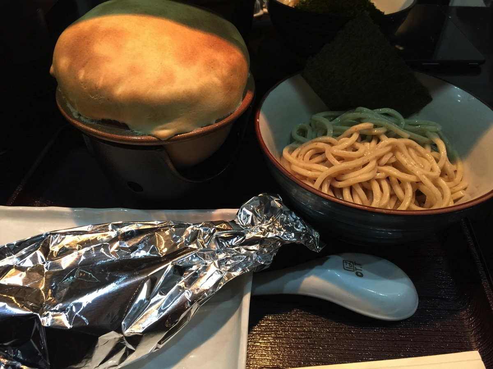
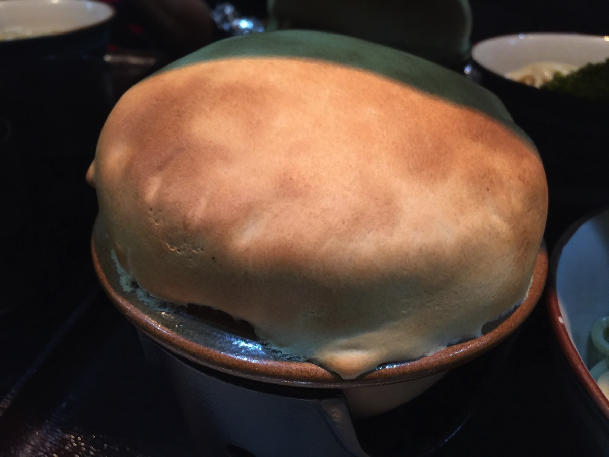
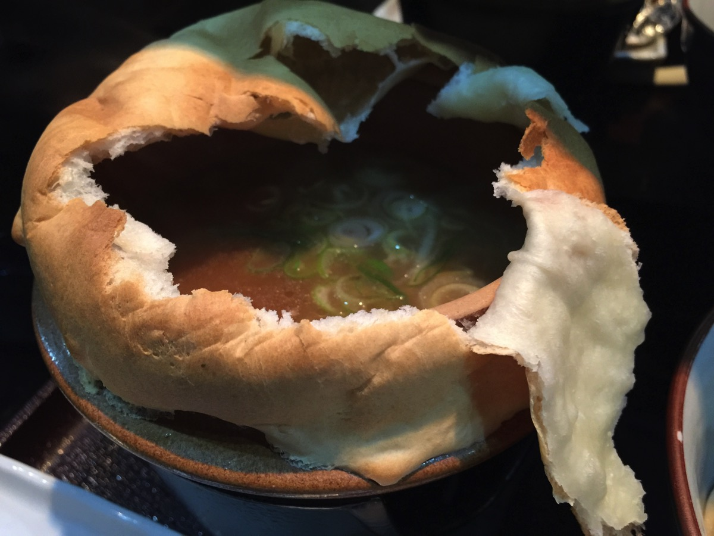
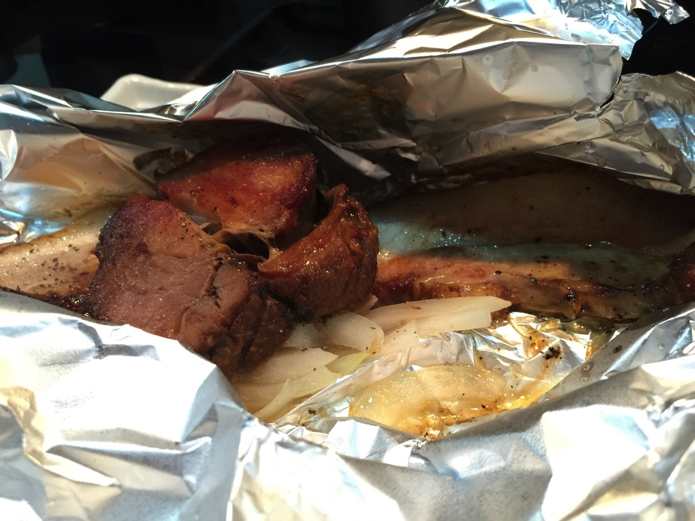
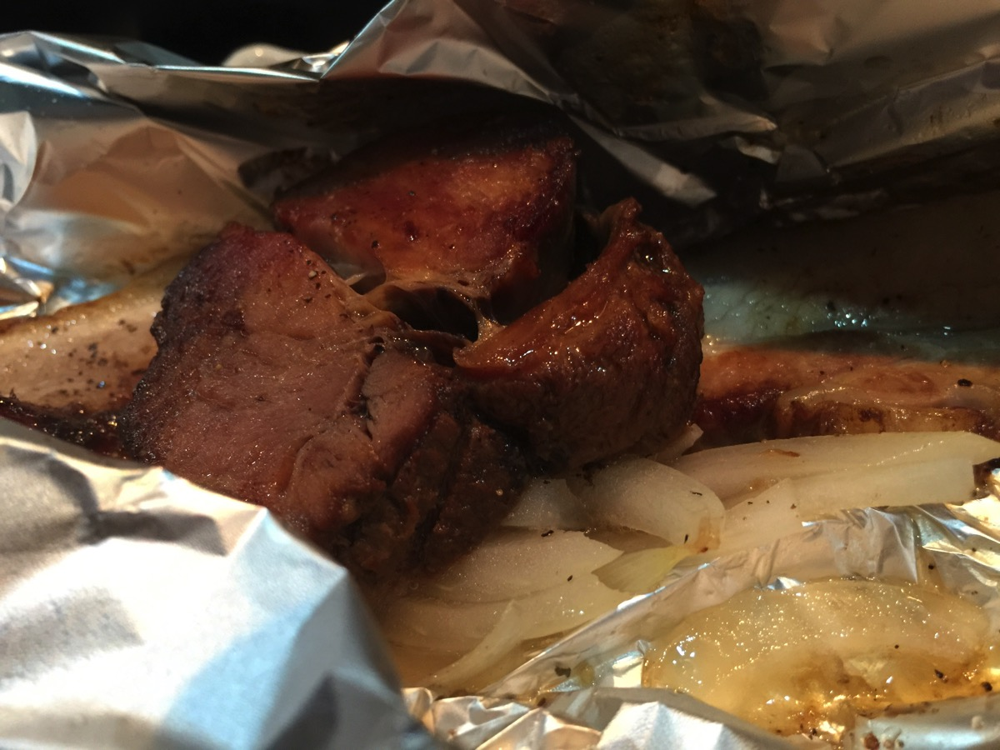

---
categories:
- グルメ
date: Mon, 02 Nov 2015 23:39:08 +0000
slug: post-8553
tags:
- つけめん
title: メレンゲの気持ちに出てたUMA TSUKEMEN（ユーエムエーツケメン）に行ってきた。
---

先日、メレンゲの気持ちのイッシーのコーナーに出た【らしい】UMAつけめんに行ってみました。初めて見るその異形とめちゃくちゃ美味しいチャーシューについてご紹介<!--more--><h2>UMA TSUKEMEN（ユーエムエーツケメン）</h2>

こちらがこの店のスタンダードメニューの極UMA MEGA つけめんです。

このドーム上の肌色の物体なんだと思いますか？

これ実はつけめんのつけ汁が入っています。このパイ生地を少しづつ破いて麺をつけて食べます。このパイ生地がつけ汁が冷めるのを防いでくれているようです。あとパイ生地をつけ汁に落としてしまうと生地が汁を吸って少なくなってしまうのと、味が変わってしまうそうなので落とさないで食べるといいそうです。

手前のアルミホイルにはベーコンとチャーシューが入っています。とてもあったかく、そして・・・

めちゃくちゃうまい！！！！チャーシューが味が染み込んでて絶品です。
350円でトッピングできるみたいなので、追加してもよかった。とにかくめちゃくうまかった。うまかった！！！

うますぎたのでアップでも！！！とにかくこれだけのためにここに通ってもいいくらいだ！

<h3>味</h3>

チャーシューは絶品

麺は？つけ汁は？というと、麺はこだわった自家製らしいです。そしてつけ汁は魚介系でエビ系の香りがしました。

ただ、癖があるというものではないのでエビ系が苦手な人でも食べられると覆います。

<h3>店舗情報、アクセス、店の雰囲気</h3>

<strong><a href="http://tabelog.com/tokyo/A1329/A132901/13087931/" target="_blank">UMA TSUKEMEN</a></strong>

<strong>関連ランキング：</strong><a href="http://tabelog.com/rstLst/ramen/">ラーメン</a> | <a href="http://tabelog.com/tokyo/A1329/A132901/R5481/rstLst/">西武立川駅</a>

車がないとかなり行きづらいところにあると思います。西武立川駅からは徒歩5分でいけますが、ぼく多分生まれて初めて西武立川というところに行きました。

住宅街で駅の目の前にスーパーというかショッピングセンターみたいなのがあったり、ゴルフの打ちっ放しがあったり、マンションがあったり、建売の住宅が立ち並んでたりして開発したっばかりだぜ！という感じです。

治安はたぶんいい！立川ってもっと治安悪いところだと思ってました。

それと店の雰囲気ですが、店長さんがいいキャラでとても親しみやすい方でした。常連の方も多いみたいでアットホームなお店でした。

<h2>しんぺーはこう思った。</h2>

チャーシューがね、マジでおすすめ

これは本当にもしかしたら今まで食べたチャーシューで一番かと思うくらい美味しかった。

あのね、本当に美味しかったです。ほんとうに美味しかったです。

と言ったところで本日は以上になります。  おやすみなさい。