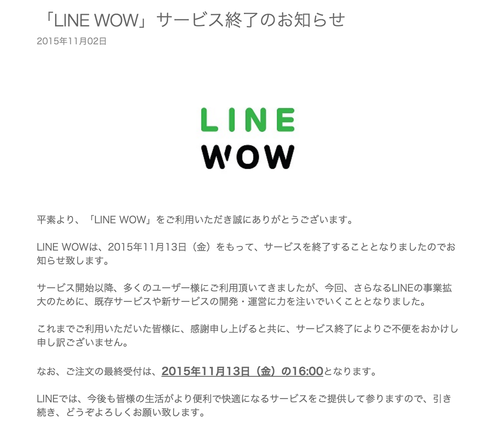
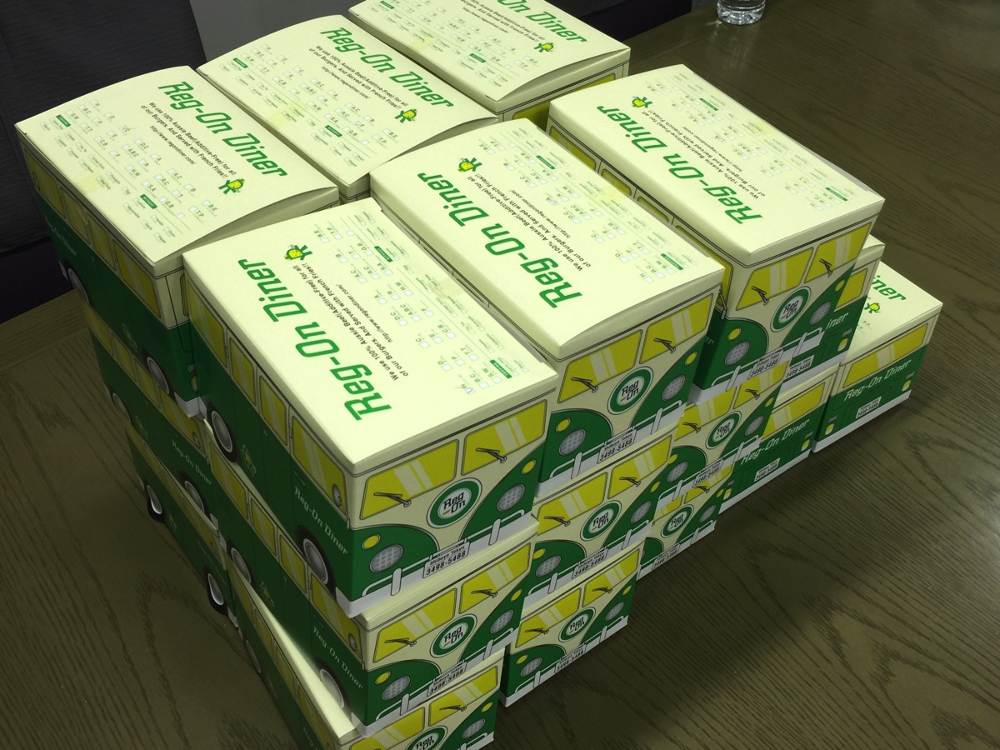
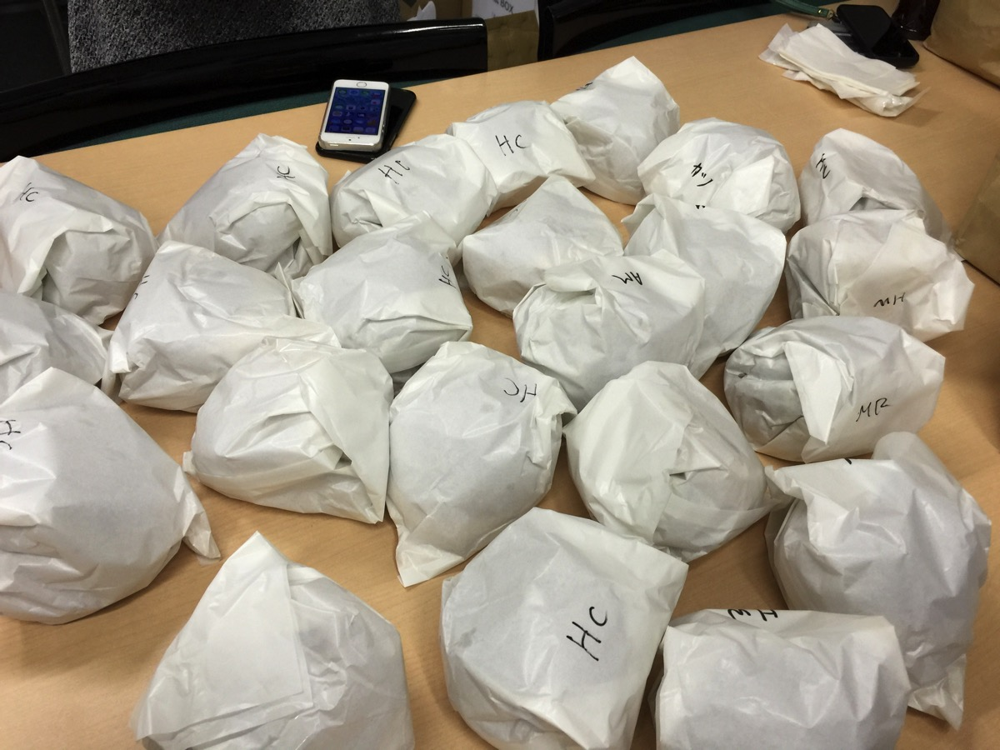
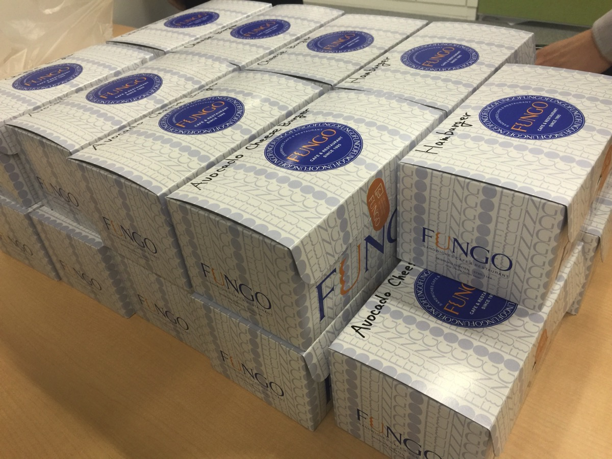
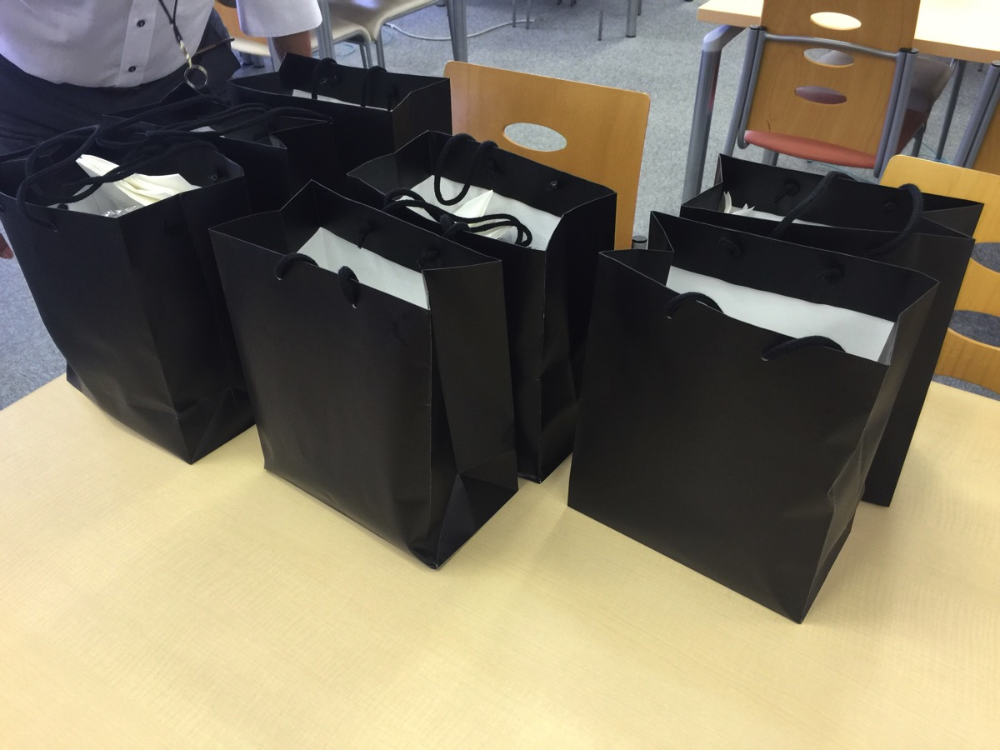
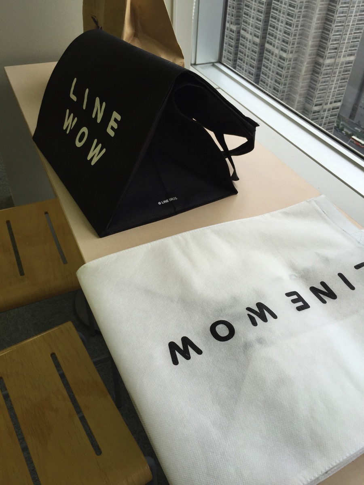
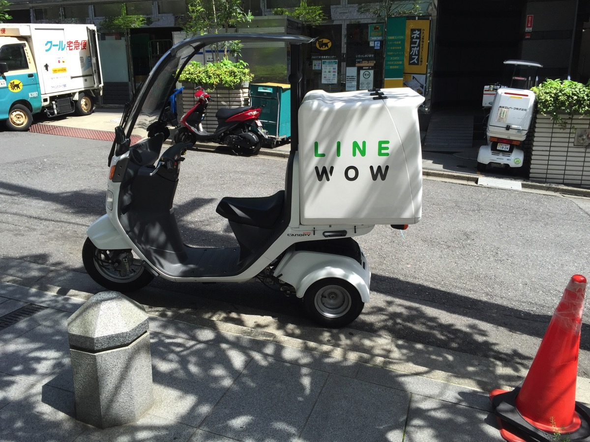
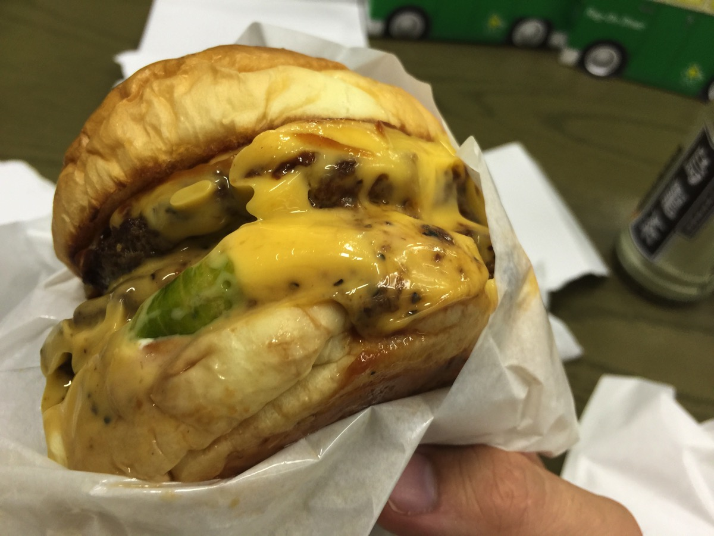
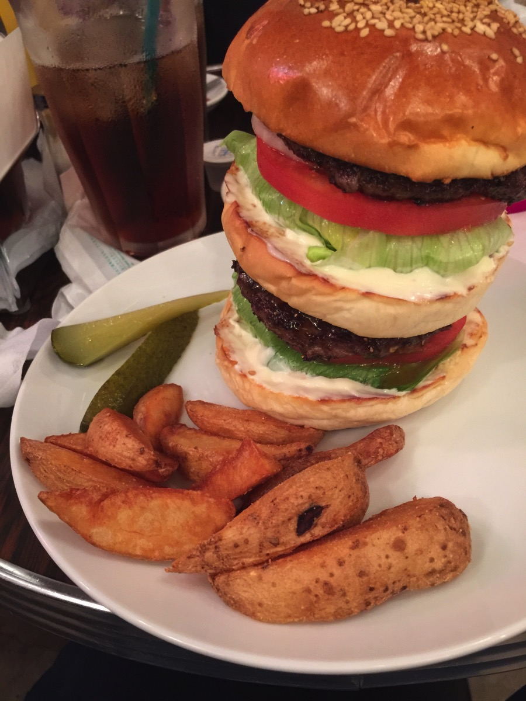
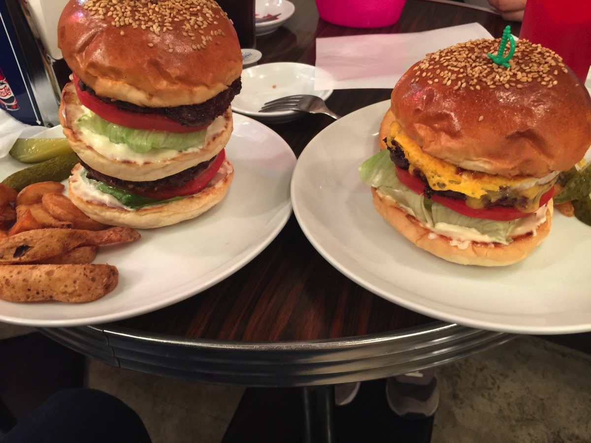

---
categories:
- LINE WOWの思い出
- グルメ
date: Tue, 03 Nov 2015 12:00:00 +0000
slug: post-8565
tags:
- LINE WOW
title: 【悲報】LINE WOWがサービス終了。一番うまかったハンバーガーをご紹介
---

ワンコインで配達エリア内の店のなんでも配達してくれる神サービスLIEN WOWが突然のサービス終了のお知らせ・・・悲しすぎる<!--more--><h2>まずはお詫びを</h2>

<a href="http://wow-blog.line.me/archives/1043526911.html">「LINE WOW」サービス終了のお知らせ</a>

まずはお詫びを・・・毎週毎週10個も20個もハンバーガーを注文してすいませんでした。わずか500円でなんでも配達してくれるLINE WOWさんにつけこんで、週２平均で注文してました。すいません。

ハンバーガーって大体デリバリー用の箱にポテトと一緒に入ってることが多いので20個注文すると一人で持ち運ぶの不可能なんですよね。

これくらいの量を専用の袋に入れてもってきてくれます。

しかも原付1台じゃ運搬も不可能だったでしょう。

人件費見合いとして絶対に赤字でしたよね。すいませんでした。

ぼくが注文すればするほど赤字だったのではないかと<strong>いつもおもっていました。</strong>

<h2>一番美味しかったハンバーガー</h2>

さて、そんな中運んでもらったお店で一番美味しかったお店をご紹介します。

毎週20人の同僚と食べ比べ、その人たちが口を揃えて言うので間違いありません。

<strong>渋谷のレッグオンダイナーです。</strong>

食べログの東京ハンバーガーランキング6位くらいですかな。ただ1位の店から順番に注文していって出した結論です。

<strong>ここが一番美味しいお店です。</strong>

これは実証に基づく答えです。20人の舌による公平な結論だと思います。
なおかつデリバリーという、店舗の雰囲気やサービスといった他の要素を配した条件下での答えです。

ちなみに店舗に行くと当然ですが焼きたてでめちゃくちゃ美味しいのが食べられます。

これ、デリバリー対応不可のサイズの「ビッグレッグ」です。

通常のハンバーガーの2倍あります。

<h2>レッグオンダイナーが最強</h2>

渋谷の奥地にあります。恵比寿との中間地点くらいにあります。めちゃくちゃ行きづらいですが、絶対におすすめです。

<strong><a href="http://tabelog.com/tokyo/A1303/A130301/13054359/" target="_blank">レッグオンダイナー</a></strong>

<strong>関連ランキング：</strong><a href="http://tabelog.com/rstLst/hamburger/">ハンバーガー</a> | <a href="http://tabelog.com/tokyo/A1303/A130301/R4698/rstLst/">渋谷駅</a>、<a href="http://tabelog.com/tokyo/A1303/A130302/R1528/rstLst/">恵比寿駅</a>、<a href="http://tabelog.com/tokyo/A1303/A130303/R5661/rstLst/">代官山駅</a>

<h2>しんぺーはこう思った。</h2>

おすすめです。めちゃくちゃ美味しいレッグオンダイナー

そしてLINEの次のサービスに期待！！！

と言ったところで本日は以上になります。  おやすみなさい。