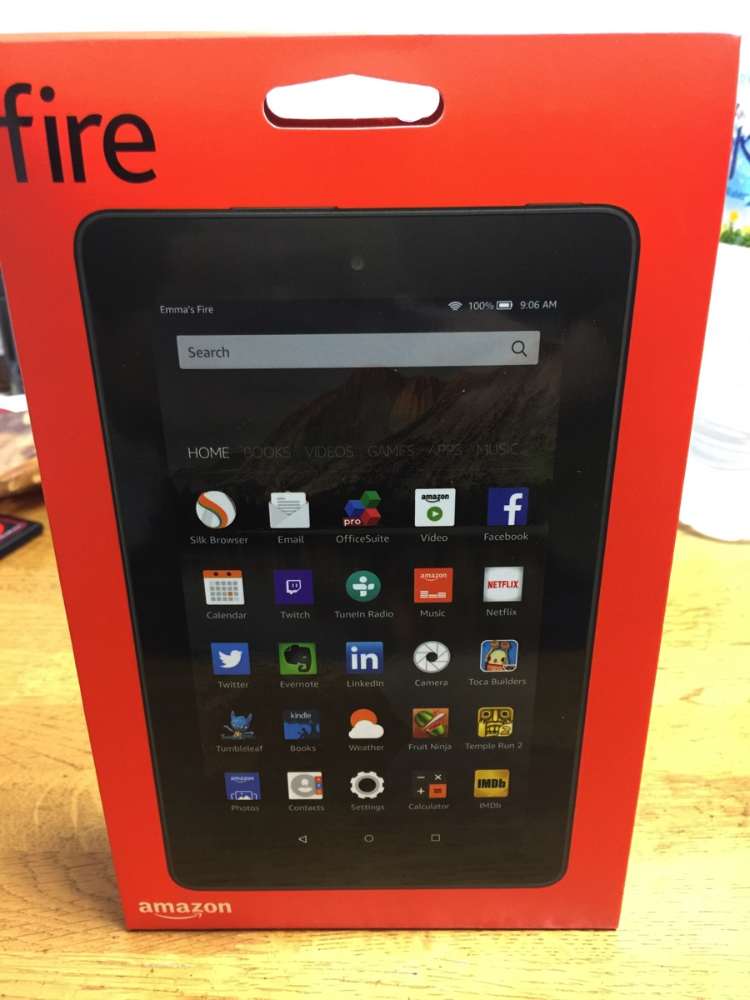
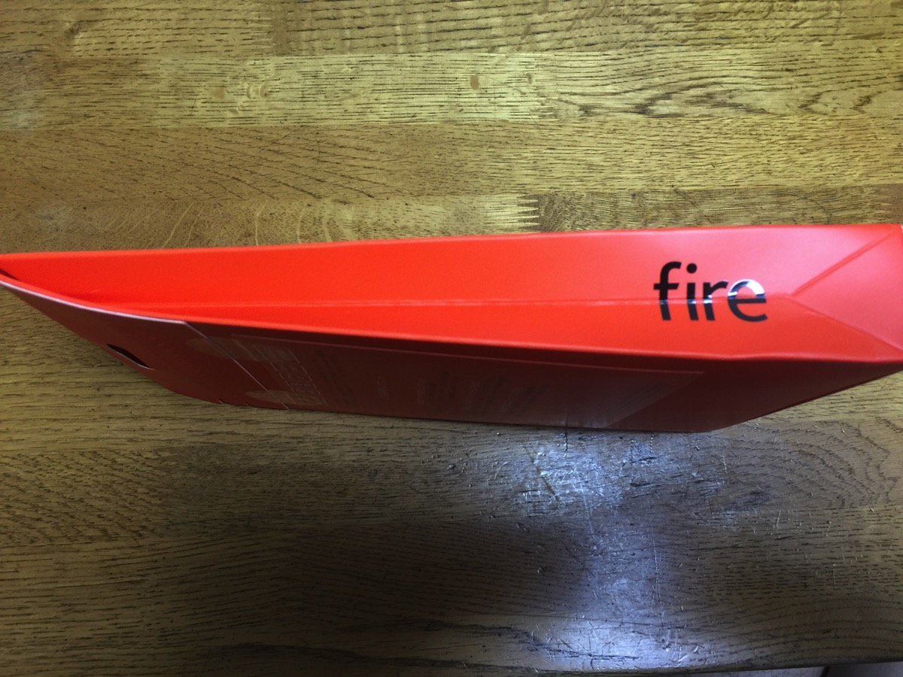
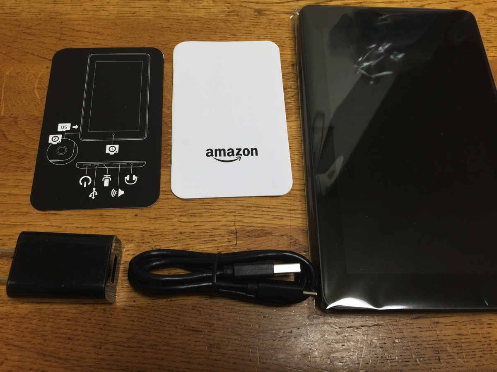
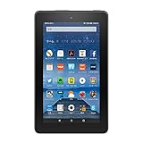
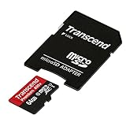

---
categories:
- レビュー
date: Sat, 07 Nov 2015 07:24:19 +0000
slug: post-8583
tags:
- amazon
title: Kindle Fireはめちゃくちゃ気軽に使える低スペック機だった
---

Amazonプライム会員特典として半額近い金額で購入できたAmazonのKindle Fire（8G）がやっと届きました。そして色々試したので感想をご紹介<!--more--><h2>Kindle Fireのいいところ</h2>

定価は8,980円

しかしながら、Amazonプライム会員特典として半額近い価格で購入することができました。

簡易な包装

無駄なものが一切入ってないことが伺えます。

ほぼケーブルなどのみ

この端末のいい所はとにかく気軽に使えるという点です。まとめるとこんな感じです。

<ul>
	<li>めちゃくちゃ気軽に使える</li>
	<li>Amazonのサービスが気軽に使える</li>
	<li>Amazonプライムビデオがダウンロードして見れる</li>
</ul>

安かったので、iPadなどと違って心理的に使いやすいきがします。

さらに、Amazonと直結しているためとにかくAmazonサービスがシームレスに使えるよう設計されています。

手軽すぎて不用意に購入ボタンをタップしてしまうとそのまま購入になります。とにかく消費行動が加速するガジェットです。

それと、Amazonプライムビデオの動画をダウンロードしてみることができます。通勤時などにテザリングなんかしてみるとすぐに通信制限がかかるので、家でダウンロードしていくと通勤時も心配ありません。

<table  border="0" cellpadding="5" style="border:none"><tr><td valign="top" style="border:none"></td><td valign="top" style="border:none;text-align:left">
 Amazon 2015-09-30

売り上げランキング : 2
<table style="border:none;margin-top:10px"><tr><td style="border:none;text-align:left;">
<a href="http://www.amazon.co.jp/gp/search?keywords=Fire%20%83%5E%83u%83%8C%83b%83g%208GB&__mk_ja_JP=%83J%83%5E%83J%83i&tag=warawareotoko-22" target="_blank" >Amazonで購入</a>

<a href="http://hb.afl.rakuten.co.jp/hgc/0f6e221b.2eb9748a.0f6e221c.35cc1e84/?pc=http%3A%2F%2Fsearch.rakuten.co.jp%2Fsearch%2Fmall%2FFire%2520%25E3%2582%25BF%25E3%2583%2596%25E3%2583%25AC%25E3%2583%2583%25E3%2583%2588%25208GB%2F-%2Ff.1-p.1-s.1-sf.0-st.A-v.2%3Fx%3D0%26scid%3Daf_ich_link_urltxt%26m%3Dhttp%3A%2F%2Fm.rakuten.co.jp%2F" target="_blank" >楽天市場で購入</a>

<a href="http://ck.jp.ap.valuecommerce.com/servlet/referral?sid=3041033&pid=882528283&vc_url=http%3A%2F%2Fsearch.shopping.yahoo.co.jp%2Fsearch%3Fp%3DFire%2520%25E3%2582%25BF%25E3%2583%2596%25E3%2583%25AC%25E3%2583%2583%25E3%2583%2588%25208GB" target="_blank" >Yahooショッピングで購入</a>

<a href="http://ck.jp.ap.valuecommerce.com/servlet/referral?sid=3041033&pid=882660047&vc_url=http%3A%2F%2Fauctions.search.yahoo.co.jp%2Fsearch%3Fvo%3D%26ve%3D%26auccat%3D0%26aucminprice%3D%26aucmaxprice%3D%26aucmin_bidorbuy_price%3D%26aucmax_bidorbuy_price%3D%26loc_cd%3D0%26abatch%3D0%26istatus%3D0%26filtered%3D1%26ei%3DUTF-8%26tab_ex%3Dcommerce%26va%3DFire%2520%25E3%2582%25BF%25E3%2583%2596%25E3%2583%25AC%25E3%2583%2583%25E3%2583%2588%25208GB" target="_blank" >ヤフオク!で購入</a>
</td><td style="vertical-align:bottom;padding-left:10px;font-size:x-small;border:none">by <a href="http://kaereba.com" rel="nofollow" target="_blank">カエレバ</a></td></tr></table></td></tr></table>

<h2>Kindle Fireのダメなところ</h2>

<strong>ストレージが全然足りない！！</strong>

これに尽きます。

購入したKindle本をダウンロードしようとすると全くストレージが足りません。

調整しつつダウンロードして、次にプライムビデオでウォーキングデッドをダウンロードしようとしたら容量不足でエラーに

かなり致命的です。

ただ、メモリーカードで容量を増設できるので適当なものの購入を検討しています。

<table  border="0" cellpadding="5" style="border:none"><tr><td valign="top" style="border:none"></td><td valign="top" style="border:none;text-align:left">
 トランセンド・ジャパン 2015-10-06

売り上げランキング : 30
<table style="border:none;margin-top:10px"><tr><td style="border:none;text-align:left;">
<a href="http://www.amazon.co.jp/gp/search?keywords=Fire%20%83%5E%83u%83%8C%83b%83g%208GB&__mk_ja_JP=%83J%83%5E%83J%83i&tag=warawareotoko-22" target="_blank" >Amazonで購入</a>

<a href="http://hb.afl.rakuten.co.jp/hgc/0f6e221b.2eb9748a.0f6e221c.35cc1e84/?pc=http%3A%2F%2Fsearch.rakuten.co.jp%2Fsearch%2Fmall%2FFire%2520%25E3%2582%25BF%25E3%2583%2596%25E3%2583%25AC%25E3%2583%2583%25E3%2583%2588%25208GB%2F-%2Ff.1-p.1-s.1-sf.0-st.A-v.2%3Fx%3D0%26scid%3Daf_ich_link_urltxt%26m%3Dhttp%3A%2F%2Fm.rakuten.co.jp%2F" target="_blank" >楽天市場で購入</a>

<a href="http://ck.jp.ap.valuecommerce.com/servlet/referral?sid=3041033&pid=882528283&vc_url=http%3A%2F%2Fsearch.shopping.yahoo.co.jp%2Fsearch%3Fp%3DFire%2520%25E3%2582%25BF%25E3%2583%2596%25E3%2583%25AC%25E3%2583%2583%25E3%2583%2588%25208GB" target="_blank" >Yahooショッピングで購入</a>

<a href="http://ck.jp.ap.valuecommerce.com/servlet/referral?sid=3041033&pid=882660047&vc_url=http%3A%2F%2Fauctions.search.yahoo.co.jp%2Fsearch%3Fvo%3D%26ve%3D%26auccat%3D0%26aucminprice%3D%26aucmaxprice%3D%26aucmin_bidorbuy_price%3D%26aucmax_bidorbuy_price%3D%26loc_cd%3D0%26abatch%3D0%26istatus%3D0%26filtered%3D1%26ei%3DUTF-8%26tab_ex%3Dcommerce%26va%3DFire%2520%25E3%2582%25BF%25E3%2583%2596%25E3%2583%25AC%25E3%2583%2583%25E3%2583%2588%25208GB" target="_blank" >ヤフオク!で購入</a>
</td><td style="vertical-align:bottom;padding-left:10px;font-size:x-small;border:none">by <a href="http://kaereba.com" rel="nofollow" target="_blank">カエレバ</a></td></tr></table></td></tr></table>

<h2>しんぺーはこう思った。</h2>

とにかく気軽に使えます。Kindleも読みやすいです。

プライムビデオも綺麗に見えるし、音質もグッドです。

ただ、ただ、ストレージが！！！！！そこだけ解決すればコスパ最強の消費行動加速装置になります！！！

年末年始の休みに向けて購入するのもいいかもしれないです。旅行時の移動中とか特にいいかも

それと移動が多いバンギャの暇つぶしにもいいかもしれないです。

と言ったところで本日は以上になります。  おやすみなさい。

<table  border="0" cellpadding="5" style="border:none"><tr><td valign="top" style="border:none"></td><td valign="top" style="border:none;text-align:left">
 Amazon 2015-09-30

売り上げランキング : 2
<table style="border:none;margin-top:10px"><tr><td style="border:none;text-align:left;">
<a href="http://www.amazon.co.jp/gp/search?keywords=Fire%20%83%5E%83u%83%8C%83b%83g%208GB&__mk_ja_JP=%83J%83%5E%83J%83i&tag=warawareotoko-22" target="_blank" >Amazonで購入</a>

<a href="http://hb.afl.rakuten.co.jp/hgc/0f6e221b.2eb9748a.0f6e221c.35cc1e84/?pc=http%3A%2F%2Fsearch.rakuten.co.jp%2Fsearch%2Fmall%2FFire%2520%25E3%2582%25BF%25E3%2583%2596%25E3%2583%25AC%25E3%2583%2583%25E3%2583%2588%25208GB%2F-%2Ff.1-p.1-s.1-sf.0-st.A-v.2%3Fx%3D0%26scid%3Daf_ich_link_urltxt%26m%3Dhttp%3A%2F%2Fm.rakuten.co.jp%2F" target="_blank" >楽天市場で購入</a>

<a href="http://ck.jp.ap.valuecommerce.com/servlet/referral?sid=3041033&pid=882528283&vc_url=http%3A%2F%2Fsearch.shopping.yahoo.co.jp%2Fsearch%3Fp%3DFire%2520%25E3%2582%25BF%25E3%2583%2596%25E3%2583%25AC%25E3%2583%2583%25E3%2583%2588%25208GB" target="_blank" >Yahooショッピングで購入</a>

<a href="http://ck.jp.ap.valuecommerce.com/servlet/referral?sid=3041033&pid=882660047&vc_url=http%3A%2F%2Fauctions.search.yahoo.co.jp%2Fsearch%3Fvo%3D%26ve%3D%26auccat%3D0%26aucminprice%3D%26aucmaxprice%3D%26aucmin_bidorbuy_price%3D%26aucmax_bidorbuy_price%3D%26loc_cd%3D0%26abatch%3D0%26istatus%3D0%26filtered%3D1%26ei%3DUTF-8%26tab_ex%3Dcommerce%26va%3DFire%2520%25E3%2582%25BF%25E3%2583%2596%25E3%2583%25AC%25E3%2583%2583%25E3%2583%2588%25208GB" target="_blank" >ヤフオク!で購入</a>
</td><td style="vertical-align:bottom;padding-left:10px;font-size:x-small;border:none">by <a href="http://kaereba.com" rel="nofollow" target="_blank">カエレバ</a></td></tr></table></td></tr></table>