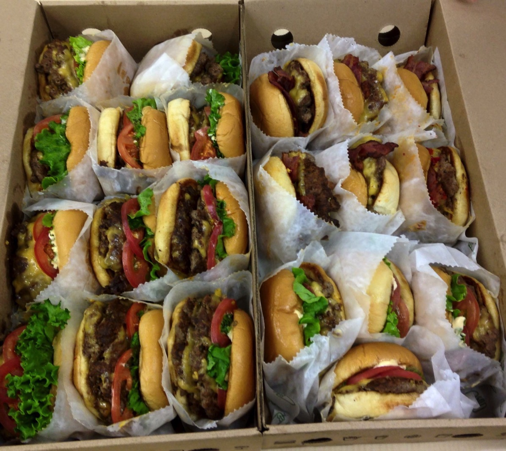
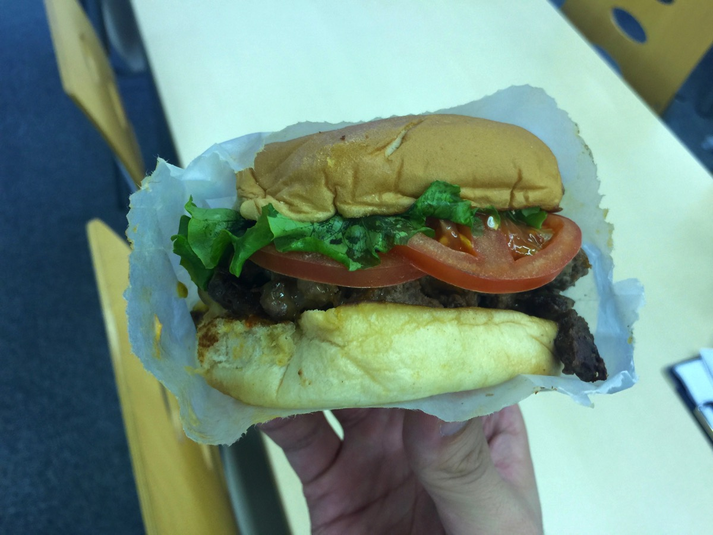
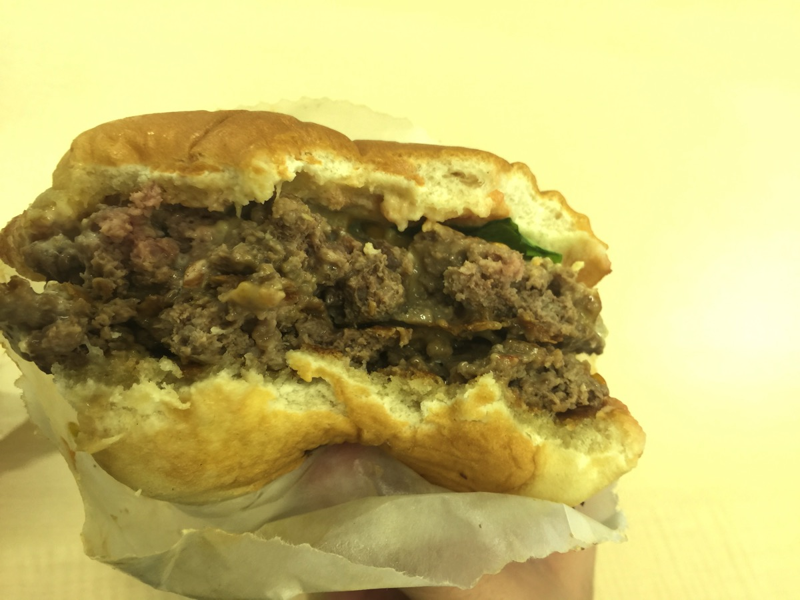
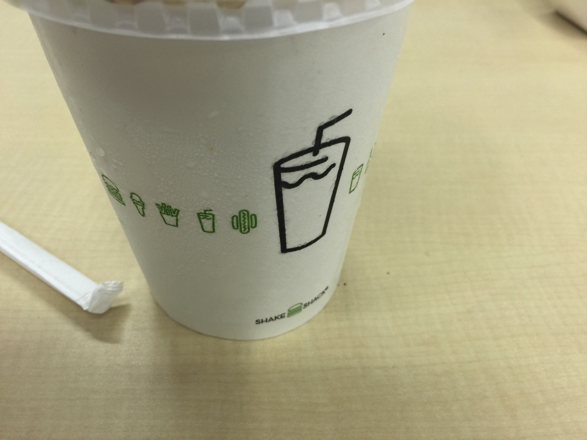

---
categories:
- LINE WOWの思い出
- グルメ
date: Sat, 14 Nov 2015 01:40:41 +0000
slug: post-8600
tags:
- グルメ
- ハンバーガー
title: シェイクシャックのハンバーガーをLINE WOWに4時間並んで買ってきてもらった話
---

本日（11月12日）外苑にオープンしたハンバーガーシィップ「シェイクシャック」さっそく食べましたよ！

でも実際にお店にいって食べたわけではなく、<a href="https://www.warawareotoko.com/2015/11/03/post-8565/">本日店じまいのLINE WOW</a>にデリバリーをお願いして、食べました！<!--more--><h2>シェイクシャックとは</h2>

シェイクシャックとはニューヨークに本社をおくハンバーガーチェーンです。2000年にマディソンスクウェアガーデンで始めた屋台が起源らしいです。

そしてシェイクシャックというくらいなのでシェイクが売りで、その品質はアメリカの業界内でも最高品質とされているらしいです。

なお、ニューヨークでも毎日長蛇の列がするくらい人気らしいです。

<h3>日本でのシェイクシャック</h3>

1号店である外苑いちょう並木店はこちらにあります。

<strong><a href="http://tabelog.com/tokyo/A1306/A130603/13189009/" target="_blank">シェイク シャック 外苑いちょう並木店</a></strong>

<strong>関連ランキング：</strong><a href="http://tabelog.com/rstLst/hamburger/">ハンバーガー</a> | <a href="http://tabelog.com/tokyo/A1306/A130603/R2209/rstLst/">外苑前駅</a>、<a href="http://tabelog.com/tokyo/A1306/A130603/R93/rstLst/">青山一丁目駅</a>、<a href="http://tabelog.com/tokyo/A1309/A130901/R4658/rstLst/">信濃町駅</a>

【店舗詳細】
シェイク シャック 外苑いちょう並木店
オープン日：2015年11月13日(金)
営業時間：11:00〜22:00
席数：店内 67席 / テラス席 100席
場所： 明治神宮外苑内 外苑いちょう並木
住所：東京都港区北青山2-1-15
TEL：03-6455-5409
※2015年11月に1店舗目を東京にオープン、2020年までに10店舗の展開を予定。

<h2>シェイクシャック食べてみたので感想を</h2>

御託が長くなりましたが、食べた感想を

いつも通り、20個前後注文しました（参考：<a href="https://www.warawareotoko.com/2015/04/19/post-7631/">LINE WOWでデリバリーしたハンバーガーたち</a>）

色合いがすごい綺麗なハンバーガーです。食品のモデルみたいな感じです。しかも変わってるのがパンが上下で独立しておらず、繋がっていました。
おそらくですが、バーガー袋の中にパンを入れておいてそこに中身を差し込んでいくという作り方でしょう。極めて効率的でいかにもニューヨークという感じがします。

ちなみにこのバーガー袋は今まで頼んだどこのお店のバーガー袋よりも強靭で時間がたって油が染み込んでいるにもかかわらず、破けませんでした。

バンズにも厚くてジューシーでした。野菜は入っているけどほぼ食べている感覚がなく、肉を喰らう！！という感じです。

シェイク！！！これに関しては配達の時間もあったのでほぼ液体になっていました！しかしとっても濃厚！！レギュラーサイズを注文したんですが、正直スモールで十分です！！女性ならとくにスモールで十分ですよ！！

<h2>しんぺーはこう思った</h2>

うまかった！！！LINE WOWさんラストでこんな大仕事をお願いしてすんませんでした！！配達の方からも並んでいる最中に状況報告のメールが来たりして、「目の前にあと50人ならんでます！」とか言われました。Twitterなんかで見ると4時間待ちとか書いてあったし、いやーワンコインでなおかつ昨日は寒かっただろうに、本当にありがとうございました！！！

こんな素晴らしいサービスが終わってしまうのは非常に残念です。大好きだったのに。復活があるならば今後は月額制とか重量（重さ）課金制や距離による料金変化などをした方がいいのかなと思います。ただそうなるとワンコインという分かりやすさと手軽さが損なわれてしまうかなと思いますが。

LINE WOWは誰もやらなかった領域に初めて乗り出した素晴らしい発明でした。

復活をお待ちしています。

で、ハンバーガーの感想ですが美味しかったです！！ただし！！！！やはりレッグオンダイナーには勝てませんね。

レッグオン最強です。でも今まで食べたハンバーガーの中では5本の指にはまーはいるかもしれないです。並んで食べてみてもいいかもしれません。

と言ったところで本日は以上になります。  おやすみなさい。