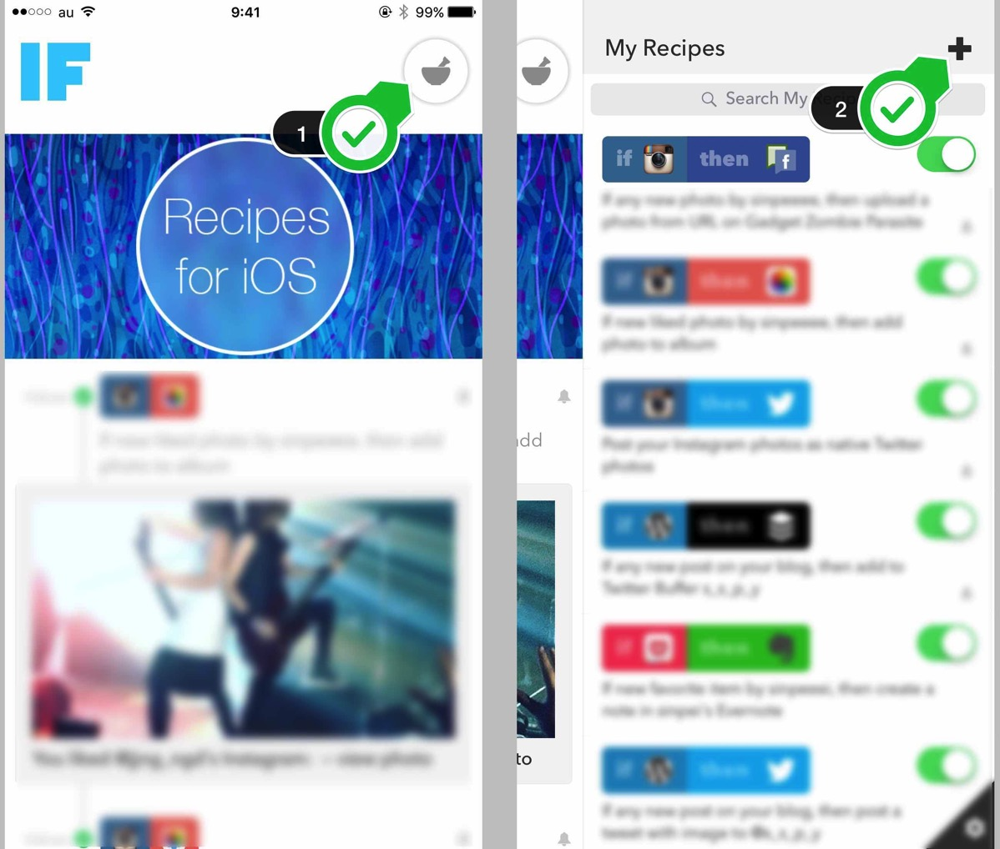
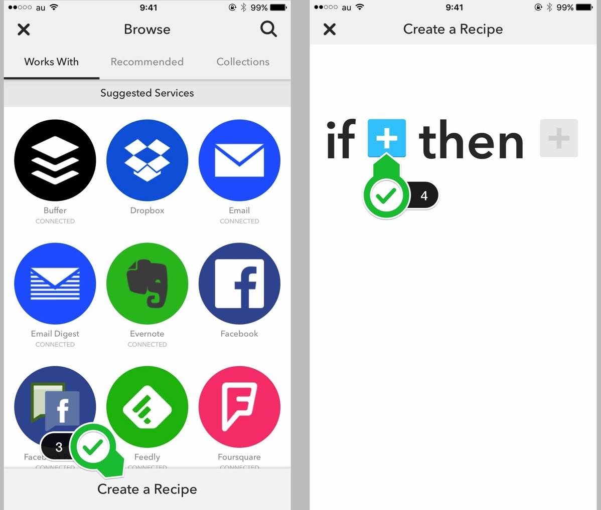

---
categories:
- アプリ
date: Sun, 15 Nov 2015 01:33:03 +0000
slug: post-8606
tags:
- Instagram
title: instagram（インスタグラム）でいいねした画像を自動で保存する方法
---

DIR EN GREYのShinyaがInstagramを頻繁にあげてくれるので、それを見るためにInstagramに登録しました。

そういう方も多いかと思います。しかし、Instagramといえば今や世界で一番使われているSNSで、今後もどんどん利用者が増えていきそうな勢いです。

ぼくもだんだんと使い方が解ってきたので、これからどんどん使っていきたいと思っております。

ということでInstagramの使い方について役にたつ設定をご紹介します。<!--more--><h2>Instagramの画像を保存する方法</h2>

すでに利用されている方はお分かりかとおもいますが、Instagramで投稿された画像は保存することができません。これはPCでもスマホでも同様です。

そのため、スクショをとってそれを加工したりしている方がほとんどだと思います。

しかし、この方法を使えばスクショすることなく綺麗な画像を保存することができます。

<h3>「IF」を使ってInstagramでいいねした画像をそのまま保存する</h3>

IFというアプリをご存知でしょうか。これは「何か」をした時に「何か」を自動でしてくれるアプリです。

例えば、Twitterに投稿した内容をEvernoteに保存したり、メールを受け取ったら自動でDropboxに保存したり、家に帰ったら家電と連携するアプリに命令して自動で明かりをつけたりとかとか

そんな感じで使い方によっては超絶便利な神アプリになっております。
ただし全部英語のアプリです。。。とはいえ、設定は簡単ですので心配ご無用

それでは使い方をご説明します。

まずはダウンロード。

<a href="https://itunes.apple.com/jp/app/if-by-ifttt/id660944635?mt=8&uo=4&at=11ld5P" target="_blank" rel="noopener">IF by IFTTT</a>

無料

(2015.11.15時点)

<a href="https://itunes.apple.com/jp/developer/ifttt/id660944638?uo=4&at=11ld5P" target="_blank" rel="noopener">IFTTT</a>

posted with <a href="http://pochireba.com" rel="nofollow noopener" target="_blank">ポチレバ</a>

右上のアイコンをタップします。すると自分が作成した自動化のレシピがずらっとでてきます。当然、最初は何もありませんので、新規で作成します。右上のプラスマークをタップしてください。

自分でレシピを作らなくても、あらかじめ用意されているものも沢山あります。今回は一から自分で作成します。画面下をタップ、すると「if~then~」というのがでてきます。これは「もし何かのアプリの特定の動作をした時に、他のアプリで何かをする」という意味です。プラスをタップしてください。

するとアプリ一覧がでてきますので、instagramをタップしてください。
次にInstagramでトリガーになる動作を選びます。「You like a photo（あなたが写真にいいねをする）」をチェックします。

次に、赤いプラスをタップします。これで後半の挙動を設定しますので、iOS Photosをタップします。

英語で説明が書いてありますが、「Add photo to album」をタップ
ここは細かい設定ができるのですが、そのままNextをタップしてください。

Finishをタップ。これで設定が完了です。あとはInstagramでいいねするだけです。

ただし注意点があります。いいねしただけではすぐに保存されません。おそらく通信にタイミングがあるみたいで1日1回から数回程度の同期がされるみたいです。そこで、すぐに保存したい場合はこちらの画面でCheck nowをタップします。

これで完了です。

<h2>まとめ</h2>

このIFというアプリは他にも様々なレシピがあります。
とても役にたつアプリです。

おすすめです。

と言ったところで本日は以上になります。  おやすみなさい。