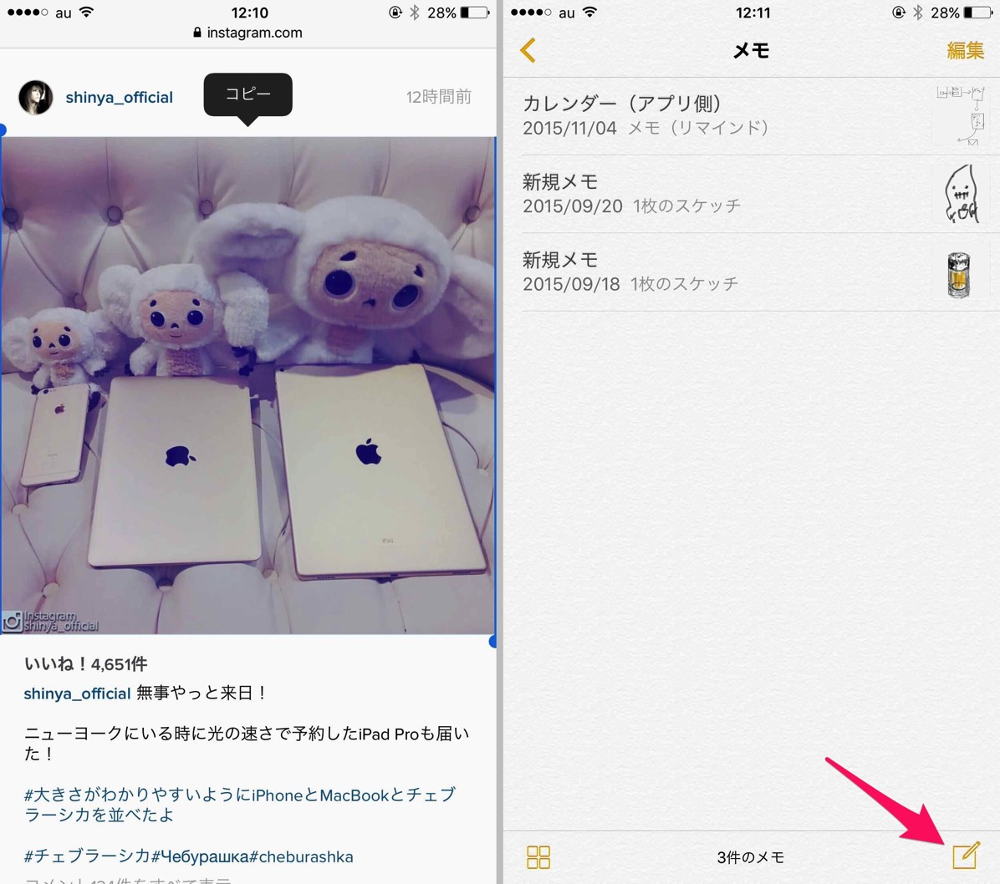
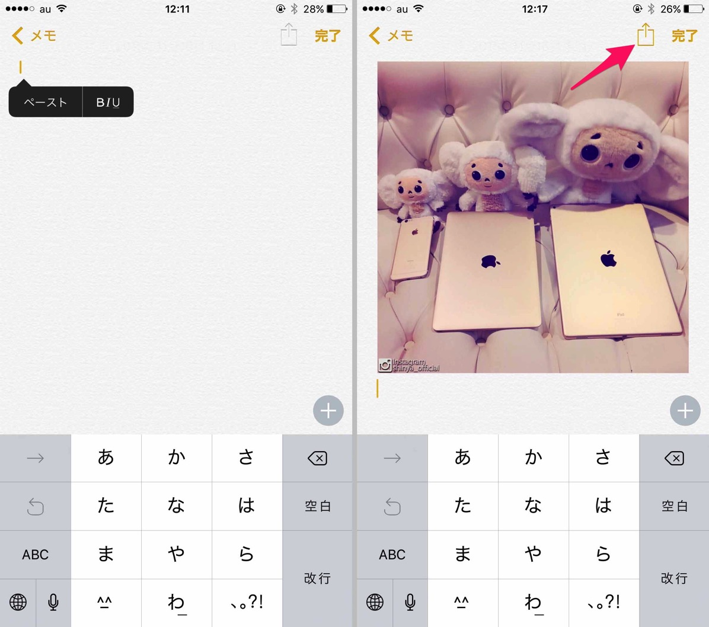

---
categories:
- アプリ
date: Mon, 16 Nov 2015 02:34:59 +0000
slug: post-8628
tags:
- Instagram
title: メモ帳を使ってInstagramの画像を保存する方法
---

昨日ご紹介しました<a href="https://www.warawareotoko.com/2015/11/15/post-8606/">「instagram（インスタグラム）でいいねした画像を自動で保存する方法」</a>よりも簡単に画像を保存する方法を見つけましたのでご紹介します。

<!--more-->
こちらの記事で紹介しましたIFというアプリを利用した方法ですと、自分がいいねした画像が全部保存されてしまいます。一回設定すると全自動なので楽っちゃ楽ですが、そうするといつのまにかアルバムの中に必要な画像以外の画像がどっさりなんてことになってしまいます。（参考：<a href="https://www.warawareotoko.com/2015/11/15/post-8606/">instagram（インスタグラム）でいいねした画像を自動で保存する方法</a>）

そこでアプリなどを使わずに簡単にInstagramの画像を保存する方法をご紹介します。

<h2>Instagramでアプリを使わずに画像を保存する方法</h2>

簡単３ステップです

1.safariでInstagramにアクセス

2.保存したい画像部分をタップして長押ししてコピー

3.iOSのメモアプリで新しいメモ帳を開く

<ol>
</ol>

4.メモ帳の入力部分をタップして長押ししてペースト

5.矢印バタンをタップ

6.画像を保存をタップ

これだけです。これだけで好きな画像が保存できます。

まれにペーストが上手く行かずに直前にコピーした他のテキストとかがペーストされる場合がありますが、その場合はsafariとメモ帳を一旦終了して、バックグラウンドから消して再起動すると治るかもしれません。

<h2>しんぺーはこう思った。</h2>

サードパーティー製のInstagramアプリなどを使えば保存できるみたいですが、保存のために他のアプリを使うのも面倒くさいですし。

どちらにしろお気に入りのアーティスト関連でしか使わないでしょうから、頻度的にコレがオススメだと思います！

と言ったところで本日は以上になります。

おやすみなさい。