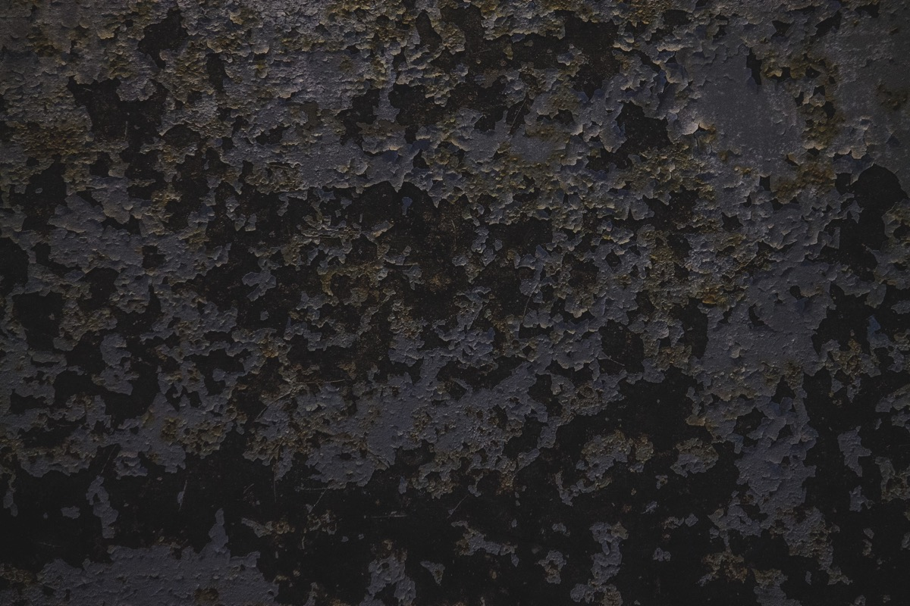

---
categories:
- トラウマ
date: Sat, 21 Nov 2015 00:45:08 +0000
slug: post-8640
tags:
- ブログ
title: 自己否定をしたことのない人間をぼくは信じられない。
---

以前付き合いのあった友人が自己否定をしたことのない人間でした。だいたいは周りのせいにしたり、脊髄反射的に生きていて、目の前に起こった事象にのみ反応する人間でした。それでいて別に頭が悪い人間ではないのですが。

他罰的というか、自分の非について考えない人間した。<!--more--><h2>他罰的な人間が許せない</h2>

ぼくは極めて自罰的な人間でした。
自分がいなくなればいいというか、自分がいること自体が悪だとずっと考えていました。

世の中にはいてもいなくてもいい人間もいるけど、自分はいちゃいけない人間だと考えていました。

そんなぼくからすると他罰的な人間を理解することができませんでした。

自分が悪いと思い、自分を責めている人間からすれば、明らかに自分の行動の結果起きた行動に対し、自分以外のせいにするような思考構造が理解できません。

<h2>他罰的な人間はメンタルが弱いと思う</h2>

のちに社会人になってからですが、そいつは会社を長期間休業しました。
これも彼が招いた結果なのですが、これも理解できません。

自分に非があるにも拘わらず、勝手に病んでお薬を飲むようになりました。

思うに、内罰的な人間の方がメンタルでの打たれ強さがあるんじゃないかと。自分で自分をいじめているし、自己否定を繰り返してきている分、他人に責められても他罰的な人間ほどのダメージを受けない気がします。

よく彼はぼくに対し「おれの立場だったら絶対に病んでるでしょ」と繰り返し言ってきました。
でも、そんなことないだろうと思います。

思い返せばそれも彼の他罰的側面だったのでした。

<h2>自己否定したことのない人間をぼくは信頼できない</h2>

だからと言って内罰礼賛しているわけではありません。

内罰的すぎるせいでぼくはだいぶ遠回りしてきた気がします。といってもそれはそれで今の自分を作る重要な要素だったと思いますが。

なぜ内罰すなわち自己否定をする人間に対し信頼をおくかというと、それはそもそもの前提として自分が間違ってるかもという選択肢を持っているからです。

他罰的な人間は、自分の行いですら自分が原因かもという前提がありません。だから問題の解決に対し、大きく逸脱する可能性があります。そういう人間と会話をすると全く話がかみ合わないケースがあります。世間ではこの現象を価値観の相違と呼びます。

だからぼくは自己否定をしたことのない人間を信頼できません。

自分の生命や出自までを否定しろとは言わないけれど、何か問題にあたっては自分にも非がある可能性を考慮してもいいのではないかと思うのでした。