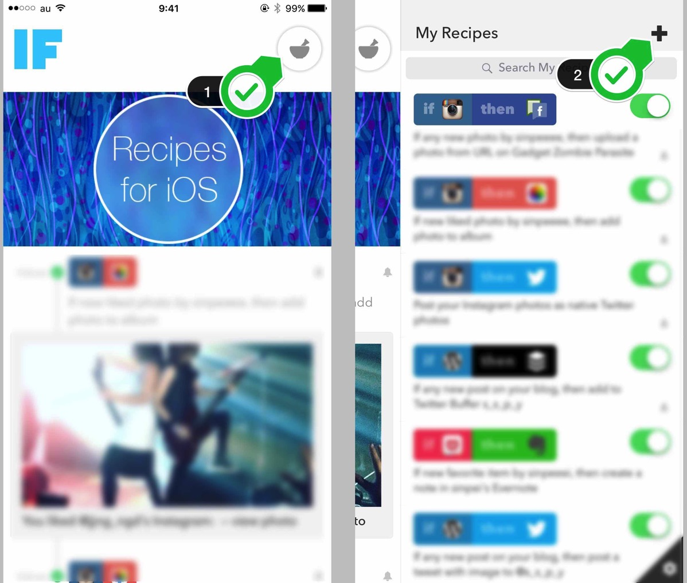
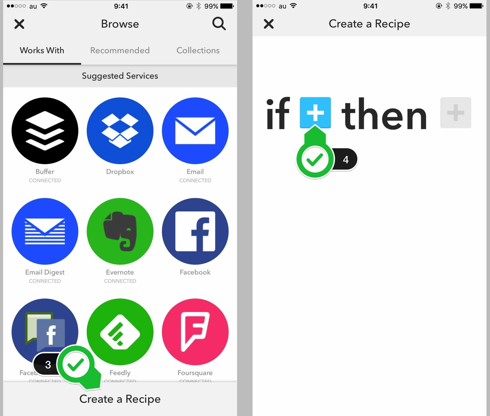
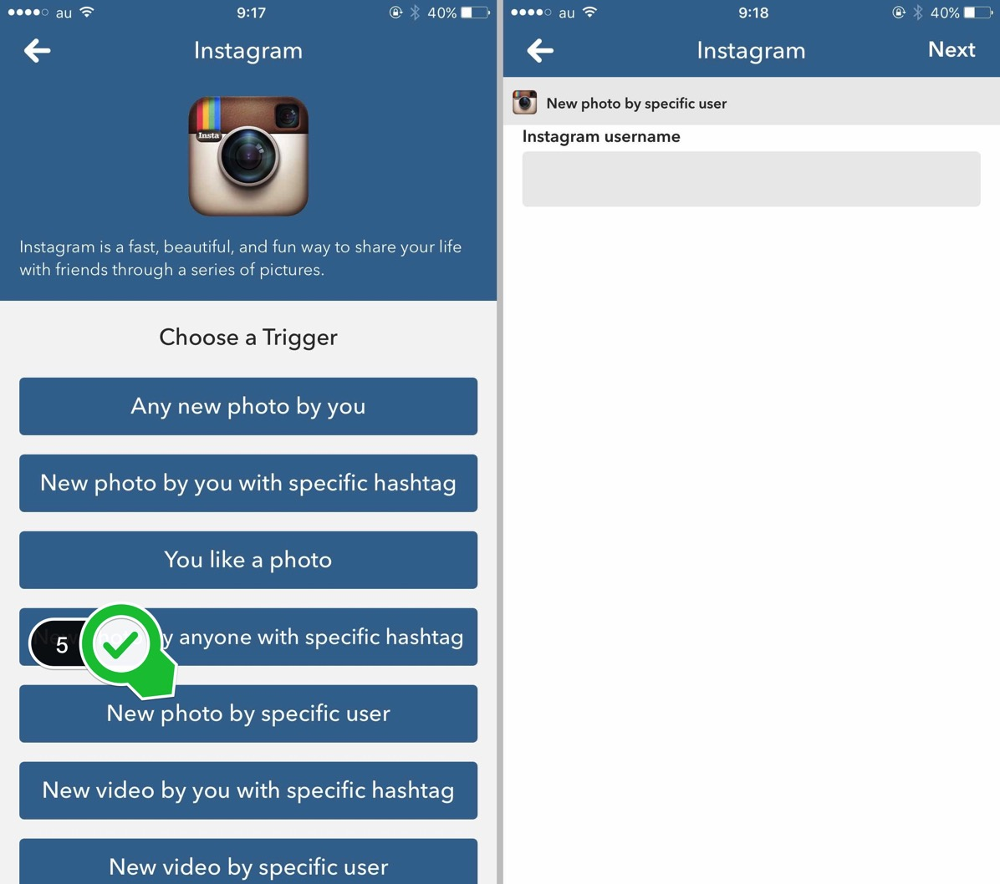
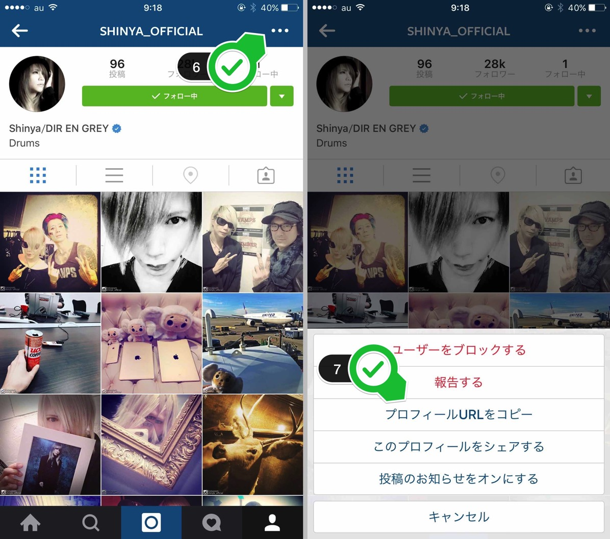
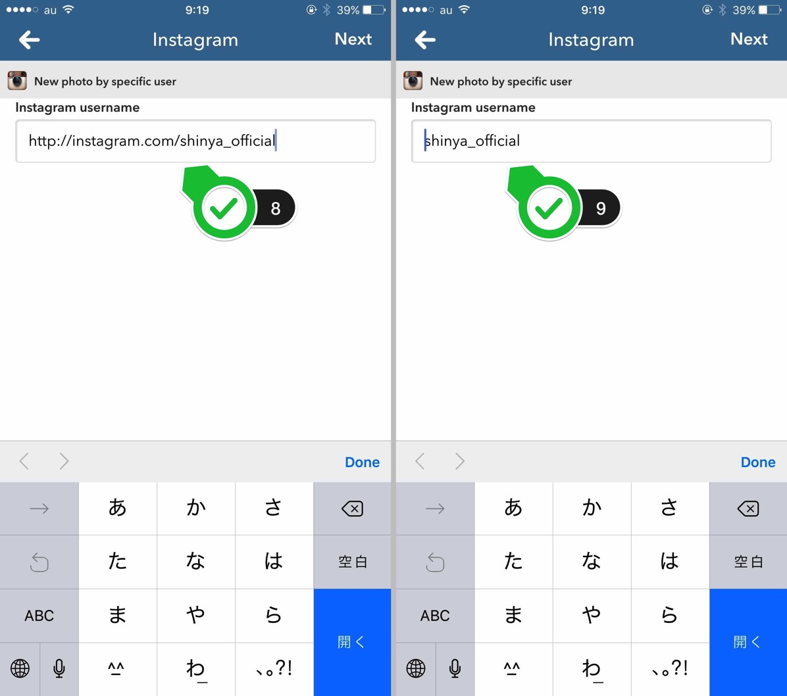
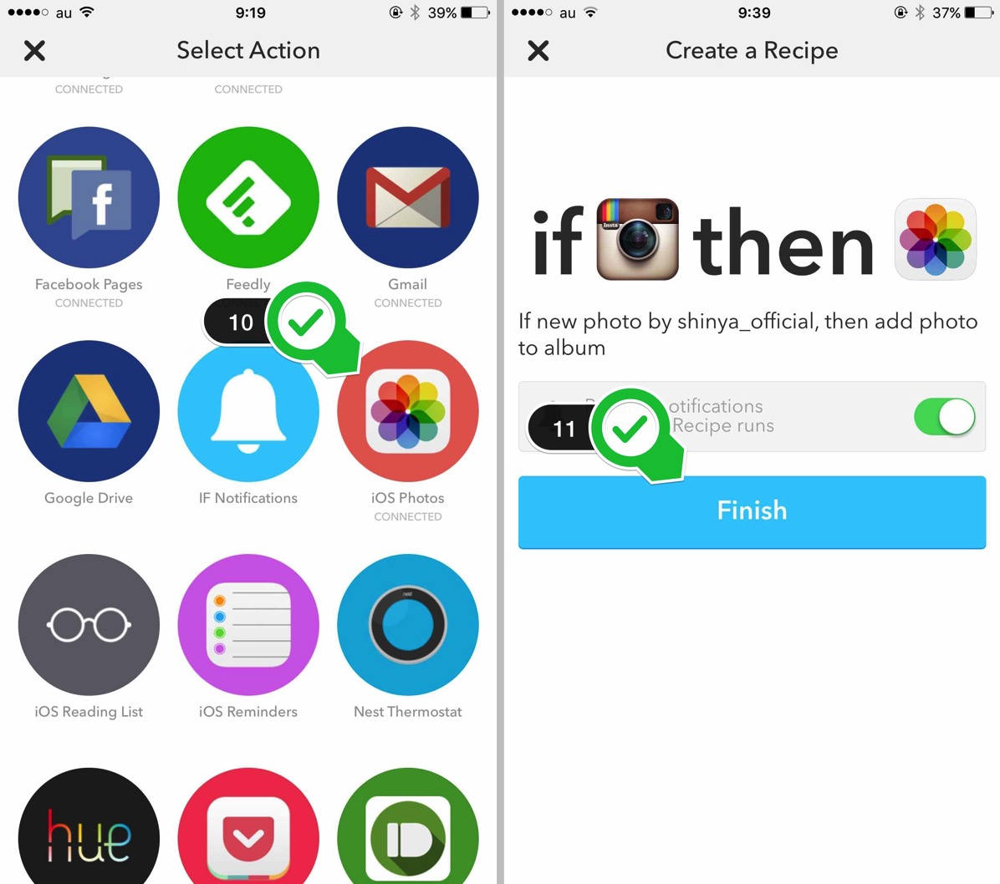
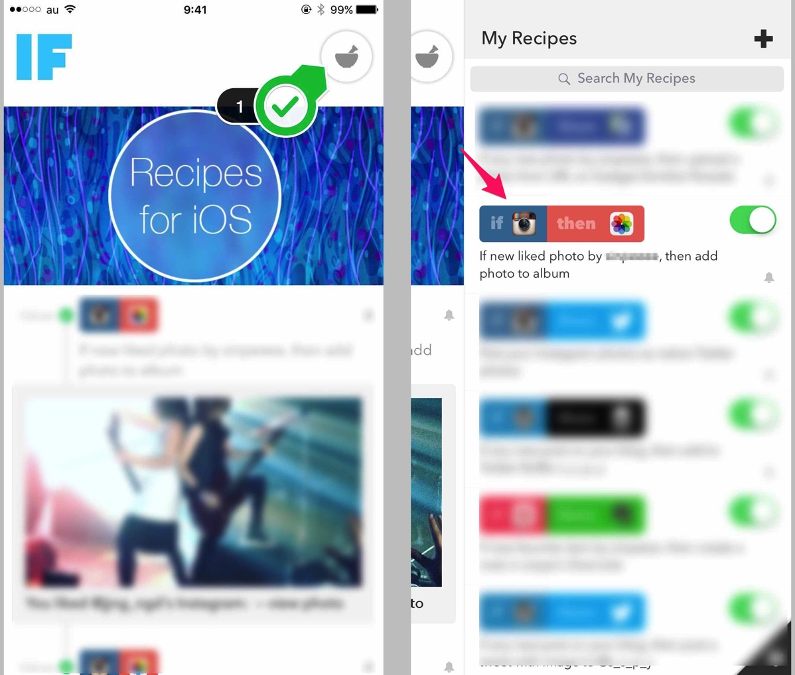

---
categories:
- アプリ
date: Mon, 23 Nov 2015 01:04:38 +0000
slug: post-8643
tags:
- Instagram
title: instagramで特定のアカウントが投稿した画像を自動保存する方法【IF】
---

Instagramを最近頑張るようにしてます。ただし、画像を読み込んでるからもしかしてパケット通信料の制限に対して負荷になってるんじゃないかなーとか少し心配して、Twitterほど頻繁に開かないようにしています。

なので、よくお気に入りのアカウントの投稿を見逃してしまします。

そこで思いついた設定をご紹介します。<!--more-->以前、「<a href="https://www.warawareotoko.com/2015/11/15/post-8606/">instagram（インスタグラム）でいいねした画像を自動で保存する方法</a>」でご紹介しました方法の進化版です。完全自動で、Instagramを開かずとも画像保存ができてしまいます。

IFを開いたら①をタップ、次に②プラスマークをタップ

③でレシピ作成に入ります。④プラスマークをタップしてInstagramを選択してください。

&nbsp;

⑤Instagramをタップすると色々でてくるので「New photo by specific user」をタップします。意味は「特定のユーザーの新しい画像」です。
するとユーザーネームを入れるように言われます。

⑥さてユーザーネームを正しく調べるためにInstagramを開きましょう。保存したいユーザーのプロフィールページにいき、右上のアイコンをタップしてください。

⑦するとメニューが出てきますので、「プロフィールURLをコピー」をタップ

⑧Instagramに戻って先ほどのところに貼り付けます。するとURLが表示されますので、⑨「htttp://instagram.com/」の部分を削除します。そしたら右上のNextをタップ

⑩次にiOS Photosをタップして、そのまま右上のマークをタップして進んでください。Finishをタップして設定完了です。

これで自動保存できるようになります。

また通知をオンにしておけば投稿されて保存されたタイミングで通知がきますので、見逃すことも減るでしょう。

注意点としては、同期のタイミングが割とリアルタイムではない場合があります。それと画像が上手く保存されていない場合があります。

そんな時は作ったレシピをタップしてcheck nowをタップしてください。

<h2>しんぺーはこう思った。</h2>

InstagramってTwitterでフォローしてる人見つけてもなんかフォローしずらい。。。

ということでInstagramよかったらフォローお願いします。

と言ったところで本日は以上になります。  おやすみなさい。