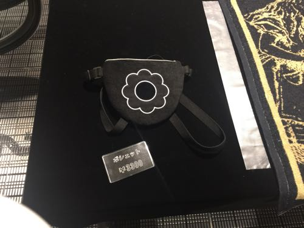
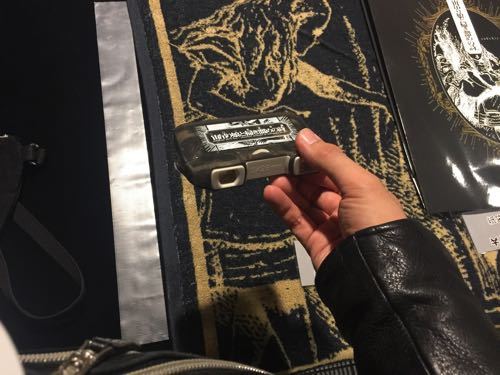
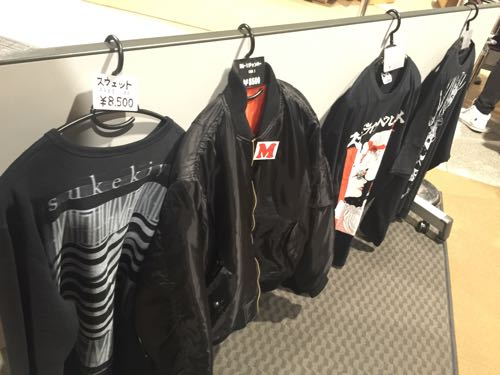
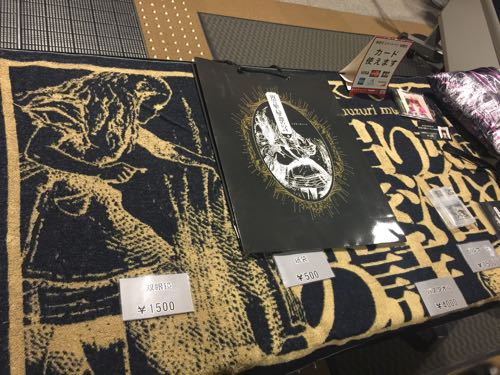
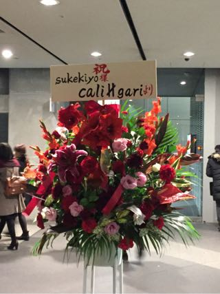

---
categories:
- sukekiyoのLIVEレポ
date: Wed, 02 Dec 2015 12:35:52 +0000
slug: post-8695
tags:
- LIVEレポ
- sukekiyo
title: 【ライブレポ】sukekiyo 二〇一五年公演 宙吊り娘と掃き溜めの詩2015_12_2@国際フォーラムホールC
---

ようやく寒くなり出し曇天の中、俄かに降り出した冷たい雨の本日、sukekiyoの「宙釣り娘と掃き溜めの詩」に参列してきました。個人的には調布グリーンホール以来の、sukekiyoで開演前から高揚感を抑えられませんでした。

<!--more-->
今回のより明確なストーリーが提示されているみたいでした。

<h2>物販</h2>

本日は会場限定の新曲「耳ゾゾ」を手に入れるべく、会社を有給にして早めにやってきました。物販開始は16時で告知されていましたが、1時間早まったようで開場前にゲットすることができました。

恒例の怒られそうなデザインシリーズのポーチ

噂のオペラグラス。

本日はコラボTシャツを購入しました。ちなみにジャンバーは結構買っている人いました。

この下に引いてあるのがバスタオル。でけー

<h2>演出</h2>

SEは洋楽が流れていたかと思ったら、中森明菜にかわり一気に会場の雰囲気が柔らかい懐かしい感じに包まれまし。

いつも通りの開演ブザーでスタート。暗転し映像と朗読の後にメンバーが登場。

修道女の格好をした京は、喉も絶好調でした。ぼくは2階上手側に座っており、見えた範囲だとUTAと匠は割とゆったりとしたシルエットの服装でした。

舞台中央にはソファが設置され、その周りには何か白いものが置いてあるみたいでしたがはっきりとは見えませんでした。

前半の曲の合間に首にロープを繋がれた演出(万有引力)のパフォーマンスが激しすぎて、メンバーに接触しそうでした。(と思ったらロープが京に当たってたらしい)

後半は今度はマスクをした女性2人によるSMショー

ここにきてようやくソファが使われる。Mの女性にSの女性が蝋を垂らし、鞭を打つ。やがて京もそれに加わり、女性の顔面に下半身を押し付けておりました。

<h2>セトリ</h2>

<ol><li>foster mother</li><li>aftermath</li><li>hidden one</li><li>scars like velvet</li><li>斑人間</li><li>烏有の空</li><li>in all weathers</li><li>celeste</li><li>vandal</li><li>the daemon cultery</li><li>耳ゾゾ</li><li>zephyr</li><li>白露</li><li>leather field</li></ol>

1曲目の前にセッション。

今日もmamaが聴けると思っていたらやりませんでした。残念。ただ、冒頭のhidden oneから烏有の空の流れが神がかっていて、鳥肌ものでした。呼吸するのもはばかれるような緊張感。酸素sukekiyoに侵食されて苦しい感じでした。

その後のin all wearhersでは最後のピアノを弾かずにそのままcelesteに。その後はSMショーがあり気がつけば終幕という流れでした。最後の方京が少し走ってた感がぁ。。

<h2>次回予告</h2>

すべての曲が終わるとモニターには次回予告の文字が。

次回予告

自由

禁欲

欲に溺れ

解放

「桜肌、夢締め痕と優越の詩」

4/15 (金)  なかのZERO

4/23 (土)  京都劇場

4/24 (日)  京都劇場

<h2>しんぺーはこう思った。</h2>

どうやら「ゆうえつのし」と読む様です。ということは掃き溜めの詩(し)何でしょうか。。ずっと<strong>うた</strong>だと思ってた。

久しぶりのsukekiyoは堪能という言葉がぴったりでした。すぐにでも続きがみたいくらいです。

次のsukekiyoは正月のガリガリのLIVEです。チケットも確保済みなので、正月休み明けで気まずいけどしっかり午後半休で参列いたします！

それでは、虜としてはまだまだDECAYS新譜、インストとCDJ、それとBooXmasが残ってますね！体調管理しっかりして気を抜かずに新年を目指しましょう。

といったところで本日は以上になります。

おやすみなさい。