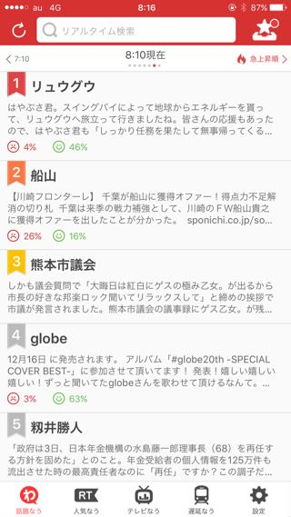
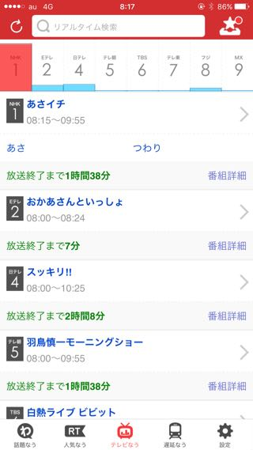
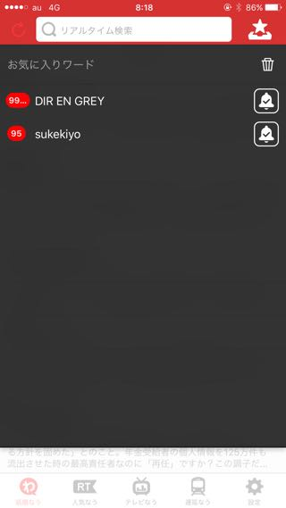
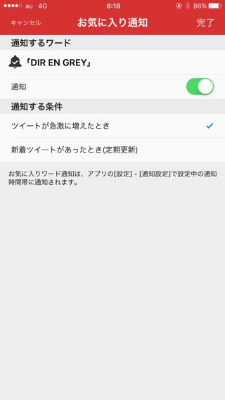

---
categories:
- アプリ
date: Thu, 03 Dec 2015 12:17:04 +0000
slug: post-8707
tags:
- iPhone
- アプリ
title: TL監視 twitterで特定のツイートが多くツイートされると教えてくれるアプリ
---

自分が好きなバンドやアイドルの情報を逃さないようにtwitterをチェックしてても、四六時中チェックしてるわけにもいきません。オフィシャルアカウントからのツイートがあると通知が来るように設定していても、オフィシャル以外からの先行情報やリークなどは拾うことができません。そんな時に使えるのがYahoo!の「リアルタイム検索」というアプリです。本日はそのご紹介

<!--more-->
<h2>「Yahoo!リアルタイム検索」とは</h2>

twitterなどのSNSで多く言及されている話題を通知してくれるアプリです。ランキング形式で今話題のツイートを見ることができます。大抵、とうらぶ関係かKPOPかジャニーズか炎上ネタです。

それだけ見ていれば1日のtwitter上の話題は大抵網羅できます。

また、その話題に対してポジティブなツイートが多いのかネガティヴなツイートが多いのかなども見ることができます。さらに何時頃から関連ツイートが増えたのかといったグラフも見ることが出来るのでなかなか面白いです。

まとめると主要機能は以下の通り

<ul><li>話題なう</li><li>人気なう</li><li>テレビなう</li><li>遅延なう</li></ul>

遅延なうとか電車が遅れてる際に便利です。

話題なう

人気なう

テレビなう

<h2>特定のワードが一定数つぶやかれると通知してくれる機能</h2>

そして、本題です。このアプリでとても便利なのが通知に特定ワードを設定できる点です。

つまり、「DIR EN GREY」や「sukekiyo」などとキーワード登録をしておくと、そのワードが多くつぶやかれると「今このワードが急上昇！」みたいな感じで通知してくれるのです。

これでオフィシャルから以外の情報もしっかりとキャッチあっぷできます。

<h3>ただし誤報もあり</h3>

ただ、通知がくるトリガーがツイート数なのでたまに誤報もあります。

通知きたー！と思ったらたまたまツイートが多くなっただけだったりします。

<a href="https://itunes.apple.com/jp/app/riarutaimu-jian-suo-twitter/id552858779?mt=8&uo=4&at=11ld5P" target="_blank" >リアルタイム検索 ~ Twitter検索の決定版</a>

無料

(2015.12.04時点)

<a href="https://itunes.apple.com/jp/developer/yahoo-japan-corp./id288091005?mt=8&uo=4&at=11ld5P" target="_blank" >Yahoo Japan Corp.</a>

posted with <a href="http://pochireba.com" rel="nofollow" target="_blank">ポチレバ</a>

<h2>しんぺーはこう思った。</h2>

入れて設定しておくだけで安心のアプリです。自分の好きなこと以外でも世の中の話題をお知らせしてくれるのでなかなか便利です。

おすすめです。無料だし

といったところで本日は以上になります。

おやすみなさい。