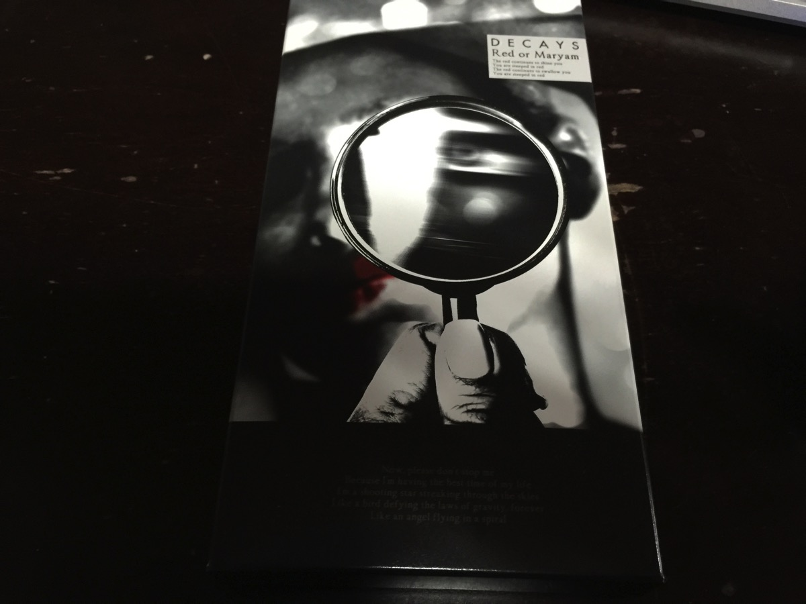
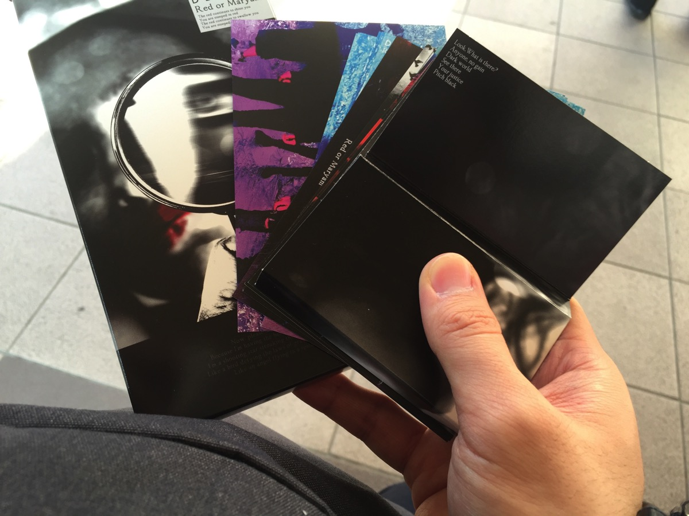
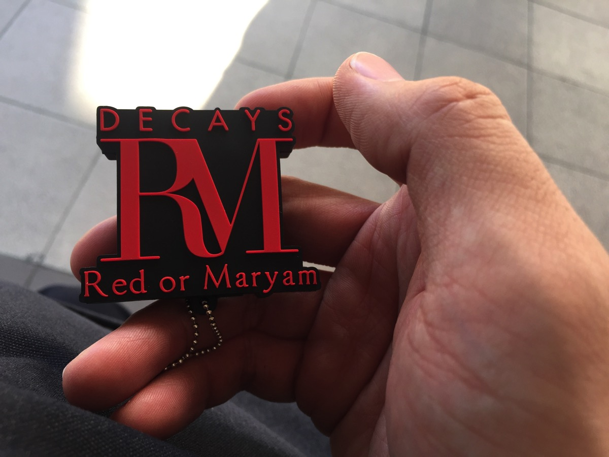
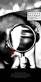
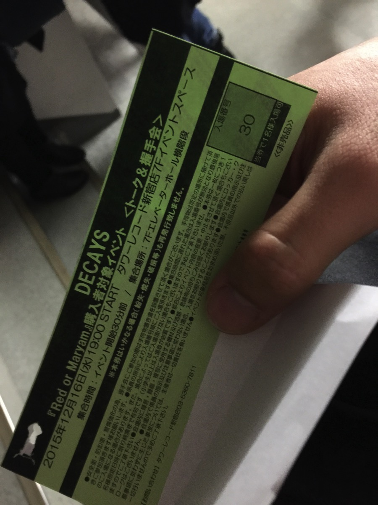

---
categories:
- DIR EN GREY
date: Wed, 16 Dec 2015 16:32:19 +0000
slug: post-8744
tags:
- DECAYS
title: 【インストレポ】DECAYS「Red or Maryam」発売トークイベント&握手会＠新宿タワレコ
---

本日発売DIR EN GREYのDieのソロプロジェクト<strong>「DECAYS」</strong>のニューアルバム「Red or Maryam」の、発売記念イベントのトークイベント＆握手会に参加してきました！本日は新曲の開封含めてのレポートです！<!--more--><h2>Red or Maryam</h2>

昨日手に入れておりましたが、開ける暇がないので行きの駅で開封

メンバーの個人と全員が写ったフォトカードが複数枚

そしてキーホルダーが入っていました。

で、肝心のUSBは？？

<blockquote class="twitter-tweet" lang="ja">
USBはいってないよ？キーホルダーはいってるだけだよ？Dieさん忘れちゃったのかなー？
&mdash; しんぺー@はきだめの「し」んぺー (@s_s_p_y) <a href="https://twitter.com/s_s_p_y/status/676958229583261696">2015, 12月 16</a></blockquote>

<blockquote class="twitter-tweet" lang="ja">
そうかダウンロード版なのかな？？ハイレゾっていうくらいだからきっとそうに違いない
&mdash; しんぺー@はきだめの「し」んぺー (@s_s_p_y) <a href="https://twitter.com/s_s_p_y/status/676958311892295680">2015, 12月 16</a></blockquote>

いやーこれ本当に「「DECAYS   USB   入ってない」でググるところだったわ。

<blockquote class="twitter-tweet" lang="ja">
ん？ <a href="https://t.co/tbtJlDvPAa">pic.twitter.com/tbtJlDvPAa</a>
&mdash; しんぺー@はきだめの「し」んぺー (@s_s_p_y) <a href="https://twitter.com/s_s_p_y/status/676958713199112192">2015, 12月 16</a></blockquote>

どうやらこれが怪しい。DIR EN GREYのChild prey方式の隠し要素的にUSBが格納されていました。これを引っ張るとUSBがでてくるんですけど、かなり硬くてちぎれそうな気がしてこわかったです。

<table  border="0" cellpadding="5" style="border:none"><tr><td valign="top" style="border:none"></td><td valign="top" style="border:none;text-align:left">
DECAYS FWD Inc. 2015-12-16

売り上げランキング : 1435
<table style="border:none;margin-top:10px"><tr><td style="border:none;text-align:left;">
<a href="http://www.amazon.co.jp/gp/search?keywords=red%20or%20maryam&__mk_ja_JP=%83J%83%5E%83J%83i&tag=warawareotoko-22" target="_blank" >Amazonで購入</a>

<a href="http://hb.afl.rakuten.co.jp/hgc/0f6e221b.2eb9748a.0f6e221c.35cc1e84/?pc=http%3A%2F%2Fsearch.rakuten.co.jp%2Fsearch%2Fmall%2Fred%2520or%2520maryam%2F-%2Ff.1-p.1-s.1-sf.0-st.A-v.2%3Fx%3D0%26scid%3Daf_ich_link_urltxt%26m%3Dhttp%3A%2F%2Fm.rakuten.co.jp%2F" target="_blank" >楽天市場で購入</a>

<a href="http://ck.jp.ap.valuecommerce.com/servlet/referral?sid=3041033&pid=882528283&vc_url=http%3A%2F%2Fsearch.shopping.yahoo.co.jp%2Fsearch%3Fp%3Dred%2520or%2520maryam" target="_blank" >Yahooショッピングで購入</a>

<a href="http://ck.jp.ap.valuecommerce.com/servlet/referral?sid=3041033&pid=882660047&vc_url=http%3A%2F%2Fauctions.search.yahoo.co.jp%2Fsearch%3Fvo%3D%26ve%3D%26auccat%3D0%26aucminprice%3D%26aucmaxprice%3D%26aucmin_bidorbuy_price%3D%26aucmax_bidorbuy_price%3D%26loc_cd%3D0%26abatch%3D0%26istatus%3D0%26filtered%3D1%26ei%3DUTF-8%26tab_ex%3Dcommerce%26va%3Dred%2520or%2520maryam" target="_blank" >ヤフオク!で購入</a>
</td><td style="vertical-align:bottom;padding-left:10px;font-size:x-small;border:none">by <a href="http://kaereba.com" rel="nofollow" target="_blank">カエレバ</a></td></tr></table></td></tr></table>

<h3>USBの中身は？</h3>

MP3版のアルバム全曲
ハイレゾ版のアルバム全曲
secret modeのミュージッククリップ
ライブ映像
フォトデータ

<h2>インストアイベントレポート</h2>

いい番号だったので2、３列目くらいに入ることができました。

その後登場したDieと樫山さん
なんか個人的には久々のDieという感じですごい高揚しました！！そして登場と同時にいっきに華やかな香りが会場中に広がりました。Dieさんのお気に入りの香水！

たしかこれだったはず
<table  border="0" cellpadding="5" style="border:none"><tr><td valign="top" style="border:none"></td><td valign="top" style="border:none;text-align:left">
 ディーゼル 

売り上げランキング : 16117
<table style="border:none;margin-top:10px"><tr><td style="border:none;text-align:left;">
<a href="http://www.amazon.co.jp/gp/search?keywords=diesel%20%8D%81%90%85&__mk_ja_JP=%83J%83%5E%83J%83i&tag=warawareotoko-22" target="_blank" >Amazonで購入</a>

<a href="http://hb.afl.rakuten.co.jp/hgc/0f6e221b.2eb9748a.0f6e221c.35cc1e84/?pc=http%3A%2F%2Fsearch.rakuten.co.jp%2Fsearch%2Fmall%2Fdiesel%2520%25E9%25A6%2599%25E6%25B0%25B4%2F-%2Ff.1-p.1-s.1-sf.0-st.A-v.2%3Fx%3D0%26scid%3Daf_ich_link_urltxt%26m%3Dhttp%3A%2F%2Fm.rakuten.co.jp%2F" target="_blank" >楽天市場で購入</a>

<a href="http://ck.jp.ap.valuecommerce.com/servlet/referral?sid=3041033&pid=882528283&vc_url=http%3A%2F%2Fsearch.shopping.yahoo.co.jp%2Fsearch%3Fp%3Ddiesel%2520%25E9%25A6%2599%25E6%25B0%25B4" target="_blank" >Yahooショッピングで購入</a>

<a href="http://ck.jp.ap.valuecommerce.com/servlet/referral?sid=3041033&pid=882660047&vc_url=http%3A%2F%2Fauctions.search.yahoo.co.jp%2Fsearch%3Fvo%3D%26ve%3D%26auccat%3D0%26aucminprice%3D%26aucmaxprice%3D%26aucmin_bidorbuy_price%3D%26aucmax_bidorbuy_price%3D%26loc_cd%3D0%26abatch%3D0%26istatus%3D0%26filtered%3D1%26ei%3DUTF-8%26tab_ex%3Dcommerce%26va%3Ddiesel%2520%25E9%25A6%2599%25E6%25B0%25B4" target="_blank" >ヤフオク!で購入</a>
</td><td style="vertical-align:bottom;padding-left:10px;font-size:x-small;border:none">by <a href="http://kaereba.com" rel="nofollow" target="_blank">カエレバ</a></td></tr></table></td></tr></table>

Dieの服装は、茶色いブーツに黒の細いパンツ、革ジャンでサングラス
右手には人差し指と多分親指以外に指輪をしていました。小指だけゴールド
手首には黒数珠？

左手の中指には星マークのごっつい指輪をしてました。

おそらくほんのりファンデーションだけ塗っていた感じです。

以下トークイベントの内容メモったものをまとめてみました。

メンバーの選定はなにきっかけ？

堀川バンドがきっかけ。
※細く樫山さんはDirのドラムテックをやってたりする。Slash&Burn(FM FUJI)より

チドニーは樫山さんの後輩
ベースはDieの友達
Voの小林さんは樫山さんの知り合いの知り合いみたいな感じ。ちょっとイメージが違うなと思って1年くらい探してから戻ってきた。(Die曰く暗いとのこと)

ちなみにチドニーという名前は、自分で考えてきたとのこと。名前のクレジットをCDNYでどっすかと聞かれたDieは皆チドニー知らんのに勝手に突っ走らないでみたいな感じだったとのこと。パートについては、Dieがわからないからとりあえず☆マークを書いておいたので、そのまま担当スターになった。なお、Dieはよくわからないと星をかくことが多いらしい。

この辺からQ&A

Q.どこの国の女性が好みですか？

A.
樫山さん「海外いったことないから。韓国に一度だけ行ったことがあるだけで触れ合ってないので。日本で。」

Die「Japan」

Q.DECAYSで行ってみたい国は？

A.
樫山さん「飛行機乗れない。新幹線もフェリーも苦手。車で行けるところ。島根とか遠いのか近いのかわからないところ。この前のツアーも車で1人かって行って怒られた。」

Die.「島根はDIRでもいったことないし、やる場所ないんじゃないか」

Q.Dieさんの声の印象は？

A.
樫山さん「声というよりも切り替えがすごい。プロ意識」

Die「合宿で起きてすぐに歌うようにいきなり言われて」

樫山さん「小林くんと声が似てるからどっちがDieかわからない。音源でも多分Dieの方をレベルあげてるけどデータ見てみないと本当かわからない。」

Die「アルバムは少しレベル変えてる」

Q.今後のライブはどんな感じに（おぼろげな記憶）

A.
樫山さん「21日はDieの誕生日の次の日なので祝ってもらって、24日はイブなんでプレゼントをおくるような感じにします。」

Die「10曲くらい新曲がある」

Q.今年の漢字は？

A.
樫山さん「新。新人なので。年末のイベントも全部楽屋挨拶いきます。どう考えても俺が最年長だけど」

Die「気。気合いの気。（笑い起こる）」

その後握手会のためステージセットチェンジ
一旦お二人裏に下がる。しかしその時！！！樫山さんがDieのペットボトルも持ってあげて裏に入ってたったよ！！！もしかして樫山さんってかわいい感じの愛玩キャラかもしれないぞ！

<h3>握手会</h3>

<blockquote class="twitter-tweet" lang="ja">
昨日の帰り際…&#10;K「明日、俺人生で初めての握手会やわぁ…」&#10;D「僕もです～」&#10;K「え～Dieも(゜ロ゜)ほな二人とも握手素人やん…」&#10;D「どうしましょう…会場って薄暗くないですかねぇ？明るいと照れますよね～」&#10;K「タワレコやで！めっちゃ明るいやん！」&#10;DK「どうしよう…」
&mdash; 樫山 圭 (@kei_kashiyama) <a href="https://twitter.com/kei_kashiyama/status/677051469296615424">2015, 12月 16</a></blockquote>

はい、ということで緊張してきましたーーーー！！！！

今日も司会の方と井上さんが長く話す人を促す〜

ぼくはというと、テンパっちゃって樫山さんとの握手時に自分の手に手を添えてなんかよくわかんない感じになりながら「頑張ってください」とか言っちゃって。でDieには言いたいことをちゃんと言えて「おお、おめでとう」と言われた！！！いやーーーー前回の薫インストの時はもうこれは次回のライブから下手だなとか思ってたけど、今日を終えてもう俺は上手なんだ！とか思ってもう本当なんていうか抱いてください。

そして、ここで思わぬ事案発生

握手を終えた人々が危ない中毒患者のように自分の右手をはぁはぁ言いながらかいでるwww当然ぼくも！！！

そう、なんとDieさんの香りがするのです！！あの細い指、華奢な手のひら、それでいてやわらかく優しいあの手の香りが！！！

ということで無事イベント終了

<blockquote class="twitter-tweet" lang="ja">
【 <a href="https://twitter.com/hashtag/DECAYS?src=hash">#DECAYS</a>】DECAYS「Red or Maryam」発売記念イベント先程終了!本日はDieさん樫山さんにお越しいただき貴重なトーク、そして握手会を開催!ご参加の皆様もありがとうございました!今度の活動にも期待! <a href="https://t.co/pY7f4kMbbq">pic.twitter.com/pY7f4kMbbq</a>
&mdash; タワーレコード新宿店 (@TOWER_Shinjuku) <a href="https://twitter.com/TOWER_Shinjuku/status/677087123850170368">2015, 12月 16</a></blockquote>

<h2>しんぺーはこう思った。</h2>

実をいうとぼくの手元にはハイレゾ環境はありません。
現在調査中ですが、弟がわりと音響関係詳しいので色々教えてもらってます。

どうもiPhoneで聴くのには、買い揃えないといけないものがあるみたいです。

んー難しいですね〜これでDIRとsukekiyoが今後ハイレゾだすよっていうなら環境整備もやむなしですが、今回単発なんであればちょいときつい。

まあでも、とりあえずDieが意図しているハイレゾでの視聴をしないわけにはいかないので、なんとか聞きたいと思います。その内ハイレゾ関係のことかくかもしれないです。

と言ったところで本日は以上になります。  おやすみなさい。