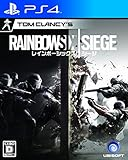

---
categories:
- ゲーム
date: Thu, 17 Dec 2015 15:58:47 +0000
slug: post-8746
tags:
- ゲーム
title: 【PS4】レインボーシックスシージが面白すぎる！そういや昔SATに入りたいって思ってました。
---

今ハマってるゲーム、それがレインボーシックスシージ。簡単にいうとSWAT隊員になってテロリストと戦うFPS（一人称視点）のゲームです。<!--more--><h2>レインボーシックスとは</h2>

トム・クランシー原作の小説がもとになっているゲームです。

Windows版として1998年に小説と同時発売。かなりリアルな設定が玄人向けということで一般の人にはあまり馴染めるものではなかったらしいです。

というのも、プレイヤーのライフがかなり低めに設定されており、敵の攻撃を受けるとすぐに動けなくなったり死んだりしてしまうようになっていました。この辺現実にかなり寄せているみたいです。さらに部位ダメージもあり、足を撃たれれば引きずったりするみたいです。ただ、このあたりがかなりマニアックな感じを醸し出してたらしい。

なお、その後プレステに移植されるも設定がそのままだったため、一般層までは浸透しなかったらしいです。

そして、それらの設定を見直し新たにコンシューマー向けに発売されたのがレインボーシックスシージです。

ストーリーはアメリカ・ドイツ・イギリス・フランス・ロシアの特殊部隊で構成された対テロ特殊部隊「レインボー」の活躍を描くものになっています。敵は大規模なテトリスト集団。それに対してレインボーはそれぞれ特殊スキルを持ち、対抗します。

<iframe width="560" height="315" src="https://www.youtube.com/embed/GGOpwO_PI9A" frameborder="0" allowfullscreen></iframe>

<h2>ゲームシステム</h2>

ゲームモードはコンピューター相手に戦うテロリストハントと人間相手に戦うマルチプレイの二つがあります。

ルールは、

立てこもった一定数のテロリストを掃討するテロハント
人質救出
人質を守る作戦
爆弾解除

などがあります。

また、各国の特殊部隊の隊員はそれぞれ違った特殊スキルと武器を持っています。壁に穴を開けられるハンマーを持ったキャラや爆弾やワナを発見する能力をもったキャラなどです。

同じキャラクターを他人と同時には選択できないため、スタート時点で他人と争わなければいけません。この辺からもうシビアです。

<h2>おもしろいの？</h2>

こんゲームかなり面白いです。ぼくはこのゲームの存在を知ったのは半年前です。海外ドラマが好きなので特殊部隊とか大好きなんですけど、いやーかっこいい！

<strong>おもしろい！</strong>

先ほど昔は設定がリアルでシビアだったと書きましたが、今回調整されたとはいえ、やはりシビアです。難易度がかなり高いです。

<strong>それでもめっちゃ面白いです。</strong>

緊張感がすごいです。

ということで、冬のお休みはレインボーシックスシージで過ごすのはいかがでしょうか。

<table  border="0" cellpadding="5" style="border:none"><tr><td valign="top" style="border:none"></td><td valign="top" style="border:none;text-align:left">
 ユービーアイ ソフト 2015-12-10

売り上げランキング : 55
<table style="border:none;margin-top:10px"><tr><td style="border:none;text-align:left;">
<a href="http://www.amazon.co.jp/gp/search?keywords=%83%8C%83C%83%93%83%7B%81%5B%83V%83b%83N%83X&__mk_ja_JP=%83J%83%5E%83J%83i&tag=warawareotoko-22" target="_blank" >Amazonで購入</a>

<a href="http://hb.afl.rakuten.co.jp/hgc/0f6e221b.2eb9748a.0f6e221c.35cc1e84/?pc=http%3A%2F%2Fsearch.rakuten.co.jp%2Fsearch%2Fmall%2F%25E3%2583%25AC%25E3%2582%25A4%25E3%2583%25B3%25E3%2583%259C%25E3%2583%25BC%25E3%2582%25B7%25E3%2583%2583%25E3%2582%25AF%25E3%2582%25B9%2F-%2Ff.1-p.1-s.1-sf.0-st.A-v.2%3Fx%3D0%26scid%3Daf_ich_link_urltxt%26m%3Dhttp%3A%2F%2Fm.rakuten.co.jp%2F" target="_blank" >楽天市場で購入</a>

<a href="http://ck.jp.ap.valuecommerce.com/servlet/referral?sid=3041033&pid=882528283&vc_url=http%3A%2F%2Fsearch.shopping.yahoo.co.jp%2Fsearch%3Fp%3D%25E3%2583%25AC%25E3%2582%25A4%25E3%2583%25B3%25E3%2583%259C%25E3%2583%25BC%25E3%2582%25B7%25E3%2583%2583%25E3%2582%25AF%25E3%2582%25B9" target="_blank" >Yahooショッピングで購入</a>

<a href="http://ck.jp.ap.valuecommerce.com/servlet/referral?sid=3041033&pid=882660047&vc_url=http%3A%2F%2Fauctions.search.yahoo.co.jp%2Fsearch%3Fvo%3D%26ve%3D%26auccat%3D0%26aucminprice%3D%26aucmaxprice%3D%26aucmin_bidorbuy_price%3D%26aucmax_bidorbuy_price%3D%26loc_cd%3D0%26abatch%3D0%26istatus%3D0%26filtered%3D1%26ei%3DUTF-8%26tab_ex%3Dcommerce%26va%3D%25E3%2583%25AC%25E3%2582%25A4%25E3%2583%25B3%25E3%2583%259C%25E3%2583%25BC%25E3%2582%25B7%25E3%2583%2583%25E3%2582%25AF%25E3%2582%25B9" target="_blank" >ヤフオク!で購入</a>
</td><td style="vertical-align:bottom;padding-left:10px;font-size:x-small;border:none">by <a href="http://kaereba.com" rel="nofollow" target="_blank">カエレバ</a></td></tr></table></td></tr></table>

<h2>しんぺーはこう思った。</h2>

思い出しましたがぼくそういえば日本の特殊部隊であるSATに入りたいって思ったことがありました。

と言ったところで本日は以上になります。  おやすみなさい。