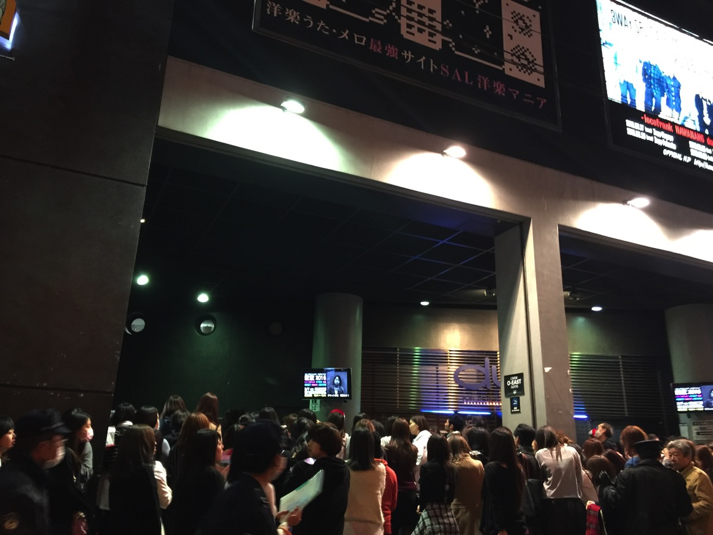

---
categories:
- 各メンバーの個人イベントレポなど
date: Mon, 21 Dec 2015 04:58:57 +0000
slug: post-8753
tags:
- LIVEレポ
- TTT
title: 【ライブレポ】TTT Boo Xmas 2015＠TSUTAYA O-EAST
---

PIERROTの愛児とDIR EN GREYの薫

それはぼくにとって現在の精神構造構築の説明で欠くことのできない2大バンドだ。PIERROTがいたからこうなって、Dirがいるから今こうしてる。

そのバンドのキーマンである2人が同じステージに立つ、しかも同じバンドとして。これはぼくにとってsukekiyoで京とキリトがコラボしたことと同じくらい衝撃的な事件。絶対にこの目でそれを目にしなければならなかった。そして今日それが叶った。

<!--more-->
<h2>Boo Xmasとは</h2>
MTVなどでVJ（VideoJocky、DJのビデオ版）として活躍するBoo氏が主催する音楽イベント。2009年に始まり、もはやクリスマス時期の恒例行事となっている。参加するアーティストはBooの友人関係やこれは紹介したいとBooが強く思うバンドたちで、ジャンルも幅広い。

ぼくも2011年に参戦した。その時のラインナップはJUNK4ELEMENTS / MAN WITH A MISSION / 雅-MIYAVI / Pay money To my Pain / Plastic tree / sads

特に印象に残ってるのが、今は亡きPTPボーカルKが登場と同時にマイクスタンドをオーディエンスに投げ入れたシーン。こえええええと思った。そしてその後登場したSADS、清春が若い奴になんか負けねーよと言わんばかりに同じようにマイクスタンドを投げいれて、ニヤって笑った。マジで、マジでかっこよかった。PTPも清春も。それとMIYAVIもね。

とにかく、そう言ったすげーアツいイベントがBoo Xmasです。

そして今回の参加ラインナップは、シド / T T T / Nobuaki Kaneko

今回はTTTを目当てで参戦しましたので、そのレポートです。体調の関係で大変失礼でしたが、TTT見た後にすぐに退出しました。。。すんません。
<h2>TTTとは</h2>
TTTとはBooの呼びかけのもと集まった寅年の飲み友達。トラトラトラの略でTTT

メンバーは

Vo: Mr.T T T (Boo)

Vo: KOJI (Tears Of The Rebel/ex.SCREAMING SOUL HILL)

Gt: 薫（DIR EN GREY)

Gt: Aiji (LM.C)

Ba: T$UYO$HI (The BONEZ/PaymoneyTomyPain)

Dr: DUTTCH (UZMK)

もともとアイジとは親交が厚くなかったようだが、PIERROTのMVに出演したBooが、その関係で昨年のPIERROT復活のLIVEにゲスト参加。そこではすごい無愛想な対応をされたらしいが、薫がアイジと飲んでいる時に呼ばれて親しくなったとか。

（そういやこの時の説明でPIERROTの夕闇シーサイドって曲のって言ってたけど、夕闇スーサイドなw　シーサイドじゃこうなっちゃうw　参考画像↓）

それにもともと仲がよかったほかのメンバーと飲んでいるうちに奇跡的に全員違うパートであることに気がつき、バンドでもやる？となったらしい。
<blockquote class="twitter-tweet" lang="ja">

遂にTTTフルメンバーが集結。 初リハーサルでの1枚を公開!!! 21日BooXmasではメンバーが敬愛する【THE MAD CAPSULE MARKETS】のコピーバンドとして出演!!! <a href="https://t.co/XjcIceUfqK">pic.twitter.com/XjcIceUfqK</a>

— TTT_official (@TTT_official_) <a href="https://twitter.com/TTT_official_/status/677321814507429893">2015, 12月 17</a></blockquote>

正式には表に出てないけどもう一人メンバーがいるようです。

この動画を見るとKOJIさんだけは初対面の人もいるのかな？

<iframe src="https://www.youtube.com/embed/pNlHPadaCWU?rel=0" width="560" height="315" frameborder="0" allowfullscreen="allowfullscreen"></iframe>
<h2>LIVEの様子</h2>

この会場、ぼくは2回か3回しか来たことがないのですが結構変わった構造です。

入ったら出にくく、ドリンクバーも奥まで行ってとなりのバーで買えるという感じ。

さらにトイレも2階に上らなければならないという感じ

LIVEはというとツリー姿で現れたBooがさっそくスペシャルゲストの宮川大輔を呼びこみました。
<blockquote class="twitter-tweet" lang="ja">

宮川大ちゃんと久しぶりに話して、仲間を無くして凹んでるオレを励ましてくれた！大ちゃんはマジで本物だ☆ 仲間で良かったって、つくづく想わせてくれる人！メチャクチャ熱くなった♪ 今日もトレーニング燃える～ ※写真は前に撮ったものです笑 <a href="https://t.co/dYtQJhjo75">pic.twitter.com/dYtQJhjo75</a>

— VJ Boo (@MTV_VJ_Boo) <a href="https://twitter.com/MTV_VJ_Boo/status/672590887742935042">2015, 12月 4</a></blockquote>

実はこの2人、売れない時代に一緒にバイトしてたとのことで親友らしい

オープニングトークが終わるとついにTTTが登場

<strong>セトリはこちら</strong>

1.マスメディア

2.HI-SIDE

3.SYSTEMATIC.

4.GOOD GIRL

5.MIDI SURF

<!-- 1.マスメディア 2.HI-SIDE 3.systematic 4.GOOD GIRL 5.Midi surf -->

途中MCにてBoo「アイジーかおるー・・・」「ね、ラストーって言ったらえーって言ってね」

メンバー紹介の時にアイジ終わって薫の時にしゃべるように促す。すると喋りだす薫にアイジがすかさず「ステージでしゃべるのレアだね」薫「何言うてるか聞こえん」アイジ「<strong>声張ろうか</strong>」

いやーーー奇跡！！！

そして、Booから「本当にこの4人で、あ5人で。あ6人か、俺2人分だから」「やせたって言われるの・・・・・・・（この聞き取れなかった）」すかさず薫が「まだデブやもんな」とDIR EN GREYとしてのどSな矜持を示しました。

最後ははける際にBooをどつく薫

とても楽しそうでした。

ちなみに今日の薫の姿は、上から下までいつもどおりの真っ黒。目の下にはいつものメイク。そしてフワッフワのいつもの髪型外ハネ（ただしいつもよりもフワッフワ）

DIR EN GREYドラムのやもさんことShinyaも来てたみたいでインスタを更新してました。
<blockquote class="instagram-media" style="background: #FFF; border: 0; border-radius: 3px; box-shadow: 0 0 1px 0 rgba(0,0,0,0.5),0 1px 10px 0 rgba(0,0,0,0.15); margin: 1px; max-width: 658px; padding: 0; width: calc(100% - 2px);" data-instgrm-captioned="" data-instgrm-version="6">

<a style="color: #000; font-family: Arial,sans-serif; font-size: 14px; font-style: normal; font-weight: normal; line-height: 17px; text-decoration: none; word-wrap: break-word;" href="https://www.instagram.com/p/_ji9LoChaM/" target="_blank" rel="noopener noreferrer">Boo Xmas！ #TTT#nobuakikaneko#sid#booxmas2015</a>

Shinya/DIR EN GREYさん(@shinya_official)が投稿した写真 - <time style="font-family: Arial,sans-serif; font-size: 14px; line-height: 17px;" datetime="2015-12-21T13:23:43+00:00">2015 12月 21 5:23午前 PST</time>

</blockquote>

ということで本日は体調不良につきTTT終わって退出しました。
<h2>しんぺーはこう思った。</h2>
TTTよかったー！！！愛児、薫がMCで絡んでた。感慨なんか湧かずにただただ楽しかった！喧嘩する時は敵の高校なんだけど地元のゲーセンでは仲が良い野郎達って感じでもう本当にありがとうございました。

これまた、継続的に動くバンドなんでしょうか？？

もしそうなら色んなバンドのコピーしてもらいたいなー例えばPIERROTとかね。薫が弾くPIERROTとか、もうなんていうかもうほんと・・・・・・・・・・・・・・・

とにかく楽しかったですよ！！！！！

と言ったところで本日は以上になります。おやすみなさい。