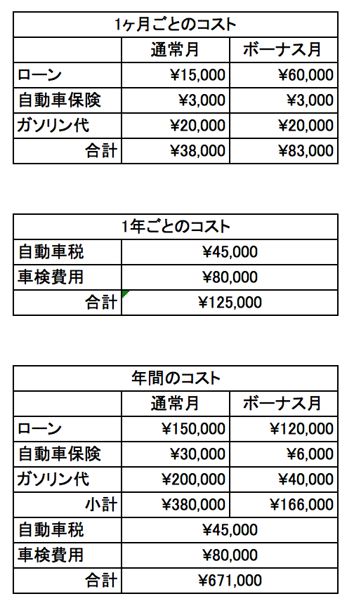
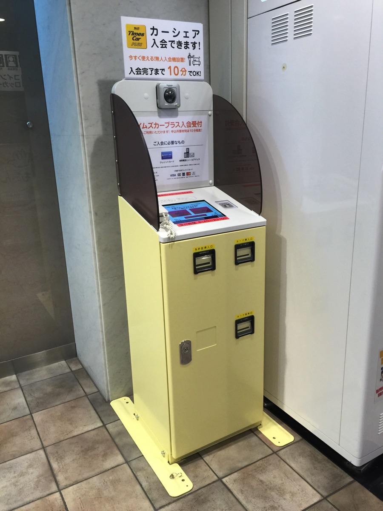
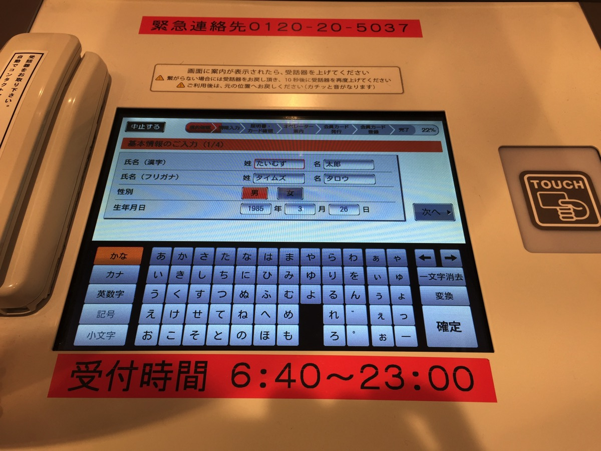
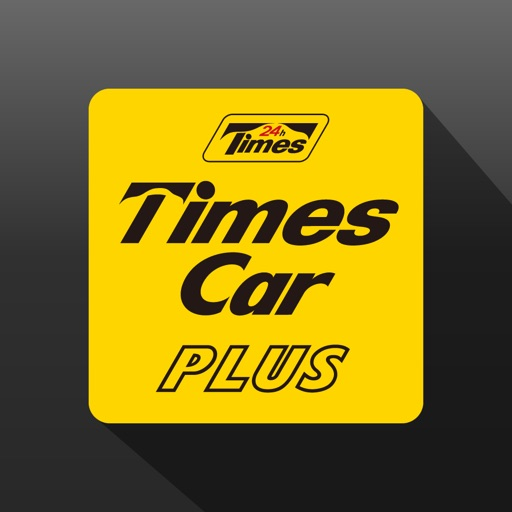
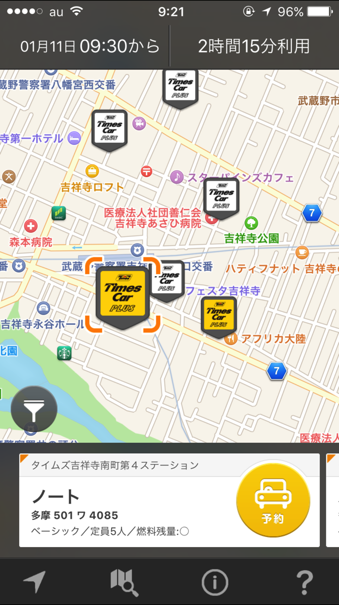
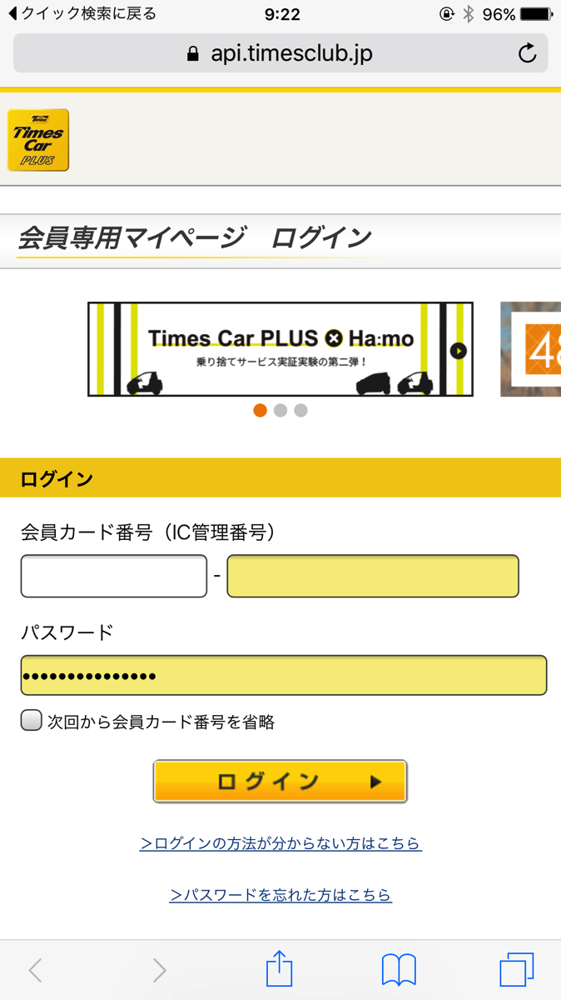
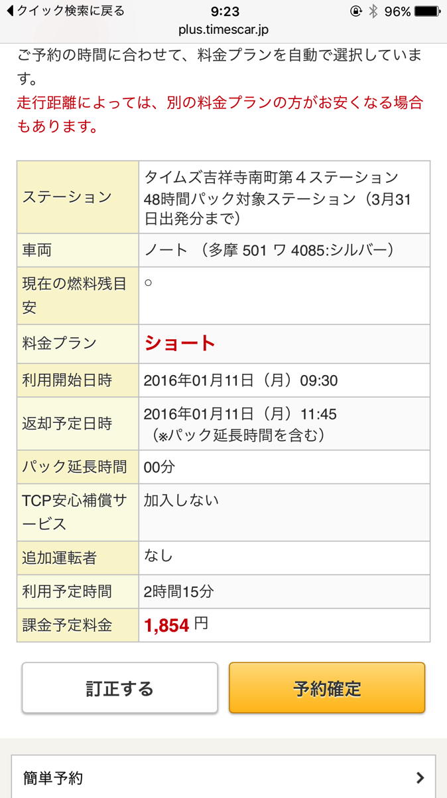
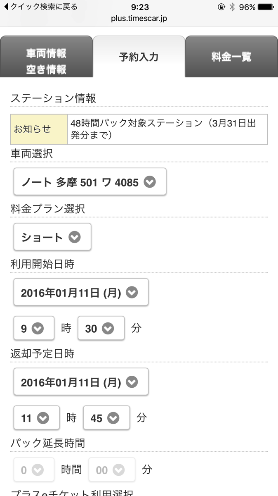

---
categories:
- レビュー
date: Sun, 27 Dec 2015 07:42:46 +0000
slug: post-8780
tags:
- おすすめ
title: 車の月の維持費が高いので、タイムズのカーシェアリングに切り替えてみた！料金や予約方法をまとめとく
---

2011年に初めて購入した車を手放しました。そっからカーシェアを使うようにしてるんですけど、これがなかなかいい感じなのでオススメですって話です。<!--more-->
<h2>車を手放した理由</h2>
金銭的な理由です。だって車って買うにも、乗るにも、置いておくにも、捨てるにも全部お金がかかるんですもん。それで若者の車離れとか言ってるんだからそりゃ乗らなくなるわなって思います。

ざっと計算してみますとこんな感じ

毎月のコストもさることながら、年間合計するとかなりの費用がかかります。しかも本来でらればここに駐車場の費用が加算されます。

ぼくは親が使ってた駐車場をそのまま使わせてもらっていたのでかかっていませんが、これが都内なら2万3万くらいが月額で発生します。年間24万円です。

さらにさらに、オイル交換・タイヤ交換・バッテリー交換などと消耗品のメンテナンス費用もかかってくるので一体いくら加算されるかわかりません。

こんなんなので貯金もできませんし、手放そう！と思ったわけです。
<h2>でも車は使いたい。そんな人はカーシェアを使うと費用が抑えられて便利です。</h2>
でも、車が必要な時は少なからずあるので代替え手段としてカーシェアを使ってみました。

利用も簡単な上に、費用も安いと聞いたのですが、まさにその通りでした。
使い方の説明です。
<h3>登録方法</h3>
<strong>利用するにはまず会員登録が必要です。</strong>
方法はクイック入会、インターネット入会、カーシェア説明会、無人入会機の4つあります。（参考：<a href="http://plus.timescar.jp/regist.html">タイムズカーシェア個人入会方法</a>）

ぼくは無人入会機を使ってカードの発行をしました。他の入会方法はどれも時間がかかったり、店舗に足を運んだりしなければなりませんが、これなら<strong>15分程度</strong>でカード発行までできます。

必要なものは、運転免許証・クレジットカード・メールアドレスなどです。

（参考：<a href="http://plus.timescar.jp/registmachine.html">タイムズカーシェア無人入会機説明ページ</a>）
<h3>利用方法</h3>
ぼくはいつもアプリを使って予約をしています。

<a href="https://itunes.apple.com/jp/app/taimuzukapurasukuikku-jian/id825371148?mt=8&amp;uo=4&amp;at=11ld5P" target="_blank" rel="noopener">タイムズカープラスクイック検索</a>

無料

(2016.01.11時点)

<a href="https://itunes.apple.com/jp/developer/park24-co.-ltd./id622474012?uo=4&amp;at=11ld5P" target="_blank" rel="noopener">Park24 Co.,Ltd.</a>

posted with <a href="http://pochireba.com" target="_blank" rel="nofollow noopener">ポチレバ</a>

画面はこんな感じです。利用したい駐車場を選択すると、その駐車場に止まっている今現在予約可能な車が表示されます。白いマークの駐車場は全部利用されているので、予約不可という意味です。

都度ログインが必要ですので、IDを覚えておくかicloudで記憶させておきましょう。

デフォルトで一番短いプランが設定されています。また、課金予定金額が表示されるのでどれくらいの費用がかかるかわかりやすいです。
また時間内に返却すれば、使った分しか課金されませんのでご安心を。もう少し使う場合やパックで利用したい場合は「訂正する」をタップ

こちらの画面からプランや開始時間返却時間を変更できます。また他の車種への変更もできます。

<h3>実際にかかった費用</h3>
では利用してみて一ヶ月あたりどれくらいの料金がかかってるのかを見てみましょう。

12月分¥13,236（168km、15時間30分）
11月分¥18,348（204km、26時間22分）
10月分¥17,038
9月分¥15,016
8月分¥16,068

だいたい2万円以内に収まっています。この感じだと年間20万くらいで済みそうです。マイカーを持っていて年間100万円程度消費されることを考えると非常にリーズナブルです。
<h3>改善してほしいところ</h3>
ただし、これだけ便利なカーシェアですが改善してほしいところが一つあります。

それは最近予約が取りづらくなってきていることです。

便利だからこそ人気で、利用者が増えているので当然といえば当然ですが。

使いたい時に使えないことがあるのがストレスです。

<iframe src="http://ad.jp.ap.valuecommerce.com/servlet/htmlbanner?sid=3041033&amp;pid=883922752" width="200" height="200" frameborder="0" marginwidth="0" marginheight="0" scrolling="no"></iframe>
<h2>でもマイカーもいいよね・・・</h2>
そう、これだけ便利でもやっぱりマイカーもいいなあという気持ちが捨てきれません。
使いたい時に使え、自分が好きなようにカスタマイズできて、倉庫代わりにも使える。

またいずれマイカーを持ちたいとは思います！

<a href="http://www.amazon.co.jp/mn/search/ref=as_li_ss_tl?_encoding=UTF8&amp;camp=247&amp;creative=7399&amp;linkCode=ur2&amp;rh=i%3Aautomotive%2Cn%3A3132447051%2Ck%3A%E4%B8%AD%E5%8F%A4%E8%BB%8A%2Cn%3A3132447051&amp;tag=warawareotoko-22" target="_blank" rel="noopener">ちなみにAmazonで車購入できるって知ってましたか？</a>

<iframe src="http://ad.jp.ap.valuecommerce.com/servlet/htmlbanner?sid=3041033&amp;pid=883922752" width="200" height="200" frameborder="0" marginwidth="0" marginheight="0" scrolling="no"></iframe>
<h2>まとめ</h2>
費用を抑えたければカーシェア
夢とロマンが欲しければマイカー

費用を抑えつつマイカーがほしければ軽自動車かハイブリットもしくは電気自動車がいいのかなぁなんて考えています。

と言ったところで本日は以上になります。

おやすみなさい。