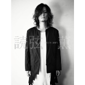

---
categories:
- 各メンバーの個人イベントレポなど
date: Sat, 09 Jan 2016 08:26:00 +0000
slug: post-8793
tags:
- dir en grey関連
title: 薫の読弦発売記念トークライブ「新宿虎の穴 夜の部」@新宿ロフトプラスワン  イベントレポート
---

久しぶりに歌舞伎町行きましたが、綺麗になってて驚きました。コマ劇もうないんですね。<!--more-->
<h2>新宿ロフトプラスワンとは？</h2>
で、ロフトプラスワンはコマ劇があったとこの目の前あたりにあります。トークライブ主体の居酒屋といいますか、注文するとご飯も食べられます。

受付で自分の番号を渡されます。で店員さんに注文と自分の番号を伝えると頼んだものを持ってきてくれます。

キャパシティは200ないくらいでしょうか。

ちなみに精算は最後出るときに番号を伝えると向こうで管理されてるので金額がレジに出るようになってます。
<h2>トークライブレポート</h2>

樋口氏:今日はなんでこういうのをやろうと思ったんですか？

薫先生:タワレコ限定での発売で告知もいきなりだったので。ただ今日のも色々ありましたが

樋口氏:2015年はどんな年でしたか？

薫先生:LIVEばかりで制作できてない

樋口氏:読弦の反応はありましたか？

薫先生:読んだよって周りに言われるので、もういいって返します。

樋口氏:名前の長い若いバンドのメンバーにあげたら、家に飾りますって

薫先生:勘弁してくれ

樋口氏:ぼくの所にも読者から手紙くるんですよ。

薫先生:見せてくださいよ

樋口氏:今日のオリジナルドリンクの説明を

薫先生:ネクッシュはネクターとレモンスカッシュまぜたやつ。ネクター好きだからそれに炭酸混ぜたらどんなかなと思って
無酒の運命は酒飲まないんだったらって感じで。ジンジャーエール。辛いもの入れてる。カクヤスに売ってた。
魔赤紫はワイン多めのサングリア

樋口氏:どんな本を作りたかったのか？最初はアーティスト本みたいなのを想像してた。その方がファンも喜ぶと思って。そしたら割とストイックなのが出てきた。

薫先生:シンプルで読みやすいのがよかった。テキストと写真は分けたいと思った。読んでる途中に写真入ってると流れが切れるから嫌だと思って。

樋口氏:紙や表紙にもこだわった。普通アーティストが本出すとコーティングしてキラキラさせる。その方が高く見えるので。

薫先生:読みやすいようにしたかった。マット加工で指紋がつかないようにしたり。

樋口氏:表紙の写真も2、3時間位撮影したけど最初の方のやつ。普通もっとポーズとると思ったけど。手にポケットインするとか

薫先生:これポケットがなかった

読弦の発売は予定だともう少し早くなるはずだった。しかし樋口氏の入院があったため、少し伸びたとのこと。このあたりで全員にドリンクが行き渡り、乾杯

樋口氏:どう、かなり近いでしょ。目があった？

薫先生:いやー近いですねぇ。まぁぼやーっと見てます。

樋口氏:LIVEとかで目があうとことかあるの？

薫先生:んーまぁぼやーっと見てますけど、まぁあります。変なやつとか見ます。だいたい分かるんで。けっこういます。

薫先生:なんでタワレコ限定だったんですか？

樋口氏:本の流通ってかなり仕組みが古くて、本屋になくて注文とかすると1週間とかかかるでしょ？今そんなことやってる業界ないでしょ。田舎の小さい本屋に一冊とか置かれても大切に売ってもらえないこととかあるから効率が悪い。だったら地方の人には申し訳ないけど一生懸命売ってくれるタワーさんにお願いした。

<h2>薫が持ってきたものを紹介する</h2>
<h3>①子供の頃の写真複数</h3>
•昔はかおちゃんと呼ばれていた。
•今も母親にはかおちゃんと呼ばれている。(会場狂喜乱舞)
•CHARM時代の写真。髪の毛がけっこうおったててあった。ダイエースプレー使って30分くらいかけてセット。当時のビラもしくはポートレート披露。(よくとってあったなぁ)メンバー画像と葉っぱの【あしらい】(樋口氏)なぜ薔薇じゃなくて葉っぱかというと他の大将がいるからなぁとのこと。(大将て？エックス？)
•DIR EN GREYの漫画が昔あった。造形師のDADA？作。薫とDieが戦士、京がなんか凄い悪いやつ
<h3>②自宅の写真紹介</h3>
高林さんのMacにいれた薫家画像を公開。樋口氏から自分のMacだとヤバいものとか入ってるから見せられない？薫先生「そうそう、曲とか入ってるし絶対見せられない」
•フィギュアのコレクションの写真
一面山積み。裏側にもある。衣装作ってくれてる<a href="https://twitter.com/d4caggy">よこざわさん</a>とよく買いに行く。
•樋口氏「メンバーのフィギュアとかどう？」薫先生「昔作る話があって社長がノリノリだった。十字架とかに貼り付けたり悪魔的な感じの。メンバーは冷めてた」
•先日のガンプラでパイロットとして小さいものを作ってもらった。顔は書かれてないけど髪型とヒゲと服装(黒と紫)本がでるからそれに乗ってる。

<strong>ここで薫がふと思い出す。高林さんに指示「おれのカバンの上側のジッパーあけたところに入ってるガチャガチャとってきて」</strong>

黄色のガチャガチャのケースを開ける薫
中身を取り出しスクリーンに出すと、例のピックにかかれたあのキャラの原型でした。会場狂喜乱舞。可愛かった。ポケモンみたい。樋口氏からは妖怪ウォッチに提案して作ってもらおうとのこと。薫「みたことないもん」樋口氏「今度貸す」薫「そういやDVD貸してましたよね」樋口氏「今度返す今度返す」
ちなみにグッズとして企画したけど高くなりそうだったので今回は見送ったとのこと。ちなみに名前は決まってないけど仮置きのがある。けど変えたいのでまだ発表しないとのこと。

<strong>•某アーティストのサイン</strong>
作業する机のところにはってある。その隣にいただいたどこにも出てない写真をはってある。

<strong>•その他の画像</strong>
デランジェ、ピンクフロイド、エイリアンフィギュアなどなど
<h2>質問コーナー</h2>
Q:TTTでカバーしたいマッドカプセルマーケットの曲は？
A:parasite

Q:TTTは継続的に活動するんですか？(これぼくの質問でした)
A:サマソニオファーするかとか言ってたけど、まぁコピーバンドだからなぁ。
樋口氏「フェスでコピーバンド枠作ってもらえば？」
薫先生「あーそれ絶対いい。絶対やりたい大御所いるもん」

Q:最近の髪型について
A:濡らして、ドライヤーかけてふわーってして、ここってとこでケープ(青)で固める。
樋口氏「若手バンドマンとかメイクのやり方わからない人とかいる」
薫先生「絶対自分でやったほうがいい。凹凸とか自分が1番わかってる」
樋口氏「一度女装したことあるけど不思議な高揚感。ワクワクした、そういうのある？」
薫先生「もう今はない。昔は気合入ったけど今はふんふんふんって感じ」「海外いくとDieが髪の毛立てるのめんどくさいと言ってた(ここでモノマネ)、京も体にペイントするのめんどくさいっていって2人で盛り上ってた。

Q:執筆以外にやってみたいことは？
A:んーなんやろなぁみたいな感じで樋口氏からバンドやソロの音楽活動はどうかとの質問、DJとか。ぼうエムユーシーシーの人とか、酒全く飲めなかったのにクラブ遊び覚えたら酔えるようになった。
薫先生「昔逹瑯から紹介受けたとき、今度飲もうやって言ったらおれ飲めないんでご飯でもいいですか？って。で、はいって」

Q:ニコ生の裏話
A:twitterとかでつぶやいたらあかんでほんま。そのかYoshiki、トミー社長に怒られそうな内容ばかり

Q:来年のツアーはどのようになるか
A:武道館とは違うような感じにしたい。樋口氏からセトリはどのように決めるのなとの質問。昔はホワイトボードにマグネットにタイトル書いたものを張って話し合っていたが、曲数が多くなったので今はメンバーの意見を汲み取った薫がだいたい決めてメンバーに投げる。そこから返信があったりして決めていくとのこと。ただ1人だけ1度も返信をくれたことがない人がいる。ちなみに武道館にはあまり思い入れがなく、大阪城ホールの方がビラ配りとかで後のメンバーになる人たちと顔合わせたりしてたので思い入れがある。

Q:他のメンバーのソロ状況について
A:sukekiyo見たことない。気が熟してからの方がいいかと思って。樋口氏「先日の国際フォーラム見に行ったら鞭とかでたたいた」薫先生「あの人、グローブに紐付いててLIVEにパチーンって顔に当たったことある。やから経験済みです」

樋口氏:薫先生はアイジとかとなんかやらないんですか

薫先生:なんであいつなんwやるとしてもないなぁ

樋口氏:マイペースだしねぇ、マイクしゃべるときエコーかけなきゃいけないし

樋口氏:Shinyaさんは色々見に行ってる見たいですよ

ここからしばらくShinya話

とにかく交友関係が広い。まったく違うバンドのLIVEにもいたりする。と樋口氏

薫先生:テレビでてますからねぇ。他の番組(イマル司会のやつかな？)で彼と2人で出たのを有吉反省会のディレクターが見ててそこからオファー来た

樋口氏:あー見抜かれてた

薫先生:おれ見てなんですけど、この辺にテロップでおれが言ったことみたいな感じで出るんですよ

Shinyaが表紙のROCK READに話がうつる

樋口氏:あれはすごいですよね。なんかになりきってますよね。ああいう癖なんでしょうね

薫先生:おれからしたらバンド始めた時の高校生のイメージでずっときてる。20年近く一緒にいるけど目を見て話したのがトータルで24時間ない

この辺のながれで、樋口氏から薫にしきりにソロでの活動を促す形に

薫先生:自分用の作ったりはしてるけど、とても出せるようなレベルになってない。そういえば最初映ってた映像も、俺が撮ったんですよ。

樋口氏:その話最初にしましたよ

薫先生:あれw

樋口氏:あれはどこでとったんですか

薫先生:近所

補足ですが今日本当は誰か来るはずだったみたいです。メリーのガラ？深夜の部には来たっぽいですけど

ぼくのメモはこの辺りで終わってますが、この後いくつかキーワードが

武道館が例年よりも時期が少し早いのは、その後の展開があるから。来ればわかる。

ということで、その後唐突な握手会に突入！！！

薫先生の握手は柔らかく空気のようでしたよ！そして！！

https://twitter.com/s_s_p_y/status/685453129760948224
<h2>しんぺーはこう思った。</h2>
いやー最初ぼっち参加マジきつーと思ってたんですが、めちゃくちゃ楽しかったです。

もう次回のLIVEは下手の住人となります！！！

ということで本日は以上になります。
おやすみなさい。

&nbsp;

＜タワーレコード限定＞ 

<a href="http://ck.jp.ap.valuecommerce.com/servlet/referral?sid=3041033&amp;pid=883922249&amp;vc_url=http%3A%2F%2Ftower.jp%2Fitem%2F4015894%2F%3Fkid%3Dpafvc" target="_blank" rel="noopener noreferrer">DIR EN GREY薫 「読弦」</a>