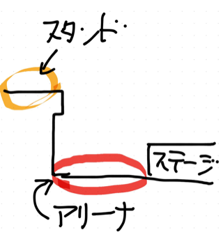

---
categories:
- LIVEのお作法
date: Wed, 20 Jan 2016 13:38:50 +0000
slug: post-8831
tags:
- LIVE
title: 今年こそLIVEに初めて行ってみたい初心者向け「LIVEに行く方法」
---

新年ということで今年こそは初めてLIVEにいってみようという若人もいると思います。今はまだ受験生だけど受験終わったらLIVE行ってみたい！今年こそはLIVEデビューだという若人向けの記事です。主にDIR EN GREYでの経験をもとに書いておりますので、若手ビジュアル系やその他のJPOPやアイドルなどだと文化が違う関係から多少作法が違うかもしれません。随時注記をつけていきますが、概ねは同じだろうという想定です！では、始めましょう。

<!--more-->
<h2>チケットの取り方</h2>

	

	

まずLIVEに参加するにはこれがないと話になりません。必須アイテムです。LIVEに行きたいならこれをまず入手しましょう。

	

	

一般的な入手方法は次の通り

	

	

①各プレイガイドで購入

	

②支払い

	

③発券

	

	

だいたい次の３つのサイトで購入します。

	

	

ぴあ

	

イープラス

	

ローチケ

	

	

一般的にはプレイガイドのチケットはファンクラブ先行チケットなどに比べると座席や整理番号が悪いと言われています。またファンクラブで購入したチケットなどはデザインが特別な場合がありますが、こちらは購入したプレイガイド別、もしくは発券方法によって変わってきます。

	

	

また、アーティストによっては販売していないプレイガイドなどもありますのでアーティストのサイトを見てみてください。

	

	

支払いについてはクレジットカード支払いのものや、期限内にコンビニで支払うものなどがあります。

	

	

また発券方法ですが、支払い後に自宅に郵送されてくるパターンと期限内にコンビニの端末で発券するパターンがありますので申し込み時に確認しましょう。期限が過ぎて発券できなくなってしまうなどあります。また、事故などで郵送されないケースもありますので、LIVE日程が近づいているのに手元に届かないなどあれば、その辺も注意が必要です。

	

またチケットの種類についてですが大きなアリーナクラスの会場になるとスタンド席、アリーナ席と言った場所の違いが出てきます。図で説明しますとこんな感じです。会場の低い平らな部分がアリーナ席で。高くなってる部分がスタンド席です。アリーナ席の方が運がいいとステージに近くなる可能性があります。ただスタンド席の方がゆったりと全体を見渡すことができます。でも後ろの方になっちゃう可能性もあります。

	

	

	<h2>持ち物</h2>

	

さて、チケットの確保ができたら持ち物や服装についてです。と、その前に参加するLIVEの形式について確認しましょう。

	

	

形式とは座先の形態です。スタンディングはつたり立ち見のことです。激しめのLIVEを行うアーティストの場合立ち見が多い傾向にあります。押し合いへし合いで、バンドによってはモッシュやダイブなどが発生して非常に危険です。そのため初めて参加するLIVEがスタンディングであれば下手に前に行かずに真ん中より後ろの方で見ることをおすすめします。

	

	

スタンディングでの参加の場合、カバンはロッカーやクロークに預けるのがいいでしょう。カバンなどを持って入った場合、壊れたり他人に引っ掛けて迷惑をかけてしまう恐れがあります。また文化によっては注意を受けたりする可能性があります。会場内にロッカーがある場合でも数に限りがあるため入れることができない可能性もあります。またクロークは終演後に非常に混雑します。そのためぼくはなるべく手ぶら、もしくは駅のなどのロッカーに預けるようにしています。

	

	

指定席は、文字通り席が指定されている形態です。全席指定か一部スタンディングで一部指定席といった複合タイプがあります。また指定席といえど自分の席の部分で立ってLIVEを見るという感じになるアーティストが多いのではないでしょうか。この辺は文化の違いがあるかと思いますので周りを見て立つのか座るのか決めるといいと思います。また会場によっては安全面の配慮から立ち上がっての観覧を禁止している座席もありますので、スタッフからの注意があるかもしれません。ぼくの場合は、席指定では基本的には荷物をそのまま持って行って置くことが多いです。ただ盗難などの危険もありますので荷物の管理には気をつけましょう。足元に置くとか貴重品は肌身離さず持っておくなど。

	<h2>服装</h2>

基本的には汗をかいてもいい服装でいきましょう。夏でも冬でもLIVE会場は暑いものです。そして動きやすい服装がおすすめです。特にスタンディングのLIVEで前の方に行くのなら暑さで体調が悪くなる可能性があります。さらに人や自分に怪我をさせてしまうような服装、アクセサリーも外していきましょう。ピンヒールなんてもってのほかです。どんな高さであろうとヒールは踏まれた相手の足に穴が開く可能性があります。また基本的には貴金属はひっかかったり、引きちぎられたりする危険がありますので外しましょう。

	

	<h2>会場までの行き方</h2>

	

今は便利な時代になりました。スマホがない頃は最寄りの駅まで行って、それっぽい集団についていくという感じでした。

スマホで検索して向かいましょう。ただし次に書きますがグッズなどを買う場合は早めに向かいましょう。

また、早く着きすぎてしまったりで時間を潰すために、LIVE会場近くで休憩できる場所も探しておきましょう。カフェやファミレスなど

	

	<h2>物販の買い方</h2>

	

多くのファンにとってはLIVEの思い出として、多くのアーティストにとってはチケット代以外の資金源である物販ですが、もし欲しいグッズがあるのなら早めに並びましょう。アーティストにもよりますがDIR EN GREYなんかは早い人だと早朝から並んだりします。

そしてグッズを買うということは荷物が出来るということなので購入後はロッカーの確保を速やかに行いましょう。

	

	

	

	<h2>予習について</h2>

さて、ここまで行えば大体は準備万端です。が、LIVEをより楽しく過ごすためにぜひ予習を行いましょう。アルバムやシングルのB面曲全てに耳を通しましょう。当然ですが。そしてLIVEDVDを購入してLIVEの様子を確認しましょう。ぼくが初めて行ったLIVEの時はLIVEビデオ(！)を買って振り付けやノリ方、煽られ方などを勉強しました。

でもLIVEはノリだと思う人やファーストインプレッションを大事にしたければ見ずに参加するのもいいでしょう。

さて、こんな感じです。LIVEに行くってのは。