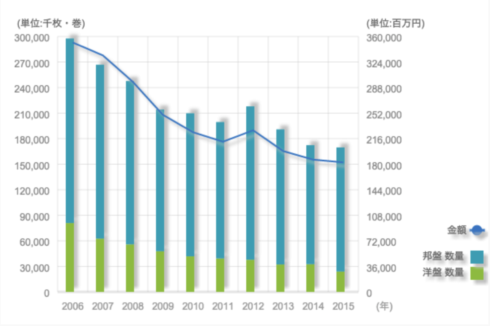
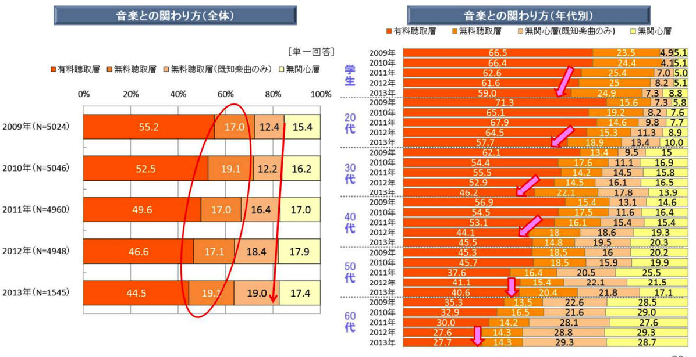
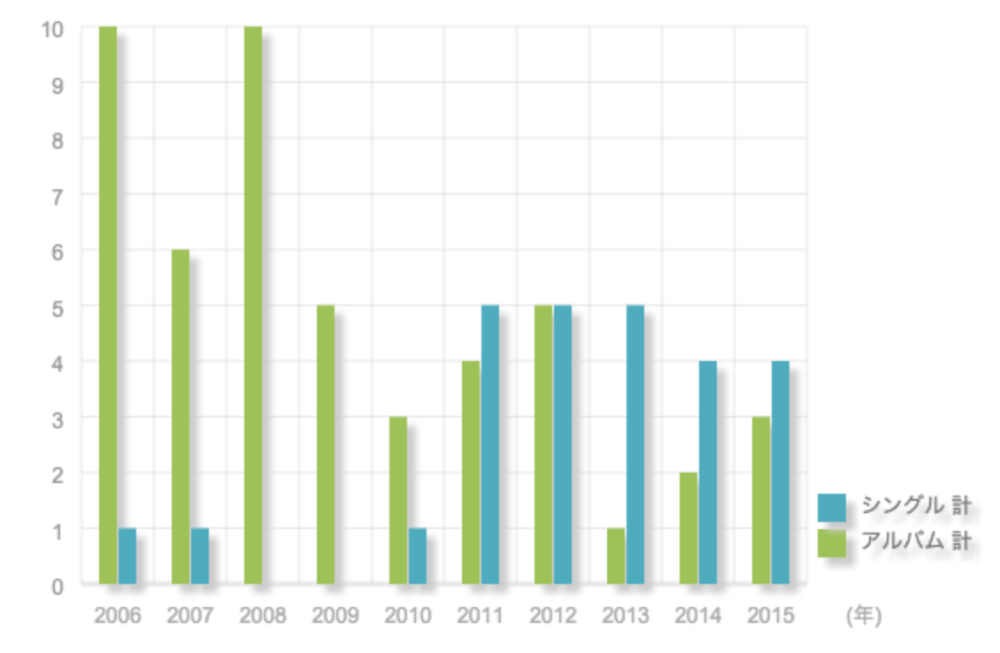
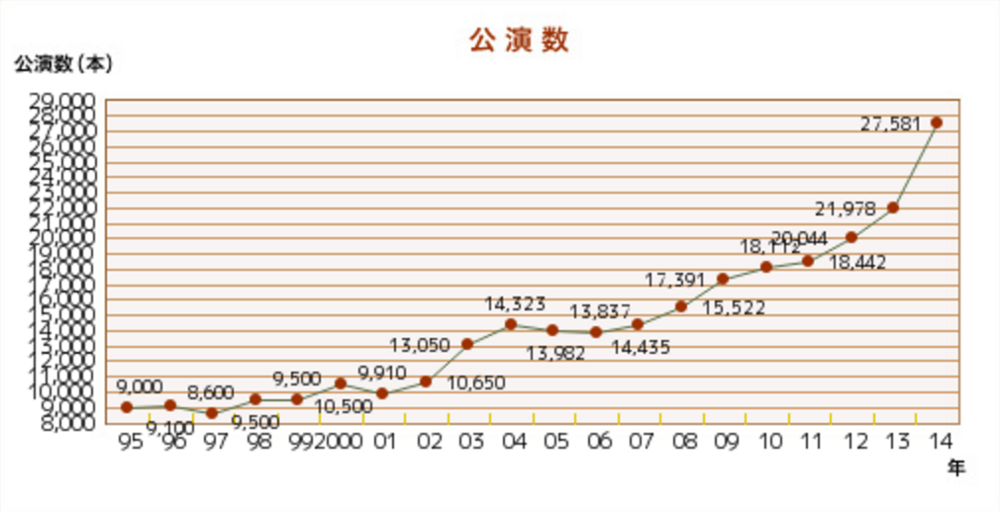
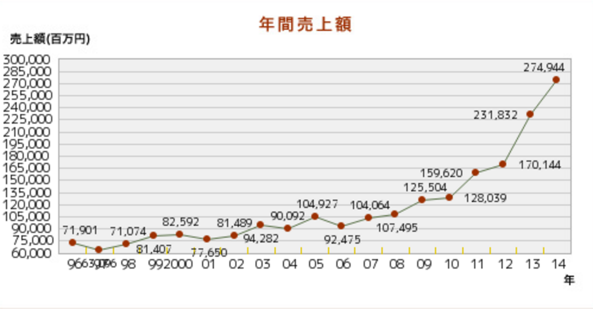

---
categories:
- music
date: Sun, 24 Jan 2016 23:15:35 +0000
slug: post-8837
tags:
- 音楽
title: CD不況について実際調べてみたら逆にコンサート売上がすごいことになってた。
---

CDが売れなくなって久しいです。そういった業況はアーティスト側やライターから語られることが多いきがします。でもそれって作り手とか販売側に問題があるんじゃね？という話です。

<!--more-->
<h2>CD不況は他のエンタメの発展に原因がある？</h2>

CDの全体の売上推移です。本当にめっちゃ減ってます。10年ほど前の半分近くになってます。

（引用元：<a href="https://www.riaj.or.jp/">一般社団法人日本レコード協会</a>）

ではその原因とは何なのだろう。

年代別の音楽への関わり方のアンケート結果に如実に表れているが、有料で音楽を聴く人間が減ったことだ。よく言われるのが違法ダウンロードやコピー、YouTubeの台頭により、無料で音楽を聴けるようになったから、わざわざお金を支払う必要がなくなったというのだ。

（引用元：<a href="https://www.riaj.or.jp/">一般社団法人日本レコード協会</a>）

しかしこのアンケート結果で着目すべきはそれ以外にもあります。

それは<strong>無関心層の拡大</strong>

アンケートによると全ての世代で無関心層が増えていることがわかる。その要因はスマホやネットの普及により音楽以外のコンテンツに時間とお金を使うようになったためと言われている。

けど裏を返せば<strong>スマホゲームやその他のエンタメに勝てないアーティストが増えたんじゃないだろうか。</strong>

実際に多くの人から支持を得られるアーティストが減っている。こちらはミリオンセールと呼ばれる100万枚以上売り上げたアルバム、シングルの年間枚数のグラフです。

（引用元：<a href="https://www.riaj.or.jp/">一般社団法人日本レコード協会</a>）

ちなみに2006年のミリオンアルバムは10枚。内訳は倖田來未4枚、コブクロ3枚、宇多田ヒカル、絢香、浜崎あゆみとなっている。

一方、2015年は嵐、三代目 J Soul Brothers from EXILE TRIBE、DREAMS COME TRUEの3組のみ。ちなみに1996年は36枚のミリオンがあったみたい。

多様化する価値を束ねられる最大公約数的なアーティストや表現がないんじゃなかろうか。

だからCDが売れないんだろ

<h2>物質主義から精神主義に</h2>

ここまではCDという「モノ」に対してのお話でした。

CDが売れなくなってきた分、それ以外を収入源とするアーティストが増えてきました。その１つがコンサートです。

それまでCDの宣伝という位置付けがされていたコンサートですが、今では立派な収入源です。どれくらい立派か推移を見てみましょう。公演回数と売上です。

（引用元：一般社団法人コンサートプロモーターズ協会）

（引用元：一般社団法人コンサートプロモーターズ協会）

正直この右肩上がり具合には驚きました。

CDはそんなに売上ないけど、LIVEはすごいというアーティストが結構な数でいるんじゃないかなーと思いました。

それと個人的には、無料音楽視聴がここへの導線になっている可能性もあるじゃないかと思います。

CDが売れなくてもキチンとファンに訴求して、コンサートに来てもらえればなんとか成立するんじゃないでしょうか。

<h2>2016年問題</h2>

ただし、この流れをぶった切るのが2016年問題

<blockquote>
2016年問題（2016ねんもんだい）とは、2020年の東京オリンピックに向けて、東京都内や首都圏各地の劇場やコンサートホールが改修工事などのために閉鎖し、コンサート用の施設が不足するとされる年問題である[1][2]。
<cite>引用元:<a href="https://ja.m.wikipedia.org/wiki/2016%E5%B9%B4%E5%95%8F%E9%A1%8C" target="_blank">2016年問題 - Wikipedia</a></cite></blockquote>

これにより、アーティスト側は公演会場が減り、収益も減ります。さらに元々収支が悪い地方公演を都市部での公演でカバーするなどしていることが多いため、地方公演を増やしても意味がないらしい。

ということで、利権がある人の得にしかならないオリンピックのせいで日本の音楽シーンは割とピンチみたいです。

<h2>しんぺーはこう思った。</h2>

LIVEが収益のメインになりつつあるというのはずっと知ってましたが、まさかこんなにも公演回数が増えてるなんて知りませんでした。

そして2016年問題を見越してなのかDIR EN GREYは、今年はあまりLIVEなさそうな気がしてます。

もう各アーティストや事務所ごとに会場を持っちゃった方がいいんじゃないかって気がしてきます。

と言ったところで本日は以上になります。

おやすみなさい。