---
categories:
- DIR EN GREY
date: Sun, 31 Jan 2016 03:55:50 +0000
slug: post-8852
tags:
- dir en grey関連
title: DIR EN GREY、sukekiyoファンとしてメンバー御用達スポットの京都聖地巡礼してきた
---

DIR EN GREY、sukekiyoファンとしてメンバー御用達の京都の聖地へ巡礼してきましたので、本日はそのレポートです。<!--more-->というか友達の結婚式に参加するために京都行ってきた旅レポですよー

<h2>sukekiyoメンバー御用達「新福菜館」</h2>

sukekiyo初ツアーの京都2daysで恐らく京以外のメンバーが足を運んだ名店

<strong><a href="http://tabelog.com/kyoto/A2601/A260101/26000791/" target="_blank">新福菜館 本店</a></strong>

<strong>関連ランキング：</strong><a href="http://tabelog.com/rstLst/ramen/">ラーメン</a> | <a href="http://tabelog.com/kyoto/A2601/A260101/R3313/rstLst/">京都駅</a>、<a href="http://tabelog.com/kyoto/A2601/A260304/R4622/rstLst/">七条駅</a>、<a href="http://tabelog.com/kyoto/A2601/A260604/R3445/rstLst/">九条駅</a>

ぼくは、それ以前から知っていて京都に遊びに行った際に立ち寄ったことがありましたのでブログに上がった画像を見てすぐに特定できたのを覚えています。本当に美味しくて、以前の滞在中に2回も行った程です。

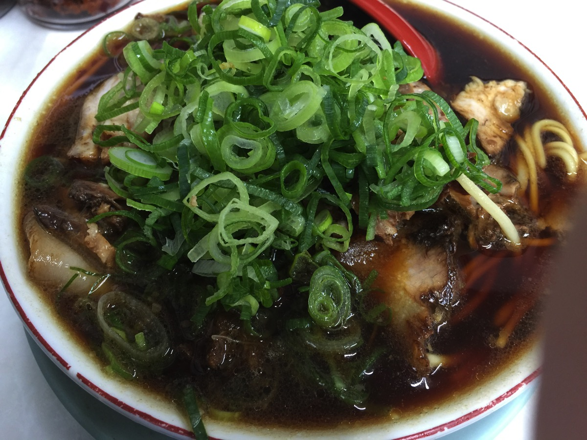

醤油ベースの非常に濃い味のラーメンです。チャーシューも味がしっかりと染みていて美味しいです。

家系のこってりラーメンとは違いますが、割と重めかもしれません。人によっては少し味が濃いと感じるかも

<h2>京が雑誌撮影で足を運んだ「遊形サロン•ド•テ」</h2>

京都の情報誌Leafにて京が訪問したオシャレなカフェ

お店も、おしぼりも、店員さんも全てがかぐわしいいい匂いがしました。

<strong><a href="http://tabelog.com/kyoto/A2601/A260202/26005378/" target="_blank">遊形 サロン・ド・テ</a></strong>

<strong>関連ランキング：</strong><a href="http://tabelog.com/rstLst/CC010101/">カフェ</a> | <a href="http://tabelog.com/kyoto/A2601/A260202/R3321/rstLst/">京都市役所前駅</a>、<a href="http://tabelog.com/kyoto/A2601/A260202/R2811/rstLst/">烏丸御池駅</a>、<a href="http://tabelog.com/kyoto/A2601/A260301/R4465/rstLst/">三条駅</a>

とても落ち着いた外見、内装もとても落ち着いていて時間の流れがゆっくりしている様な雰囲気です。

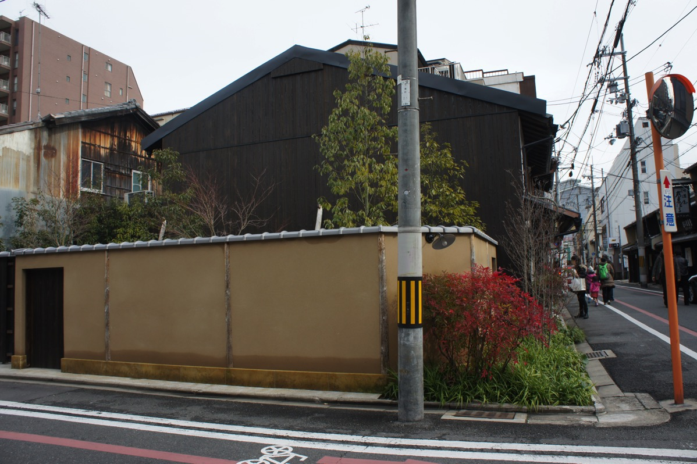

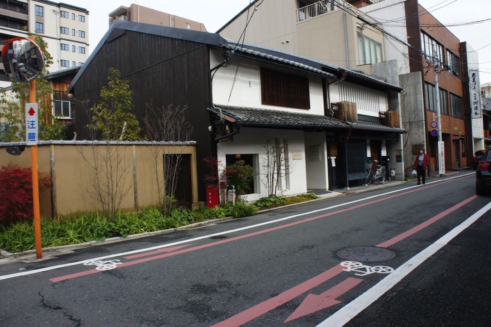

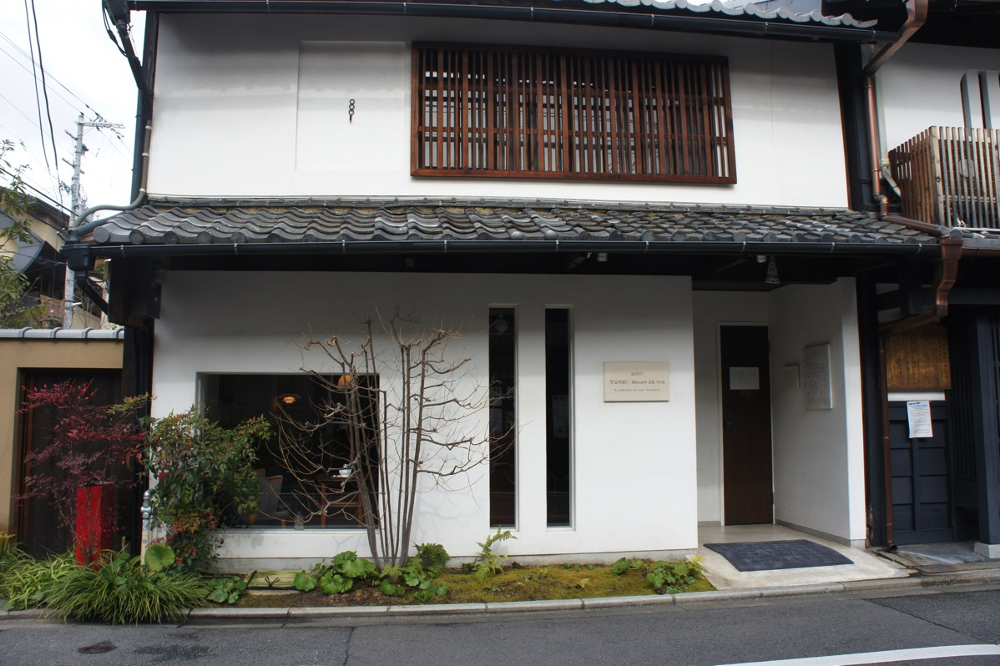

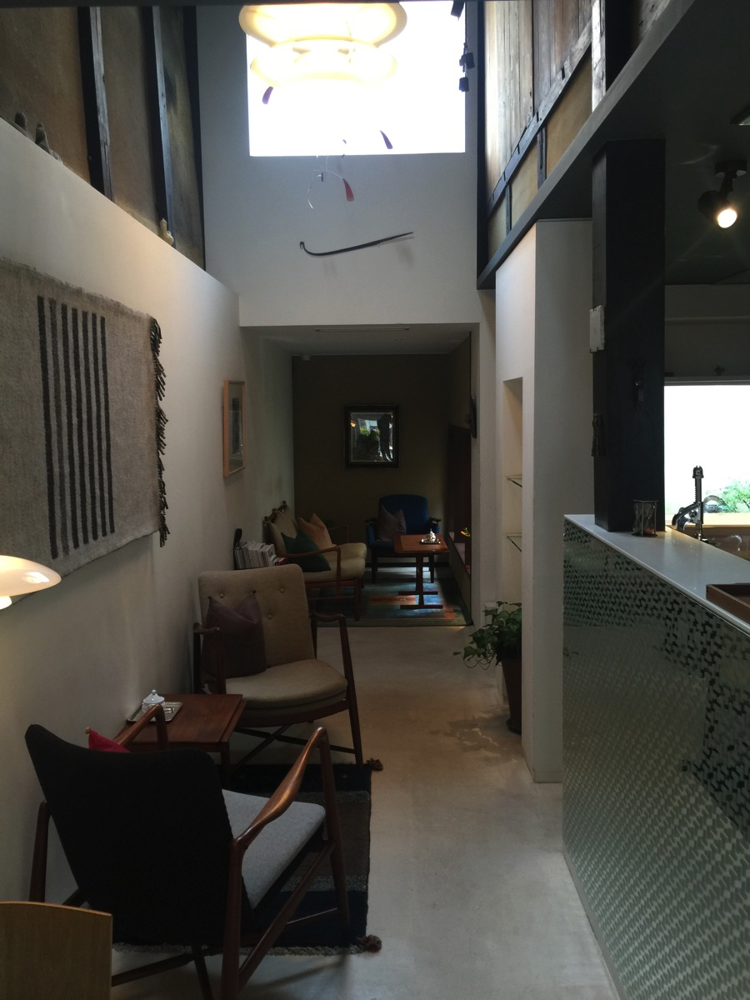

京が座ってた椅子がこちら（と思ったら隣の椅子だったらしい。。。）

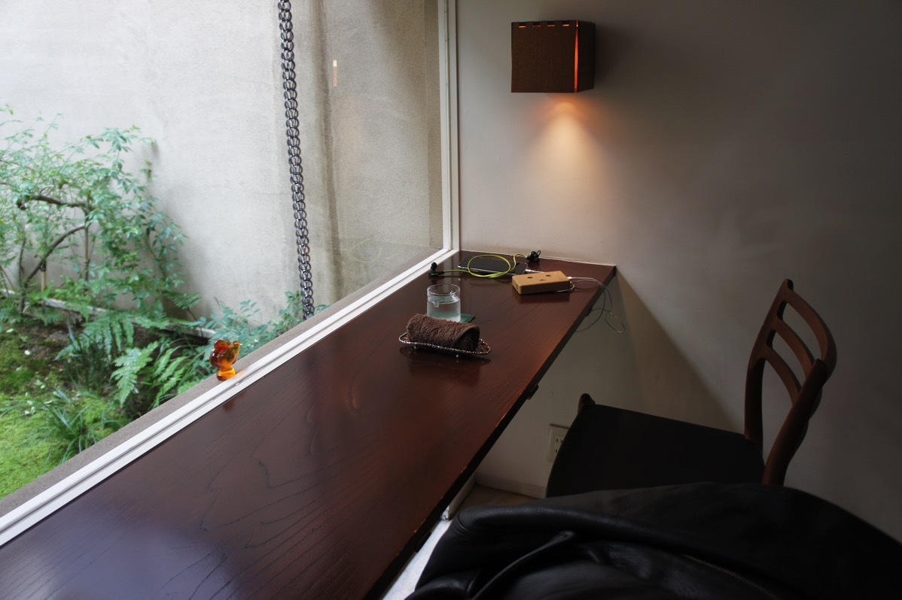

値段は普通のカフェよりも若干お高め。でもその分本格的で、和菓子も抹茶も美味しかった！

一応当時の様子は<a href="https://www.warawareotoko.com/2014/05/07/post-5329/">こちら</a>の記事にも掲載しております。

参考：<a href="https://www.warawareotoko.com/2014/05/07/post-5329/">sukekiyo後始末！「別れを惜しむフリは貴方の為」メンバーが訪れたお店</a>

<h2>しんぺーはこう思った。</h2>

以下は聖地巡礼と関係ない旅レポです。写真を中心にどうぞ。

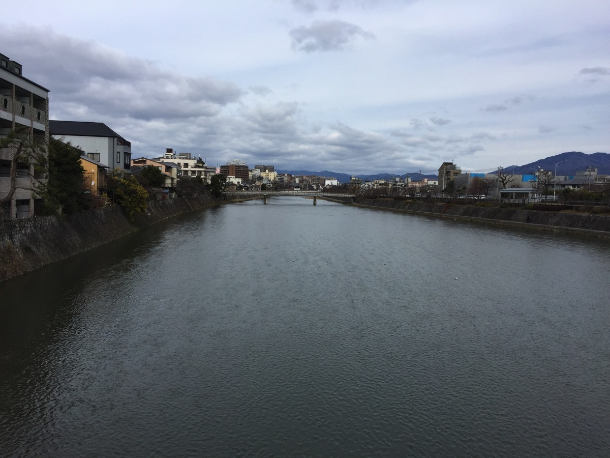

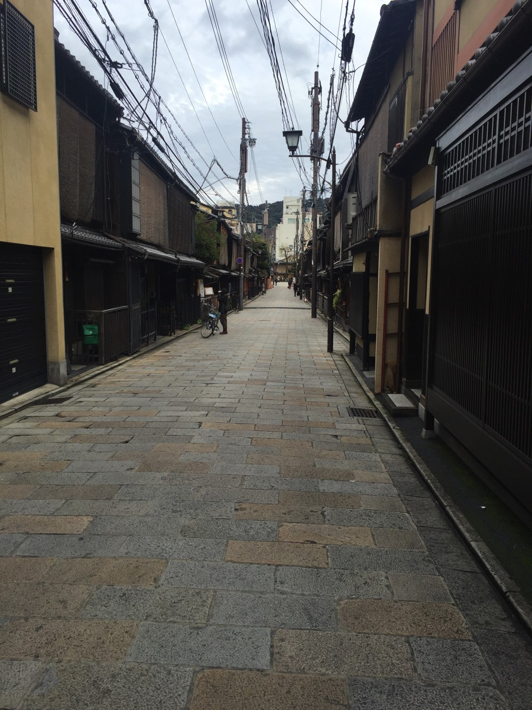

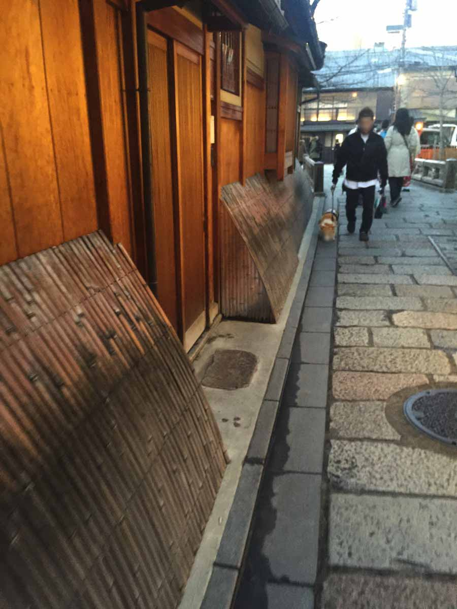

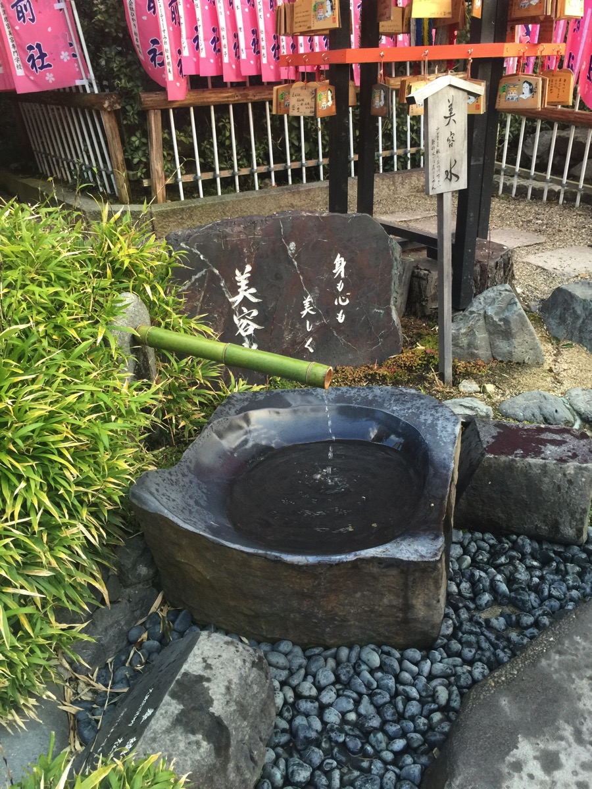

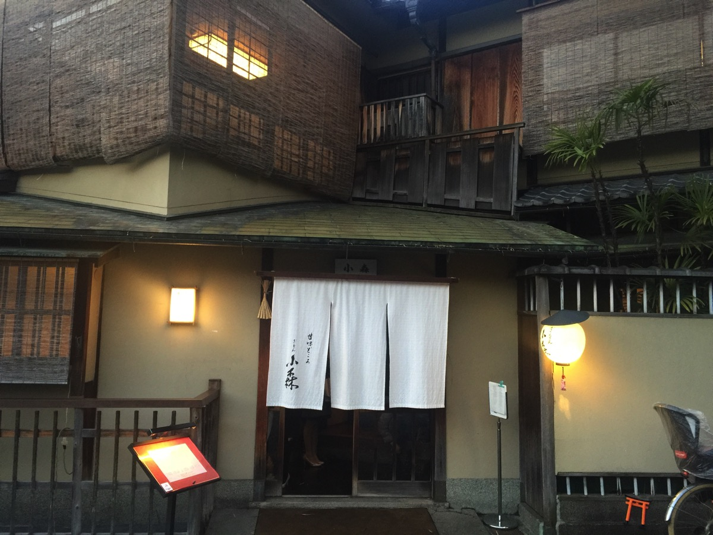

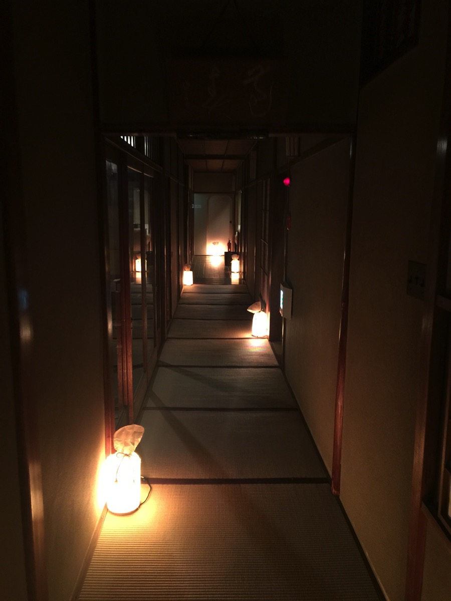

と言ったところで、本日は以上になります。
おやすみなさい。