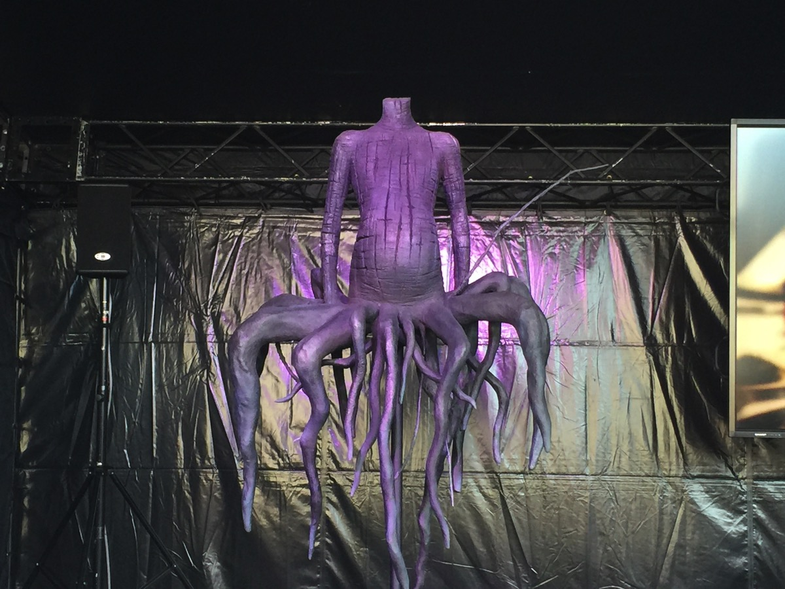

---
categories:
- DIR EN GREYのLIVEレポ
date: Sat, 06 Feb 2016 02:32:41 +0000
slug: post-8872
tags:
- DIR EN GREY
- LIVEレポ
title: 【ライブレポ】DIR EN GREY ARCHE 2016_2_5@日本武道館
---

終わりを讃えよ。DIR EN GREYの日本武道館公演「DUM SPIRO SPERO」から2年

余りにも深淵に沈み過ぎた前作「DUM SPIRO SPERO」はリーダーの薫に「このバンドでアルバムが作れるのもあと数枚かもしれない」と言わしめるほどの造形だった。そして、その集大成ともいえる2014年3月9日、10日のLIVEでは正にバンドの全てを出し切ってDIR EN GREYを表現しきった。ラストで「THE FINAL」の大合唱が起こるなか、モニターに写されたのは、ステージを去り廊下を歩くメンバーの後ろ姿だった。その様からぼくは、<strong>何かが終わってしまうのかもしれない</strong>という恐れを感じて涙を止められなかった。

そんな「DUM SPIRO SPERO」から2年

今日、明日再びこの地でDIR EN GREYがアルバムの終りを讃えるLIVEを行う。<!--more--><h2>アルバム「ARCHE」とは</h2>

ARCHEとは、アルケーすなわちギリシャ語で根源を意味するDIR EN GREY9枚目のアルバム。

「ARCHE」は、14曲と4曲の全18曲で構成される。それまでの複雑な曲調や展開を意識して作品を作ることを得意としていた彼らが、よりLIVEや体感で乗れるように以前に比べればシンプルさを重視して作られた。

そして、今回の日本武道館公演は

<ul>
	<li>TOUR14-15 BY THE GRACE OF GOD</li>
	<li>TOUR15 THE UNSTOPPABLE LIFE</li>
	<li>TOUR15 NEVER FREE FROM THE AWAKENING</li>
	<li>TOUR16 FINEM LAUDA</li>
</ul>

そのほかの海外公演やイベントを通して完成された「ARCHE」の集大成として位置付けられている。

<h2>2015年2月5日「ARCHE」LIVEレポ</h2>

午後半休をとっての参戦でした。なぜに平日にしたのか。。。
にもかかわらず昼間からたくさんの人がおりました。夜はさすがに寒かったですが、それでもUROBOROS公演の時の寒さに比べたらぜんぜんあったかかったです。

それでは今回のLIVEで行われているキャンペーンのご紹介

<h3>キャンペーン</h3>

<h4>特設ブース</h4>

メンバーの楽器

朝鮮人じ・・・いや、ARCHEの造形物

まじかで見ると、すっごい違和感。これ木製じゃないのかな？発泡スチロール？

ハッシュタグつけるとここに表示されるらしい。#ARCHE
たぶん#direngreyでもいける。

<h4>QRコードマン”Q”</h4>

<blockquote class="twitter-tweet" data-lang="ja">
武道館外周をこんな人みたら、頭を写真撮ってみてください！ なんででしょう^_^; <a href="https://t.co/BDgm5fXVHt">pic.twitter.com/BDgm5fXVHt</a>
&mdash; DIR EN GREY (@DIRENGREY_JP) <a href="https://twitter.com/DIRENGREY_JP/status/695469956163465218">2016, 2月 5</a></blockquote>

この方の頭についてるQRコードを読み取ると画像が見られる。おそらく時間で色々と画像が変わるみたい。リンク先を控えておけばよかった。誰かリンク先知ってたらください。

<h4>interFM897 Freedom of expressionブース</h4>

物販とa knot限定企画のブースの間にひっそりとあります。やってほしいコーナー企画やメッセージをノートに記入すると番組ステッカーがもらえる。

みんなだいたい頑張ってくださいみたいな事書いてありました。ぼくは後半バンドマン向けの指南教室やってくださいって書いておきました。

<h4>ツアーで作られたオブジェ一式</h4>

今やなつかしのGAUZEツアーの例の椅子

TOUR14-15 BY THE GRACE OF GOD

TOUR15 NEVER FREE FROM THE AWAKENING

a knot限定企画

チケット両日分と会員証が必要です。

ひだりからチケットクリアファイル、特典応募用ハガキ、都内某所LIVE用のシリアルコードが書いてある応募詳細です。

都内某所LIVEに関しては、なんかガクっとなりました。そこかい！って感じで。でも結構狭目で相当カオスになるんじゃないでしょうか。

っつかこの予想すらしてない会場だった→　<a href="https://www.warawareotoko.com/2016/01/15/post-8824/">【DIR EN GREY】日本武道館2DAYSご来場者完全限定LIVEの場所はどこか予想してみた</a>

<h3>物販</h3>

相当やはやく行かないと買えないなこれ。朝8時くらいから並んでる人もいたっぽいし。

お目当てのTシャツAタイプが買えなかった。しょうがないから中国LIVEのTシャツ買いましたよ。

それと前回武道館でもやってたお守りが売れまくっておりました。スタッフさん曰く、「今後もうない神企画」全お守りに直筆のサインが入っています。

そらーあの量書いたメンバーからもう２度とやりたくないと言われてもおかしくないwww

<h3>メンバー衣裳とセット</h3>

全員前回ツアーとほぼ同じ衣裳

京はキュロット的なふわっとしたシルエットのスカート？かもしくはキュロット的なのに、いつものチュニック的な園児服にランドセルの肩掛けの部分のみのやつに白いチョーカー的な、、、それとセルフ暖簾に目が4つ。胸には大きな瞳のペイントななめver、手袋もいつもの

セットはバックにはLEDモニター、照明は過去のツアーで見たことあると思う。斜めに骨組みがセットされていた。

そして本日の薫のメイクは口周り真っ黒だったことをご報告いたします。

<h3>セットリスト</h3>

Un deux
咀嚼
鱗
Phenomenon
Cause of fickleness
濤声
輪郭
Chain repulsion
Midwife
禍夜想
and Zero
てふてふ
懐春
Behind a vacant image
Sustain the untruth
空谷の跫音

The inferno
Revelation of mankind
THE FINAL
朔
KRcube
Child prey

and zeroで歌ってました。アルバム曲全部突っ込んでくるという流れ。明日はどんな具合になるのかしら。

<h3>LIVEの感想</h3>

人生初最前でした。というか最初2列目だったのに、圧がすごくて割り込む形で最前に、、、入れてくれたお姉さんお二人ありがとうございます。

そして前回のDVDでもそうでしたけど相当観客の顔うつりますよね。多分すごい写ってるんじゃないかと思います。とりあえず頭振っときました。

さて、2014年の武道館とはうって変わってアルバム全曲をまとめて突っ込んでくるセトリでした。

参考：<a href="https://www.warawareotoko.com/2014/03/10/post-4585/">DIR EN GREY「DUM SPIRO SPERO」一寸先の闇から生まれたのは、一筋の光</a>

そしてアンコールでは懐かしの曲。KRcube振り方正しく知りません。。。

一連の流れから感じたのは、なんていうかこれって多分ARCHEの集大成じゃないです。完成してから研ぎ澄まされて今日！っていう感じではないと思いました。

それよりも<strong>ARCHEの完成披露</strong>という感じがしました。

アルバムをリリースしてツアーをやって、ようやくゼロの状態になって披露した！と感じました。

DUM SPIRO SPEROの様に深淵まで潜りとぎすますというよりかは、ひたすら身をさらして反射に近い何かを得たという感じでしょうか。

きっとそれが新しいDIR EN GREYなんでしょう。

といいつつ、2日目ではきっとがらっと表情を変えてくるかもしれないのがこのバンドの魅力ですが、、、2日目も楽しみです。

<h2>しんぺーはこう思った。</h2>

ここからは気分を害される方もいるかと思いますので、読むことはおすすめできません。

↓
↓
↓
↓
↓
↓
↓
↓
↓
↓

↓
↓
↓
↓
↓

↓

<blockquote class="twitter-tweet" data-lang="ja">
ザファイナルの演出がクソすぎ
&mdash; しんぺー@ARCHE2/5,2/6 (@s_s_p_y) <a href="https://twitter.com/s_s_p_y/status/695580914827431936">2016, 2月 5</a></blockquote>

<blockquote class="twitter-tweet" data-lang="ja">
ごめんなさい。finalの演出でおつりがくるくらい全部台無し
&mdash; しんぺー@ARCHE2/5,2/6 (@s_s_p_y) <a href="https://twitter.com/s_s_p_y/status/695582012611043328">2016, 2月 5</a></blockquote>

どんな演出だったかというと、ステージ上のメンバーがモニターにうつされて歌詩が表示されて（明朝体）、さーファンのみなさんもご一緒にーーーーーーーみたいな

カラオケかよ

作り手側（メンバー以外）の心境を慮る（おもんぱかる）とわからなくはないですよ？？？

UROBOROSのラストの「激しさとこの胸の中で絡みついた灼熱の闇」のフルPV初披露で自然発生したあの合唱

あそこからDUM SPIRO SPERO公演のTHE FINALの合唱につながってくるわけなんですけど、でもあれはその前に発売したドキュメントちっくなDVDがあり、さらにDIR EN GREYの活動休止がありつつ、しかもなんだかもうDIR EN GREY終わっちゃうんじゃないのって誰しもが思ってしまうくらいの世紀末ノストラダムス的な雰囲気の中での合唱ですよね！？？？

それを「さーーーーーんはいっ！」って・・・

薫がモニター振り返ってガン見してましたよ

これ恒例化されたらどうしよう。本当にお釣りがくるくらいドン引きしちゃいました。。。まさか2日目も同じ演出ないよね？

と言ったところで本日は以上になります。  おやすみなさい。