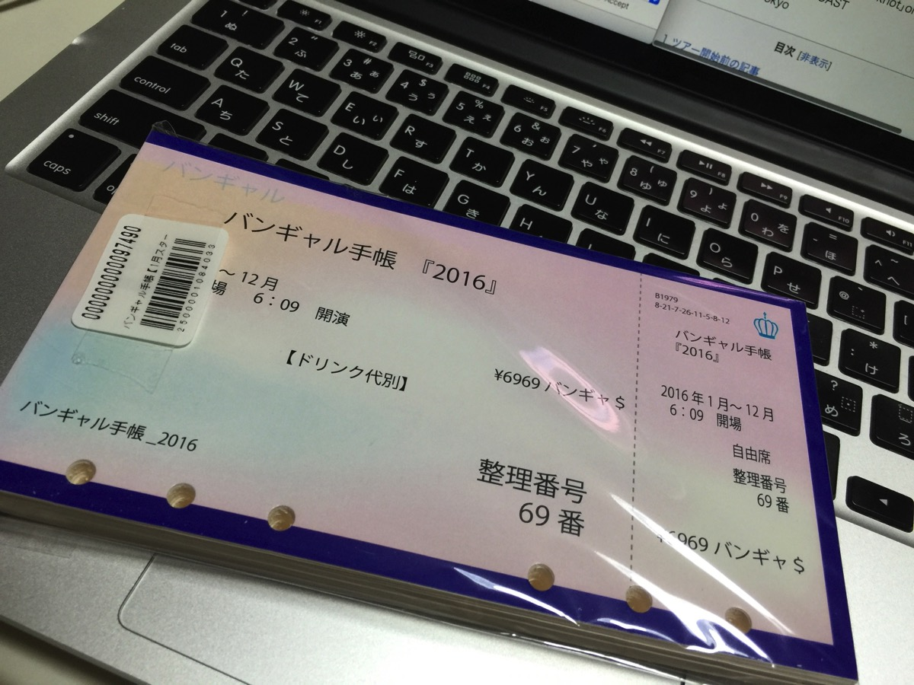

---
categories:
- DIR EN GREYのLIVEレポ
date: Sat, 06 Feb 2016 20:06:45 +0000
slug: post-8891
tags:
- DIR EN GREY
- LIVEレポ
title: 【ライブレポ】DIR EN GREY ARCHE 2016_2_6@日本武道館
---

1日目のLIVEレポは<a href="https://www.warawareotoko.com/2016/02/06/post-8872/">こちら</a>
→<a href="https://www.warawareotoko.com/2016/02/06/post-8872/">【LIVEレポ】DIR EN GREY ARCHE@日本武道館 2/5 #direngrey #arche</a>

ARCHEの世界観、今までの流れを汲んだ完成披露という印象でした。
新しいものはなく、今までのツアーで見てきた風景でした。だからでしょうか、なんとなく武道館なのに狭く感じました。新木場やチッタみたいな。

それと、今までのツアーの全部の衣裳を京が来ていたこともそれを裏付けているような気がします。<!--more--><h2>演出とメンバー衣裳</h2>

昨日とは打って変わってという感じです。

セットは変わりなかったけど、同じ曲でもほぼ全ての映像が昨日と違うものになっていました。

空谷の跫音では、<a href="https://www.warawareotoko.com/2015/01/04/post-6868/">例の綺麗な映像</a>とは違ったものが流れていました。

それとメンバー衣裳も昨日と異なり、京はTATTOO TRIBALの時の軍服姿で登場

日の丸の下、旧日本軍の軍服に刀という姿はなかなかでした。

それと１曲目のand zeroでは下手にふっと現れた薫がギターを引き出し、次に上手に当てられたスポットライトの下にDieが上手から現れるという鳥肌がたつくらいかっこよかった。

それと禍夜想で京が間奏からの入りを間違えてた。直前に軍服を脱いだ時に帽子も取れちゃってそれに気を取られてたのかな？

<h2>セトリ</h2>

and Zero
空谷の跫音
Behind a vacant image
Sustain the untruth
鱗
懐春
Phenomenon
てふてふ
輪郭
禍夜想
咀嚼
Midwife
Cause of fickleness
Chain repulsion
Revelation of mankind
The inferno

濤声
THE FINAL
obscure
mamaradechansaw
激しさとこの胸の中で絡みついた灼熱の闇
Undeux

<h2>感想</h2>

昨日と同じでアレに持っていかれました。。。

歌詩を画面に出しちゃうやつ。しかも今日は2曲も。。。

もう本気で帰ろうかと思うくらい、そして上がるか？ってよぎるくらい
ま、でも冷静に考えれば昨日ほどのドン引きはなく、はぁまたっすかってくらいで。どう考えてもimovieで素人が編集したであろう明朝体fontは、やっぱりどう考えてももう2度としてほしくない演出でした。

と、まあFINAL終わりで自分の顔ぶん殴って気合入れ直しました。ま、次の曲でも同じ演出でしたけどね（白目
なので、頭振りまくった後に顔殴ってるので更新なかったらぼくはもう死んだものと思ってください

まーいーや、その話は。

昨日までがARCHEの完成披露だとすると今日は集大成って感じかなと思いました。でもDUM SPIRO SPEROで感じた頂点にも近い感覚ではなく、あくまで通過点という感じでまだまだ先があるんだろ？という期待感を持たずにはいられないLIVEでした。

最後に京から

<blockquote>今日ここから始まる俺たちとお前らの未来に向けて</blockquote>

でun duexは今までにないくらいの清涼感でした。

終わった後は京がToshiyaとハイタッチしたり

<h2>今後の予定</h2>

で予想はしていましたが今後の予定が発表されました。

6月　ARCHE AT NIPPON BUDOUKAN Live Blu-ray&DVD発売
7月　新曲発売

TOUR16-17 FROM DEPRESSION TO ___　決定
ちなみにこのツアーは数回に分かれている模様
第1弾　 6月　mode of VULGAR
第2弾　 9月　mode of DUM SPIRO SPERO
第3弾　11月　mode of 鬼葬

<h2>しんぺーはこう思った。</h2>

２日間お疲れ様でした。

そして長きに渡るARCHEの幕が一旦おりました。

次の未来はもう動きだしています。

未来へと言いつつ、過去アルバムのツアー再来、、いや多分これ再構築

きっとその答えが新曲でかいま見えるのではないかなと思っています。

いやーそれにしても。。。。恐ろしい。。。何がって、、、、5月、8月10月12月は空いてるんですよ。。。DIR EN GREYの予定がよーーー！！！

ということは、、、

↓月をじゃっかん間違えてるw
<blockquote class="twitter-tweet" data-lang="ja">
虜「5月6月10月12月はチャージタイムかなぁ」  suke「と思うじゃん？残念ツアーやるよー！」 TTT「夏フェス出るかも」 dirt「新作をご用意しておりまして」 deca「新曲またハイレゾです！」 やも「今年はかけもちで10バンドやります」  【これが俺たちの未来】
&mdash; しんぺー@ARCHE2/5,2/6 (@s_s_p_y) <a href="https://twitter.com/s_s_p_y/status/695940209364459520">2016, 2月 6</a></blockquote>

そして、さらに一つ思い出したことがあります。

<blockquote class="twitter-tweet" data-lang="ja">
その日人類(虜)は思い出した。  GAUZEツアーのメンバー監修シリーズグッズのことを  コンプリートにいくらかかるのか  そして今年はそれが三連発  ...and more
&mdash; しんぺー@ARCHE2/5,2/6 (@s_s_p_y) <a href="https://twitter.com/s_s_p_y/status/695954330537455617">2016, 2月 6</a></blockquote>

一応GAUZEツアーのまとめを参考までにどうぞ
参考：<a href="https://www.warawareotoko.com/2014/08/09/post-6061/">DIR EN GREY 「TOUR 2014 PSYCHONECT -mode of GAUZE-」まとめ</a>

いやーでも、今年も予定がたくさんだー！チケット入金日とか忘れない様にせねばー！！

そうだ！これを使おう！

と言ったところで本日は以上になります。  おやすみなさい。