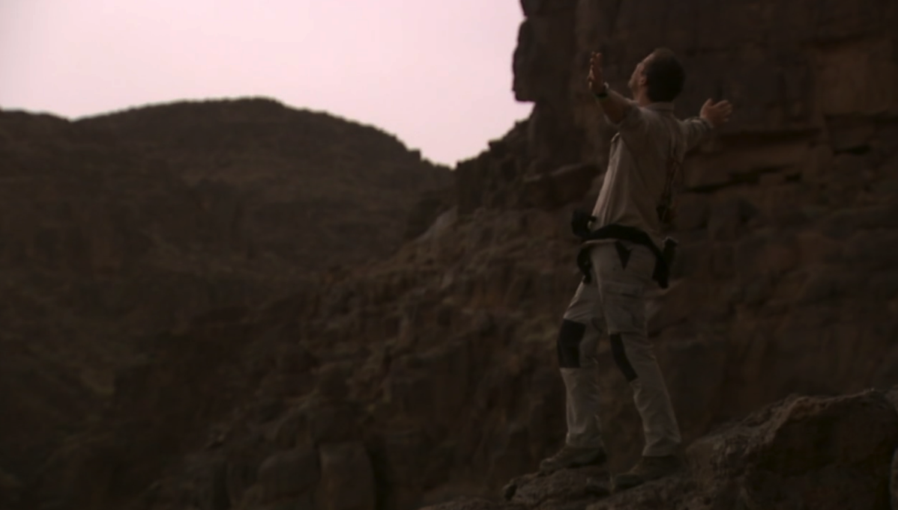

---
categories:
- コンテンツ
date: Sun, 14 Feb 2016 01:47:58 +0000
slug: post-8924
tags:
- ベアグリルス
title: ベア・グリルスとは？MAN vs WILD（サバイバルゲーム）は動画配信サイトで見られるの？
---

ベア・グリルスという冒険家をご存知でしょうか？ケーブルテレビでディスカバリーチャンネルなんかを見ている方ならご存知でしょう。彼は、ジャングルや砂漠などの極限状態の自然環境にナイフ一つを持ってパラシュートで降り立ち、そこからの脱出を描くドキュメンタリーチックな「MAN vs WILD（サバイバルゲーム）」という番組に出演しています。

この番組が面白いんです。男心をくすぐるというか、冒険心を駆り立てるような内容になっていて、アメリカでは彼の真似をして雪山に分入って遭難して死ぬ人がいたりします。ということで、本日はそんなベア・グリルスとサバイバルゲームという番組の魅力をご紹介したいと思います。

冒険家ベアグリルスが遭難したという想定でナイフとマッチを持って、ジャングルや砂漠などの自然の中にパラシュートでおり、そこから人のいるところまで生き延びる方法を伝授する番組です。これがなんと！！！！<a href="http://ck.jp.ap.valuecommerce.com/servlet/referral?sid=3041033&amp;pid=883308938" target="_blank" rel="noopener">Hulu</a>で配信開始！！！！リクエストしてたのでとても嬉しいです！！！ということで本日はサバイバルゲームの魅力をご紹介！！<!--more-->
<h2>サバイバルゲームとは？</h2>

サバイバルゲームとは、ディスカバリーチャンネルで放送している番組です。冒険家であり、作家であるベア・グリルスが飛行機事故や登山中の事故で遭難したという想定で、そこから生き延びる方法を紹介するサバイバルドキュメンタリー番組です。本国では「MAN vs. WILD」という名前で放送されている大人気番組です。
<h2>ベア・グリルスとは？</h2>

ナビゲーターのベア・グリルスは元軍人。イギリスの特殊部隊に所属
し名誉階級として中佐を授与されているようです。その経験を活かし、現在では作家・冒険家として活躍中。収録中に何度も大きな事故にあっており、そのたびの復活をしている男の中の男。
<h2>サバイバルゲームの魅力とは？</h2>
サバイバルゲームの魅力は、ベア・グリルスの屈強さにあります。100%真似できないであろうことを、遭難してどうしてもやばかったらこうしてください的なノリでレクチャーしていきます。<strong>（遭難したら本当はその場から動いちゃダメ）</strong>

その一つが<strong>食事</strong>です。

自然界の中にいるんだから、うさぎとかネズミとか何か食べられそうな動物を捕まえて焼いて食べると思うじゃん？

でも彼は男の中の男、大抵はそのあたりにいる<strong>虫を捕まえてそのまま食べます。</strong>蜘蛛だろうがカブトムシの幼虫だろうが、「貴重なタンパク源です。」と前置きしてムシャムシャ食べます。

いいわけはいつも決まってタンパク質

で次に水分補給ですが。これまたワイルド。んなもんは、自分のおしっこか象の糞しぼって飲むに決まってるんだろ！！汚い水は口から飲むと下痢になって、余計水分を失うからって肛門から注入することはないでしょう！

氷河の中、服が濡れないようにって雪解け水の中を裸で泳ぐことはないでしょう！

とまぁそんな感じで常人には絶対真似できないことを平然とやってのける！そこに痺れる！憧れる！それがサバイバルゲームの魅力です。
<h2>どの動画配信サイトで見られるのか</h2>
そんなサバイバルゲームですが、国内で見るにはスカパーなどでディスカバリーチャンネルに契約する以外で見る方法ですが以前は、楽天TVやhuluで見ることができました。しかし、今はもう配信終了しているみたいです。

で、色々と探しましたが、ありました。見る方法。

Youtube上に違法アップロードされているものもありますが、ちゃんと見るのであればAbemaTVがおすすめです。

一部無料で視聴ができます。全部見るにはプレミアムプランの加入が必要ですが、1ヶ月間無料です。

他にも興味深い番組が視聴できるので、ケーブルテレビ入るよりかは断然よいかと思います。

リンク：<a href="https://abema.tv/video/title/205-41">Abema TV <i class="fa fa-link">icon-link</i> </a>
<h2>しんぺはこう思った。</h2>
&nbsp;

&nbsp;

年末年始の休みとかにAbemaTVで見るのもいいかもしれません。

&nbsp;

といったところで本日は以上になります。
おやすみなさい。