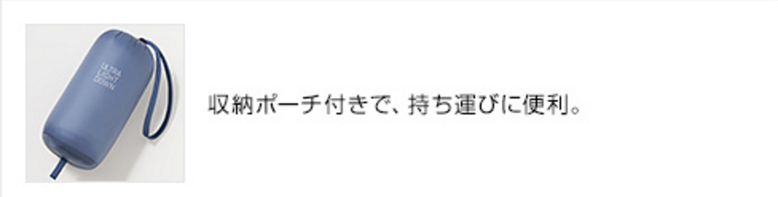
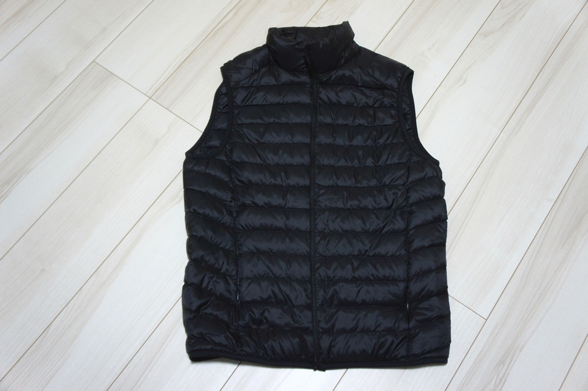
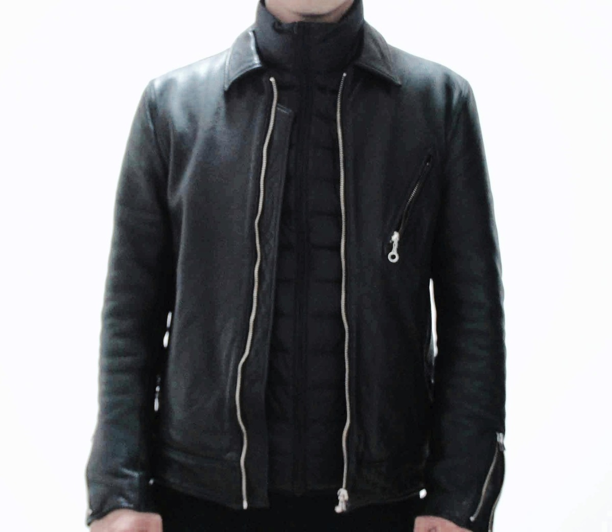
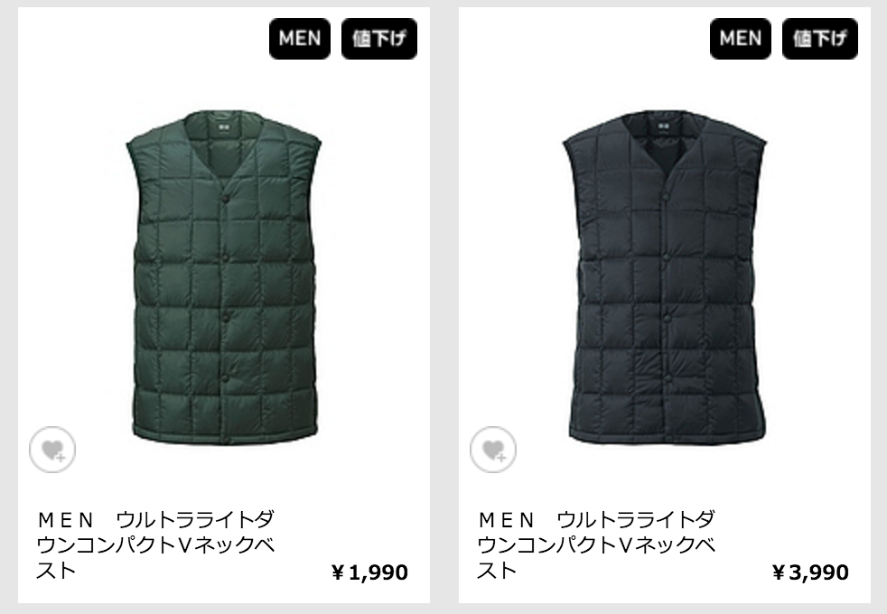
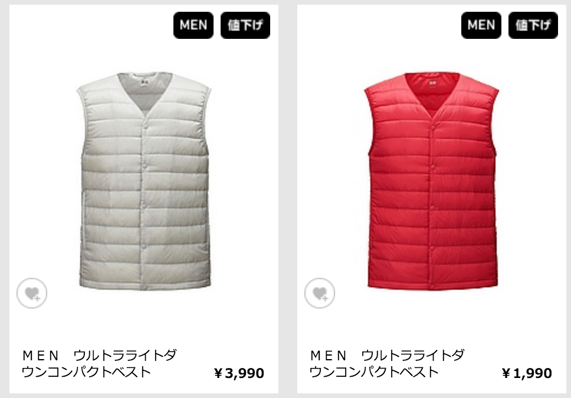
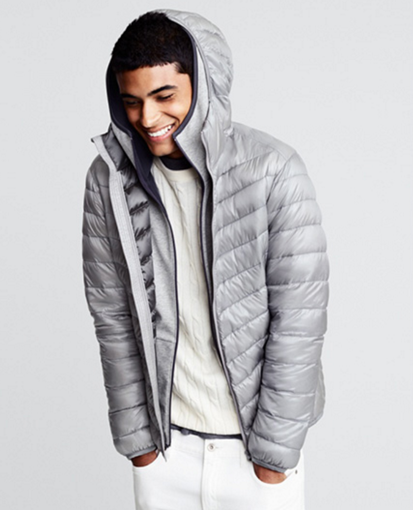
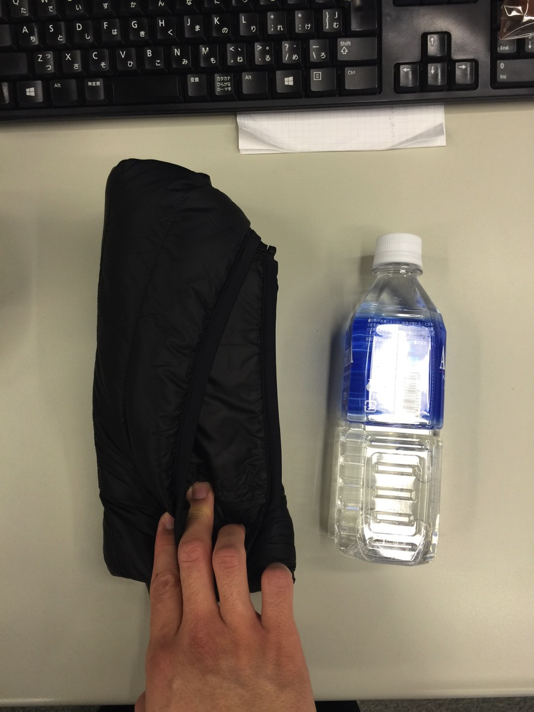

---
categories:
- レビュー
date: Tue, 16 Feb 2016 17:20:51 +0000
slug: post-8937
tags:
- LIVEお役立ち
title: 真冬のLIVEにはユニクロのウルトラライトダウンが最適！たためばポケットに入るし普段使いもできるぞ！
---

いやー寒い！寒いけどスタンディングのLIVEではチケットと最低限の持ち物以外はクロークやロッカーに預けて、バンドTシャツ一枚になるのがバンギャの宿命。どんなに寒かろうとそれは変えられない理（ことわり）
もし、陰獣の梟の「ファイファンクロス」やドラえもんの四次元ポケットがあったなら・・・そう思っている人も多いハズ。でもこのコートはたためばポケットに入れることもできるのです！ということで本日はユニクロのウルトラダウンをご紹介<!--more-->
<h2>ユニクロのウルトラライトダウンとは</h2>
ユニクロが出してるめちゃくちゃ軽いダウンジャケットです。

<iframe src="https://www.youtube.com/embed/e0SzgsoEh54?rel=0" width="560" height="315" frameborder="0" allowfullscreen="allowfullscreen"></iframe>

モバイルウェアというコンセプトで、こんな感じで<strong>とにかく小さくして持ち運びしやすいように設計されています。</strong>
カバンの中に入れておいて、寒いなって思ったらすぐに取り出して着られるというすんぽーです。

広げるとこんな感じ。ぼくは革ジャンの中に着たいと思ったので袖なしのものにしました。

そう、このダウンはなんとジャケットの下にインナー感覚で着ることができるので、<strong>普段使いもOKです。</strong>ぼくは毎日これ着てその上にコート着て会社行ってます。

襟なしバージョンもあります。（三国志の藤甲兵みたいだ・・・）

普通のパーカーもあります。

<h2>どれくらい小さくなるのか</h2>
で、冒頭に付属の袋に入れた形をお見せしましたが、どれくらいの大きさかというと500mlのペットボトルと同じくらいです。

こいつをお尻のポケットに突っ込みます。女の子で、ショートパンツとかだとちょっときついかもしれませんが、突っ込めないこともないと思います。最悪、たたんでパンツに挟んでください←

ちなみに圧縮袋などに入れて丁寧に空気を抜けばもっと小さくなるかも！

LIVEだけじゃなくても、イベントとか中に入ったら暑いけど外はクッソ寒いという場合などに本当におすすめです。（ユニクロの回し者ではない！）

→通販でもまだ買えるみたいです。（<a href="http://www.uniqlo.com/jp/store/feature/uq/ultralightdown/men/">http://www.uniqlo.com/jp/store/feature/uq/ultralightdown/men/</a>）
<h2>しんぺーはこう思った。</h2>
とにかく、軽いし温かいし、小さくなる、これは真冬のLIVEに本当にぴったりです！！！

と言ったところで本日は以上になります。

おやすみなさい。