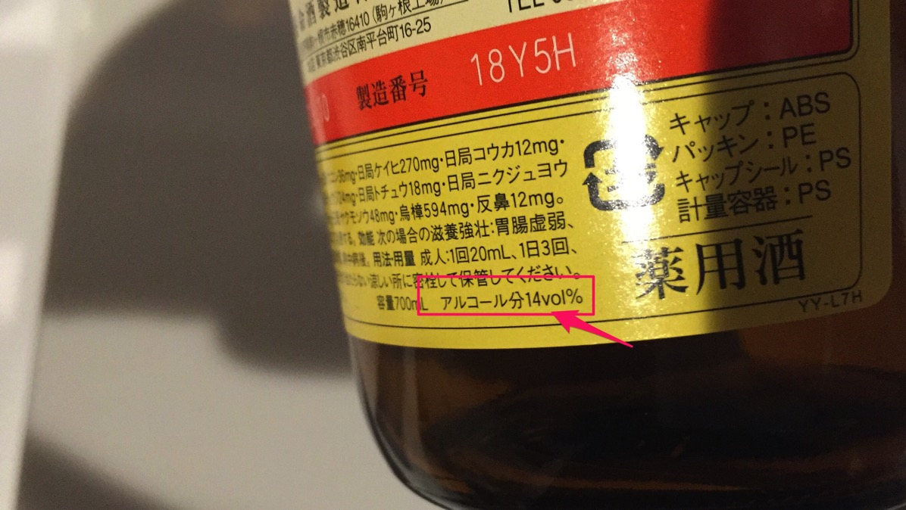
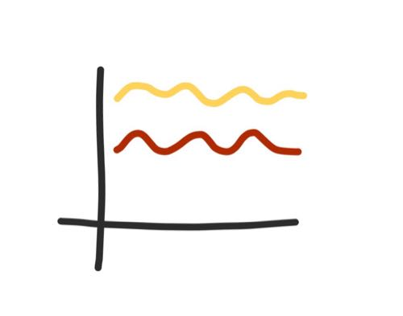
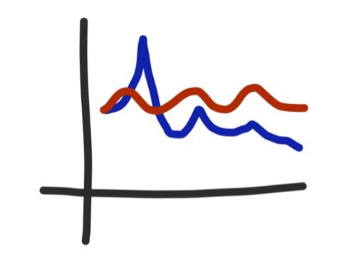

---
categories:
- グルメ
date: Wed, 24 Feb 2016 00:47:51 +0000
slug: post-8951
tags:
- おすすめ
title: 養命酒を2ヶ月程飲み続けた結果わかったこと→これはコスパ最強のエナジードリンク
---

ここ2ヶ月ほど睡眠時間がかなりすくなく、しかも冬ということもあり、体調的に心配だったので養命酒を飲むことにしました。本日は2ヶ月間養命酒を飲んでみた感想です。<!--more-->
<h2>養命酒とは</h2>
知ってる人は多いと思いますが、飲んだことがある人は少ないんじゃないでしょうか。養命酒株式会社が販売する滋養強壮を目的としたお酒です。勘違いしないでいただきたいのは、これアルコールが入ったれっきとしたお酒なんです。

<h2>味と効能について</h2>
色は透明な黄色で、匂いは甘ったるい薬っぽい感じです。味はというと、昔飲んだ子ども用の風邪薬みたいな甘さだす。苦味はありません。

効能についてですが、サイトなどによると次の効能が期待できるみたいです。
<ol>
 	<li>冷え性</li>
 	<li>胃腸虚弱</li>
 	<li>血色不良</li>
 	<li>虚弱体質</li>
 	<li>肉体疲労</li>
 	<li>食欲不振</li>
 	<li>病中病後</li>
</ol>
<h2>養命酒を2ヶ月間飲んでみた結果わかったコスパのよさ</h2>
なんだか元気な気がする•••という感じです。確証は一切ありませんが、なんとなく息切れしないで1日過ごせているような気がします。

飲むことで元気がでるというよりも、元気度が底上げされた感覚です。グラフで説明します。

赤い方が普段の元気で、黄色い方が養命酒開始後の元気です。

養命酒を飲む前はコーヒーやエナジードリンクなどのカフェイン飲料で誤魔化していました。その時の元気度はこんな感じ

青いグラフがカフェイン飲料を摂取したときの元気です。

しかも飲むたびに効力が薄まっていく上にいっぱいいっぱいが高い！！

しかしながら、養命酒は1本1500円程度。それで朝晩飲んでも1ヶ月半から2ヶ月程度もちます。1日数十円です。アルコールなので勤務中や運転前は飲めませんが、上に挙げた通り元気が底上げされますのでコストパフォーマンスは最高です。

ということで養命酒はコストパフォーマンス最高です。
[itemlink post_id="13655"]

<h2>しんぺーはこう思った。</h2>
1日数ミリリットルなのでアルコールに弱い人でも大丈夫かなと思います。寝る前に一口飲んで寝ればいいのではないでしょうか。

次の日スッキリ起きられるかどうかはよくわかりませんでしたが、多分疲れにくくなった感じがしなくもないかなぁと思います(笑)明確に効果が実感できるようなものではない気がします。

それでもなんとなく効いてる感じがしたので、騙されたと思った試してみてください。ぼくも1本空けたので、早々に2本目を買いに行きたいと思います。

といったところで本日は以上になります。

おやすみなさい。