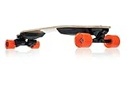

---
categories:
- youtube
date: Sun, 28 Feb 2016 10:36:56 +0000
slug: post-8968
tags:
- youtube
title: アメリカのyoutubeクリエーターCasey Neistatが国内ユーチューバーとは比べものにならないくらいかっこいい
---

ぼくが好きな人を紹介する記事です。

Casey Neistatをご存知でしょうか？アメリカのYoutubeクリエーターです。

去年から見るようになったんですが、今では毎日欠かさず見ていて習慣化しています。とにかく映像がおしゃれでかっこよくて、しかもその映像がコンパクトに数分に収められているので、とても見やすいコンテンツです。ということで本日はこのCasey Neistatをおすすめする記事でございます。<!--more-->
<h2>Casey Neistatとは？</h2>

ケイシーナイスタットと読みます。ネイスタットではありません。

Google検索するとネイスタットと出てきますが、動画中でネイスタットと呼ばれてナイスタットですと訂正しております。

生年月日：1981年3月25日（現在34歳）
見た目老けすぎで、どう考えても40代くらいにみえます。

奥さんのキャンディスと1歳の娘のフランシスと3人で暮らしています。また16歳の時に生まれた息子が離れてくらしているみたいです。この子の母親に関してはぼくが見ている分では出てきていません。

Caseyの職業は映像監督でbeme（ビーム）というアプリを運営する会社の共同創始者です。なお、bemeは動画共有アプリのようです。ログインに電話番号が必要みたいで日本の電話番号には対応していないっぽいです。

最近話題になった動画はこの二つ

ニューヨークが大雪の時に街中をスノーボードで走る動画。これは世界中でテレビニュースなどにも取り上げられたみたいです。
<iframe src="https://www.youtube.com/embed/qRv7G7WpOoU?rel=0" width="560" height="315" frameborder="0" allowfullscreen="allowfullscreen"></iframe>

ハロウィン時期に友達のユーチューバーと共同で作ったアラジン動画です。ブーステッドボードに布を付けてアラジンの空飛ぶ絨毯風に見せてるやつです。
<iframe src="https://www.youtube.com/embed/lqlrru1V69E?rel=0" width="560" height="315" frameborder="0" allowfullscreen="allowfullscreen"></iframe>
<h3>Casey Neistatの動画の魅力</h3>
<iframe src="https://www.youtube.com/embed/_FE_AcJbJGQ?rel=0" width="560" height="315" frameborder="0" allowfullscreen="allowfullscreen"></iframe>

<strong>・おしゃれで見ていてかっこいい</strong>
→彼は移動にブーステッドボードスケートボードと呼ばれる時速35kmで走れるモーター付きのスケボーに乗っています。こいつでニューヨークの街を走りまくって映像をとっています。

ブーステッドボードはこんな感じ↓
<iframe src="https://www.youtube.com/embed/mOlAJNzfYG0?list=PLgJM114ctNEd0eB-wtz9q2YdEOuWad2KP" width="560" height="315" frameborder="0" allowfullscreen="allowfullscreen"></iframe>

ちなみに日本のAmazonでも売っているみたいです。
<table style="border: none;" border="0" cellpadding="5">
<tbody>
<tr>
<td style="border: none;" valign="top"></td>
<td style="border: none; text-align: left;" valign="top">

Boosted

<table style="border: none; margin-top: 10px;">
<tbody>
<tr>
<td style="border: none; text-align: left;">

<a href="http://www.amazon.co.jp/gp/search?keywords=boosted%20boards&amp;__mk_ja_JP=%83J%83%5E%83J%83i&amp;tag=warawareotoko-22" target="_blank" rel="noopener">Amazonで購入</a>

<a href="http://hb.afl.rakuten.co.jp/hgc/0f6e221b.2eb9748a.0f6e221c.35cc1e84/?pc=http%3A%2F%2Fsearch.rakuten.co.jp%2Fsearch%2Fmall%2Fboosted%2520boards%2F-%2Ff.1-p.1-s.1-sf.0-st.A-v.2%3Fx%3D0%26scid%3Daf_ich_link_urltxt%26m%3Dhttp%3A%2F%2Fm.rakuten.co.jp%2F" target="_blank" rel="noopener">楽天市場で購入</a>

<a href="http://ck.jp.ap.valuecommerce.com/servlet/referral?sid=3041033&amp;pid=882528283&amp;vc_url=http%3A%2F%2Fsearch.shopping.yahoo.co.jp%2Fsearch%3Fp%3Dboosted%2520boards" target="_blank" rel="noopener">Yahooショッピングで購入</a>

<a href="http://ck.jp.ap.valuecommerce.com/servlet/referral?sid=3041033&amp;pid=882660047&amp;vc_url=http%3A%2F%2Fauctions.search.yahoo.co.jp%2Fsearch%3Fvo%3D%26ve%3D%26auccat%3D0%26aucminprice%3D%26aucmaxprice%3D%26aucmin_bidorbuy_price%3D%26aucmax_bidorbuy_price%3D%26loc_cd%3D0%26abatch%3D0%26istatus%3D0%26filtered%3D1%26ei%3DUTF-8%26tab_ex%3Dcommerce%26va%3Dboosted%2520boards" target="_blank" rel="noopener">ヤフオク!で購入</a>
</td>
<td style="vertical-align: bottom; padding-left: 10px; font-size: x-small; border: none;">by <a href="http://kaereba.com" target="_blank" rel="nofollow noopener">カエレバ</a></td>
</tr>
</tbody>
</table>
&nbsp;</td>
</tr>
</tbody>
</table>
<strong>・アメリカの文化に触れられる</strong>
→まぁ日本に住んでるからそう見てるのかもしれませんが、ニューヨークの街並みは見ているだけでクールです。そんな風景や街並みをタイムラプスに収めてビデオのオープニングに使っています。

<strong>・日本のユーチューバーとは全く違う</strong>
→彼の映像は商品紹介しているわけでも、悪ふざけのネタ動画でもなければ、人をディスるわけでもありません。家から職場、そして1日に起こる日常を切り取っているだけです。でもそれがめちゃくちゃかっこいい。日本にはライフスタイルをコンテンツにしているユーチューバーはいません。まあ、ニューヨークだからかっこいいってのがあるかもしれませんが。。。

<strong>・クリエイティビティがやばい</strong>
→彼の動画加工はグラフィックを使ったり合成したりというものではありません。そのかわりペーパークラフトや手書きの文字を使って映像を作ります。

<iframe src="https://www.youtube.com/embed/L13644A5z2w?rel=0" width="560" height="315" frameborder="0" allowfullscreen="allowfullscreen"></iframe>
<h2>こんな人におすすめ</h2>
<ol>
 	<li>日本のユーチューバーの商品紹介に飽き飽きしてる</li>
 	<li>ニューヨークとかアメリカの街並みやカルチャーを見てみたい</li>
 	<li>寝る前のちょっとした時間に見られる動画を探している</li>
</ol>
<h2>しんぺーはこう思った</h2>
ぼくが、彼の動画を最初に見たのはApple Watchの動画です。

一番安いApple Watchであるスポーツタイプ（5万円くらい）を買ってきて、それをゴールドのスプレーでApple Watch Edition（150万円くらい）に見えるように加工するってやつです。

<iframe src="https://www.youtube.com/embed/MMF9I_9DAcs?list=PLTHOlLMWEwVwjF20TugWSajmCOPthUs8c" width="560" height="315" frameborder="0" allowfullscreen="allowfullscreen"></iframe>

そこからは、もう毎日見てます。彼は毎日動画をあげているので、もう習慣化してて見られない日はなんだか気持ち悪いです。

ここ最近でドローンによる空撮も多く取り入れていますので、彼のクリエイティビティからこれからも目が離せません！

<a href="https://www.youtube.com/user/caseyneistat">Youtube　Casey Neistat </a>

と言ったところで本日は以上になります。

おやすみなさい。