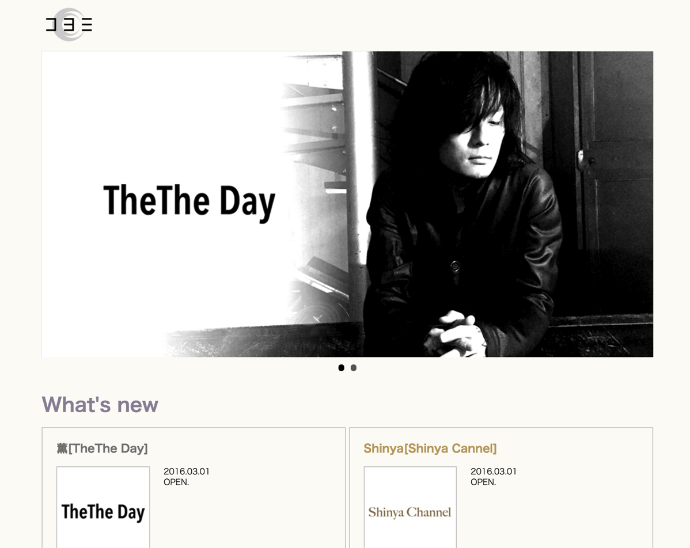

---
categories:
- DIR EN GREY
- 各メンバーの個人イベントレポなど
date: Wed, 02 Mar 2016 07:30:31 +0000
slug: post-8977
tags:
- DIR EN GREY
title: DIR EN GREYの薫とShinyaのブロマガの値段の妥当性とコヨミの今後
---

本日は突然メールがやってきました。DIR EN GREYの薫とShinyaにようrブログがスタートします。800円で。。。いやいやいやいやたけーわwwww高すぎる。ちょっとぼりすぎじゃね？って思ってたんですけど、ある考えが思い浮かびました。本日はブロマガの値付けの妥当性とコヨミの今後についての考察です。

<blockquote class="twitter-tweet" data-lang="ja">
たけーーーーわ！！！！
&mdash; しんぺー@漆黒の儀 (@s_s_p_y) <a href="https://twitter.com/s_s_p_y/status/704608192781643776">2016年3月1日</a></blockquote>

<!--more--><h2>我々の年間DIR EN GREY支出額</h2>

もちろんチケットとかグッズとかDVDとかは抜きにして定額で支払ってる金額についてです。

今まではファンクラブであるa knotの年会費5,000円とスマホ有料サイトであるDIR EN GREY online、kyo online、Die mobileに対してそれぞれ月額300円、年間<strong>合計で15,800円</strong>でした。

そこに対してブロマガの2つが加わるとこんな感じです。心臓に悪いんで消費税抜きにしてあります。消費税入れると2000円ばかし上がりますからね。知ってますか？昔は消費税って3%でしかももっと前はなかったんだからな。はい。

<table border="1" cellspacing="0" cellpadding="2"><tbody><tr><td></td><td>月間</td><td>年間</td></tr><tr><td>a knot</td><td>417円</td><td>5,000円</td></tr><tr><td>DIRENGREYonline</td><td>300円</td><td>3,600円</td></tr><tr><td>kyo online</td><td>300円</td><td>3,600円</td></tr><tr><td>Die mobile</td><td>300円</td><td>3,600円</td></tr><tr><td>TheTheDay</td><td>800円</td><td>9,600円</td></tr><tr><td>Shinya Channel</td><td>800円</td><td>9,600円</td></tr><tr><td>合計</td><td>2,917円</td><td>35,000円</td></tr></tbody></table>

そうです。<strong>倍になっていますね</strong>。

<blockquote class="twitter-tweet" data-lang="ja">
たけーー！！！！！
&mdash; しんぺー@漆黒の儀 (@s_s_p_y) <a href="https://twitter.com/s_s_p_y/status/704607949319090176">2016年3月1日</a></blockquote>

<h2>そもそもコヨミとは？ブロマガの月額の妥当性について</h2>

リンク先: <a href="http://www.co-yomi.com/" target="_blank" rel="noopener noreferrer">コヨミ</a>

これ、おそらくですけどfreewill開発のCMSですわ。CMSとはコンテンツマネージメントシステムといいまして、簡単にいうと複数の人でサイト運営をするための管理ツールみたいな感じです。つまりアメブロのブログの管理画面みたいな感じですよ。

これすなわち、freewill所属のアーティストが今後このプラットフォームを使ってブロマガを開始することを示唆しています。おそらくメリーもこちらを使い出すと思いますよ。とくに個人的にはベースのテツ氏の個人ブログがスタートするんじゃないかと思っています。

コヨミについてですがソースいろいろみたんですけどよくわかんないですね。上でfreewill独自開発とか言っちゃいましたが、どっかの会社が提供しているサービスなのかも知れません。その辺不明です。

独自開発したのなら多分ですけど数百万〜1000万円くらいはかかったんじゃないでしょうか。

現状のスマホの有料サイトで利用しているキャリア決済はキャリアに何割か手数料をとられます。しかも導入費用は結構高いと聞いたことがあります。

さらにユーザー面ですがau、docomo、softbank以外では利用ができません。そこで独自の課金プラットフォームを構築することで収益性をあげ、かつより多くの人に登録してもらうためにコヨミを開発したのではないかとぼくは考えています。

けっこうfreewillはシステム投資を惜しまない会社という印象です。LINE公式アカウントのサービスがスタートして間もない頃にDIR EN GREYのアカウントを開設しましたよね。あれって数千万単位でお金が発生してるはずなので。。でも、結構先見の明があるんじゃないかと思います。

ということで事業者目線ではきっと半分くらいはシステム開発費用の回収のためって感じですか？多分サービススタートしてからいきなり黒字ってことはなさそうなので、積み上げで費用回収しつつとりあえずはブレークスルーポイントを目指すって感じでしょうかね。

あと蛇足な予測ですが

メリーや事務所のバンドがコヨミに参入してきた場合会費はもっと安くなるんじゃないかと思います。ファンの年齢層とそれに伴う年収を考えるなら500円くらいが妥当でしょうか。多分ですけどねー

なので、この金額は妥当だと判断します！ぼったくりではないです。

家電でもなんでも新製品最初のほうは高いでしょ？あとから安くなるじゃないですか。あれってつまり初期費用を回収したあとに安く値引きして売ってるんですわ。

だから初っ端の2人は高いんです！しょーがないんです！

<h2>現状から考えらえること</h2>

おそらくですが

kyo online、Die Mobile、DIR EN GREY onlineがブロマガへと移行します。そしてToshiyaもブロマガを開始するはずです。もちろん全員月額800円で

そうなると年間我々はいくら払わないといけないのか・・・

a knotを入れないと月額では4,800円

a knotを入れて年間62,600円です。

<blockquote class="twitter-tweet" data-lang="ja">
高いです
&mdash; しんぺー@漆黒の儀 (@s_s_p_y) <a href="https://twitter.com/s_s_p_y/status/704608561448357889">2016年3月1日</a></blockquote>

さて、ここまでくるとちょっとキツイ感じがしてきます。でもどうにか費用を捻出して読みたいわけなんですが、じゃあ、自分が今ほかのことで贅沢してる部分を削ってこっちにあてたいなーと考えた時に気がつきました。

一番無駄に支払ってるのって携帯代なんじゃね？って

<h2>全人類の固定費であるスマホ代を安くして会費に充当したい</h2>

今多くの人はキャリアに縛られてスマホの支払いをしていると思います。特に一括払いをしていないぼくのような人は月に7,000円以上支払ってるんじゃないですか？ぼくも最低1万円程度は支払っています。

※iPhone6 plus最高スペックということもあるけど

しかし、ここで既存キャリアではないMVNOを使った場合はどうでしょうか。

その場合、月額のスマホの費用がぐっと下がるんですね。

MVNOにして月々の携帯料金を安くして、その分を課金額に充当すればいいのです。

ということでみんな次の機種変では格安simにしよう！ぼくもします！

マイネオとか

<a href="http://ck.jp.ap.valuecommerce.com/servlet/referral?sid=3041033&pid=884008922" target="_blank" rel="noopener noreferrer">au端末もドコモ端末もそのまま使える！【mineo（マイネオ）】</a>

<h2>しんぺーはこう思った。</h2>

だから別に高くないよ！って記事にしようとしたんだけど。ごめんやっぱ高いわ！とりあえず捻出する方法として思いつくのは今の所MVNOくらいです！

<blockquote class="twitter-tweet" data-lang="ja">
高いですよ
&mdash; しんぺー@漆黒の儀 (@s_s_p_y) <a href="https://twitter.com/s_s_p_y/status/704608594780499968">2016年3月1日</a></blockquote>

と言ったところで本日は以上になります。おやすみなさい。