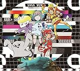

---
categories:
- ブログ
date: Thu, 10 Mar 2016 16:24:31 +0000
slug: post-8991
tags:
- ブログ
title: CDがオマケかどうかを決めるのは作り手。
---

NoGod団長のInstagramでの投稿を見て、そこから派生して感じたことを本日は書きます。はじめに書いておきますが、団長の投稿とはあんまり関係なくて散発な内容で結論は特にないです。ハヤカワ五味さんの魅力をお伝えしたかっただけかもしれません。それでは行ってみましょう。

<!--more-->
<blockquote class="instagram-media" data-instgrm-captioned data-instgrm-version="6" style=" background:#FFF; border:0; border-radius:3px; box-shadow:0 0 1px 0 rgba(0,0,0,0.5),0 1px 10px 0 rgba(0,0,0,0.15); margin: 1px; max-width:658px; padding:0; width:99.375%; width:-webkit-calc(100% - 2px); width:calc(100% - 2px);">
 
 

 
 画像の真偽はおいといて、非常に難しい問題だ…！ 俺はこうみえて音楽は真剣にやっているつもり。 でも俺はアイドルの握手会に行くときも真剣なんだ…！ でもおれは、音楽が好きでもない人のCDは買わないし、そもそもファンにならん。 結局、そのアーティストが音楽やライブ、その人の存在込みで好きじゃなかったら握手会には行かないと思う。 そりゃ握手したいために１枚持ってりゃ充分のCDを何枚も買ってる人も沢山居るでしょう。 それは単純に愛なんじゃないかと思う。 愛がなかったら金なんか払わない。 ただ、沢山買った同じCDを捨てないで、まだ聴いたことない人とかにあげてくれれば、またいつかそこに何か生まれるかもしれない。 うーん、何が言いたいかわからなくなってしまったが、 NoGoDのニューアルバムが3/30に出るので、 インストアイベントとかもやるから、 良かったらCD買ってねって事で(＾ω＾)(笑)
 
NoGoD 団長さん(@dancho_nogod)が投稿した写真 - <time style=" font-family:Arial,sans-serif; font-size:14px; line-height:17px;" datetime="2016-03-08T07:10:08+00:00">2016 3月 7 11:10午後 PST</time>

</blockquote>

	

<h2>オマケなしで作品を購入するパターン</h2>

ぼくは、でんぱ組というアイドルが一昨年の年末あたりからずっと好きなんですが、楽曲から入って好きになりました。W.W.Dって曲の歌詞を聴いて、いたく感銘を受け、いっきに好きになりました。

それまで自らの生い立ちに根ざしたアイドルってぼくの目に止まった中ではいなかったので、とても新鮮でした。

つまり、自分たちがオタクであり秋葉原をバックボーンにしており、さらにそれぞれいじめられっ子、引きこもり、サブカル女、アニオタ、生主等々。自分のコンテキストを全面に押し出しているアイドルです。

調べていくうちにどんどん引き込まれました。握手会とかLIVEにはまだ行ったことないけど、曲が好きなのでiTunesで購入したりしてます。

オマケなしでも楽曲を購入するパターンです。

来月アルバムでるー

<table  border="0" cellpadding="5" style="border:none"><tr><td valign="top" style="border:none"></td><td valign="top" style="border:none;text-align:left">
でんぱ組.inc トイズファクトリー 2016-04-27

売り上げランキング : 25
<table style="border:none;margin-top:10px"><tr><td style="border:none;text-align:left;">
<a href="http://www.amazon.co.jp/gp/search?keywords=GOGO%20DEMPA&__mk_ja_JP=%83J%83%5E%83J%83i&tag=warawareotoko-22" target="_blank" >Amazonで購入</a>

<a href="http://hb.afl.rakuten.co.jp/hgc/0f6e221b.2eb9748a.0f6e221c.35cc1e84/?pc=http%3A%2F%2Fsearch.rakuten.co.jp%2Fsearch%2Fmall%2FGOGO%2520DEMPA%2F-%2Ff.1-p.1-s.1-sf.0-st.A-v.2%3Fx%3D0%26scid%3Daf_ich_link_urltxt%26m%3Dhttp%3A%2F%2Fm.rakuten.co.jp%2F" target="_blank" >楽天市場で購入</a>

<a href="http://ck.jp.ap.valuecommerce.com/servlet/referral?sid=3041033&pid=882528283&vc_url=http%3A%2F%2Fsearch.shopping.yahoo.co.jp%2Fsearch%3Fp%3DGOGO%2520DEMPA" target="_blank" >Yahooショッピングで購入</a>

<a href="http://ck.jp.ap.valuecommerce.com/servlet/referral?sid=3041033&pid=882660047&vc_url=http%3A%2F%2Fauctions.search.yahoo.co.jp%2Fsearch%3Fvo%3D%26ve%3D%26auccat%3D0%26aucminprice%3D%26aucmaxprice%3D%26aucmin_bidorbuy_price%3D%26aucmax_bidorbuy_price%3D%26loc_cd%3D0%26abatch%3D0%26istatus%3D0%26filtered%3D1%26ei%3DUTF-8%26tab_ex%3Dcommerce%26va%3DGOGO%2520DEMPA" target="_blank" >ヤフオク!で購入</a>
</td><td style="vertical-align:bottom;padding-left:10px;font-size:x-small;border:none">by <a href="http://kaereba.com" rel="nofollow" target="_blank">カエレバ</a></td></tr></table></td></tr></table>

<h2>作品もほしいしオマケもほしいし全部ほしいパターン</h2>

DIR EN GREYです。完全限定盤に握手券ついていれば買いますし、タワレコ予約限定でトークショーあるなら昼休みに走っていきますし、何が何でも手に入れて楽曲も聞くしオマケもいただくパターンでございます。

説明不要で自分の身体の一部というか存在証明の重要要素だと思う。

オマケも作品も関係なくほしいパターンです。

<h2>オマケなしで作品も買わないけど支援するパターン</h2>

それとは別で、作品を購入していないけれども単純に応援したいなと思う人もいます。

それがハヤカワ五味です。

<blockquote class="twitter-tweet" data-lang="ja">
朝食と中野飯だけ永遠に載せるInstagram垢つくりました。  タベカワ五味<a href="https://t.co/uMzKvs68vC">https://t.co/uMzKvs68vC</a> <a href="https://t.co/Xquq2NrUax">pic.twitter.com/Xquq2NrUax</a>
&mdash; ハヤカワ五味 (@hayakawagomi) <a href="https://twitter.com/hayakawagomi/status/706105488623022081">2016, 3月 5</a></blockquote>

ハヤカワ五味とは2016年3月現在で若干20歳にしてデザイナーであり、自分の立ち上げた会社である株式会社ウツワの代表取締役社長。本名は稲勝 栞（いなかつ しおり）

バストの小さな女性向けのランジェリーを考案し、<a href="http://feast.tokyo/">“feast by GOMI HAYAKAWA”</a>として制作、販売している。

どこかで読んだことの抜粋をまとめる

海に彼氏といった時に胸が小さいために水着の脇から中身が見えてしまい、それが酷く嫌だった。そのため胸が小さい人のためのランジェリーだったり、水着を作りたいと考えた。また制作にあたっては、大手の下着メーカーと工場がバッティングしないようにTシャツを製造するラインを押さえ制作。その結果、Tシャツの様な着心地のブラジャーが誕生した。

彼女を応援したくなる点は、少女が強大な敵に立ち向かうチックなその感じ

大手のアパレルメーカーやマスコミや騙そうとする大人やら自称起業家たち

それに対して毅然と相対する様はジャンヌダルクやナウシカの様な雰囲気を感じる。今ほど話題になる前から知ってフォローしてたけど、ナウシカを見守る城爺たちみたいな感情をいだいている。

ぼくは男なのでハヤカワ五味氏の作品を買って支持したりできない。(できるけど)そこで、彼女のnote(有料のブログ購読サービス)を購入したりしてる。握手券がついてるわけでも実際に会えるわけでもないし、会って何か話したいわけでもない。純粋に支持している。そんな感じです。

だから作品も買わないしオマケもないけど支援したいパターンです。

<h2>結局どっちをオマケにするかは作り手側が決めること</h2>

冒頭の話に戻るけど、どれも好きなものへの支持表明の態度なわけで、どちらがオマケでもいいんじゃないかと思ってる。

好きな態度の結果、誰がどこにどれくらい課金するか決めればいいだけの話。どちらを本文に持ってくるかは作り手側次第。ファンにとってはどっちがオマケだろうと関係ない。

むしろ、購入や支援自体を愛情表現や支持としてすり替える方がタチが悪いと思う。

「買ってくれないと活動継続できないから、買ってください」「みなさんの愛です」とかね。ニワトリタマゴじゃないけど、何が目的で表現活動してるのかをそういう人たちは見つめ直した方がいいと思う。買ってもらえないのは何かしらの問題があるんでしょ。世の中には買ってって言わなくても支援したくなるような人もいるわけなんだし。

オマケは感謝の印なのか、オマケで人を呼ぶのか

逆に作り手側にそれを問いたい。

<strong>CDがオマケかどうかを決めるのは作り手。いい加減聴き手に責任押し付ける議論やめろ。</strong>

と言ったところで、本日は以上になります。

おやすみなさい。