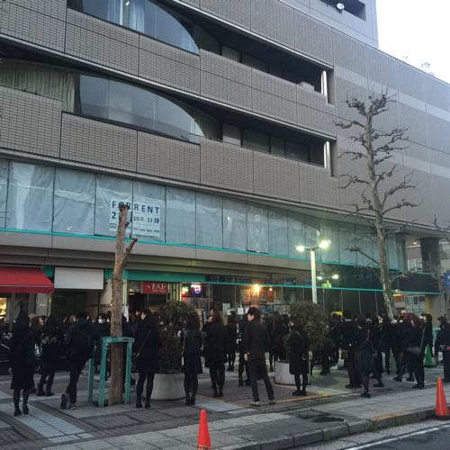

---
categories:
- sukekiyoのLIVEレポ
date: Sat, 19 Mar 2016 23:43:49 +0000
slug: post-8999
tags:
- LIVEレポ
- sukekiyo
title: 【ライブレポ】sukekiyo 二〇一六年公演「漆黒の儀」2016_3_19@横浜F.A.D
---

日常で消耗する自分をここで補充していて、見終わった後には清々しさが残るそんなLIVEでした。<!--more--><h2>FAD横浜</h2>

初めてくる会場です。変わってるのがマンションと思しき建物の1階にあるというなんとも変わった造りでした。

しかも中華街近くというか中華街からも外れているし、周囲に似た施設があるわけでもないし。しかも時間潰すところが中華街くらいしかなく、目の前にコンビニはあるものの住宅街といった趣でした。

周りに駐車場がいくつもあったので車で行ける人は車で行った方があるいはいいかもしれませんな。

<iframe src="https://www.google.com/maps/embed?pb=!1m18!1m12!1m3!1d3250.5384871145284!2d139.64285431525207!3d35.44146098025094!2m3!1f0!2f0!3f0!3m2!1i1024!2i768!4f13.1!3m3!1m2!1s0x60185ce4770877e1%3A0x4f28ee376f884381!2z77ym77yO77yh77yO77yk5qiq5rWc!5e0!3m2!1sja!2sjp!4v1458430707357" width="600" height="450" frameborder="0" style="border:0" allowfullscreen></iframe>

<h2>セトリ</h2>

今回はコンセプチュアルな前回のツアーなどとは異なり、ツアー形式ですが単発の公演。会場が狭いということもあったと思いますが、特に演出やセットはなく全体的にシンプルな感じでしたが、曲数が少し多かった印象です。

destrudo

1. foster mother

2. in all weathers

3. nine melted fiction

4. scars like velvet

5. vandal

6. aftermath

7. zephyr

8. leather field

9. the daemon's cutlery

10. dunes

11. maniera

12. latour

13. 雨上がりの優詩

14．mama

15. 烏有の空

16. 斑人間

<h2>動画撮影</h2>

事前にアナウンスがあった通り動画撮影可能な時間がありました。

具体的には「leather field」「the daemon's cutlery」「dunes」

アナウンスがあり撮影スタート

ぼくはiPhone6plusで使用して撮影しました。ただ電源を落としていたので起動まで時間がかかり、ど頭抜けてます。

編集無しです。

<iframe width="560" height="315" src="https://www.youtube.com/embed/KzHh_lNXliU?rel=0" frameborder="0" allowfullscreen></iframe>

それと注意点としては、kyo onlineのstaff reportでも言及ありましたが自撮り棒の使用は辞めた方がいいと思います。

<blockquote class="twitter-tweet" data-lang="ja">
明日行く人へのアドバイス 壁近くが一段高くなってるのでそこに乗ってください。それとアナウンスされてから携帯の電源いれるのだとiPhone6plus使ってる僕は乗り遅れました。あと各自いまから腕立てするなりして鍛えてください。10分以上腕上げるのはシンドイです。
&mdash; しんぺー@漆黒の儀 (@s_s_p_y) <a href="https://twitter.com/s_s_p_y/status/711152207459004416">2016年3月19日</a></blockquote>

<h2>しんぺーはこう思った。</h2>

久しぶりのsukekiyo

京聖誕祭いけてないんで、正月振りですね。

Dirで不完全燃焼気味だったので久しぶりのカタルシスでした。

本日の公演はニコ生で中継されるみたいなのでTS登録して、見ようかと思います！(リアルタイムで見れないので)

<a href="http://sp.live.nicovideo.jp/gate/lv255452466" target="_blank">DIR EN GREY 京 率いる sukekiyo 二〇一六年公演「漆黒の儀」ライブ独占生中継(一部) - ニコニコ生放送</a>

ちなみに今回の唯一のツアーグッズのマスクケースは結構でかかったです。

<blockquote class="twitter-tweet" data-lang="ja">
マスクケース。 携帯用にも家用にも使えます。 この時期、マスクを手放せない皆様、いかがでしょうか？ メンバーも愛用するようです。(s) <a href="https://t.co/z9nw0JoUDk">pic.twitter.com/z9nw0JoUDk</a>
&mdash; sukekiyo (@sukekiyo_band) <a href="https://twitter.com/sukekiyo_band/status/711122604510158848">2016年3月19日</a></blockquote>

あとは過去グッズも売ってたので少し見てみてもいいんでないでしょうか。

といったところで本日は以上になります。

おやすみなさい。