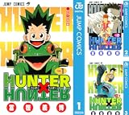
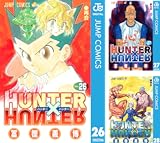

---
categories:
- アニメ
date: Tue, 29 Mar 2016 16:40:41 +0000
slug: post-9008
tags:
- 漫画
title: ハンターハンターが連載再開ということで、知らない人のためにその魅力をお伝えします。
---

ハンターハンターをご存知だろうか。若い人の中には知らないって人もいるかもしれない。なんせ、ここ数年休載してたから。でももしかしたら名前だけは知ってるかも、「週刊連載のはずなのに1年に10話しかやらないやつでしょ」と記憶している人もいるかもしれない。そんな人のためにハンターハンターの魅力について今日は書きたいと思います。これを読んで興味がわいたら是非、全巻読んで来月の連載再開からリアルタイムで読んだらいいと思う。

<!--more-->
<h2>ハンターハンターとは</h2>
1998年に週刊少年ジャンプで連載をスタート。11歳の少年であるゴン=フリークスが父親を探すためにハンターという職業につき、様々な仲間と出会い困難に立ち向かう姿を描いた冒険譚

こち亀、ONE PIECEに続く長期連載漫画(笑)

こち亀は1976年連載開始で198巻、ONE PIECEが1997年連載開始で80巻でているのに対し、ハンターハンターは32巻(2016年3月時点)

ちなみに、BLEACHは2001何連載開始で71巻

どういうことかおわかりいただけただろうか。

それだけ休載が多いのである。「ハンターハンター 休載」でググるとどれくらいそれが凄いことなのかわかる。

しかし、なぜ、それでもなお打ち切りならず連載が続くのか。

それは、面白いからである。

噂によるとハンターハンターが掲載されているジャンプの売上はヤバイらしい。今回の連載再開号は恐らく売り切れ必至

コミックスの巻数は少なくとも、正直他の漫画が全て霞むほどの濃厚さが詰まっている。(冨樫信者談)
<h3>登場人物</h3>
<h4>ゴン=フリークス</h4>
この物語の主人公。父親を探すために育ての親である叔母のミトさんと暮らす故郷を離れ、ハンターを目指す。幼少の頃より、野山で動物と遊び育ったため常人離れした感覚を持ち動物の言語を理解できる野生児。

性格は明るく、めげないひたむき。誰に対しても平等に接し、物事に対して善悪の頓着がない。いかにもシュジンコー！って感じ
<h4>キルア=ゾルディック</h4>
暗殺を生業とする世界有数の暗殺一家出身の職業殺人鬼。

生まれた時から家族の屈折した愛情と激しい訓練を受け育つ。母親を刺し家出をし、「難しいらしい」からという理由でハンターを目指すことに。

ハンター認定試験にてゴンと出会い、以降行動を共にしやがて親友となる。
<h4>レオリオ</h4>
ハンター試験には金目当てで参加。しかし実は医者死亡の心優しい青年。

ゴンとキルアの良き理解者、兄貴分としてサポートする。単純明解な性格でありながら頭脳明晰な一面も持つ。

幽遊白書でいうところの、桑原っぽいポジション？
<h4>クラピカ</h4>
幻影旅団という盗賊団により一族を惨殺されたクルタ族の生き残り。彼らは興奮すると瞳が紅くなり、その死後色素が沈着することから一部の愛好家に珍重されていた。そのため闇のマーケットで高額で取引される。そのため、彼ら一族が殺されたわけだが、その復讐のためにハンターになることを誓ったのがこのクラピカ。

豊富な知識と冷静さとは裏腹に、仲間思いかつ向こう見ずな一面を持ち合わせる。モデルはナウシカの王蟲らしい。つまりきれると周りが見えなくなり暴走するという。

幽遊白書でいうところの蔵馬的なポジションかな？

この4人を中心に話が展開しますが、基本ゴンとキルアを中心に描かれてますね今のところ。
<h3>あらすじ</h3>
<h4>ハンター試験編</h4>
ゴン、キルアたちが出会い試験を受け、協力して試験合格を目指す話。

この試験方法が練られていてさすが冨樫という感じか。

もうこのあたりから一気に引き込まれる。

そして、ゴンの宿命の敵というか、超えられない壁として常に存在し続けるヒソカというキャラが現れます。彼はこの後もずっとで続けます。
<h4>ククルーマウンテン（キルアの自宅）〜天空闘技場編</h4>
試験後、突如現れた兄から強制されキルアが自宅へ帰ってしまいます。それを3人で連れ戻しにいく話です。

しかしながら、さすが暗殺一家。キルアにたどり着くまでに修行が必要になります。重い湯のみもったりとか。重い門を開けたりとか。

そして、キルアを無事取り戻した3人は一旦それぞれの道を目指すことになります。ゴンはキルアとともに当座のお金を稼ぎつつ、レベルアップを図るために天空闘技場で修行することとなります。

まあ、要は毎日開かれる天下一武道会といった感じでしょうか。

しかし、ここで物語全体に大きなエッセンスとなる概念が追加されます。

それが「念」です。ドラゴンボールでいうところの「気」、NARUTOでいうところの「チャクラ」です。

ここで一気に離れた読者もいたのではないでしょうか。えー、結局そっち系のバトル漫画かよーってなった人もいましたなー

しかしながら、のちにわかりますが、この念（オーラともいう）はかなり考えられていて、基本的なスキルや使い道が決まっています。そして、さらに自分の性格によっては属性が分かれており、属性によって得手不得手があり、さらに体得できる固有の技にもそれが影響してくるというものになっています。

この概念はNARUTOのチャクラの属性概念にも影響を与えているように見受けられます。なんせあれもいっきなりでてきましたからね。

作者の冨樫氏は、こういった体系立てたものをちゃんとした形で物語に取り入れたかったのかなと感じます。幽遊白書しかりレベルEしかり。

さて、念を体得した2人は一旦天空闘技場を離れ、次の行動に移ります。それはゴンの父親探しです。
<h4>くじら島への里帰り編（ゴンの故郷）</h4>
一旦、ゴンの故郷にキルアを伴って里帰りします。そこで父親が残した手がかりを入手。父親に近づくためにはレアなゲームを入手するしかないことを知ります。

さらにそのレアアイテムを入手するには、金持ちが参加するオークションに参加し落札しなければならないことを知るのでした。
<h4>ヨークシン編（幻影旅団編）</h4>
ここで物語は並行してクラピカ編が始まります。

ゴンキルアと別れたクラピカは、念を体得しつつ自身の仇である幻影旅団を捕まえるために闇マーケットに詳しい人物の腹心となります。

そして、闇マーケットで開かれるオークションに幻影旅団が現れることを知り直接対決をするのでした。

この話のあらすじはこの変ではしょります。なぜならめちゃくちゃ面白いのでぜひ読んでほしいです。

特に念でのバトルが本格化し、なるほどこういう使い方もあるのかってのがわかるからです。

この世界観は、念としての基本概念を考え抜いた末に構築しなければ描けない内容になっています。冨樫氏が天才と言われる所以を見ることができるでしょう。さらに物語は複雑に絡みつつ、それでいて一本の糸へとたぐりよせられていく様は本当に凄まじいものです。
<h4>グリードアイランド</h4>
オークションの話を経て入手したレアゲームをプレイする話です。

いやー、ここは正直文字数が半端ないです。小説家な？ってくらい文字数がでてきます。

でも、これもきっと冨樫氏がやりたかったことの一つなんだろうなって感じます。というのも、彼が休載する要因の一つと噂されるのがゲームだからです。

彼自身ゲームを作ってみたかったんだろうなって感じました。

自ら作ったルールの中で、自身を消耗させながら成長するというのが好きみたいです。多分。

正直、ここは説明を飛ばしながらでも十分楽しめるようになっています。

ここで注目すべきは強敵に対して、脳筋で相対するのではなく戦略で戦うという点。

さらに1人では叶わなくても仲間で力を合わせて強い敵を倒すという、少年漫画の王道が描かれています。

そういった意味では、上部は随分ひねくれていますが、王道中の王道が描かれた素晴らしい話だと思います。
<h4>キメラアント編</h4>
ここから一気にヤバさが増していきます。本当にやばいなって感じました。

グロさが増します。表現もわざと黒塗りをしてヤバさを演出したりとか。また現実ではありえない設定にもかかわらず、凄まじい臨場感が感じ取れます。そして躊躇なく死ぬ主要人物。

ショックすぎて日常生活で一週間ほど落ち込みました。

とにかく、凄まじく面白いです。

そして、ここに<strong>「漫画家冨樫極まれり」</strong>というものを感じました。

それはキメラアントのボスとハンター協会ネテロ会長が戦うシーンです。

ネテロ会長は世界一の念の使い手。しかし、戦いの最中に気がつきます。
<blockquote>「いつからだ…？

敵の攻撃を待つ様になったのは、一体いつからだ

敗けた相手が頭を下げながら、差し出してくる量の手に

間を置かず、応えられる様になったのは？

そんなんじゃねェだろ！！オレが求めた武の極みは

敗色濃い難敵にこそ、全霊を以て臨む事！！

感謝するぜ、お前と出会えたこれまでの全てに！！」</blockquote>
これ、まんま冨樫の心境でしょう。

でも、作り出した最凶の漫画ハンターハンター、自分でもどう決着をつけていいのかわからないくらいの展開。それに対して果敢に立ち向かう冨樫。

そらー年に数回しか連載できないわけだよ。
<h4>アルカ編</h4>
正直、キメラアント編が面白すぎてどう収拾つけるんだろって感じこの話が始まります。

しかし、、、この20話足らずの話はぼくの漫画史上最高に面白い話でした。

こんなにドキドキして漫画を読めたことはありません。

とにかく、、、とにかく、、、面白い。
<h4>暗黒大陸編</h4>
そして、ようやく始まる新章。

どうも主人公はゴンではないようです。

ゴンの役割は一旦は終了なんでしょうねきっと。この後はもう全く違う新しいハンターハンターなんだろうなって思います。

正直話の設定がラッキーマンぽくて。。。小宇宙の上に中宇宙があって実はその上に大宇宙があって的な

でも、そんなの正直どうでもいいんです。あきらかに面白そうだから。

ここからが連載再開なんです！！！！
<h2>しんぺーはこう思った。</h2>
以下、冨樫信者のぼくから魅力をお伝えします。

本当に身震いするほどの漫画を読んだのはこれが初めてだった。

それは念という能力と、それを掛け合わせた脳筋ではない戦略から繰り広げられる「小が大を制す」という圧倒的少年漫画感

一見すると清涼感あふれる設定とは裏腹な冨樫義弘節とも言えるグロテスクかつ本質的な世界観と緻密なストーリー。それでいて各登場人物のかすかな感情の揺れや苦悩を描く繊細さ。かと思えば社会情勢を風刺しつつ、彼の訴えを乗せたメッセージが刻み込まれた漫画。

待とう。彼が休むのなら、何年でも待とう。

幽遊白書、レベルE、全ての作品はここに帰結するために描かれた。

そして彼自身が苦悩している。最高の漫画を描ききったのちに自分は存在し得るのか。否。

それを超えるために彼は血反吐を吐き、魂を削り、命を消費して書き続けるのである。

至高にして最強の漫画、それがハンターハンターなのである。

と言ったところで本日は以上になります。おやすみなさい。
<table style="border: none;" border="0" cellpadding="5">
<tbody>
<tr>
<td style="border: none;" valign="top"></td>
<td style="border: none; text-align: left;" valign="top">

冨樫義博

<table style="border: none; margin-top: 10px;">
<tbody>
<tr>
<td style="border: none; text-align: left;">

<a href="http://www.amazon.co.jp/gp/search?keywords=%5B%82%DC%82%C6%82%DF%94%83%82%A2%5D%20HUNTER%81~HUNTER%20%83%82%83m%83N%83%8D%94%C5%81i%83W%83%83%83%93%83v%83R%83~%83b%83N%83XDIGITAL%81j&amp;__mk_ja_JP=%83J%83%5E%83J%83i&amp;tag=warawareotoko-22" target="_blank" rel="noopener">Amazonで購入</a>

<a href="http://hb.afl.rakuten.co.jp/hgc/0f6e221b.2eb9748a.0f6e221c.35cc1e84/?pc=http%3A%2F%2Fsearch.rakuten.co.jp%2Fsearch%2Fmall%2F%255B%25E3%2581%25BE%25E3%2581%25A8%25E3%2582%2581%25E8%25B2%25B7%25E3%2581%2584%255D%2520HUNTER%25C3%2597HUNTER%2520%25E3%2583%25A2%25E3%2583%258E%25E3%2582%25AF%25E3%2583%25AD%25E7%2589%2588%25EF%25BC%2588%25E3%2582%25B8%25E3%2583%25A3%25E3%2583%25B3%25E3%2583%2597%25E3%2582%25B3%25E3%2583%259F%25E3%2583%2583%25E3%2582%25AF%25E3%2582%25B9DIGITAL%25EF%25BC%2589%2F-%2Ff.1-p.1-s.1-sf.0-st.A-v.2%3Fx%3D0%26scid%3Daf_ich_link_urltxt%26m%3Dhttp%3A%2F%2Fm.rakuten.co.jp%2F" target="_blank" rel="noopener">楽天市場で購入</a>

<a href="http://ck.jp.ap.valuecommerce.com/servlet/referral?sid=3041033&amp;pid=882528283&amp;vc_url=http%3A%2F%2Fsearch.shopping.yahoo.co.jp%2Fsearch%3Fp%3D%255B%25E3%2581%25BE%25E3%2581%25A8%25E3%2582%2581%25E8%25B2%25B7%25E3%2581%2584%255D%2520HUNTER%25C3%2597HUNTER%2520%25E3%2583%25A2%25E3%2583%258E%25E3%2582%25AF%25E3%2583%25AD%25E7%2589%2588%25EF%25BC%2588%25E3%2582%25B8%25E3%2583%25A3%25E3%2583%25B3%25E3%2583%2597%25E3%2582%25B3%25E3%2583%259F%25E3%2583%2583%25E3%2582%25AF%25E3%2582%25B9DIGITAL%25EF%25BC%2589" target="_blank" rel="noopener">Yahooショッピングで購入</a>

<a href="http://ck.jp.ap.valuecommerce.com/servlet/referral?sid=3041033&amp;pid=882660047&amp;vc_url=http%3A%2F%2Fauctions.search.yahoo.co.jp%2Fsearch%3Fvo%3D%26ve%3D%26auccat%3D0%26aucminprice%3D%26aucmaxprice%3D%26aucmin_bidorbuy_price%3D%26aucmax_bidorbuy_price%3D%26loc_cd%3D0%26abatch%3D0%26istatus%3D0%26filtered%3D1%26ei%3DUTF-8%26tab_ex%3Dcommerce%26va%3D%255B%25E3%2581%25BE%25E3%2581%25A8%25E3%2582%2581%25E8%25B2%25B7%25E3%2581%2584%255D%2520HUNTER%25C3%2597HUNTER%2520%25E3%2583%25A2%25E3%2583%258E%25E3%2582%25AF%25E3%2583%25AD%25E7%2589%2588%25EF%25BC%2588%25E3%2582%25B8%25E3%2583%25A3%25E3%2583%25B3%25E3%2583%2597%25E3%2582%25B3%25E3%2583%259F%25E3%2583%2583%25E3%2582%25AF%25E3%2582%25B9DIGITAL%25EF%25BC%2589" target="_blank" rel="noopener">ヤフオク!で購入</a>
</td>
<td style="vertical-align: bottom; padding-left: 10px; font-size: x-small; border: none;">by <a href="http://kaereba.com" target="_blank" rel="nofollow noopener">カエレバ</a></td>
</tr>
</tbody>
</table>
&nbsp;</td>
</tr>
</tbody>
</table>
<table style="border: none;" border="0" cellpadding="5">
<tbody>
<tr>
<td style="border: none;" valign="top"></td>
<td style="border: none; text-align: left;" valign="top">

冨樫義博

<table style="border: none; margin-top: 10px;">
<tbody>
<tr>
<td style="border: none; text-align: left;">

<a href="http://www.amazon.co.jp/gp/search?keywords=%5B%82%DC%82%C6%82%DF%94%83%82%A2%5D%20HUNTER%81~HUNTER%20%83%82%83m%83N%83%8D%94%C5%81i%83W%83%83%83%93%83v%83R%83~%83b%83N%83XDIGITAL%81j&amp;__mk_ja_JP=%83J%83%5E%83J%83i&amp;tag=warawareotoko-22" target="_blank" rel="noopener">Amazonで購入</a>

<a href="http://hb.afl.rakuten.co.jp/hgc/0f6e221b.2eb9748a.0f6e221c.35cc1e84/?pc=http%3A%2F%2Fsearch.rakuten.co.jp%2Fsearch%2Fmall%2F%255B%25E3%2581%25BE%25E3%2581%25A8%25E3%2582%2581%25E8%25B2%25B7%25E3%2581%2584%255D%2520HUNTER%25C3%2597HUNTER%2520%25E3%2583%25A2%25E3%2583%258E%25E3%2582%25AF%25E3%2583%25AD%25E7%2589%2588%25EF%25BC%2588%25E3%2582%25B8%25E3%2583%25A3%25E3%2583%25B3%25E3%2583%2597%25E3%2582%25B3%25E3%2583%259F%25E3%2583%2583%25E3%2582%25AF%25E3%2582%25B9DIGITAL%25EF%25BC%2589%2F-%2Ff.1-p.1-s.1-sf.0-st.A-v.2%3Fx%3D0%26scid%3Daf_ich_link_urltxt%26m%3Dhttp%3A%2F%2Fm.rakuten.co.jp%2F" target="_blank" rel="noopener">楽天市場で購入</a>

<a href="http://ck.jp.ap.valuecommerce.com/servlet/referral?sid=3041033&amp;pid=882528283&amp;vc_url=http%3A%2F%2Fsearch.shopping.yahoo.co.jp%2Fsearch%3Fp%3D%255B%25E3%2581%25BE%25E3%2581%25A8%25E3%2582%2581%25E8%25B2%25B7%25E3%2581%2584%255D%2520HUNTER%25C3%2597HUNTER%2520%25E3%2583%25A2%25E3%2583%258E%25E3%2582%25AF%25E3%2583%25AD%25E7%2589%2588%25EF%25BC%2588%25E3%2582%25B8%25E3%2583%25A3%25E3%2583%25B3%25E3%2583%2597%25E3%2582%25B3%25E3%2583%259F%25E3%2583%2583%25E3%2582%25AF%25E3%2582%25B9DIGITAL%25EF%25BC%2589" target="_blank" rel="noopener">Yahooショッピングで購入</a>

<a href="http://ck.jp.ap.valuecommerce.com/servlet/referral?sid=3041033&amp;pid=882660047&amp;vc_url=http%3A%2F%2Fauctions.search.yahoo.co.jp%2Fsearch%3Fvo%3D%26ve%3D%26auccat%3D0%26aucminprice%3D%26aucmaxprice%3D%26aucmin_bidorbuy_price%3D%26aucmax_bidorbuy_price%3D%26loc_cd%3D0%26abatch%3D0%26istatus%3D0%26filtered%3D1%26ei%3DUTF-8%26tab_ex%3Dcommerce%26va%3D%255B%25E3%2581%25BE%25E3%2581%25A8%25E3%2582%2581%25E8%25B2%25B7%25E3%2581%2584%255D%2520HUNTER%25C3%2597HUNTER%2520%25E3%2583%25A2%25E3%2583%258E%25E3%2582%25AF%25E3%2583%25AD%25E7%2589%2588%25EF%25BC%2588%25E3%2582%25B8%25E3%2583%25A3%25E3%2583%25B3%25E3%2583%2597%25E3%2582%25B3%25E3%2583%259F%25E3%2583%2583%25E3%2582%25AF%25E3%2582%25B9DIGITAL%25EF%25BC%2589" target="_blank" rel="noopener">ヤフオク!で購入</a>
</td>
<td style="vertical-align: bottom; padding-left: 10px; font-size: x-small; border: none;">by <a href="http://kaereba.com" target="_blank" rel="nofollow noopener">カエレバ</a></td>
</tr>
</tbody>
</table>
&nbsp;</td>
</tr>
</tbody>
</table>