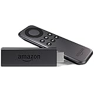

---
categories:
- レビュー
date: Tue, 05 Apr 2016 19:57:40 +0000
slug: post-9016
tags:
- ガジェット
title: Amazon Fire TV StickをBluetoothでつないでワイヤレスに音を聞く方法
---

以前までChromeキャストを使用してテレビやモニターでyoutubeだったりhuluだったりを見ていましたが、最近はAmazonのFire stickを使用しています。そしてhuluやyoutubeを見てる時は大抵他のことをしながら見ていることが多く、テレビの前からいなくなることもしばしば。そんな時、イヤホンやヘッドホンだとどうしても行動範囲が制限されてしまいます。さらに、ソファに寝っ転がりながらみたいなんて時にも非常に不便です。しかし、実はこのFire stickはBluetooth機能を搭載しており、無線で音声を飛ばすことができるのです。本日はその方法をご紹介いたします。<!--more--><h2>Fire TV Stickから音をBluetoothで飛ばす方法</h2>

まず当たり前ですが、<a  href="http://www.amazon.co.jp/gp/product/B00ZVNYLS8/ref=as_li_ss_tl?ie=UTF8&camp=247&creative=7399&creativeASIN=B00ZVNYLS8&linkCode=as2&tag=warawareotoko-22">Fire TV Stick</a>
と<a target="_blank" href="http://www.amazon.co.jp/%E3%83%A9%E3%83%B3%E3%83%8B%E3%83%B3%E3%82%B0%E3%81%AB%E6%9C%80%E9%81%A9%E3%81%AA%E3%82%A4%E3%83%A4%E3%83%9B%E3%83%B3/b/ref=as_li_ss_tl?_encoding=UTF8&camp=247&creative=7399&linkCode=ur2&node=2561837051&pf_rd_p=219473649&pf_rd_r=1YS7BRVXCY1NCPT1Y51Y&pf_rd_s=nav-subnav-avm-image-content-6&pf_rd_t=SubnavFlyout&tag=warawareotoko-22">Bluetoothイヤホン</a>などをご用意ください。

まずは、Fire TVの設定画面を表示します。

次にBluetoothの設定を行います。

ペアリングを行います。

以上！

簡単です。

<h2>Fire Stickがすぐれている点</h2>

あまりに簡単で、書くことがないくらいなのでFire TVとChromeキャストの違いについてご紹介します。

大きくことなるのはChromeキャストがスマホやChromeから映像を飛ばすという形なのに対し、Fire TVは単独で使います。この点、AppleTVと同じです。
また、アプリケーションをダウンロードして使用するあたりもChromeキャストと大きくことなる点です。

youtube、hole、netflixなどのアプリはもちろん、なんとニコニコ動画アプリもあります。

さらに、なんといってもAmazonプライムビデオがそのまま見られるという点はかなりのメリットだと思います。
最近はAmazonプライムビデオ独自コンテンツがかなり増えてきましたので、導入のメリットは十分になるかと思います。

むしろnetflixやhuluよりもAmazonの方がいいかもしれません。

<table  border="0" cellpadding="5" style="border:none"><tr><td valign="top" style="border:none"></td><td valign="top" style="border:none;text-align:left">
 Amazon 2015-10-28

売り上げランキング : 5
<table style="border:none;margin-top:10px"><tr><td style="border:none;text-align:left;">
<a href="http://www.amazon.co.jp/gp/search?keywords=fire%20stick&__mk_ja_JP=%83J%83%5E%83J%83i&tag=warawareotoko-22" target="_blank" >Amazonで購入</a>

<a href="http://hb.afl.rakuten.co.jp/hgc/0f6e221b.2eb9748a.0f6e221c.35cc1e84/?pc=http%3A%2F%2Fsearch.rakuten.co.jp%2Fsearch%2Fmall%2Ffire%2520stick%2F-%2Ff.1-p.1-s.1-sf.0-st.A-v.2%3Fx%3D0%26scid%3Daf_ich_link_urltxt%26m%3Dhttp%3A%2F%2Fm.rakuten.co.jp%2F" target="_blank" >楽天市場で購入</a>

<a href="http://ck.jp.ap.valuecommerce.com/servlet/referral?sid=3041033&pid=882528283&vc_url=http%3A%2F%2Fsearch.shopping.yahoo.co.jp%2Fsearch%3Fp%3Dfire%2520stick" target="_blank" >Yahooショッピングで購入</a>

<a href="http://ck.jp.ap.valuecommerce.com/servlet/referral?sid=3041033&pid=882660047&vc_url=http%3A%2F%2Fauctions.search.yahoo.co.jp%2Fsearch%3Fvo%3D%26ve%3D%26auccat%3D0%26aucminprice%3D%26aucmaxprice%3D%26aucmin_bidorbuy_price%3D%26aucmax_bidorbuy_price%3D%26loc_cd%3D0%26abatch%3D0%26istatus%3D0%26filtered%3D1%26ei%3DUTF-8%26tab_ex%3Dcommerce%26va%3Dfire%2520stick" target="_blank" >ヤフオク!で購入</a>
</td><td style="vertical-align:bottom;padding-left:10px;font-size:x-small;border:none">by <a href="http://kaereba.com" rel="nofollow" target="_blank">カエレバ</a></td></tr></table></td></tr></table>

<h2>しんぺーはこう思った。</h2>

Chromeキャストは安価で手軽です。AppleTVは高スペック。。。
その中間くらいなのがFire TV Stickという感じでしょうかね。

どれもお勧めですが、このBluetooth接続機能がある分Fire TV Stickをおすすめします。
（もしかしたら最新のAppleTVとChromeキャストにはついてるかもしれませんが。。。）

と言ったところで本日は以上になります。  おやすみなさい。

<iframe src="http://rcm-fe.amazon-adsystem.com/e/cm?t=warawareotoko-22&o=9&p=12&l=ur1&category=prime&banner=1JDEH56FFMMBANKKEJR2&f=ifr" width="300" height="250" scrolling="no" border="0" marginwidth="0" style="border:none;max-width:900px;max-height:600px;" frameborder="0"></iframe>