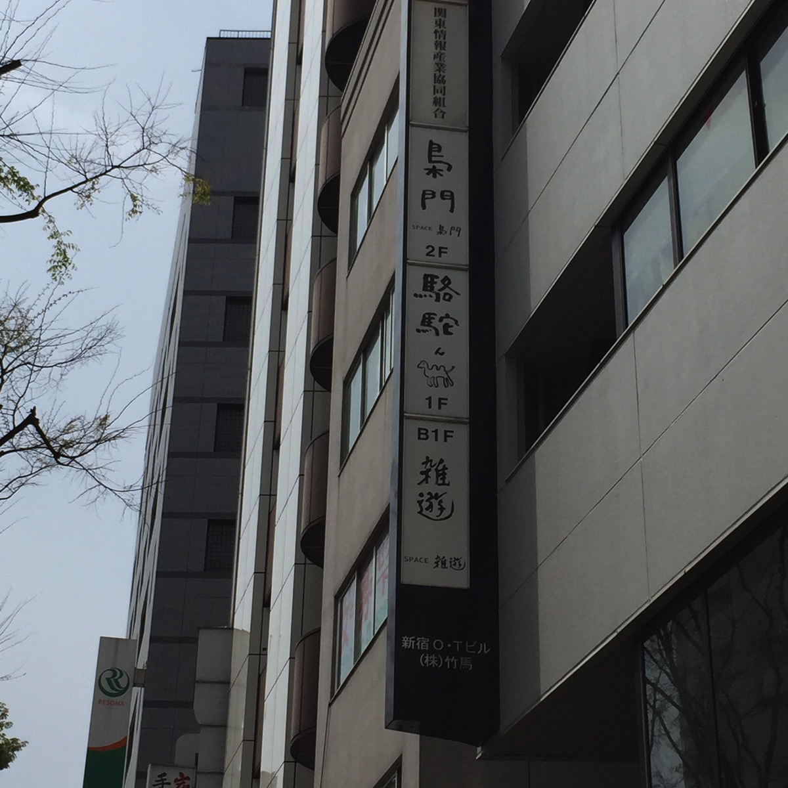
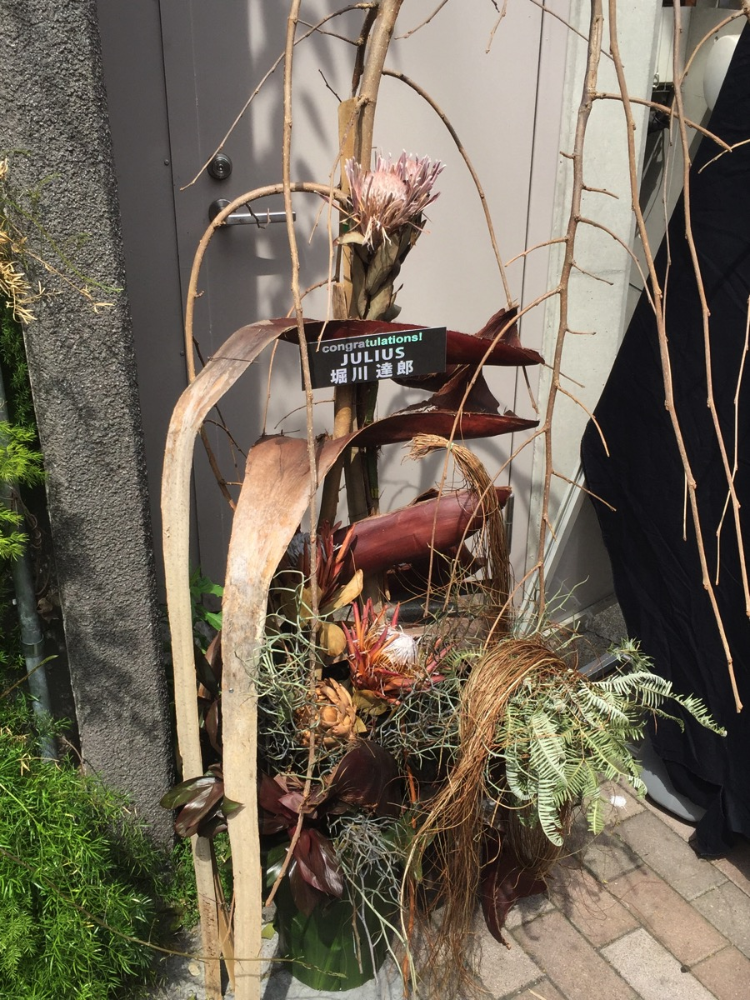
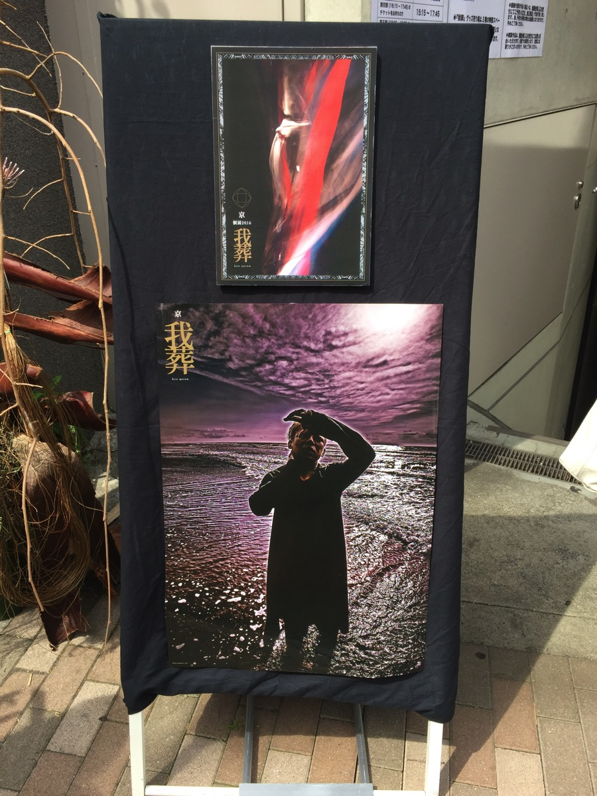

---
categories:
- 各メンバーの個人イベントレポなど
date: Sun, 10 Apr 2016 23:20:57 +0000
slug: post-9031
tags:
- イベントレポ
- 京
- 個展
title: 【イベントレポ】京 個展2016『我葬』@SPACE 雑遊
---

全日程終了につきレポ解禁。ということで最終日の本日いってまいりました京個展「我葬」

とてつもなく重苦しい空気間と脳と体が両方披露するような圧を感じました。ということで本日は個展のレポートです。

<!--more-->
<h2>会場の様子</h2>

今回会場となったSPACE 雑遊は伊勢丹よりも遠く、新宿の外れという印象の場所にありました。車で新宿に来ることがない人には通り過ぎることもないような場所です。

<iframe style="border: 0;" src="https://www.google.com/maps/embed?pb=!1m14!1m8!1m3!1d12961.7683776972!2d139.706714!3d35.690737!3m2!1i1024!2i768!4f13.1!3m3!1m2!1s0x0%3A0x995def319202d16!2zU1BBQ0Ug6ZuR6YGK!5e0!3m2!1sja!2sjp!4v1460304999314" width="600" height="450" frameborder="0" allowfullscreen="allowfullscreen"></iframe>

表にはJULIUSさんからのお花というか枯れ木

ポスター

物販は3階に上がったところにあります。詩集もこちらで販売しておりました。なにやら写真撮影OKだったみたいなのですがペニュ等を撮影するの忘れました。
<h2>京個展「我葬」レポート</h2>
地下が個展会場。入口付近からすでに香る百合の花とヒノキを混ぜたような香り。

階段を降りて入り口にはいるとすぐに目に貼ったのは、紅白の短冊が載せられた長い机。自分の痛みを書き、我葬の木というオブジェに括り付けるようになっています。入口付近に書く場所があるので主旨が解らず、最初スルーしてしまいました。中に入ってしばらくしてから理解して引き返しましたが。

ちなみに我葬の木は、鳥籠に入れられた人の腕から無数に枝が生えているはというオブジェです。その枝にはAftermathのミュージックビデオさながらに無数の赤い短冊がくくりつけられていました。なお腕には複数の目玉が埋め込まれていました。

会場は薄暗く、詩集の文字もほぼ読めないくらいの仄暗さ。それ以外は巨大なスクリーンから流れる映像による明かりでなんとか文字を読むくらいでした。

今回の詩は前回のように壁に掛けられているのではなく、天井から吊るされているものでした。だから再三リュックやショルダーを腕に持つようにアナウンスされたわけだ。

壁伝いに作品を見ていくと壁に蛍光塗料で描かれた巨大な目玉、その付近から見えるのは以前同様の音声ブース。入口にかかる布には先ほどの我葬の木が描かれていました。

中に入ると6人が座れるようになっていて、各自ヘッドホンをつけて朗読をきき、奥の壁に移されたオブジェに投影される陰影を眺めます。DIR EN GREYのライブのお立ち台のオブジェのようでした。

パフォーマンスは2回。パフォーマンス前にスクリーンに床にひかれたラインまで下がるように表示されました。

1度目は万有引力。般若と小面の面をずらしてつけた二人組が怪しげな舞踏を踏む。しゃがんだ観客の冠(かむり)を掴んだり接触があったように見えた。身体中に蛍光のペイントがされていて日本的な情緒の裏側に異国の原住民による呪術的なダンスみたいな雰囲気があった。

2回目は時間をかなりおいてに始まった。奏者による尺八の演奏。スクリーンには竹林が映し出されていて雰囲気がいっきに涼しげに。
<h2>感想</h2>
天井から吊るされた詩の配置により、クリアに見通せる場所がほとんどなかった。これにもきっと意味がありそう。ちなみに万有引力のパフォーマンス中はブラックライトが使われていて、詩の一片一片が青白く浮かび上がっていた。

そして、漂う甘い香り。何かの花の様な匂いで今も思い出せるくらいのインパクトなのに決してしつこくない。買えばよかった。

空間がとにかく重苦しく、映像を見つめてると少し前に思考したはずの頭の中の記憶が消失して焦った。自分で考えたはずのことが思い出せなくなるというより考えてた事実自体ぽっかり穴が開いた感じ。終わったあと脳みそと体の疲労感がすごかった。

それとぼくの時は機材トラブルでブースに最初入れなかった。でもあれがあったから2回目のパフォーマンスを見れた。正直、そろそろ出るかーと思っていた矢先だったのでよかった。どうもこの個展はライブと同じように時間いっぱいいないとダメで、展示会というよりも全てが出し物という感じがした。

ちなみにブースの外に手を入れられる箱があったらしい。だからウェットティッシュあったのか。これにより今回は味覚以外の五感全てで表現がなされたわけで、もう次回は味覚しか残ってないからきっとこうなる。

https://twitter.com/s_s_p_y/status/719099932938862593

なにやらスタッフの人から触るように案内があるらしいけど、トラブルで時間がかなり押してて、後ろにたくさん並んでたからパーっと出てしまいました。いやーネタバレ禁止だとノウハウが共有されないから、同じようなミスする人多かったんじゃかなろうか。我葬の木とか。
<h2>トークイベント落選</h2>
で、今回も前回の個展同様にイベント落選しました！

https://twitter.com/s_s_p_y/status/718982032047480832

オフィによるとサイン入り詩集の購入者の90%が入場できる！だからあらかじめサイン入り詩集購入権付チケットの倍率高かったんかい〜でも譲っていただいたので、これでトークイベント参加できる！前回のサイン会は、目の前で詩集売り切れたので、今回はネットでも注文済みなので保険もかけてる！

とか思っていました•••

しかし現実は違っていました。

[参加方法]以下の3つに「トークイベント参加券(整理番号付き)」が以下の優先順にてランダムに封入されます。

(1) 京 online先行にて販売される「個展入場券(サイン入り詩集購入権付き)」対象の詩集「我葬」＜参加券総数の90%封入＞

(2) 京 個展2016『我葬』入場特典 ＜参加券総数の7%封入＞

(3) 京 個展2016『我葬』グッズ「漆黒の箱」 ＜参加券総数の3%封入＞

引用元:<a href="http://www.sp-freewillonline.com/kyo/schedule.php?id=377754726">kyo-online</a>

https://twitter.com/s_s_p_y/status/719006462563909633

↑開催回数間違ってますので改めて整理するとこんな感じ↓

キャパおそらく50人×全27回＝動員1350人(収益500万円)

それぞれの回で詩集購入権付チケットの発行割合を10%とすると135人が詩集購入者

あの会場でトークイベントがあるとするとキャパは50人。うち90%の45人が詩集購入者から選ばれる。

つまり45/135=33%程度が当選者

人数にすると一回につき1.6人が当選する計算

つまりそれぞれの回に5名ほど参加券付詩集購入者がいて1-2人に当たる計算

結論、各回2人ほどあたるのでは

キャパについて外で待ってる時にざっと数えたのですが、もう少し多いかもしれません。どちらにしろ、1人か2人くらいしか当たっていないはずです。
<h2>しんぺーはこう思った。</h2>
いやーまさか外れるなんて。。。もうこうなったら好きなつけ麺食べて気分持ち直すしかない。

で気になって前回の個展レポ読み返したら、なんとその時も同じようなこと言って同じつけ麺食べに行ってたw

参考:<a href="https://www.warawareotoko.com/2015/08/23/post-8263/" target="_blank" rel="noopener">サイン会不参加組による京/kyo個展「我葬」の感想とレポ</a>

次回は、こうやって確立を考えて行動した方がいいなぁとしみじみ思うのでした。べんべん

といったところで本日は以上になります。

おやすみなさい