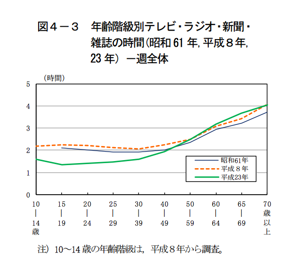

---
categories:
- コンテンツ
date: Fri, 22 Apr 2016 18:00:40 +0000
slug: post-9062
tags:
- AbemaTV
title: 単純に思う。AbemaTVがやばすぎる！新世代のTV体験はこれだ！
---

サイバーエージェントがテレ朝と組んでスタートしたAbemaTVをご存知でしょうか。ぼくの好きなでんぴ組.incのメンバー最上もがが冠番組を始めるということなので、アプリをダウンロードして見たのですがこれヤバすぎと思ったので本日はAbemaTVについてご紹介します。<!--more--><h2>AbemaTVとは？</h2>

4月11日にアメブロを運営しているサイバーエージェントとテレ朝が開局したネットテレビのことです。

24時間、無料でPCやスマートフォンアプリで視聴することができます。また様々なチャンネルが放送されており、MTVやスペースシャワーTVなどの音楽専門チャンネルやFOXなどのドラマ専門チャンネルの他にも独自番組を多数放送しています。

ちなみにアメーバティービーではありません。アベマティービーです。

<h3>AbemaTVの見かた</h3>

PCの場合はこちら

<a href="https://abema.tv/">https://abema.tv/</a>

PCだとこんな感じで見えます。

アプリからの視聴は専用アプリで見ることができます。

<a href="https://itunes.apple.com/jp/app/abematv/id1074866833?mt=8&uo=4&at=11ld5P" target="_blank" >AbemaTV</a>

無料

(2016.04.23時点)

<a href="https://itunes.apple.com/jp/developer/zhu-shi-hui-sheabematv/id1074866832?uo=4&at=11ld5P" target="_blank" >株式会社AbemaTV</a>

posted with <a href="http://pochireba.com" rel="nofollow" target="_blank">ポチレバ</a>

ちなみにアプリでなくてもブラウザで見ることもできます。

<h3>配信番組はこんなの</h3>

テレビだと東京ではだいたい7チャンネルくらいしかありませんが、AbemaTVは22チャンネルあります。

Abemanews
AbemaSPECIAL
SPECIAL PLUS
REALTY SHOW
MTV
S MUSIC
ドラマCHANNEL
Documentary
バラエティCHANNEL
ペット
CLUB CHANNEL
WORLD SPORTS
ヨコノリSurf Snow Skate
VICE
アニメ24
深夜アニメ
なつかしアニメ
家族アニメ
EDGE SPORT HD
釣り
麻雀
AbemaFRESH!

<h2>どうしてヤバいと思ったか</h2>

まずはそのUIが使いやすい！というところ。それ以外は次の通り

昨今、若者のテレビ離れとかってよく聞くと思います。

引用：<a href="http://www.stat.go.jp/data/shakai/2011/pdf/houdou2.pdf">平成 23 年社会生活基本調査 生活時間に関する結果 </a>

しかし、その分スマートフォンとの接触時間が長くなったいます。そこで、じゃぁスマホでテレビ流しちゃえばいいじゃん！っていう発想。。。ここに、すごいシビれました。

しかも、あらかじめ対象が若者というセグメントがされているので、その人達のコンテンツを配信すればいいだけです。

そして、今の若者はyoutubeなどに慣れているので、「その時しか見られない」という映像の希少性は、かえって新鮮なんじゃないかと思います。

それとこの中で視聴者取り合いになっても、他局ではないから利用者増えれば増えるほどメリットになるし、、、
とにかくすごい

<h3>気になるところ</h3>

それは通信料です。
映像のストリーミングなんて2、3時間も見ていたら1日で7G制限超えてもおかしくありません。

ちなみに1時間の番組をLTEで視聴した場合300MBから500MBくらいでした。

<h3>動画配信サービスが間違いなくきてる</h3>

実はこれ以外にも動画配信サービスあります。

それがLINE LIVEです。これも同じく若者向けのコンテンツで配信しています。しかもかなり振り切った内容で、テレビでもオンデマンドでもなかったようなコンテンツをぶっこんできています。

さらにはLINEが今夏リリースすると言われているLINEでのパケット通信料をノーカウントにすると言われているLINE SIMとあわせて使えば通信もきにすることがなくなるでしょう。

<a href="https://itunes.apple.com/jp/app/line-live-wu-liao-shi-tingapuri/id1059626535?mt=8&uo=4&at=11ld5P" target="_blank" >LINE LIVE - 無料視聴アプリ（ラインライブ）</a>

無料

(2016.04.23時点)

<a href="https://itunes.apple.com/jp/developer/line-corporation/id359067226?uo=4&at=11ld5P" target="_blank" >LINE Corporation</a>

posted with <a href="http://pochireba.com" rel="nofollow" target="_blank">ポチレバ</a>

<h2>しんぺーはこう思った。</h2>

何でもかんでも若者のナントカ離れとレッテル貼って、自分たちの努力不足を消費者のせいにする風潮

そんな中で起こったイノベーションがこれだと思う！！

災害でテレビ見れなくても、これで報道も見れちゃうわけだし。確か前回の地震の時にLINEが一躍普及した様に、今回の地震でこういった新しいインフラがまた普及するかもしれないな。

それにしても、やっぱりLTEでストリーミング視聴は、すぐ制限かかっちゃいます。
まだ今月1週間以上残ってるけど通信制限きちゃいましま。

と言ったところで本日は以上になります。
おやすみなさい。