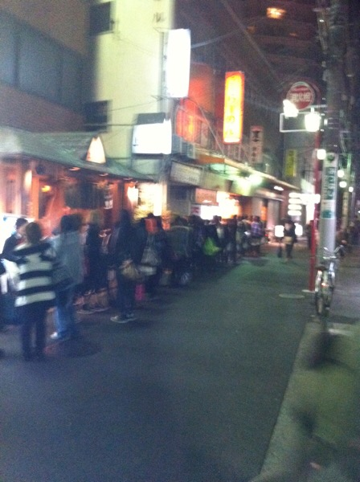

---
categories:
- ブログ
date: Tue, 03 May 2016 00:04:00 +0000
slug: post-9089
tags:
- DIR EN GREY
- pierrot
title: 好きなバンドが突然解散を発表してしまったファンに伝えたいこと
---

昨日２つのバンドが解散を発表しました。

SCREWとギルガメッシュ

ぼくはギルガメッシュに関しては、一時期熱心に聞いていましたし、ワールドツアーからの地元での凱旋LIVEにも行ったことがあります。とても楽しいLIVEでムックの逹瑯とミヤが来ていました。

ワールドツアー前の自分たちとツアー後の成長したバンド感を表現するLIVEでした。さらにお世話になった人たちへの感謝のテロップ。その最後に出てきたメンバー行きつけのラーメン屋「なりたけ」

アンコールのMCでもひたすらお店を宣伝

その結果がこちらでございます。

ぼく自身も自分を構成する大事な要素であるバンドが突然解散を発表したことがあります。しかし数年後に復活をしました。だからこそ伝えたいことを本日は書きたいと思います。

<!--more-->

<h2>バンドなんてものはそもそもが奇跡の上に成り立っている。</h2>

https://twitter.com/aiji_lmc/status/727080259846201344

色々なバランス、人気、売上、動員、印税、給料、金銭面、パワーバランス、嫉妬、、、

様々な要素がある。バンドだもの。

DIR EN GREYだって、今まで色んな解散の危機を乗り越えてきました。そもそも解散と継続の差なんて紙一重で、解散て選択肢は常に蠢いていてたまたま毎日それを選択してないだけなんじゃないでしょうか。

そして、ただ単にファンのためにだけで続けられるほど甘くないのです。

<h2>好きなバンドが解散した時の心境</h2>

当時ぼくはPIERROTというバンドが好きでした。まさに中2にではまり、この世界に足を踏み入れました。しかしながらPIERROTは2006年に突如解散を発表します。正直音楽性が少し変わって来ていたので、あまり聞かなくなっていましたし、高校3年生くらいからDIR EN GREYを聞くようになってからは、あまり情報をとらなくなっていましたし、LIVEに行く回数も減っていました。

<strong>PIERROT解散</strong>

それでもこの文字をmixiのニュースで目にした時は、信じられずに息が止まりそうになりました。直前に行ったLIVEで解散は絶対にしないって言ってたのに。

PIERROTが解散した理由は色々あると思いますが、すっごいめちゃくちゃ端的にいうと「メンバー不仲」に分類されます。

だから解散LIVEなんてありませんでした。PIERROTを存続したい派のメンバーのコメントが先に掲載され、数日後に脱退希望派のメンバーのコメントが付け加えられました。

今これを書いてる時ですら、当時を思い出して泣きそうになります。

ギルガメッシュファン、SCREWファンの方々の心中お察しします。

<h2>それでも受け入れるしかない</h2>

PIERROTのラストシングルは皮肉にも「HELLO」というタイトルでした。

ボーカルのキリト曰く解散する気はなく、再起のつもりでレコーディングしたとのこと。しかしながら結果的にラストシングルとなりました。その歌詞にこんな一節があります。

<blockquote>どこへ逃げようとも望んだものは手に入らない
何を叫ぼうとも壊したものはもう戻らない</blockquote>
<blockquote>だから

瞳閉じて胸に手をあててあの日を思い出そう
たとえそれが押し殺した涙を秘めた朝だとしても
前を見つめ両手を広げ もう過去に別れを告げよう
たとえそれが行き場のない涙を秘めた明日だとしても</blockquote>

それでも、受け入れるしかないんです。

PIERROTの場合は何度もメンバーたちは話し合いの場を設けたそうです。

それでも、喧嘩別れにおわりました。

どんな結果であろうと好きなメンバーたちが出した結果なら、受け入れるのがファンだと思います。

たとえそれが、どんな結果であろうと。

もともとが奇跡の上に成り立っていた存在

その奇跡の時間を一緒に過ごせた事実はとても素晴らしいと思いませんか？

ぼくも、あの時レンタルCD屋でまだ縦長だったPIERROTのCDを借りていなければ、今の自分になんてなっていません。

あの時、横浜アリーナで生まれて初めてLIVEというものにいってなければ、今の自分にはなっていません。

死にたく死にたくて死のうと思った時に大好きな音楽があったから生きてこれたのかもしれません。

その奇跡の瞬間にファンとして立ち会えたことに、そして自分もその奇跡の一部だったことに誇りを持ちませんか？

だから、今は受け入れるしかないのです。

<h2>しんぺーはこう思った。</h2>

少しだけ希望を残して終わりにしたいと思います。

解散したバンドが復活するのってめちゃくちゃカッコ悪いて思ってました。

でもね、そんなことなかったです。

2014年、PIERROTは突如復活します。そしてLIVEをやりました。

夢の様な時間でした。自然と溢れる涙を止める理由はどこにもありませんでした。

信じましょう

バンド存続が奇跡っていうなら、信じましょう、もう１つの奇跡を

復活という奇跡を。