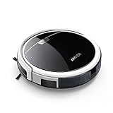
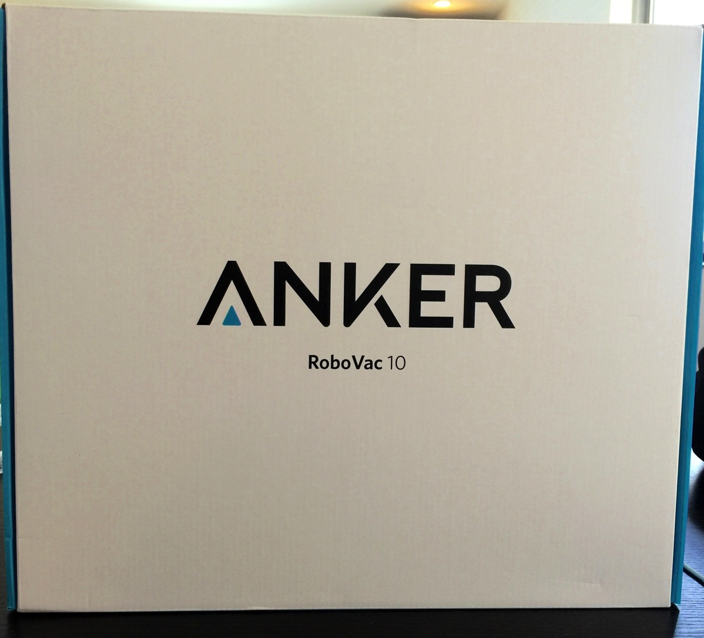
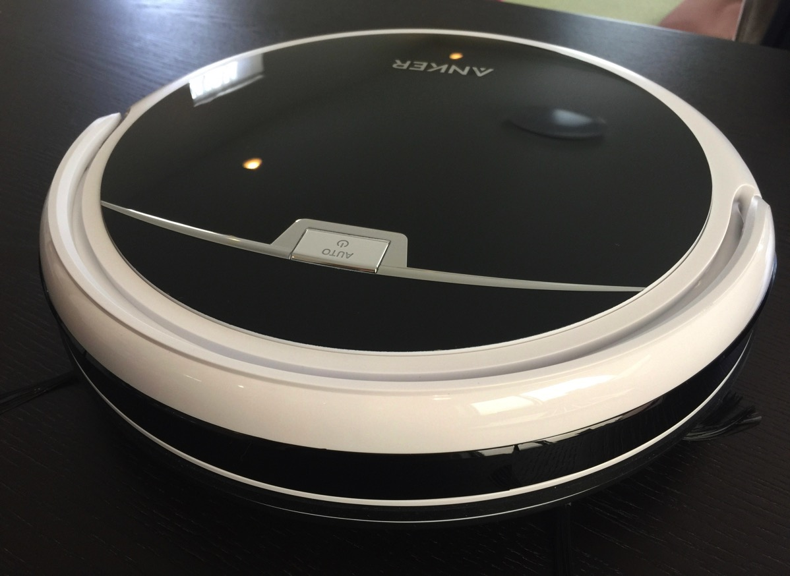
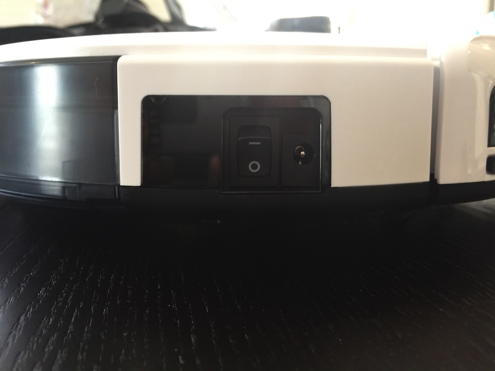
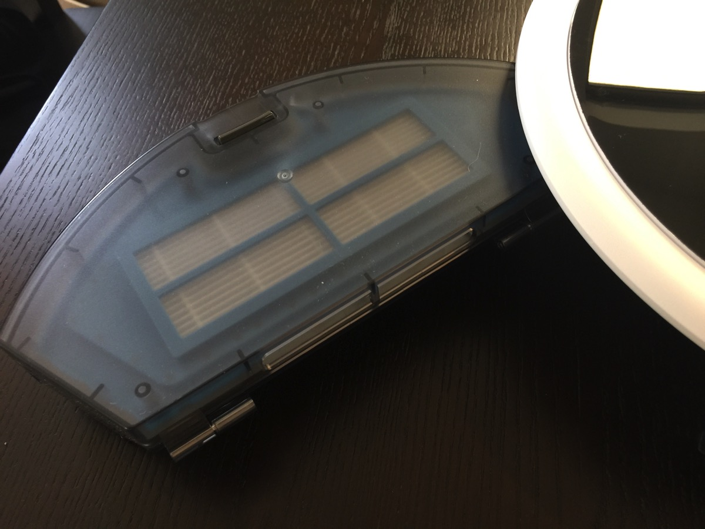
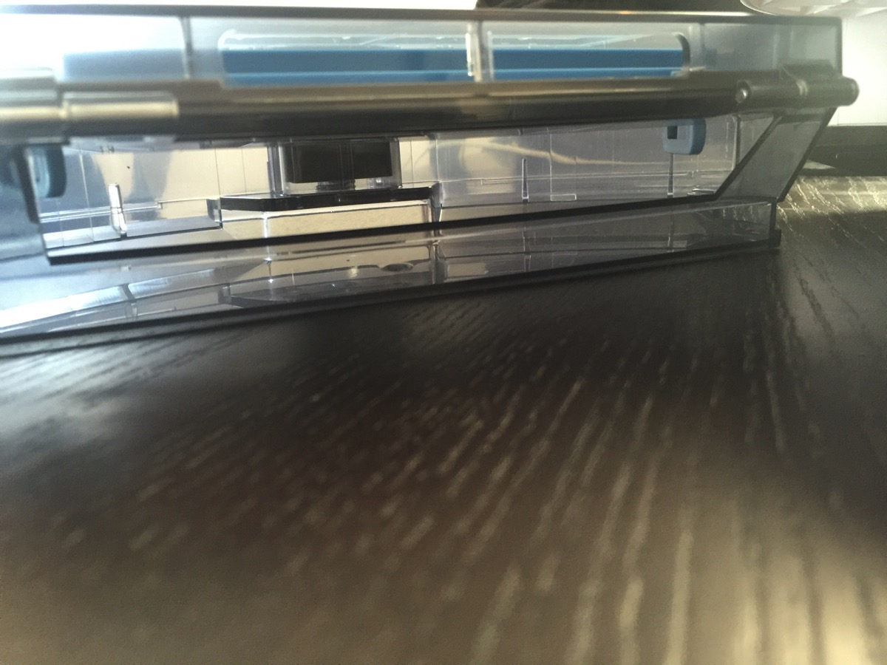
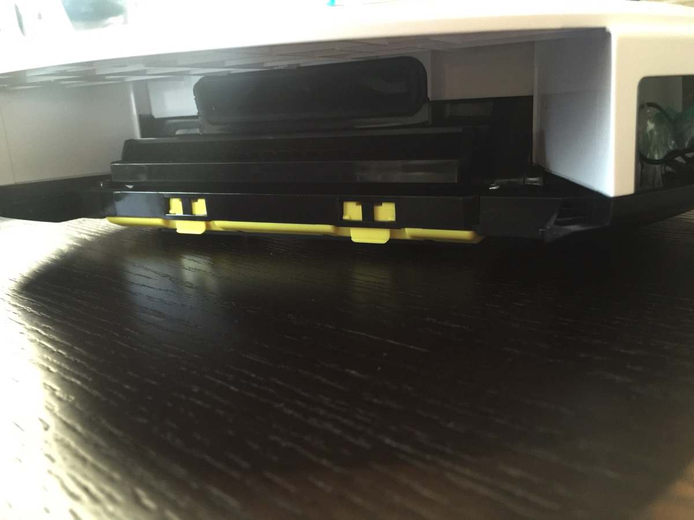
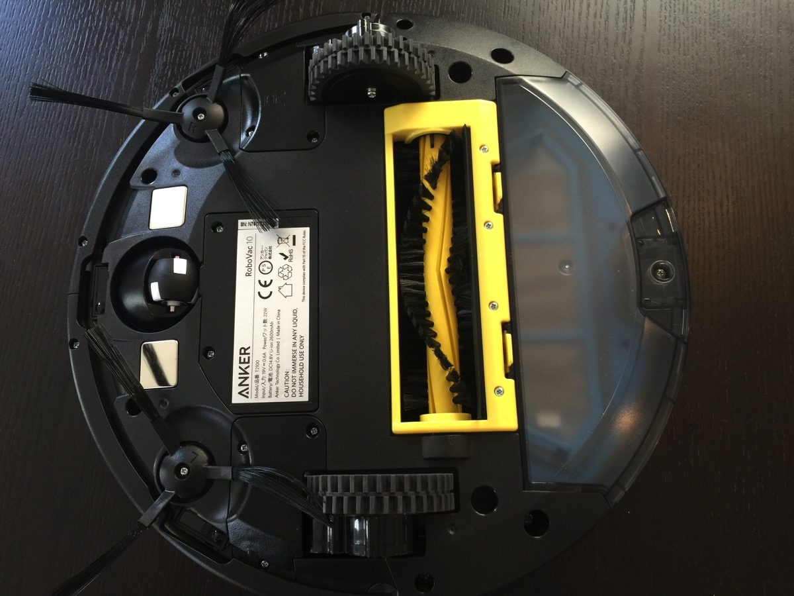
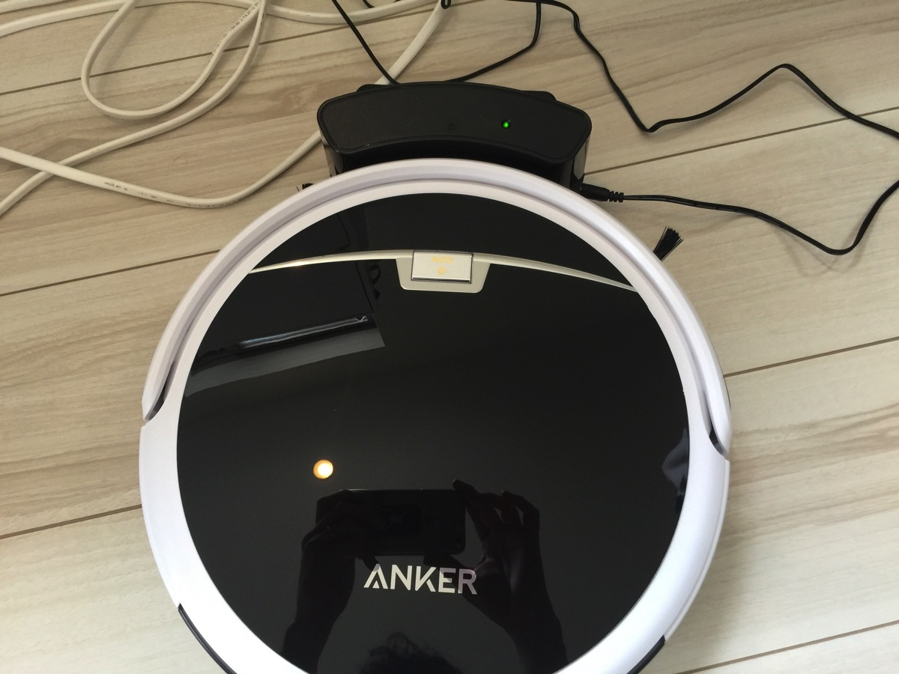

---
categories:
- レビュー
date: Mon, 13 Jun 2016 22:30:00 +0000
slug: post-9152
tags:
- Anker
title: 初めてロボット掃除機を購入！「Anker RoboVac 10 」を使った感想
---

掃除機をかけるのがめんどくさいし、ホコリがたつから換気しなきゃいけないしということでルンバ的なものを買おうか迷っていました。といってもかなり高価なのでヤフオク見たりしてたわけですが、ANKERが家電販売するということでもう発売日にソッコーで買いした。信頼のおけるブランドだし、なんといっても安価だった！というわけで本日はその「Anker RoboVac 10」ご紹介です。<!--more--><h2>Anker RoboVac 10</h2>

<table  border="0" cellpadding="5" style="border:none"><tr><td valign="top" style="border:none"></td><td valign="top" style="border:none;text-align:left">
 Anker 

売り上げランキング : 571
<table style="border:none;margin-top:10px"><tr><td style="border:none;text-align:left;">
<a href="http://www.amazon.co.jp/gp/search?keywords=Anker%20RoboVac%2010%20&__mk_ja_JP=%83J%83%5E%83J%83i&tag=warawareotoko-22" target="_blank" >Amazonで購入</a>

<a href="http://hb.afl.rakuten.co.jp/hgc/0f6e221b.2eb9748a.0f6e221c.35cc1e84/?pc=http%3A%2F%2Fsearch.rakuten.co.jp%2Fsearch%2Fmall%2FAnker%2520RoboVac%252010%2520%2F-%2Ff.1-p.1-s.1-sf.0-st.A-v.2%3Fx%3D0%26scid%3Daf_ich_link_urltxt%26m%3Dhttp%3A%2F%2Fm.rakuten.co.jp%2F" target="_blank" >楽天市場で購入</a>

<a href="http://ck.jp.ap.valuecommerce.com/servlet/referral?sid=3041033&pid=882528283&vc_url=http%3A%2F%2Fsearch.shopping.yahoo.co.jp%2Fsearch%3Fp%3DAnker%2520RoboVac%252010%2520" target="_blank" >Yahooショッピングで購入</a>

<a href="http://ck.jp.ap.valuecommerce.com/servlet/referral?sid=3041033&pid=882660047&vc_url=http%3A%2F%2Fauctions.search.yahoo.co.jp%2Fsearch%3Fvo%3D%26ve%3D%26auccat%3D0%26aucminprice%3D%26aucmaxprice%3D%26aucmin_bidorbuy_price%3D%26aucmax_bidorbuy_price%3D%26loc_cd%3D0%26abatch%3D0%26istatus%3D0%26filtered%3D1%26ei%3DUTF-8%26tab_ex%3Dcommerce%26va%3DAnker%2520RoboVac%252010%2520" target="_blank" >ヤフオク!で購入</a>
</td><td style="vertical-align:bottom;padding-left:10px;font-size:x-small;border:none">by <a href="http://kaereba.com" rel="nofollow" target="_blank">カエレバ</a></td></tr></table></td></tr></table>

発売日にAmazonで購入しました。記事公開日時点では、33,999円でしたがタイムセールになっており20,088円にて購入しました。そして次の日に早速届きました。

PS4の箱くらいの大きさの箱に入っております。

大きさは恐らく通常のロボット掃除機と同じくらいでしょうか。他を使ったことがないのでわかりませんが。

側面に主電源があります。

こちらがゴミが入るボックスです。フィルターは替え用が一つ余分に入っていました。

割とこまめにゴミは捨てることになりそうな容量です。

取り外した内部の構造です。シンプルな感じです。

本体裏側

ホームに設置した際の姿です。充電部分は小さくてすっきりしています。

<h3>素晴らしいところ</h3>

2日ほど使った感想ですが、「Anker RoboVac 10」のいいなと思った点は<strong>安価なこと</strong>と<strong>パワフルなこと</strong>

ちょっとくらいの段差なら乗り越えますので絨毯やカーペットもちゃんと掃除してくれます。

また目に見えるゴミはほとんど残らずに掃除してくれるので、タイマーでセットしておけば寝ている間や外出中に掃除を終えてくれています。普通の掃除機をかけよりか、ぜんぜん小さいです。洗濯機の方が大きい音がします。

こんな商品を2万円で購入できたので大満足です。

<h3>気になるところ</h3>

多少きになるところもあります。それは次の3つです。

<ul>
	<li>方向転換時のゴム音</li>
	<li>衝突の衝撃</li>
	<li>コンセントやヒモが絡む</li>
</ul>

タイヤがゴム製なのでフローリングで方向転換時にキュッキュという音がします。

壁や障害物に衝突することはありませんが、椅子などには当たってしまうのでその衝撃がきになりました。

あと、これが一番困った点ですがコンセントやヒモにひっかかると絡まって、そのまま進もうとしてしまいます。ロボット掃除機を使う上で、どの製品も共通なのかもしれませんが、床の上に小さいものやヒモ状のものは注意が必要です。

<h2>しんぺーはこう思った。</h2>

「Anker RoboVac 10」素晴らしいです。

「平日は仕事で帰ってきたら掃除をする時間がない、だから土日で掃除機をかける」みたいない人が多いと思いますが、その土日の掃除機を忘れてしまうことがあると思います。そうするとすぐにほこりがたまってしまったり、髪の毛が落ちていたりという感じで汚くなってしまいます。

しかし、「Anker RoboVac 10」なら自動でお掃除をしてくれるのでそんな悩みとはおさらばです。

本当にいいものを買いました！

おすすめです！

と言ったところで本日は以上になります。  おやすみなさい。

<table  border="0" cellpadding="5" style="border:none"><tr><td valign="top" style="border:none"></td><td valign="top" style="border:none;text-align:left">
 Anker 

売り上げランキング : 571
<table style="border:none;margin-top:10px"><tr><td style="border:none;text-align:left;">
<a href="http://www.amazon.co.jp/gp/search?keywords=Anker%20RoboVac%2010%20&__mk_ja_JP=%83J%83%5E%83J%83i&tag=warawareotoko-22" target="_blank" >Amazonで購入</a>

<a href="http://hb.afl.rakuten.co.jp/hgc/0f6e221b.2eb9748a.0f6e221c.35cc1e84/?pc=http%3A%2F%2Fsearch.rakuten.co.jp%2Fsearch%2Fmall%2FAnker%2520RoboVac%252010%2520%2F-%2Ff.1-p.1-s.1-sf.0-st.A-v.2%3Fx%3D0%26scid%3Daf_ich_link_urltxt%26m%3Dhttp%3A%2F%2Fm.rakuten.co.jp%2F" target="_blank" >楽天市場で購入</a>

<a href="http://ck.jp.ap.valuecommerce.com/servlet/referral?sid=3041033&pid=882528283&vc_url=http%3A%2F%2Fsearch.shopping.yahoo.co.jp%2Fsearch%3Fp%3DAnker%2520RoboVac%252010%2520" target="_blank" >Yahooショッピングで購入</a>

<a href="http://ck.jp.ap.valuecommerce.com/servlet/referral?sid=3041033&pid=882660047&vc_url=http%3A%2F%2Fauctions.search.yahoo.co.jp%2Fsearch%3Fvo%3D%26ve%3D%26auccat%3D0%26aucminprice%3D%26aucmaxprice%3D%26aucmin_bidorbuy_price%3D%26aucmax_bidorbuy_price%3D%26loc_cd%3D0%26abatch%3D0%26istatus%3D0%26filtered%3D1%26ei%3DUTF-8%26tab_ex%3Dcommerce%26va%3DAnker%2520RoboVac%252010%2520" target="_blank" >ヤフオク!で購入</a>
</td><td style="vertical-align:bottom;padding-left:10px;font-size:x-small;border:none">by <a href="http://kaereba.com" rel="nofollow" target="_blank">カエレバ</a></td></tr></table></td></tr></table>