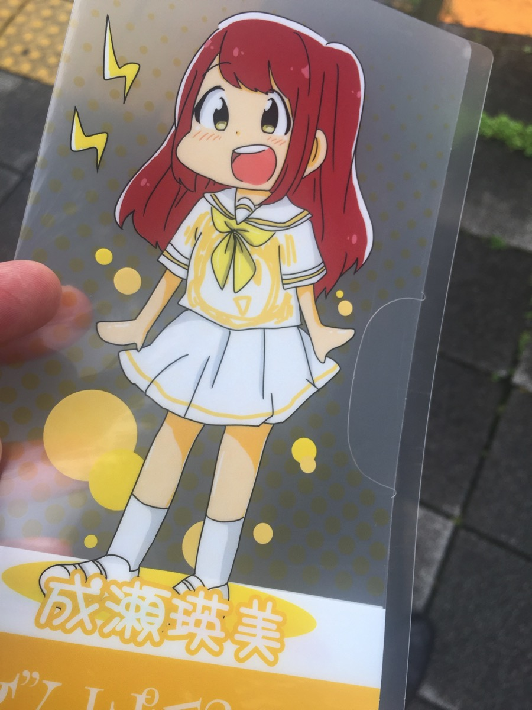

---
categories:
- でんぱ組
date: Fri, 24 Jun 2016 02:57:54 +0000
slug: post-9173
tags:
- でんぱ組.inc
title: でんぱ組.incメンバーのコスプレ観劇騒動について思うこと
---

でんぱ組.incのメンバーがコスプレで観劇をしたとのことで炎上しておりました。本人たちはTwitter上で謝罪をし、すでに切り替えているのか本日から始まったキャンペーン情報等をツイートしておりましたが、まとめページやネットコンテンツ等が掲載され現在もまだ進行中の様な気配です。御多分に洩れずぼくもその件について考えたことをまとめたいと思います。<!--more--><h2>おことわり</h2>
まずはおことわりを書きますが、当方でんぱ組.incのファンでございます。

LIVEも行ったことありませんし、DVDも持ってないし、アルバムも最新アルバムしか持っておりませんが、一応ファンでございます。

現在のコスプレというカルチャーについては全くの素人ですし、アニメ•漫画やゲームキャラなどの劇やオペラなどについても全く知識ありません。

そんな立場から書かせていただきます。

<h2>経緯</h2>

Twitterをざっと見返して経緯をまとめます。
<ul>

	<li>「あんさんぶるスターズ！オン・ステージ」というスマホゲームアプリのキャラによる劇に、でんぱ組.incのメンバー相沢梨紗、夢眠ねむ、成瀬瑛美が参加</li>

	<li>3人はキャラクターのコスプレをして観覧</li>

	<li>座席は関係者席</li>

	<li>コスプレでの観劇はマナー違反として炎上</li>

	<li>でんぱオタ(でんぱ組.inc)のファンとファンではない劇や俳優のファンらがTwitter上でバトル開始</li>

	<li>メンバーは謝罪のツイートをするも誠意が感じられないとしてさらに炎上</li>

	<li>重ねての謝罪</li>

	<li>ファンとそれ以外の人との代理戦争継続</li>

	<li>バンギャがとばっちりをなぜか喰う</li>

</ul>
こんなところでしょうか。。
記事を書き出した時（6/21）はまだまだ話題でしたが、今（6/24）はもう沈静化に向かっているかなという感じです。Yahoo!ニュースに載ってたけどな。。。

<h2>でんぱ炎上騒動のその後</h2>
21日にはメンバー3名とも関連ツイートを謝罪ツイート含め全て削除していました。

おそらく事務所の指示と思われますが、誠意がないと指摘されたメンバーはもうすっかり切り替えて同日に始まったキャンペーンの告知をしていました。

<h2>しんぺーはこう思った。</h2>

<strong>各カルチャーには明文化されていない不文律がある。それは暗黙の了解として守るべきものであり、それもまたカルチャーの一部を形成していると思う。

知らずに踏みにじれば洗礼を受けるのは当然。</strong>

（でも、別にルールとして明文化されていないんだから守らなくてもいいし、非難されても自分さえよければいいというメンタルさえあって、別に本人的にはOKならそれもそれでいいと思う。それはそれで別の話ですが。。。）

ぼくが通うDIR EN GREYのLIVEだって同じ。
今過去のアルバムのツアーやってるけど、だからって誰も過去のノリで当時の不文律に従って参戦する人なんていないわけで（いるかもしれないけど）、当時はダイブが黙認されてたけど今やったら袋叩きになるとかね。sukekiyoのLIVEでハッピーバースデー歌っちゃうとかねw

強制されたマナーではなく、相互の理解の上に成り立つ暗黙の了解が、作品やその空間の空気を作ってるんだと思う。だから知らなくてマナーを破ったのは仕様がないし、それで批判されるのも当然だし仕方がない。

<strong>でも、だからこそがっかりした。</strong>

オタクカルチャーをバックボーンにでてきたでんぱ組.incなのに、そのカルチャー内の空気を理解せずに壊すというのはオタクとして1番やっちゃいけないことな気がする。

さらに謝罪後の後始末も悪い。全員がツイート消したら、これってキャンペーンの炎上マーケティングだったんじゃね？とか勘ぐっちゃうし。

ただ、本人たちはオタクの本文としてちゃんと「空気感」について理解しているのか消された謝罪文の中で、批判を甘んじて受ける旨が記載してた。

まー、にしても切り替え早すぎだよなwww

ということで、ファミマで今キャンペーン中なので対象商品早速購入して特典もらってきたw

と言ったところで本日は以上になります。  おやすみなさい。