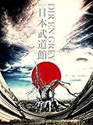

---
categories:
- DIR EN GREY
date: Fri, 24 Jun 2016 03:26:06 +0000
slug: post-9175
tags:
- dir en grey関連
title: 【DIR EN GREY】「ARCHE AT 日本武道館 特別編」＠T・ジョイPRINCE品川見てきた
---

行ってきました。最終日なのに結構混んでいました。予約開始時点に予約した時はすっかすかだったのに。ということで本日はDI R EN GREYの「ARCHE」武道館公演の感想です。<!--more--><h2>内容は？</h2>
内容は、今月発売のLIVE Blu-rayに収録されているものの再編集と思われます。プラステレビ放送されたものとニコ生で放送されてた部分に含まれない部分かなという感じです。
LIVE映像の合間に、メンバーのインタビューが挟まっている感じです。曲順はわすれましたが、どちらにしろ武道館のセトリからの映像ですのでARCHE中心です。むしろARCHE以外の曲は映像に入っていたかしら。。。

<iframe width="560" height="315" src="https://www.youtube.com/embed/5mMDZM3qtWw?rel=0" frameborder="0" allowfullscreen></iframe>

<iframe width="560" height="315" src="https://www.youtube.com/embed/NlNzbNoAwsw?rel=0" frameborder="0" allowfullscreen></iframe>

また、ぼくはいけませんでしたが各地ではメンバーが舞台挨拶に現れたりしてもりあがったみたいです。

大阪はToshiya、京都は京、品川はDieだったみたいです。
<blockquote class="twitter-tweet" data-lang="ja">
プレミアム上映会『DIR EN GREY ARCHE AT 日本武道館 特別編』 本日(6/13) T・ジョイPRINCE品川は&lt;Die&gt;が登壇！ 明日6月14日(火) Ｔ・ジョイ京都は!? (OvO)<a href="https://twitter.com/hashtag/ARCHE?src=hash">#ARCHE</a> <a href="https://t.co/0uXtFWKCJC">pic.twitter.com/0uXtFWKCJC</a>
&mdash; DIR EN GREY (@DIRENGREY_JP) <a href="https://twitter.com/DIRENGREY_JP/status/742336754347216896">2016年6月13日</a></blockquote>

<blockquote class="twitter-tweet" data-lang="ja">
劇場版『DIR EN GREY ARCHE AT 日本武道館 特別編』本日のＴ・ジョイ京都は京が登壇！メンバーによる舞台挨拶も明日6/15が最終日。チケットはお早めに！<a href="https://t.co/xKihjXp5h3">https://t.co/xKihjXp5h3</a> <a href="https://twitter.com/hashtag/ARCHE?src=hash">#ARCHE</a> <a href="https://t.co/VYSOdN18cd">pic.twitter.com/VYSOdN18cd</a>
&mdash; DIR EN GREY (@DIRENGREY_JP) <a href="https://twitter.com/DIRENGREY_JP/status/742690490294886400">2016年6月14日</a></blockquote>

<blockquote class="twitter-tweet" data-lang="ja">
劇場版『DIR EN GREY ARCHE AT 日本武道館 特別編』本日の梅田ブルグ7はToshiyaが登壇！プレミアム上映会は東京・大阪・京都の3劇場にて17日(金)まで！ <a href="https://twitter.com/hashtag/ARCHE?src=hash">#ARCHE</a> <a href="https://t.co/Oln7WTPhou">pic.twitter.com/Oln7WTPhou</a>
&mdash; DIR EN GREY (@DIRENGREY_JP) <a href="https://twitter.com/DIRENGREY_JP/status/743056588160667651">2016年6月15日</a></blockquote>

ちなみに京のこの着物はこちらで売ってたみたいですが、即完したらしいw常人が着るのはつらいだろこれw買った人いつきるの。。。

<h2>感想は？</h2>

以前の劇場版ouroborosの時もそうでしたが、すっごい眠くなるんですよね。今回も少しうとうとしてしまいました。こりゃビールでも飲みながら見てたら、完全爆睡だったかも。

ということで内容自体は、2日間実物を見てきた身としては「まーこんなもんか」という感じです。ただし、シーンによっては、映像として切り出されることで新たな凄みがでているものなどがありました。

また例のクソ演出も多少修正というか、目立たないようにされていて個人的にはそこが一番でした。

あとすっごく気になったのはDieのインタビューシーンでのブーツね。白いブーツ。すっごい気になった。

<h2>しんぺーはこう思った。</h2>
ボーナスフッテージみたいな感じで移動中や打ち合わせ中のシーンが入ってるDVDありますけど、あーいうの大好きなんですよね。メンバーの裏側が観れるというか、ステージとは違った一面が見れて。そういうシーンはほとんどありませんでしたので、発売されるBlu-rayには収録されていることを望みます！

<table  border="0" cellpadding="5" style="border:none"><tr><td valign="top" style="border:none"></td><td valign="top" style="border:none;text-align:left">
DIR EN GREY SMD itaku (DVD) 2016-06-29

売り上げランキング : 374
<table style="border:none;margin-top:10px"><tr><td style="border:none;text-align:left;">
<a href="http://www.amazon.co.jp/gp/search?keywords=ARCHE&__mk_ja_JP=%83J%83%5E%83J%83i&tag=warawareotoko-22" target="_blank" >Amazonで購入</a>

<a href="http://hb.afl.rakuten.co.jp/hgc/0f6e221b.2eb9748a.0f6e221c.35cc1e84/?pc=http%3A%2F%2Fsearch.rakuten.co.jp%2Fsearch%2Fmall%2FARCHE%2F-%2Ff.1-p.1-s.1-sf.0-st.A-v.2%3Fx%3D0%26scid%3Daf_ich_link_urltxt%26m%3Dhttp%3A%2F%2Fm.rakuten.co.jp%2F" target="_blank" >楽天市場で購入</a>

<a href="http://ck.jp.ap.valuecommerce.com/servlet/referral?sid=3041033&pid=882528283&vc_url=http%3A%2F%2Fsearch.shopping.yahoo.co.jp%2Fsearch%3Fp%3DARCHE" target="_blank" >Yahooショッピングで購入</a>

<a href="http://ck.jp.ap.valuecommerce.com/servlet/referral?sid=3041033&pid=882660047&vc_url=http%3A%2F%2Fauctions.search.yahoo.co.jp%2Fsearch%3Fvo%3D%26ve%3D%26auccat%3D0%26aucminprice%3D%26aucmaxprice%3D%26aucmin_bidorbuy_price%3D%26aucmax_bidorbuy_price%3D%26loc_cd%3D0%26abatch%3D0%26istatus%3D0%26filtered%3D1%26ei%3DUTF-8%26tab_ex%3Dcommerce%26va%3DARCHE" target="_blank" >ヤフオク!で購入</a>
</td><td style="vertical-align:bottom;padding-left:10px;font-size:x-small;border:none">by <a href="http://kaereba.com" rel="nofollow" target="_blank">カエレバ</a></td></tr></table></td></tr></table>