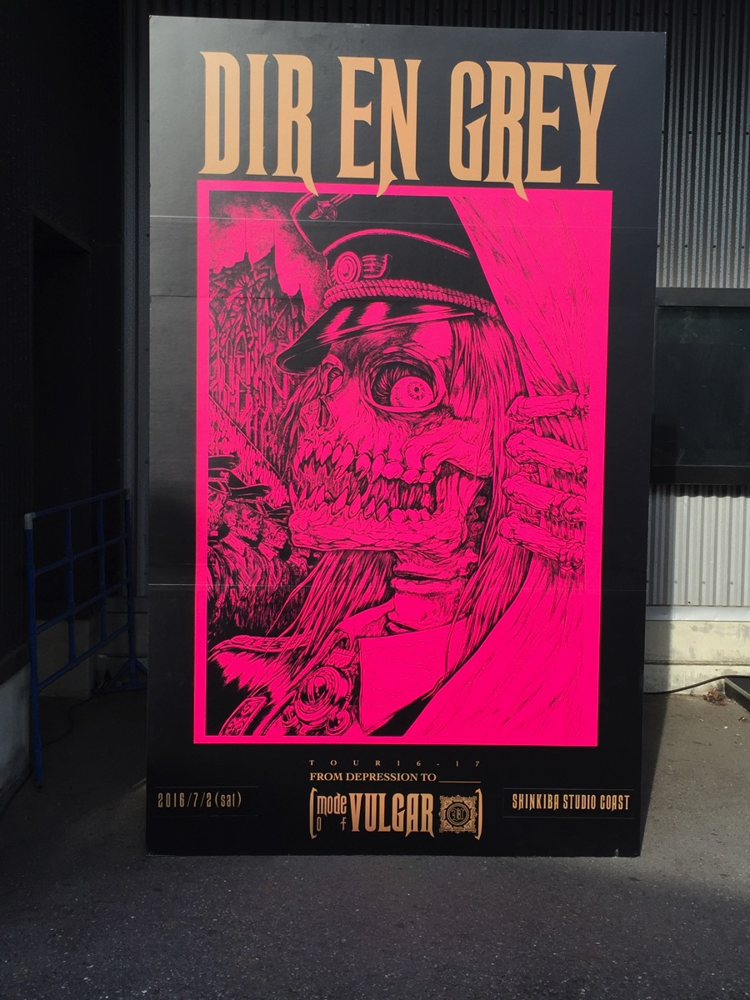
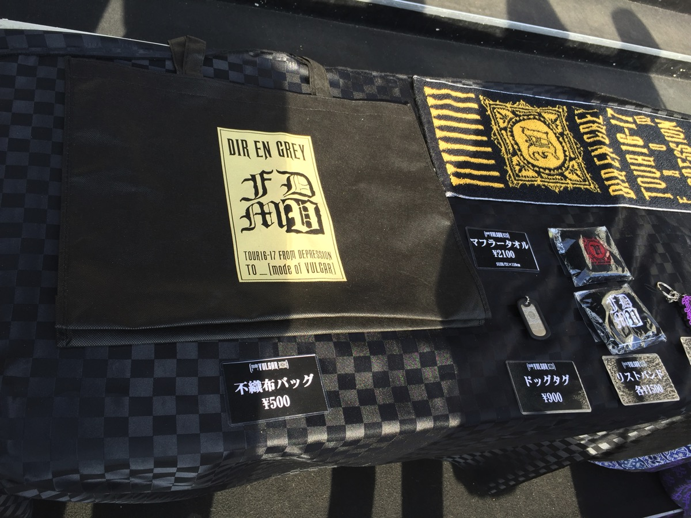
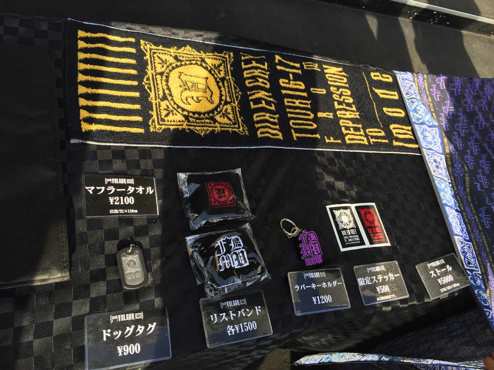
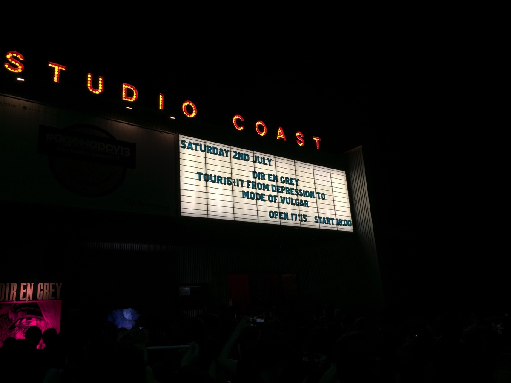
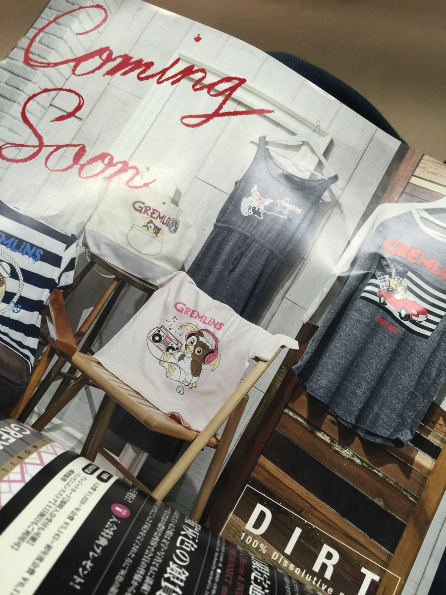

---
categories:
- DIR EN GREYのLIVEレポ
- TOUR16-17 [mode of VULGAR]
date: Sun, 03 Jul 2016 06:01:00 +0000
slug: post-9182
tags:
- DIR EN GREY
- LIVEレポ
title: 【ライブレポ】DIR EN GREY TOUR16-17 FROM DEPRESSION TO ______ [mode of VULGAR]2016_7_2@新木場スタジオコースト
---

本日行ってまいりましたDIR EN GREY TOUR16-17 FROM DEPRESSION TO ______ [mode of VULGAR]のスタジオコーストに！ということで本日はLIVEレポです。ちなみに来週月曜日にZEPP TOKYOにて追加公演が決定しています。そっちも行く予定です。<!--more--><h2>単なる過去をなぞるツアーではなく懐かしさと新しさが混在するLIVEだった。</h2>

VULGARといえば、2003年に発売したDIR EN GREYの4枚目のアルバムです。13年前。。。そんなに前だったのかと信じられない気持ちです。

それまでピエラーだったぼくが、完全にDIR EN GREYも好きになったのがSIX UGLYくらい。そしてリアルタイムで購入したフルアルバムはVULGARが最初でした。

確か赤坂BLITZ 5daysの最終日に発売前のVULGARの世界観が再現され、初めて披露されたOBSCUREのMV。いまでこそ免疫がついているものの、当時は虜ですらドン引きしたという、、、

懐かしさ前回のツアーですが、LIVEが始まって数曲演奏されると近くの人が「ナツカシィ」みたいに口走ったり、ぼくも腐海を聴いて当時の色んな気持ちが思い起こされて号泣してしまったりしました。

<h3>懐かしさを煽る復刻Tシャツなどのグッズ</h3>

これが今回の看板で、当時もこのイラストがプリントされたTシャツが販売されておりましたが、今回復刻ということで販売されておりました。

あと、かなりダサイということで話題になっていた「ディルアングレイ」タオルとかも売ってました。買わなかったけど。

購入したのはマフラータオルです。かなり暑かったので必要に迫られてという感じで購入しました。。。それにしても暑かった。。。

その他のグッズたち

<h3>懐かしさよりも新しさを感じるセットリスト</h3>

ステージは、かなりバックスクリーンが設置されておりました。今回はそこで表現される映像を主に見るという感じのステージだったかなと思います。
スクリーンは背面の大きなもの一つと、立体構造になっているものがサイドに2つあり、反転したりと動作するような作りになっていました。

セトリは、もちろんVULGARメインでARCHE収録曲がいくつかという感じでした。ARCHE曲が入ったことと、今はあまり演奏されない曲がたくさんあったということで、逆に新鮮な印象を感じたました。

THE ⅢD EMPIER
明日無き幸福、呼笑亡き明日
腐海
Mamarade Chainsaw
AMBER
Un deux
audience KILLER LOOP
蝕紅
濤声
輪郭

INWARD SCREAM

かすみ
New Age Culture
Я TO THE CORE
SUSTAIN THE UNTRUTH
Revelation of mankind

EN.
OBSCURE
詩踏み
INCREASE BLUE
CHILD PREY

<h3>腐海で号泣。生きることが辛かった当時を思い出して。</h3>

そして、今振り返るとかなり冒頭の曲だったみたいですが「腐海」で号泣しました。個人的にVULGAR発売時は死を思うことが多かった時期でしたし、そこから数年間そんな状況でしたので、どうしてもその頃が思い出されて感情が溢れてきてしまいました。

その後の濤声で泣く京を見て、どんな感情でこの歌詩は書かれたのかにとても興味が湧きました。

それ以外は、全体的にVULGARはノリがいいし、攻撃的でとても楽しいLIVEでした。新木場はいつも柵が取り払われている印象でしたが、この日は2つ目の柵がきっちり設置されておりました。おそらく危険な状態になるのを防ぐ目的だったと思われます。確かに暑くって壁や手すりが熱気でベチョベチョに濡れるくらいだったので、それくらいしてもいいかなと納得しました。

<h3>詩踏み</h3>

ぼくは、ファーストインプレッションを大切にしたいので、演奏されたり新曲発売されるまでは、新曲を絶対に聞かない主義です。

なので、今回初めて詩踏みを聞きました。

感想は、「なんかマイクがモゴモゴしてて聞き取りづらかったなぁ」という印象。そういえば、この日は全体的にボーカルがモゴモゴしてるように聞こえた。気のせいか？

そして、LIVE終わりの薫のラジオで初オンエアされる詩踏みを寝落ちして聞き逃したので、追加公演ではきっちり聞きたいと思います。

<h2>しんぺーはこう思った。</h2>

LIVEらしいLIVEで喉が死んでおります。さらに足首もなんか痛めているし、きっと数日後にくる筋肉痛がやばいんだろうな〜こわいな〜VULGAR発売したくらいの時は筋肉痛すぐに来てたんだけどな〜こわいな〜

それと、、、、最後アンコール入ってOBSCURE終わったくらい？詩踏み中？に目の前に来たToshiyaがなぜかTシャツの方々を破いて原始人ルックになってた。。。

なにそれ。。Toshiyaの乳首初めてマジマジと見たけどちっちぇーのな！

そしてラスト餌撒き終わってお立ち台たった上裸Toshiyaの筋肉！！！！なんですかそれ！！！！過去最大級！！！！

メロスだよもうあれは。。。

<blockquote class="twitter-tweet" data-lang="ja">
LIVE会場にメロス読んだの誰ですか
&mdash; しんぺー@バルガ新木場 (@s_s_p_y) <a href="https://twitter.com/s_s_p_y/status/749200219196108800">2016年7月2日</a></blockquote>

その筋肉にぼくもサボってる筋トレをやらねば！！と誓ったのでした。

それと、DIRTからどんどんかわいい洋服でてくるみたい。。。毎回買おうかな〜って悩んでると売り切れちゃうんですが。。

と言ったところで本日は以上になります。  おやすみなさい。