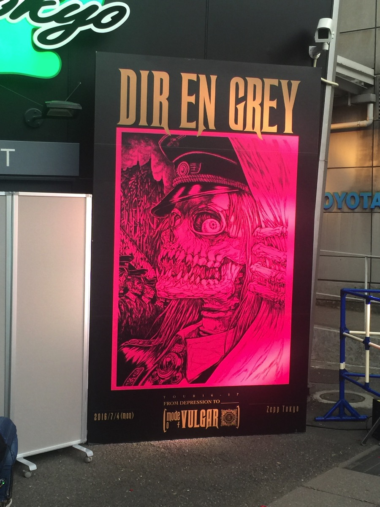
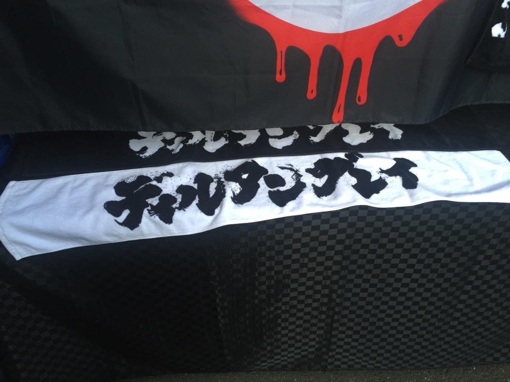
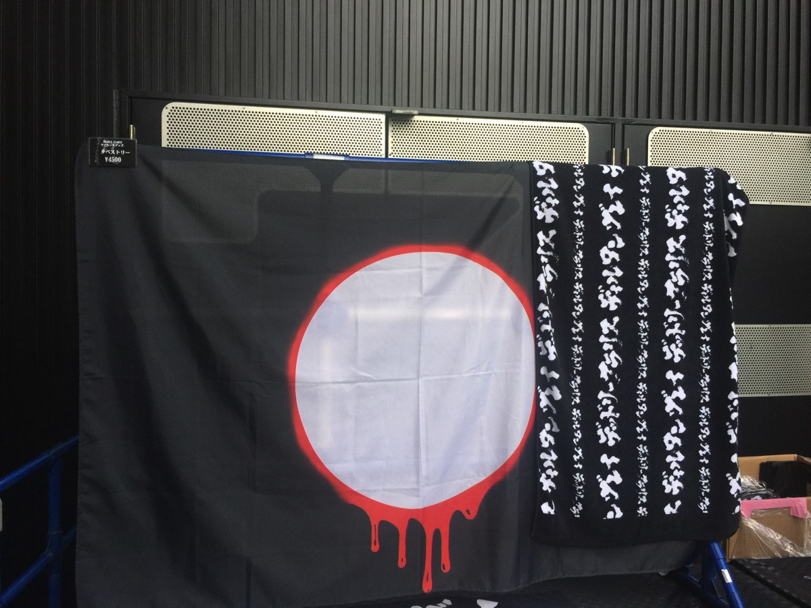

---
categories:
- DIR EN GREYのLIVEレポ
- TOUR16-17 [mode of VULGAR]
date: Tue, 05 Jul 2016 21:07:33 +0000
slug: post-9191
tags:
- DIR EN GREY
- LIVEレポ
title: 【ライブレポ】DIR EN GREY TOUR16-17 FROM DEPRESSION TO ______ [mode of VULGAR] FINAL
  2016_7_4@Zepp Tokyo
---

急遽決まった？と言われるTOUR16-17 FROM DEPRESSION TO ______ [mode of VULGAR]の追加公演でZepp Tokyoに行ってきました！本日はそのレポです。<!--more--><h2>急遽決まったと言われる追加公演。チケット発売はまさかの前日</h2>

ファンクラブ先行は1週間ほど前で、一般発売は前日という異例のスケジュールでした。にもかかわらず完売したらしい。(公式発表)にもかかわらず当日券でてたらしい。(公式発表)

まぁ保険かけてた人が当たりすぎて入金しなかったんだろうけど。。。

ファンの年齢層的にみんないい歳で働いてるから追加公演嬉しいがキツいよな。

決定自体は薫のラジオの収録前だと思うので6月中旬には決まっていたかなと思われる。

（これが噂の激ダサタオル）

（デカいタオルもある）

<h3>セトリはVULGARから全曲！！というわけでもなく通常運転！</h3>

特別感はなく通常のセトリでした！それでも十分パワーのある曲たちで終始動きっぱなしという感じでした。だいたい冒頭から飛ばして、真ん中くらいでバラード系がいくつかでまた後半飛ばすって感じの流れが多いと思いますが、終始動いてい記憶があります。

audience KILLER LOOP
Mamarade Chainsaw
DRAIN AWAY

砂上の唄
AMBER
Un deux
輪郭

INCREASE BLUE
明日無き幸福、呼笑亡き明日
Red...［em］

INWARD SCREAM
触紅
New Age Culture
Я TO THE CORE
SUSTAIN THE UNTRUTH
Inferno

EN.
OBSCURE
詩踏み
CHILD PREY
THE IIID EMPIRE

<h3>終演後にまさかのダブルアンコ発生！！からのまさかのダブルアンコなし！</h3>

アンコールが終わり、メンバーが一通り餌撒きを終え舞台袖に捌けたあと、すぐにアンコールの声援が再び発生しました。ツアーファイナルだし、突然の追加公演だしということで、こちらももちろん期待してました。かなり大きなアンコールが続き、何度も終演を告げるアナウンスが流れました。それでも一向に帰らない我々に対して、アナウンスとは別に拡声器で終了を叫びました。

それでも一向に鳴り止まないコールの中、そろそろでるかなー？と思ってたらまさかのステージ上片付け開始(笑)うぉーそんな、殺生な〜！！平日の突然の発表でも予定調整してきたんよ？まじかよ！腐海もやってないし！まじかよ！鬼葬の日程発表もしてないし！まじかよ！ダイヤリーではダブフアンコなかったーとか言っちゃうのに！こっちが！もとめた！ときには！こないの！？予定調和なんてー(以下略)ということで、まぁしゃーないか、延長料金かかっちゃうかもだしなー

<h3>京ついに薫に叫ばせることに成功</h3>

さて、それ以外のお話を。時系列めちゃくちゃですが。

・今回のツアーは京によるメンバー一人一人にマイクを向けて叫けばせることを使命にしたツアーでもあります。DIe、Toshiyaときて、薫が最後餌食になっていました。油断しきったところに怪しい笑みを浮かべた京が近づきマイクを向けました。「うわぁマジで？」という声が聞こえてきそうな表情をした薫が、意を決して叫びました。それに会場は湧き、京も赤ちゃんのような仕草でジタバタしておりました。

・薫に歌わせたあとに、お立ち台に戻ろうとしたら薫のギターのシールドとマイクが絡まったみたいで、ワンフレーズ歌ってからマイク捨ててスタッフに直させてからさらに歌い出すという連携をしてた

・京「おとこーーーー！！！！」男「おおおお！！！」京「平日なのに暇やな」←ツンデレ？？
・京「おんなーーーー！！！！」女「おおおお！！！」京「アグレッシブにこい」

・薫詩踏みで片足を上げてた
・京投げキッスしまくり
・目ビームやってる京、どうみても「目ビーム！目ビーム！」って言ってた
・モヘヤニットキリスト薫が最後両腕広げてて本当にイエス！って感じだった。
・薫のメイクが眉毛部分まで増殖してて呪術師的になってきた感ある。
・昨日ダブルアンコで粘ってたとき、下手で大きな姿見の鏡片付けられてたけど、どうも薫用みたい。だから演奏の間で下手の舞台袖をよく見てるのかーと思った。

そして鬼葬の日程発表！！！なし！！！

以上です。

<h2>ところで忘れていませんか？ベストアルバムのことを</h2>

<blockquote class="twitter-tweet" data-lang="ja">
みんな忘れてないか。。ベストアルバムのことを
&mdash; しんぺー@調布 (@s_s_p_y) <a href="https://twitter.com/s_s_p_y/status/749947477382410240">2016年7月4日</a></blockquote>

<a href="http://direngrey.co.jp/special/bestalbum/">http://direngrey.co.jp/special/bestalbum/</a>

鬼葬の発表ないかと思ってサイト見てたら、たまたま目に止まって思い出した。。。

いつ発売なの？そしていくらなの？

<h2>しんぺーはこう思った</h2>

とてもファイナルらしいLIVEでした！！完全燃焼というか完全非日常空間でした！ごちそうさまでしたああああ！！！

鬼葬の日程発表してくれないと年末の予定組めないよ！！！はよ！！！

と言ったところで本日は以上になります。  おやすみなさい。