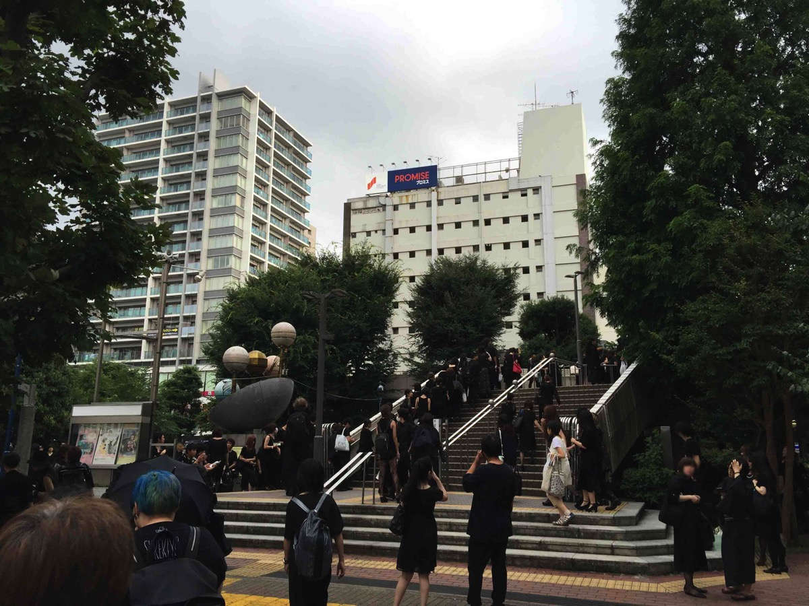

---
categories:
- sukekiyoのLIVEレポ
date: Sun, 17 Jul 2016 17:16:05 +0000
slug: post-9204
tags:
- LIVEレポ
- sukekiyo
title: 【ライブレポ】sukekiyo「裸体と遊具、泥芝居に讃歌の詩」-漆黒の儀-@調布市グリーンホール
---

ドレスコードは「喪服」、会場内の私語禁止、途中入退場禁止のsukekiyoのLIVEに行ってきましたので本日はそのLIVEレポです。<!--more-->

<h2>公演概要</h2>

今回の『二〇一六年公演「裸体と遊具、泥芝居に讃歌の詩」-漆黒の儀-』は昨年行われた<a href="https://www.warawareotoko.com/2015/12/02/post-8695/">「宙釣り娘と掃き溜めの詩」</a>と今年行われた<a href="https://www.warawareotoko.com/2016/04/15/post-9066/">「桜肌、夢諦め跡と優越の詩」</a>２つのツアーを1つにしたものです。もともと1つの公演として表現したかったものの、都合上前編と後編と分けるにいたったようです。そのためかわかりませんが、チケット代も単純に倍の値段となっています。正直発表があった時はたまげましたが、後述する通り、終わってみれば納得のいく値段だったと思います。

<h2>物販</h2>

こちらはTwitterを見るに、少々問題ありのようでした。炎天下の中並んだ方々から、列が遅々として進まない惨状がTLに溢れていました。公演2時間前ですら、この調子じゃ<strong>開演に間に合わないのでは</strong>という声まで聞かれました。

また、今回1万円以上購入の方に特典としてトートバッグがつくのですが、それも早々になくなってしまったり、その他のグッズも売り切れが早かったようで喪服の集団がかなり殺気だっていたようです。

<h3>「dummy」と「マダラニンゲン」</h3>

今回のグッズはいつものグッズやゼメキスと少し趣が異なりブランドが追加されておりました。それが「dummy」と「マダラニンゲン」です。

「dummy」はオフィシャルサイトによると以下の通り。どうも京のブランドではなく、sukekiyoブランドということのようです。

<blockquote>
sukekiyoの思考に限りなく近く、sukekiyoの音以外が表現されるもの。すなわち《分身》。
それを身に付けることで生まれる《共鳴》を想像し「dummy」と名付けました。
京

引用元：<a href="http://sukekiyo-official.jp/goods/">http://sukekiyo-official.jp/goods/</a></blockquote>

そして、これまた物議を醸しておりましたのが「マダラニンゲン」

<blockquote class="twitter-tweet" data-lang="ja">
マダラニンゲンで御座います。<a href="https://t.co/pqcoMoq3c0">https://t.co/pqcoMoq3c0</a> <a href="https://t.co/9iF2tTkDeL">pic.twitter.com/9iF2tTkDeL</a>
&mdash; マダラニンゲン (@_madaraningen) <a href="https://twitter.com/_madaraningen/status/752397312035418112">2016年7月11日</a></blockquote>

最初見た時、なんのこっちゃと思ってスルーしてましたが、どうもこれもsukekiyoブランドの一環のようですね。物販スペースにあった黒いテントは試着ブースだったっぽいです。これのせいで列が動かなかったのかな？

今の所女性物オンリーみたいですが、かなりいいお値段で下はアクセサリーで数千円、iPhoneケースで1万円、スカートでうん万円とかでスカジャンにいたっては数万円とからしいです。見た感じけっこうかわいいみたいだけど、、、

<a href="https://madaraningen-clothes.tumblr.com/">https://madaraningen-clothes.tumblr.com/</a>

ちなみにGALAXY BROAD SHOPにて通販しているようです。

<a href="http://www.galaxybroadshop.com/character/madaraningen/">http://www.galaxybroadshop.com/character/madaraningen/</a>

正確な値段が載っています・・・スカジャンなんて62,640円・・・
しかもソールドアウトしとるがな。。。みんなどこにそんなお金あるの・・・

<h2>公演内容</h2>

今回は前編と後編をつなげた完全版です。17:00開演で休憩が途中15分あり、終了が20:40くらいでした。かなりの長丁場です。

<h3>前編</h3>

前編（<a href="https://www.warawareotoko.com/2015/12/02/post-8695/">「宙釣り娘と掃き溜めの詩」</a>）はいつもの、スケキヨ堂からスタート

ツアー時に流した映像からスタート。おそらくですが、短めに少し編集してあった気がします。修道女の姿で現れた京とSM嬢の絡みも相変わらず。また、万有引力のパフォーマンスはツアー時よりも増員され6名体制となっており、EXILEよろしくの千手観音もかなりの密着度で妖艶さアップ。

ステージのセットはツアー時と同じ。赤い見世物小屋的なテントのセットと中央にはソファと人形が設置されておりました。ソファの傍らには瓶に入った赤い液体（トマトジュース？カシスオレンジ？）

ぼくの勝手な解釈ですが、前編は純真無垢な少女が騙され堕ちていく姿が画かれているような気がします。純真無垢な少女＝人形＝京だと思います。イラストで表現されている箇所もありますが、全て同一の「少女」かと思われます。

何らかの原因により、危機的状態にあった少女がウサギにより導かれ助けられます。しかし、のちに騙されおそらく人身売買されるのではないでしょうか。

ここで、サディスティックな喜びに目覚めるのではと解釈しました。
なお、ツアー時よりも京のムチさばきが上達しており、純真な少女が初めてムチを扱ったというよりも、「はい！使えます！3年やってました！」って感じの慣れた手つきで、実際M嬢のお尻にぴしっとあてておりました。それと百合の花束の散らし具合も美しかったです。

<h3>セトリ</h3>

1. foster mother
2. aftermath
3. hidden one
4. scars like velvet
5. 斑人間
6. 烏有の空
7. in all weathers
8. celeste
9. vandal
10. the daemon's cutlery
11. 耳ゾゾ
12. zephyr
13. leather field

<h3>後編</h3>

前編の終わり方は、ツアー時と大体同じだったと思われます。その後、何のアナウンスもなく少し明るくなると皆一斉にトレイに駆け込みます。今日の会場は左右に男女のトイレがあるのですが、女性比率が高いため向かって左のトイレは男性トイレが潰され女性用に変わっていました。

しかし、ロビーに出てみると女性トレイは長蛇の列。物販で並ばされ、トイレで並ばされ、ちなみに終演後も外に出るまでに渋滞してほとんど動きませんでした。ということで何かとならばされる日でした。

さて、休憩時間はとくにアナウンスもされていなかったのですが、多分15分くらいかなーと思って早々に席に戻ってきました。すると「dummy」のCMがながされておりました。攻殻機動隊ARISEを思わせるフワーっとしたBGMと一緒に。そして、合間にはいつもの懐メロ的SEが流れてました。吉川晃司とか。。でええええええ、多分知り合いとかときてたら絶対ぼく騒いでたと思うんですがジルスが流れた！！！と思って改めて調べたらジルスじゃなくて、その前身バンドのD≒SIREの「追憶 -Nostalgia-」でした。当時LIVEもいったことあるんですがMCがくっっっっっっそなげーーーーーー解散LIVEですか？ってくらいながかった。。。DIR EN GRYEのI'llのイントロはおそらくここから来ていると思われます。

そんなこんなで内心興奮していると開演のブザーが。外はまだまだおしっこに行きたい方々でごった返しているのに、ブザーは無情に鳴り響きます。後編のスタートです。（<a href="https://www.warawareotoko.com/2016/04/15/post-9066/">「桜肌、夢諦め跡と優越の詩」</a>）

後編は、自身のサディスティックな一面の目覚めた少女がいつの間にか、マゾヒズムに堕ちていくストーリーだと思います。

演出面であきらかにツアー時よりもバージョンアップしていることが2つ。
まず万有引力のパフォーマンスが、より怪しさが増していました。セーラー服を着た女性がひたすら笑顔で手には紙風船。笑顔というよりも破顔という表現があっている気がします。崩さない笑顔は逆に怖さを覚えます。それ以外にも、顔に包帯を巻いた詰襟の学生や裸に学ランなど。そして親玉的なのがこの見世物一座の座長的な男。その一行とSM嬢に誘われ、下手へと京が消えていきます。画面中央のスクリーンにその後が映し出されます。と同時にバックにオーケストラが現れバイオリンなどの楽器で演奏。

スクリーンに映し出された京は、両手を紐で結ばれ一座やSM嬢にあんなところやこんなところをいじめ、弄ばれます。ステージの演奏も大詰めに至ると匠が中腰になり、指揮で締めの指示を出します。それと同時にバックの楽器の演奏が終わり、メンバーの演奏も終了。ステージもスクリーンも暗転し本編終了。宙吊りにされた少女の人形が、上方より現れエンドロールが流れます。これに公演終了。拍手が起こります。しかし、すぐに画面にANIMAのMVが長ます。その後、告知がはじまりました。

<h3>セトリ</h3>

14. hemimetabolism
15. elisabeth addict
16. mama
17. latour
18. nine melted fiction
19. dunes
20. maniera
21. 304号室 舌と夜
22. focus
23. anima
24. 雨上がりの優詩
25. 鵠
26. 12時20分金輪際
27. 烏有の空

<h2>告知</h2>

記憶が曖昧ですがニューアルバムが出るようです。告知文はこんなニュアンス。
「自殺の名所の山々に雪が咲く季節より、蝿の〜〜〜〜〜〜桜が狂い咲く季節よりも前に〜〜〜〜」たぶん2月くらいでしょうか？？桜の季節よりも前で雪の季節よりも後くらいのこと言ってましたので。

次、公演情報です。12月に「ハロウィン殺し」やるとのこと。12月なのにハロウィン殺しということで。ただしメンバーはノーマルらしいです。おそらくドレスコードは仮装。どうせなら、また10月の某ハロウィンパーティと日程かぶせて京がチェブラー○カのコスで出て来ればいいのに。。。日程は12月25日くらいでしょうかね。。。

さて、告知は以上でしたがオフィシャルサイトには新たに情報が載っていました。

<a href="http://sukekiyo-official.jp/news/">sukekiyo 二〇一六年公演「裸体と遊具、泥芝居に讃歌の詩」-漆黒の儀-映像化決定
</a>

11月発売です。まぁ当然ですよね！また未架さんが編集するんでしょうか。

<h2>しんぺーはこう思った</h2>

腰と膀胱の心配をしておりましたが、そこまでじゃなかったのでよかったです。ただ反省点として、以外と室内が寒かったということ。ジャケットは必須ですね。

今日の感想ですが、音が一つずつ輪郭がはっきりしているなと改めて感じました。なんていうか音の一つずつをリアルに感じ取れました。それと同じく、ステージもリアルに感じました。同じ空間にいるので当たり前ですが、なんていうか臨場感・リアル感がすごかった。多分普通のLIVEじゃなくて観劇に近いからそういう印象をもったのかもしれません。

あと、確信しましたがsukekiyoのLIVEは性的なものよりも、あやしさの方が強いと思いました。SM嬢が出てきたので単純にエロスやセクシャルなものと関連付けてしまいますが、それよりもSM嬢ですら万有引力側の表現する「あやしさ」の一環なんじゃないかと思います。それを明確に言語化するのは難しいのですが、そう言った摑みどころがない部分こそsukekiyoの真髄でもある気がしました。

最初はチケット代が高額という印象を持ちましたが、最後までみてこのやりたいことを全てやりきった感がある演出で、とにかく堪能いたしました。最後はやはり呼吸すら許されないような張り詰めた空間にてsukekiyoを感じました。

と言ったところで本日は以上になります。  おやすみなさい。