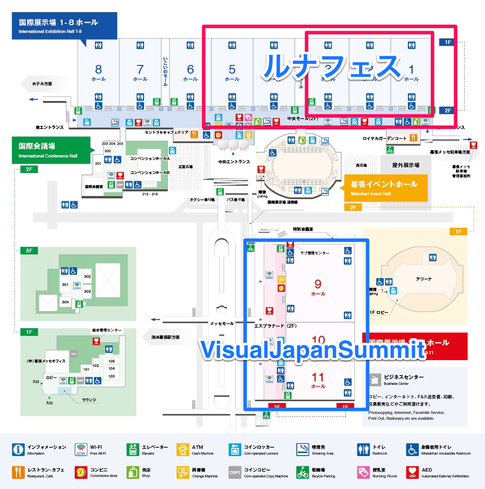

---
categories:
- ヴィジュアルジャパンサミット
date: Wed, 27 Jul 2016 23:00:00 +0000
slug: post-9229
tags:
- ヴィジュアルジャパンサミット
title: '【ヴィジュアルジャパンサミット】気になること(VIP席と会場と参加バンド数とか) #VisualJapanSummit'
---

ヴィジュアルジャパンサミットについてですが、気になることというか現時点でわからないことがいくつか<!--more--><h2>VIP席の仕様について</h2>

3日通し券の椅子付きで6万円だと思ってたら、1日で6万円だとさ。。。しかも指定席とのことで。。。どこに設置されるのか。最初はキャンプとかで使用する持ち運び可能な椅子を想像してたんだが、指定ということでどうもそうじゃないっぽい。

確かに長丁場なので椅子はあった方がいいよな。でも6万円て
VIPエリア入場権とお土産とかならわかるけど、要は指定席が6万円ということですよね。すぎょい

<h2>開催される会場について</h2>

今回の会場はルナフェスと同じ幕張メッセです。ただ、ルナフェスはホール1-3で開催されたのに対して、ヴィジュアルジャパンサミットはホール9-11

こんな位置関係のはずです。駅から電車で来た人は、ホール1-3の建物の手前に9-11があるので多分間違えようがないと思います。

ここって確かVAMPSのハロウィンパーティーが開催されてるところのはず。ここを3分割にするのか、ルナフェスみたいに3ステージ用意してぶち抜きで１つのホールにしてやるのか。。気になるところ

ちなみに例年この時期はハロウィンパーティーと並行して他のホールではビジネス関連の展示会が催されているのが通例です。この日程もいくつか開催されてるっぽいです。ということで飲食ブースはどこに出すのかしら。。同じホール内？

<h2>で、結局誰がくるのか</h2>

Yoshikiとhydeの会合があったようです。

https://instagram.com/p/BFvYj88L9NE/

Gacktとも

https://instagram.com/p/BFyRIpdL9DZ/

今週の金曜日に新たな情報でるのかな？

<h2>しんぺーはこう思った。</h2>

ルナフェスみたいに徐々に発表されるとしたら、多分まずはステージ構成、参戦バンド数、第1弾ラインナップ、第2弾、第3弾という感じでしょうか。

そして正午なのか深夜なのかも気になる。。

と言ったところで、本日は以上になります。
おやすみなさい。